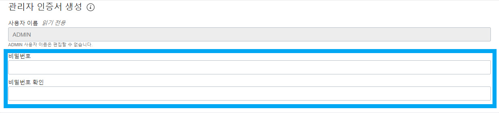

#APT-DB

<details>
    <summary>APT 생성</summary>

1. ATP 생성 클릭


2. DB 이름 설정


3. 버전 및 무료 체크


4. 비밀번호 설정


5. DB 생성


</details>

<details>
    <summary>DB 접속</summary>

1. DB 접속 클릭


2. DB 접속을 위한 전자 지갑 다운. 비밀번호는 ATP에서 설정한 비번.


3. sql developer로 접속.

    

</details>

<details>
    <summary>Spring Boot 연결</summary>

```maven


```
</details>