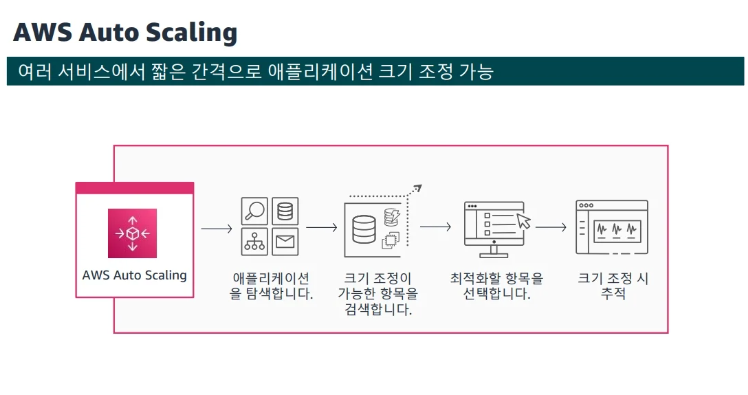
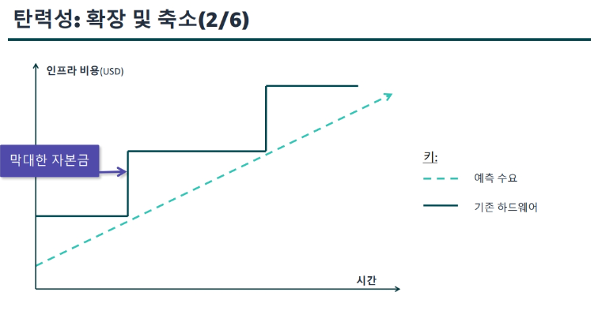
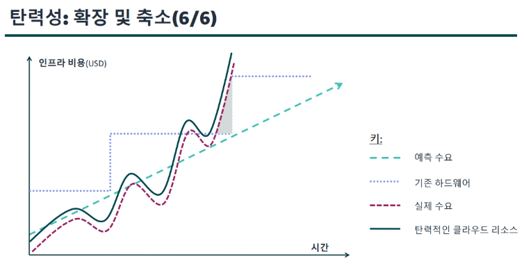
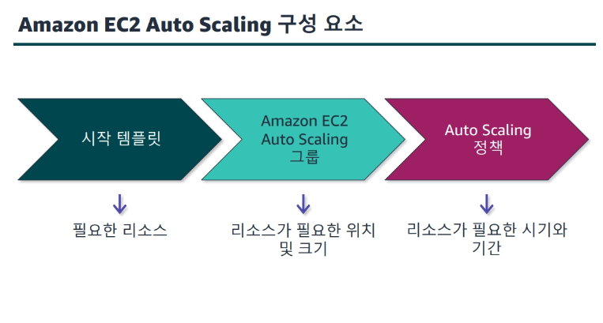
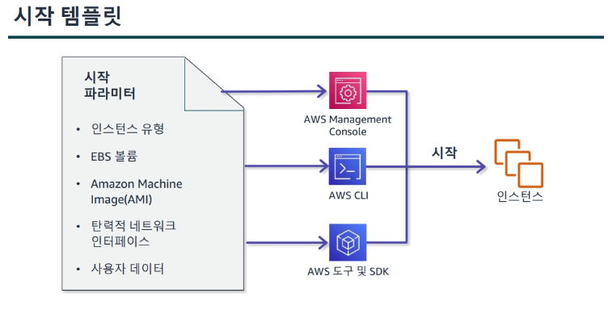

## 로드 밸런싱

    
Elastic Load Balancing(ELB)

- 네이티브 방식.
- 사용자를 EC2 인스턴스, 컨테이너 배포 및 AWS Lambda 함수에 연결하는 AWS에서 제공하는 유일한 로드 밸런서.
- 고가용성
    - 단일 또는 여러 가용 영역에서 다수의 대상에 걸쳐 트래픽 자동 분산.
    - EC2 인스턴스, 컨테이너 및 IP 주소 등이 대상.
- 계층4 또는 계층7 HTTP 및 HTTPS 로드 밸런싱
- 보안 기능
    - VPC를 사용하여 로드 밸런서와 연걸된 보안 그룹을 생성 및 관리하여 추가 네트워킹 및 보안 옵션 제공 가능
    - 내부 로드 밸런서 생성 가능
- 상태 확인
    - 비정상 대상을 감지하고, 해당 대상으로 트래픽 전송을 중단한 뒤, 나머지 정상 대상으로 로드 분산.
- 모니터링 작업
    - 실시간 모니터링할 수 있도록 CloudWatch 지표와 통합되며 요청 추적 기능을 제공

 
    
ELB 유형

- Application Load Balancer
    - OSI 7계층에서 작동.
    - 콘텐츠 기반 라우팅, 컨테이너에서 실행되는 애플리케이션, 개방형 표준 프로토콜을 지원.
    - HTTP 및 HTTPS 트래픽의 고급 로드 밸런싱에 이상적.

- Network Load Balancer
    - 높은 처리량과 매우 짧은 지연 시간을 유지하며 초당 수천만 건의 요청을 처리.
    - OSI 4계층에서 작동.
    - IP 프로토콜 데이터에 따라 대상으로 라우팅.
    - EC2 인스턴스, 컨테이너 및 IP 주소가 대상에 포함됨.
    - TCP, UDP 트래픽 밸런싱에 적합.

- Gateway Load Balancer
    - 서드 파티 가상 어플라이언스를 쉽게 배포, 크기 조정 및 관리 가능.
    - 여러 가상 어플라이언스에 트래픽을 분산하면서 수요에 따라 확장 및 축소하는 게이트웨이 역할 수행.
    - 네트워크의 잠재적 장애 지점을 줄이고, 가용성을 높일 수 있음.

    
로드 밸런서 구성 요소

- 2개 이상의 리스너를 가질 수 있음.
- 리스너의 기능은 로드 밸런서 유형별로 다름.
- 로드 밸런서는 사용자가 정의한 규칙 및 설정에 따라 하나 이상의 대상 그룹에 요청 전달 가능.
- 각 대상 그룹은 지정된 프로토콜과 포트 번호를 사용하여 하나 이상의 등록된 대상으로 요청을 라우팅함.

    
일반 기능

- Application Load Balancer : 유연한 애플리케이션 관리가 필요한 경우
- Network Load Balancer : 뛰어난 성능과 고정 IP가 필요한 경우
- Gateway Load Balancer : 서드 파티 가상 어플라이언스를 관리해야 하는 경우

 

## 자동 크기 조정 

    
AWS Auto Scaling

- 애플리케이션을 모니터링하고 용량을 자동으로 조정하여, 최대한 저럼한 비용으로 안정적이고 예측 가능한 성능을 유지.
- EC2 인스턴스, 스팟 플릿 및 기다 컴퓨팅/데이터베이스 서비스 등.

    
Amazon EC2 Auto Scaling

- 서로 다른 EC2 리소스 그룹이 수요 변화에 대응하여 자동으로 크기 조정을 할 수 있음.
- 늘어나거나 줄어드는 수요에 따라 인스턴스를 시작하거나 종료 할 수 있음.
- ELB와 통합되므로 하나 이상의 로드 밸런서를 기존 Amazon EC2 Auto Scaling 그룹에 연결 가능함. 연결하면 그룹에 인스턴스가 자동으로 등록되고 수신 트래픽이 인스턴스 전체에 분산됨.

    
탄력성

- 탄력적인 인프라는 용량 요구 사항이 변화함에 따라 지능적으로 확장 및 축소될 수 있음.
    - 트래픽 급증 시 웹 서버 수 확장
    - 트래픽 감소 시 데이터베이스 쓰기 용량 축소
    - 아키텍처 전반에 걸친 일상적인 수요 변동 처리

- 기존 방식의 경우 정기적으로 대규모 투자를 해야함.

- 수요가 일정하지 않고 예측 가능한 경우는 거의 없음.
- 즉, 트래픽이 급격이 변화하는 경우가 훨씬 많음.

- 이러한 갭으로 발생하는 기회 비용이 매우 큼.
- 갑자기 트래픽이 증가할 경우 서비스가 중단될 위험도 있음.

- 클라우드는 수요와 공급의 균형을 유지하여 기존 인프라의 단점을 보안함.

    
구성 요소

- Auto Scaling 그룹이라는 EC2 인스턴스 모음을 생성.
- 각 Auto Scaling 그룹의 최소 인스턴스 수를 지정.
- 각 Auto Scaling 그룹의 최대 인스턴스 수를 지정.

- AMI의 ID아 인스턴스 유형 등 EC2 인스턴스를 시작하는데 필요한 파라미터가 포함되어 있음.
- Amazon EC2 Auto Scaling의 모든 기능과 Amazon EC2의 최신 기능을 제공.
- Amazon EBS Provisioned IOPS 볼륨, EBS 볼륨 태그 지정, T2 무제한 인스턴스, Elastic Inference, 전용 호스트 등의 최신 세대가 포함될 수 있음.
- EC2 최신 기능을 사용할 수 있도록 시작 템플릿에서 Auto Scaling 그룹을 생성하는 것이 좋음.
- 실행 중인 EC2 인스턴스의 속성을 사용하요 시작 구성을 생성할 수도 있음.

- 자동 크기 조정 및 관리를 위한 논리적인 그룹으로 간주되는 EC2 인스턴스 모음을 포함.
- 그룹을 통해 상태 확인 대체 및 크기 조정 정책등 Amazon EC2 Auto Scaling 기능을 사용.
- 그룹을 생성할 때 용량을 지정하거나, 그룹 생성 후 원할 때 지정할 수 있음. 이때는 현재 인스턴스의 수를 포함해야함.

- 상태 확인
    - 지정된 수의 실행 인스턴스를 항상 유지하도록 그룹을 구성할 수 있음.
    - 비정상 상태인 인스턴스는 종료하고 대체 가능한 인스턴스를 시작.
- CloudWatch 경보
    - 특정 CloudWatch 지표를 추적하도록 명령.
    - 연결된 CloudWatch 경보 Alarm 상태일 때 수행할 작업을 정의해야 함.
- 일정
    - 일정에 따라 크기 조정 가능.
- 수동 크기 조정
    - 가장 기본적인 방법.
    - 그룹의 최대 용량, 최소 용량, 권장 용량의 변경 사항만 저장.

    
크기 조정 방법

- 예약 크기 조정
    - 알려진 도르 변경 전에 애플리케이션 크기를 조정할 수 있음.
    - 예측 가능한 트래픽 패턴에 따라 크기 조정 활동을 계획.

- 동적 크기 조정
    - 수요 병화에 대응하여 Amazon EC2 Auto Scaling 그룹의 용량 크기를 조정하는 방법을 정의.
    - 과도한 유휴 리소스를 유지하지 않고도 트래픽 급증을 처리할 수 있는 추가 용량을 확보할 수 있음.

- 예측 크기 조정
    - 일별 및 주별 패턴에 앞서 그룹의 EC2 인스턴스 수를 늘림.
    - 주기적 트래픽, On/Off가 반복되는 워크로드 패턴, 초기화가 오래 걸려 확장 이벤트 중 애플리케이션 성능이 저하되어 지연시간이 현저하게 길어지는 애플리케이션 등.

- 확장은 조기에 수행하고 축소는 장기적/점진적으로 진행하는 것이 좋음.

    
비용 최적화

- Amazon EC2 플릿을 사용하면 EC2 인스턴스 유형의 조합을 정의하여 그룹이 원하는 용량을 구성 가능.
- 그룹이 확장되거나 축소될 때 원하는 비용 최적화를 유지.
- 혼한 플릿으로 구성된 그룹도 단일 플릿 그룹과 동일한 수명 주기 후크, 인스턴스 상태 확인, 예약 조정을 지원함.

    
캡스톤 아키텍처

