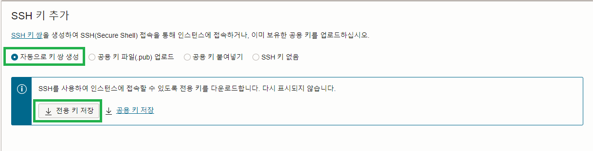
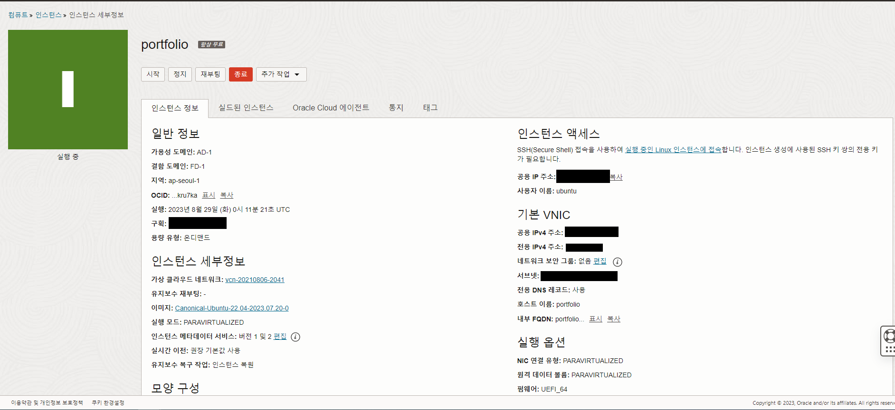
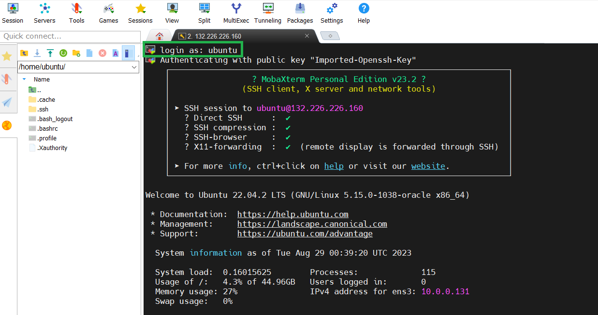

# Instance

<details>
    <summary>인스턴스 생성</summary>

1. [리소스 실행] VM 인스턴스 생성 클릭


<br/>

2. [이미지 및 구성] 이미지 변경 클릭


<br/>

3. [이미지 선택] 서버 운영체제 고른 후 이미지 선택


<br/>

4. [SSH키 추가] 서버에 접속할때 사용하기 위한 키 다운로드 (다시 발급받을 수 없으므로 파일을 관리해야함.)


<br/>

5. [생성] 인스턴스 생성


<br/>

6. [인스턴스] 기다리면 초록색으로 변경되고 구성이 완료됨.


</details>

<details>
    <summary>인스턴스 접속</summary>

1. [모바엑스텀 설치](https://mobaxterm.mobatek.net/)
2. [세션] 새로운 세션 만들기 위해 세션 클릭


<br/>

3. [SSH] Remote host : 인스턴스 공용 IPv4 주소를 넣어주고, 인스턴스 생성하며 발급 받은 키 파일을 등록.


<br/>

4. [접속] 기본 로그인은 ubuntu. 


</details>

<details>
    <summary>방화벽 설정</summary>

1. 먼저 ubuntu에서 업데이트를 해줌.
    ```ubuntu
    sudo apt update
    ```

<br/>

2. ubuntu에서 특정 포트 방화벽 해제
    ```ubuntu
    ## firewall을 이용한 포트 열기
    # firewall 설치
    sudo apt install firewalld

    # 특정 포트 열기 규칙 추가
    sudo firewall-cmd --permanent --zone=public --add-port=80/tcp

    # 규칙 초기화
    sudo firewall-cmd --reload


    ## iptables를 이용한 포트 열기
    # 특정 포트 규칙 추가
    sudo iptables -I INPUT -p tcp -m tcp --dport 8080 -j ACCEPT

    # 특정 포트 규칙 삭제
    sudo iptables -D INPUT -p tcp -m tcp --dport 8080 -j ACCEPT

    # 특정 IP로만 특정 포트 규칙 추가
    sudo iptables -I INPUT -p tcp -s 123.123.123.123 --dport 8009 -j ACCEPT

    # 위의 규칙 삭제
    iptables -D INPUT -p tcp -s 123.123.123.123 --dport 8009 -j ACCEPT

    # 변경 사항 저장
    sudo netfilter-persistent save

    # 규칙 초기화
    sudo iptables -F // iptables

    ```

<br/>

3. 서브넷 방화벽 해제를 위해 서브넷 접속


<br/>

4. 보안 목록 선택


<br/>

4. 신규 규칙 추가


<br/>

5. 서버간 라우팅 허용 규칙 추가


</details>

<details>
    <summary>시간 설정</summary>

```ubuntu
sudo timedatectl set-timezone Asia/Seoul
```
</details>

<details>
    <summary>Java 설치</summary>

```ubuntu
# 운영체제에 기본으로 있는 jdk 설치, 또는 원하는 버전 설치 #
sudo apt install default-jdk
sudo apt-get install openjdk-11-jdk

# 설치 확인 #
java -version
javac -version

# 환경 변수 설정 #
sudo vim /etc/profile

# 맨 아래에 추가
...
export JAVA_HOME=/usr/lib/jvm/java-11-openjdk-amd64      // 본인의 자바 설치 경로
export PATH=$JAVA_HOME/bin:$PATH
export CLASSPATH=$CLASSPATH:$JAVA_HOME/jre/lib/ext:$JAVA_HOME/lib/tools.jar
...

#확인
source /etc/profile
echo $JAVA_HOME
```

</details>

<details>
    <summary>docker 설치</summary>

```ubuntu
# docker 설치
sudo apt-get install docker.io -y

# docker 실행
sudo service docker start

# 파일의 권한을 666으로 변경하여 그룹 내 다른 사용자도 접근 가능하게 변경
sudo chmod 666 /var/run/docker.sock

# ubuntu 유저를 docker 그룹에 추가 후 재시작
sudo usermod -aG docker $USER
sudo service docker restart

# 버전 확인 
docker --version

# 현재 실행중인 도커 확인
docker ps

# 기존 docker 지우고 다시 설치
sudo apt-get remove docker docker-engine docker.io -y
```
</details>

<details>
    <summary>docker 실행 시 설명</summary>

```ubuntu
docker run --name jenkins-docker -d -p 8000:8080 -p 8888:50000 -v /home/jenkins:/var/jenkins_home -u root jenkins/jenkins:lts
```

- `d` : detached mode, 백그라운드에서 컨테이너가 실행되게 한다.

- `p`: 서버의 9090포트와 컨테이너 내부 8080포트를 연결한다.

- `v`: 서버의 `/home/jenkins`경로와 컨테이너 내부 `/var/jenkins_home`경로를 마운트한다.  이것을 하는 이유는, Jenkins 설치 시 ssh 키값 생성, 저장소 참조 등을 용이하게 하기 위함입니다.

- `-name`: 실행될 컨테이너의 이름을 jenkins-docker으로 설정한다.

- `u`: 실행할 사용자를 root으로 설정한다.

- 포트는 ec2 인스턴스의 8000, 8888번 포트를 도커 컨테이너의 8080, 50000번 포트에 대응시킨다.


</details>

<details>
    <summary>docker 기타 명령어</summary>

1. [주요 명령어](https://captcha.tistory.com/49)
2. [도커 삭제 명령어](https://www.lainyzine.com/ko/article/docker-rm-removing-docker-containers/)

</details>

<details>
    <summary>docker-compose 설치</summary>

```ubuntu
#설치
sudo curl -L https://github.com/docker/compose/releases/download/1.26.2/docker-compose-$(uname -s)-$(uname -m) -o /usr/local/bin/docker-compose

#권환
sudo chmod +x /usr/local/bin/docker-compose

#버전확인
docker-compose --version
```

</details>

<details>
    <summary>docker-compose 명령어</summary>

1. [주요 명령어](https://kimjingo.tistory.com/108)
2. [간단 문법](https://darrengwon.tistory.com/793)

</details>


<details>
    <summary>nginx 설치</summary>

```ubuntu
# 설치
sudo apt install nginx

# 실행
sudo systemctl start nginx

# 상태 보기
sudo service status nginx

# 연결 상태를 보기 위한 툴 설치
sudo apt install net-tools
netstat - lntp

# 제거
sudo apt remove nginx
sudo apt purge nginx

# docker로 설치하기
docker pull nginx

# docker로 실행하기
docker run --name 원하는이름 -v docker와 공유하려는 폴더 경로:docker 안에서 공유하려는 폴더 경로
```
</details>

<details>
    <summary>HTTPS 설정</summary>

```ubuntu

# https 설정을 위한 툴 설치
sudo apt-get install letsencrypt -y

# nginx 중단
sudo service nginx stop

# certbot 발급을 위한 80, 433 방화벽 열기
# certbot 이메일 입력, 인증서 발급 동의, 이메일 수신은 미동의
sudo certbot certonly --standalone -d 도메인(example.com)

# https 파일 설정
sudo vim /etc/nginx/sites-available/default

...
# 80포트 접근 시 443 포트로 리다이렉트
server {
    if ($host = beanzido.com) {
        return 301 https://$host$request_uri;
    } # managed by Certbot

    listen 80 ;
    listen [::]:80 ;
    server_name beanzido.com;
    return 404; # managed by Certbot
}

# domain을 두개 연결해서 사용하고 싶다면 똑같은걸 만들기만 하면 된다.
server {
    if ($host = k7a206.p.ssafy.io) {
        return 301 https://$host$request_uri;
    } # managed by Certbot

    listen 80 ;
    listen [::]:80 ;
    server_name k7a206.p.ssafy.io;
    return 404; # managed by Certbot
}

server {
  index index.html index.htm index.nginx-debian.html;
  server_name beanzido.com; # managed by Certbot
  root /home/ubuntu/compose/jenkins/workspace/release/frontend/build/;
  location / {
    root /home/ubuntu/compose/jenkins/workspace/release/frontend/build/;
    try_files $uri $uri/ @router;
 	}
  location /chat-server{
    proxy_pass http://13.125.39.100:8091;
    proxy_http_version 1.1;
    proxy_set_header Upgrade $http_upgrade;
    proxy_set_header Connection "Upgrade";
    proxy_set_header Host $host;
    proxy_set_header X-Forwarded-For $remote_addr;
    proxy_set_header X-Forwarded-Proto $scheme;		
 	}
  location /keyword-server{
    proxy_pass http://13.125.39.100:8092;
  }
 	location @router{
       	    rewrite ^(.+)$ /index.html last;
 	}
    
 	ssl_certificate /etc/letsencrypt/live/beanzido.com/fullchain.pem; # managed by Certbot
 	ssl_certificate_key /etc/letsencrypt/live/beanzido.com/privkey.pem; # managed by Certbot
  listen 443 ssl; # managed by Certbot
    
}

server {
  index index.html index.htm index.nginx-debian.html;
  server_name k7a206.p.ssafy.io; # managed by Certbot
  root /home/ubuntu/compose/jenkins/workspace/front/frontend/build/;
  location / {
    root /home/ubuntu/compose/jenkins/workspace/front/frontend/build/;
    try_files $uri $uri/ @router;
 	}
  location /chat-server{
    proxy_pass http://13.125.39.100:8061;
    proxy_http_version 1.1;
    proxy_set_header Upgrade $http_upgrade;
    proxy_set_header Connection "Upgrade";
    proxy_set_header Host $host;
    proxy_set_header X-Forwarded-For $remote_addr;
    proxy_set_header X-Forwarded-Proto $scheme;		
 	}
  location /keyword-server{
    proxy_pass http://13.125.39.100:8062;
  }
 	location @router{
       	    rewrite ^(.+)$ /index.html last;
 	}
    
 	ssl_certificate /etc/letsencrypt/live/k7a206.p.ssafy.io/fullchain.pem; # managed by Certbot
 	ssl_certificate_key /etc/letsencrypt/live/k7a206.p.ssafy.io/privkey.pem; # managed by Certbot
  listen 443 ssl; # managed by Certbot
    
    
}
...


# nginx 제대로 실행 되는지 테스트 확인  
sudo nginx -t

# nginx 재시작
sudo service nginx restart

```

</details>

<details>
    <summary>nginx 명령어</summary>

```ubuntu
# nginx 실행
service nginx start
sudo service nginx start
sudo systemctl start nginx

# nginx 재실행
service nginx restart
sudo service nginx restart
sudo systemctl restart nginx

# nginx 중단
service nginx stop
sudo service nginx stop
sudo systemctl stop nginx

# nginx 상태 보기
service nginx status
sudo service nginx status
ps -ef | grep nginx

```

</details>

<details>
    <summary>Certbot(인증서) 명령어</summary>

```ubuntu
# 인증서 해지 명령어
sudo certbot revoke --cert-name www.domain.com

# 인증서 삭제 명령어
sudo certbot delete --cert-name www.domain.com

# 인증서 발급 명령어 (서버 소유주 인증 방식)
sudo certbot --nginx -d www.domain.com

# 인증서 발급 명령어 (nginx 웹서버 인증 방식)
sudo certbot certonly --standalone -d www.domain.com

# 인증서 발급 명령어 (도메인 소유주 방식)
sudo certbot certonly --manual --preferred-challenges dns-01 --server https://acme-v02.api.letsencrypt.org/directory -d "*.domain.com"

# 인증서 갱신 명령어
sudo certbot renew

# nginx로 받은 인증서 갱신 명령어
sudo nginx -s stop
sudo certbot renew
sudo nginx

# 만료 이메일 업데이트 (1년마다 갱싱해야함)
certbot update_account --email yourname+1@example.com
```

</details>

