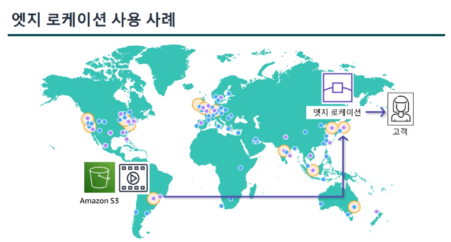

last modified date : 2023.08.25
출처 : https://www.aws.training/certification

# AWS
- 컴퓨팅, 데이터베이스, 스토리지 서비스를 제공하는 클라우드 솔루션.
- 출시 시간 단축, 비용 최적화, 보안 취약성 최소화, 복잡한 관리 작업 감소.

 

## 데이터센터
- 전 세계에 대규모로 데이터 센터 제공.
- 가용 영역으로 구성 됨.
- 하나의 데이터 센터는 수천 대의 서버를 호스함.

 

## 가용 영역

- 하나 이상의 데이터 센터 클러스터를 뜻함.

 

## AWS 리전

- 가용 영역을 포함한 나라의 대표 지역.
- 최종 사용자의 지연 시간을 줄일 수 있음.
- 리전 선택 요인
  - 거버넌스 및 법적 요구 사항
  - 지연 시간
  - 서비스 가용성
    - 모든 AWS를 모든 리전에서 사용할 수 있지 않음.
  - 비용
    - 리전 마다 비용이 다름.

 

## AWS Local Zones

- 최종 사용자의 지연 시간이 10ms 미만이어야 하며 수요가 많은 애플리케이션에 사용.

 

## 엣지 로케이션

- AWS 서비스 요청자에 가장 가까이 있는 지점.
- 엣지 로케이션은 전 세계 주요 도시에 있음.
- 요청을 수신하고 더 빠른 전송을 위해 콘텐츠 사본을 캐시.
- AmazonCloudFront, Amazon Route 53 과 같은 AWS 서비스 지원.
  - ColudFront는 엣지 로케이션 및 리전 엣지 캐시 서버로 구성된 접속 지점 위치의 글로벌 네트워크를 통해 고객의 콘텐츠를 전송.
  - 리전 엣지 캐시는 엣지 로케이션에 유지할 정도로 자주 액세스 하지 않는 콘텐츠가 있을 때 활용.
- 캐시를 이용하므로 오리진 서버에서 해당 콘텐츠를 검색할 필요가 없어짐.

