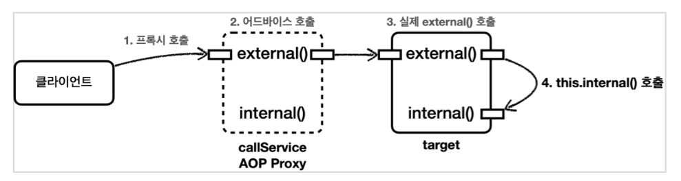

최종 작성일 : 2023.10.18.</br>

# Spring-Security

### 스프링 시큐리티란

스프링 기반 보안(인증, 권한, 인가)을 담당하는 스프링 하위 프레임워크.
보안과 관련된 많은 옵션을 제공. (개발 비용 감소)
주로 서블릿 필터와 이들로 구성된 위임 모델 사용.

- 인증 : 검증된 사람인지 확인
- 인가 : 인증 이후 해당 기능에 접근할 수 있는지 확인
- 권한 : 인가 과정에서 해당 리소스에 접근할 수 있는 최소 권한을 가졌는지 확인

<br/>

### 스프링 시큐리티 특징과 구조

- 보안과 관련하여 체계적으로 많은 옵션 제공
- filter 기반으로 동작하여 MVC와 분리하여 관리 및 동작
- 어노테이션을 통한 간단한 설정
- Spring Security는 기본적으로 세션 & 쿠키 방식으로 인증
- 인증 관리자(UsenamePasswordAuthenticationFilter)와 접근 결정 관리자(FilterSecurityInterceptor)를 통해 사용자의 리소스 접근을 관리
- Principal(사용자 정보) : 저장소에 저장되어 있는 정보 (기본적으로 사용자 ID, 추가적으로 사용자의 다른 정보 포함. ex) 나이, 주소 등)
- Credential(비밀번호) : 저장소에 저장되어 있는 비밀번호 (사용자 request PW)
- GrantedAuthority(권한) : Principal이 가지고 있는 권한 (Role)

현재 사용자(principal)가 가지고 있는 권한을 의미. ROLE*ADMIN, ROLE_USER와 같이 ROLE*\* 형태로 사용.
GrantedAuthority 객체는 UserDetailsService로 불러올 수 있고, 특정 자원에 대한 권한이 있는지 검사하여 접근 허용 여부를 결정함.

<br>

### 인증 플로우


1. 사용자가 로그인 정보를 입력하고 인증 요청을 보냄.
2. UsernamePasswordAuthenicationFilter에서 사용자가 보낸 아이디, 패스워드를 인터셉트하고 각각 유효성 검사 후 인증용 객체(UseNamePasswordAuthenticationToken) 생성. (해당 토큰은 아직 인증이 되지 않은 상태.)
3. UsernamePasswordAuthenicationFilter에서 AuthenticationManager 인터페이스를 구현한 ProviderManager 호출. (매개변수 : 인증용 객체)
4. ProviderManager에서 실제 사용자 인증을 확인 하기 위해 AuthenticationProvider 호출. (매개변수 : 인증용 객체)
5. AuthenticationProvider에서 인증 확인을 위해 UserDetailsService 호출. (매개변수 : 인용증 객체에 있는 아이디)
6. UserDetailsService는 전달 받은 아이디를 크리덴셜(사용자 정보를 가진 저장소, DB)에서 조회.
7. 조회한 정보를 UserDetails로 생성.
8. 생성한 UserDetails를 AuthenticationProvider에 반환.
9. AuthenticationProvider는 UserDetails의 비밀번호와 인증용 객체의 비밀번호가 같은지 확인(같은 경우 인증 완료) 후 인증이 완료되면 인증 완료된 객체(UseNamePasswordAuthenticationToken)를 생성. (해당 토큰은 인증이 완료된 상태.)
10. 생성한 인증 완료된 객체를 ProviderManager에 반환.
11. 전달 받은 인증 완료된 객체를 UsernamePasswordAuthenicationFilter에 반환.
12. 인증 완료된 객체를 SecurityContextHolder를 이용하여 SecurityContext에 저장. (기본적으로 SecurityContext에 저장된 정보는 SecurityContextPersistenceFilter를 통해 HttpSession에 다시 저장되어 인증 상태를 유지함.)

<br>

### 인가 권한 확인 플로우


1. AuthorizationFilter에서 SecurityContextHolder를 이용하여 SecurityContext에 저장되어 있는 인증 완료된 객체 획득.
2. AuthorizationManager 인터페이스를 구현한 RequestMatcherDelegatingAuthorizationManager 호출. (매개변수 : 인증 완료된 객체, HttpServletRequest)
3. RequestMatcher과 매치되는 AuthorizationManager에게 권한 확인 위임.
4. 확인 결과 적절한 권한을 가졌다면 통과.
5. 아니라면 예외를 던짐. 해당 에러는 ExceptionTranslationFilter가 처리.

<br>

### 모듈

#### [Authentication]

- 현재 접근하는 주체의 정보와 권한을 담음. (인터페이스)

```java
    public interface authentication extends Principal, Serializable {
        // 현재 사용자의 권한 목록
        Collection<? extends GrantedAuthority> getAuthorities();

        // credentials (주로 비밀번호)
        Object getCredentials();

        Object getDetails();

        // Principal 객체
        Object getPrincipal();

        // 인증 여부를 가져옴
        boolean isAuthenticated();

        // 인증 여부 설정
        void setAuthenticated(boolean isAuthenticated) throws IllegalArgumentException;

    }
```

<br/>

#### [UsernamePasswordAuthenticationToken]

- Authentication을 implements한 AbstractAuthenticationToken의 하위 클래스.
- User의 ID가 Principal 역할을 하고, Password가 Credential의 역할을 함.
- UsernamePasswordAuthenticationToken의 첫 번째 생성자는 인증 전의 객체를 생성하고, 두번째 생성자는 인증이 완료된 객체를 생성함.

```java
    public class UsernamePasswordAuthenticationToken extends AbstractAuthenticationToken {
        // 주로 사용자의 ID
        private final Object principal;

        // 주로 사용자의 비밀번호
        private Object credentials;

        // 인증 완료 전의 객체 생성
        public UsernamePasswordAuthenticationToken(Object principal, Object credentials){
            super(null):
            this.principal = principal;
            this.credentials = credentials;
            setAuthenticated(false);
        }

        // 인증 완료 후의 객체 생성
        public UsernamePasswordAuthenticationToken(Object principal, Object credentials, Collection<? extemds GramtedAuthority> authorities) {
            super(authorities);
            this.principal = principal;
            this.credentials = credentials;
            super.setAuthenticated(ture);
        }
    }

    public abstract class AbstractAuthenticationToken implements Authentication, CredentialsContainer {}
```

 <br/>

#### [AuthenticationManager]

- 인증 처리를 지시하는 매니저 역할. (인터페이스)
- AuthenticationProvider이 등록되어 있음.

<br/>

#### [ProviderManger]

- AuthenticationManager를 구현한 클래스.
- 인증이 성공적으로 이루어진 후, Crendentials 제거. (인증 완료하면 더이상 필요 없으며, 민감 정보이기 때문에 제거)

<br/>

#### [AuthenticationProvider]

- 인증된 사용자인지 판단하는 역할. (인터페이스)
- 인증 매니저의 지시를 받는 현장 담당자 역할.

<br/>

#### [UserDetails]

- 저장소에 저장된 사용자 정보를 담을 객체.
- UserDetails 인터페이스의 경우 직접 개발한 UserVO 모델에 UserDetails를 implements하여 이를 처리하거나 userDetailsVO에 UserDetails를 implements하여 처리 가능.

```java
    public interface UserDetails extends Serializable {
        Collection<? extends GrantedAutority> getAuthorities();
        String getPassword();
        String getUserName();
        boolean isAccountNonExpired();
        boolean isAccountNonLocked();
        boolean isCredentialExpired();
        boolean isEnabled();
    }
```

<br/>

#### [UserDetailsService]

- UserDetails 객체를 반환하는 단 하나의 메소드를 가지고 있음. (인터페이스)
- 분리를 위해 UserService를 따로 만들고, UserDetailsService를 구현한 클래스에서 UserService를 호출하여 UserDeails에 넣을 사용자 정보를 가져오는 것이 일반적.

```java
    public interface UserDetailService {
        UserDetails loadUserByUsername(String var1) throws UsernameNotFountException;
    }
```

<br/>

#### [PasswordEncoding]

AuthenticationManagerBuilder.userDetailsService().passwordEncoder() 통해 패스워드 암호화에 사용될 PassEncoder 구현체 지정 가능

```java
    @Override
    protected void configure(AuthenticationManagerBuilder auth) throws Exception {
        auth.userDetailService(userDetailsService).passwordEncoder(passwordEncoder());
    }

    @Bean
    public PasswordEncoder passwordEncoder(){
        return new BcryptPasswordEncoder();
    }
```

<br>

#### [SecurityContextHolder]

- 인증된 객체 정보를 저장하기 위한 객체.

<br/>

#### [SecurityContext]

- 인증된 객체를 보관하는 객체
- SecurityContext를 통해 Authentication 객체를 꺼내올 수 있음.

<br/>

### SecurityFilterChain


| 필터명 | 설명 |
| ----------------------------------- | -------------------------------------------------------------------------------------------------------------------------- |
| SecurityContextPersistenceFilter | SecurityContext를 로드하고 저장 |
| LogoutFilter | 로그아웃 URL로 지정된 가상 URL에 대한 요청을 감시하고 매칭되는 요청이 있으면 사용자를 로그아웃 시킴 |
| UsenamePasswordAuthenticationFilter | 사용자명과 비밀번호로 이루어진 폼 기반 인증에 사용하는 가상 URL 요청을 감시하고 요청이 있으면 사용자의 인증을 진행 |
| DefaultLogInPageGeneratingFilter | 폼 기반 또는 OpenID 기반 인증에 사용하는 가상 URL에 대한 요청을 감시하고 로그인 폼 기능을 수행하는데 필요한 HTML 생성 |
| BasicAuthenticationFilter | HTTP 기본 인증 헤더를 감시하고 이를 처리 |
| RequestCacheAwareFilter | 이 필터가 호출되는 시점까지 사용자가 아직 인증을 받지 못했다면 요청 관련 인증 토큰에서 사용자가 익명 사용자로 나타나게 됨. |
| SessionManagementFilter | 인증된 주체를 바탕으로 세션 트래킹을 처리해 단일 주체와 관련한 모든 세션들이 트래킹되도록 도움 |
| ExceptionTranslationFilter | 이 필터는 보호된 요청을 처리하는 동안 발생할 수 있는 기대한 예외의 기본 라우팅과 위임을 처리함 |
| FilterSecurityInterceptor | 이 필터는 권한부여와 관련한 결정을 AccessDecisionManager에게 위임해 권한 부여 결정 및 접근 제어 결정을 쉽게 만들어 줌 |

<br>

- Security를 적용하기 위해 여러가지 Filter를 상속 받아 로직을 구현함. 이때, 어떤 Filter을 상속 받아야 하는지 해당 표를 보면 됨.
- 해당 그림만으로 설명하긴 힘드므로 실습을 통해서 알아가는 것이 좋음.

<br>
<br>
<br>

# JWT

### JWT란

- JSON 객체를 통해 안정하게 정보를 전송할 수 있는 웹 표준.
- '.' 구분자로 세 부분으로 구분되어 있음.
- 세션-쿠키 기반이 아니므로 세션이 유지 되지않는 다중 서버 환경에서도 로그인 유지 가능함. 따라서 여러 도메인에서 사용 가능.
  
- header는 토큰 타입과 signature에서 사용하는 알고리즘으로 구성
  ```json
  {
    "typ": "JWT",
    "alg": "HS256"
  }
  ```
- payload는 인증을 위해 사용할 실제 정보들(클레임)으로 구성되어 있으며, 등록 클레임, 공개 클레임, 비공개 클레임 등으로 구성되어 있음.
  ```json
  {
    "sub": "123456789",
    "name": "Jone Doe",
    "admin": true
  }
  ```
  - 클레임이란 key와 value가 한쌍으로 이루어진 형태로 "sub" : "123456789" 가 하나의 클레임임.
  - 등록 클레임은 필수로 사용되는 정보(데이터)는 아니지만 JWT가 기본적으로 가지는 정의된 key-value을 이용하여 Token 생성 정보를 만들 때 사용함.
  - 공개 클레임은 말 그대로 공개용 정보를 뜻하며 key에 URI 포맷을 이용함. ({"https://github.comn/away0419" : true})
  - 비공개 클레임은 실제 사용되는 정보(데이터)임.
    ({"userId" : "away0419", "userEmail" : "away0419@c.com"})
  - 이러한 클레임들이 모여 인코딩 되어 JSON payload가 됨.
- signature는 인코딩된 헤더(Header)와 인코딩된 페이로드(payload), 비밀 키(Secret)와 알고리즘을 기반으로 백엔드에서 발급됨.

<br>

### 로그인 후 회원 검증 방식

- 세션

  - 사용자 정보를 세션에 저장. 이와 연결 되는 세션 ID 발급.
  - 클라이언트는 서버에 요청을 보낼 때 세션 ID를 Header에 담아 보냄.
  - 세션ID가 탈취 될 위험성이 있으며 서버가 세션 저장소를 필요로 하기 때문에 추가적인 저장 공간이 필요.

    

<br/>

- JWT

  - 인증에 필요한 정보를 암호화하여 만든 토큰을 활용한 방법.
  - 사용자가 로그인하면 해당 정보를 AccessToken으로 발급해 클라이언트에 줌.
  - 클라이언트는 서버에 요청을 보낼 때 AccessToken을 Header에 담아 보냄.
  - AcessToken의 유효 기간을 짧게 만들어 탈취에 최대한 대응하고자 RefreshToken을 만듬.
  - RefreshToken은 AccessToken이 만료 되었을 때 사용 되는 토큰. 즉, AccessToken을 새로 발급해주기 위한 토큰.
  - RefreshToken도 유효 기간이 있으며, 한번 사용되면 폐기 되고 다시 발급 됨. 이유는 RefreshToken 역시 탈취 가능성이 있기 때문임.
  - AccessToken이 탈취 되더라도 기간이 짧으므로 악용 될 시간을 줄일 수 있음.
  - RefreshToken이 탈취 되더라도 기간이 정해져 있으며, 한번이라도 사용된 이력이 있으면 해당 토큰은 사용할 수 없기 때문에, 실제 사용자가 RefreshToekn을 사용하면 탈취자는 RefreshToken을 사용할 수 없음. 반대로 탈취자가 RefreshToken을 이미 사용하여 사용자가 RefreshToken을 쓸 수 없을 경우 사용자에게 경고 메시지를 전달할 수도 있음. (사용한 RefreshToken으로 접근했을 때, 경고 메시지를 보여주는 형식)
  - Token 정보를 저장하는 저장소가 필요함. 또한, 토큰이 만료되기 전까지 대처 방법이 없고 구현이 복잡하며 AccessToken이 만료될 때마다 새롭게 발급하기 때문에 서버의 자원 낭비가 발생됨.

    

   <br/>

### 기타

<details>
    <summary>Authorization Header</summary>

- 일반적으로 토큰은 Authorization Header에 담아서 서버에 전송함.
- Authorization: `<type>` `<credentials>` 형식으로 우리가 흔히 사용하는 bearer는 type 형식에 해당함
- type에는 여러 종류가 있음
  - basic : 아이디와 비밀번호를 Base64로 인코딩한 값 사용
  - bearer : JWT 또는 OAuth에 대한 토큰 사용
  - digest : 서버는 난수를, 클라이언트는 사용자 정보와 nonce를 포함하는 해시값 사용
  - HOBA : 전자 서명 사용
  - Mutual : 암호를 이용한 서버-클라이언트 상호 인증
  - AWS4-HMAC-SHA256 : AWS 전자 서명 사용
  </details>
