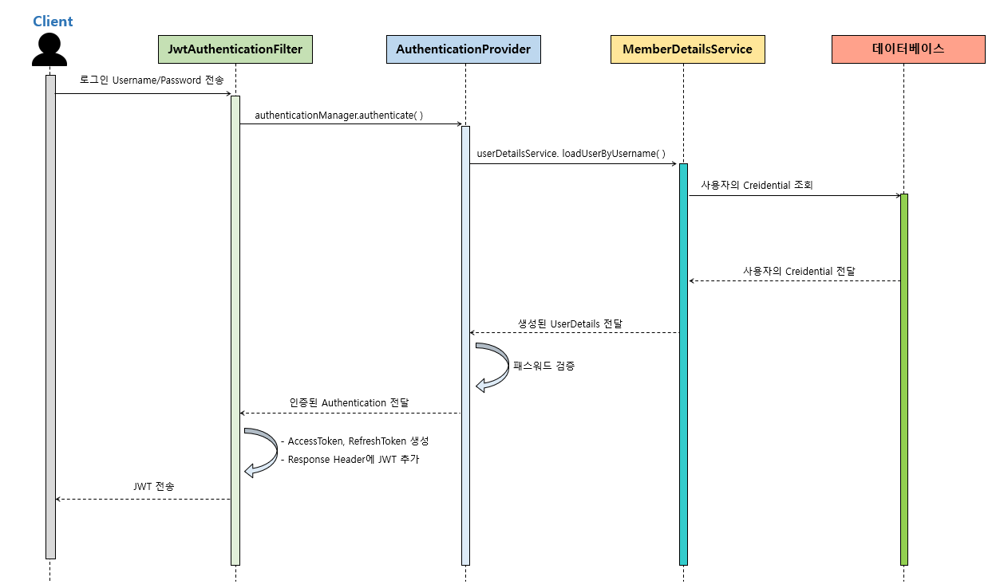

<details>
  <summary>Spring-Security</summary>

### 스프링 시큐리티란

스프링 기반 보안(인증, 권한, 인가)을 담당하는 스프링 하위 프레임워크.
보안과 관련된 많은 옵션을 제공. (개발 비용 감소)
주로 서블릿 필터와 이들로 구성된 위임 모델 사용.

- 인증 : 검증된 사람인지 확인
- 인가 : 인증 이후 해당 기능에 접근할 수 있는지 확인
- 권한 : 인가 과정에서 해당 리소스에 접근할 수 있는 최소 권한을 가졌는지 확인

<br/>

### 스프링 시큐리티 특징과 구조

- 보안과 관련하여 체계적으로 많은 옵션 제공
- filter 기반으로 동작하여 MVC와 분리하여 관리 및 동작
- 어노테이션을 통한 간단한 설정
- Spring Security는 기본적으로 세션 & 쿠키 방식으로 인증
- 인증 관리자(UsenamePasswordAuthenticationFilter)와 접근 결정 관리자(FilterSecurityInterceptor)를 통해 사용자의 리소스 접근을 관리
- Principal(사용자 정보) : 저장소에 저장되어 있는 정보 (기본적으로 사용자 ID, 추가적으로 사용자의 다른 정보 포함. ex) 나이, 주소 등)
- Credential(비밀번호) : 저장소에 저장되어 있는 비밀번호 (사용자 request PW)
- GrantedAuthority(권한) : Principal이 가지고 있는 권한 (Role)

현재 사용자(principal)가 가지고 있는 권한을 의미. ROLE*ADMIN, ROLE_USER와 같이 ROLE*\* 형태로 사용.
GrantedAuthority 객체는 UserDetailsService로 불러올 수 있고, 특정 자원에 대한 권한이 있는지 검사하여 접근 허용 여부를 결정함.

<br>

### 인증 플로우


1. 사용자가 로그인 정보를 입력하고 인증 요청을 보냄.
2. UsernamePasswordAuthenicationFilter에서 사용자가 보낸 아이디, 패스워드를 인터셉트하고 각각 유효성 검사 후 인증용 객체(UseNamePasswordAuthenticationToken) 생성. (해당 토큰은 아직 인증이 되지 않은 상태.)
3. UsernamePasswordAuthenicationFilter에서 AuthenticationManager 인터페이스를 구현한 ProviderManager 호출. (매개변수 : 인증용 객체)
4. ProviderManager에서 실제 사용자 인증을 확인 하기 위해 AuthenticationProvider 호출. (매개변수 : 인증용 객체)
5. AuthenticationProvider에서 인증 확인을 위해 UserDetailsService 호출. (매개변수 : 인용증 객체에 있는 아이디)
6. UserDetailsService는 전달 받은 아이디를 크리덴셜(사용자 정보를 가진 저장소, DB)에서 조회.
7. 조회한 정보를 UserDetails로 생성.
8. 생성한 UserDetails를 AuthenticationProvider에 반환.
9. AuthenticationProvider는 UserDetails의 비밀번호와 인증용 객체의 비밀번호가 같은지 확인(같은 경우 인증 완료) 후 인증이 완료되면 인증 완료된 객체(UseNamePasswordAuthenticationToken)를 생성. (해당 토큰은 인증이 완료된 상태.)
10. 생성한 인증 완료된 객체를 ProviderManager에 반환.
11. 전달 받은 인증 완료된 객체를 UsernamePasswordAuthenicationFilter에 반환.
12. 인증 완료된 객체는 SecurityContextHolder 안에 있는 SecurityContext에 저장됨. (기본적으로 SecurityContext에 저장된 정보는 SecurityContextPersistenceFilter를 통해 HttpSession에 다시 저장되어 인증 상태를 유지함.)

<br>

### 인가 권한 확인 플로우


1. AuthorizationFilter에서 SecurityContextHolder를 이용하여 SecurityContext에 저장되어 있는 인증 완료된 객체 획득.
2. AuthorizationManager 인터페이스를 구현한 RequestMatcherDelegatingAuthorizationManager 호출. (매개변수 : 인증 완료된 객체, HttpServletRequest)
3. RequestMatcher과 매치되는 AuthorizationManager에게 권한 확인 위임.
4. 확인 결과 적절한 권한을 가졌다면 통과.
5. 아니라면 예외를 던짐. 해당 에러는 ExceptionTranslationFilter가 처리.

<br>

### 인증 인가 예외 처리

- Security에서 사용하는 인증 인가 예외 처리 방법은 여러가지 존재함.
- 이는 인증 후 성공 및 실패 처리와는 별개로 로직에서 예외가 발생한 경우 이를 처리하는 로직임.

#### [AuthenticationFailureHandler]

- 인증 도중 예외가 발생하면 인증 실패 처리 이후 실행.
- 모든 에러를 처리하는 것은 아님. (AuthenticationException 처리)

#### [AuthenticationEntryPoint]

- 인증 되지 않은 사용자가 보호된 리소스에 접근할 때 발생하는 예외 처리.
- 주로 로그인 페이지로 리다이렉션하거나 사용자 정의 오류 메시지를 반환

#### [AccessDeniedHandler]

- 권한이 없어 발생하는 예외 처리.
- 주로 권한 거부 페이지로 리다이렉션하거나 사용자 정의 오류 메시지 반환.

#### [ExceptionTranslationFilter]

- 인증, 인가에서 발생한 예외 처리.
- 두 방식을 합친 것으로 공통된 처리 방식일 경우 사용.

#### [Global Exception Handling]

- 사용자가 직접 예외를 만들고, 이를 처리하는 로직을 따로 구현하여 예외를 직접 처리.
- @ControllerAdvice 또는 @ExceptionHandler를 사용함.
- 장점
  - 위 방식들과 다르게 어디든 사용이 가능함.
  - 사용자가 만든 에러 처리 틀을 이욯할 수 있어 security 에러 뿐만 아니라 다른 에러와도 형식(반환 값 등)을 맞출 수 있음. (일관성)
  - 에러 코드를 한 곳에 모와 관리할 수 있음. (중앙 집중화)
  - 프로젝트에 맞는 보안 설계를 따를 수 있음.
- 단점
  - security exception에서 제공하는 기능을 활용하기 힘듬.
  - 디버깅이 어려움.
  - 보안 설계를 신중하게 설계 해야 함.

<br/>

### 모듈

#### [Authentication]

- 현재 접근하는 주체의 정보와 권한을 담음. (인터페이스)

```java
    public interface authentication extends Principal, Serializable {
        // 현재 사용자의 권한 목록
        Collection<? extends GrantedAuthority> getAuthorities();

        // credentials (주로 비밀번호)
        Object getCredentials();

        Object getDetails();

        // Principal 객체
        Object getPrincipal();

        // 인증 여부를 가져옴
        boolean isAuthenticated();

        // 인증 여부 설정
        void setAuthenticated(boolean isAuthenticated) throws IllegalArgumentException;

    }
```

<br/>

#### [UsernamePasswordAuthenticationToken]

- Authentication을 implements한 AbstractAuthenticationToken의 하위 클래스.
- User의 ID가 Principal 역할을 하고, Password가 Credential의 역할을 함.
- UsernamePasswordAuthenticationToken의 첫 번째 생성자는 인증 전의 객체를 생성하고, 두번째 생성자는 인증이 완료된 객체를 생성함.

```java
    public class UsernamePasswordAuthenticationToken extends AbstractAuthenticationToken {
        // 주로 사용자의 ID
        private final Object principal;

        // 주로 사용자의 비밀번호
        private Object credentials;

        // 인증 완료 전의 객체 생성
        public UsernamePasswordAuthenticationToken(Object principal, Object credentials){
            super(null):
            this.principal = principal;
            this.credentials = credentials;
            setAuthenticated(false);
        }

        // 인증 완료 후의 객체 생성
        public UsernamePasswordAuthenticationToken(Object principal, Object credentials, Collection<? extemds GramtedAuthority> authorities) {
            super(authorities);
            this.principal = principal;
            this.credentials = credentials;
            super.setAuthenticated(ture);
        }
    }

    public abstract class AbstractAuthenticationToken implements Authentication, CredentialsContainer {}
```

 <br/>

#### [AuthenticationManager]

- 인증 처리를 지시하는 매니저 역할. (인터페이스)
- AuthenticationProvider이 등록되어 있음.

<br/>

#### [ProviderManger]

- AuthenticationManager를 구현한 클래스.
- 인증이 성공적으로 이루어진 후, Crendentials 제거. (인증 완료하면 더이상 필요 없으며, 민감 정보이기 때문에 제거)

<br/>

#### [AuthenticationProvider]

- 인증된 사용자인지 판단하는 역할. (인터페이스)
- 인증 매니저의 지시를 받는 현장 담당자 역할.

<br/>

#### [UserDetails]

- 저장소에 저장된 사용자 정보를 담을 객체.
- UserDetails 인터페이스의 경우 직접 개발한 UserVO 모델에 UserDetails를 implements하여 이를 처리하거나 userDetailsVO에 UserDetails를 implements하여 처리 가능.

```java
    public interface UserDetails extends Serializable {
        Collection<? extends GrantedAutority> getAuthorities();
        String getPassword();
        String getUserName();
        boolean isAccountNonExpired();
        boolean isAccountNonLocked();
        boolean isCredentialExpired();
        boolean isEnabled();
    }
```

<br/>

#### [UserDetailsService]

- UserDetails 객체를 반환하는 단 하나의 메소드를 가지고 있음. (인터페이스)
- 분리를 위해 UserService를 따로 만들고, UserDetailsService를 구현한 클래스에서 UserService를 호출하여 UserDeails에 넣을 사용자 정보를 가져오는 것이 일반적.

```java
    public interface UserDetailService {
        UserDetails loadUserByUsername(String var1) throws UsernameNotFountException;
    }
```

<br/>

#### [PasswordEncoding]

AuthenticationManagerBuilder.userDetailsService().passwordEncoder() 통해 패스워드 암호화에 사용될 PassEncoder 구현체 지정 가능

```java
    @Override
    protected void configure(AuthenticationManagerBuilder auth) throws Exception {
        auth.userDetailService(userDetailsService).passwordEncoder(passwordEncoder());
    }

    @Bean
    public PasswordEncoder passwordEncoder(){
        return new BcryptPasswordEncoder();
    }
```

<br>

#### [SecurityContextHolder]

- 인증된 객체 정보를 저장하기 위한 객체.

<br/>

#### [SecurityContext]

- 인증된 객체를 보관하는 객체
- SecurityContext를 통해 Authentication 객체를 꺼내올 수 있음.

<br/>

### SecurityFilterChain


| 필터명 | 설명 |
| ----------------------------------- | -------------------------------------------------------------------------------------------------------------------------- |
| SecurityContextPersistenceFilter | SecurityContext를 로드하고 저장 |
| LogoutFilter | 로그아웃 URL로 지정된 가상 URL에 대한 요청을 감시하고 매칭되는 요청이 있으면 사용자를 로그아웃 시킴 |
| UsenamePasswordAuthenticationFilter | 사용자명과 비밀번호로 이루어진 폼 기반 인증에 사용하는 가상 URL 요청을 감시하고 요청이 있으면 사용자의 인증을 진행 |
| DefaultLogInPageGeneratingFilter | 폼 기반 또는 OpenID 기반 인증에 사용하는 가상 URL에 대한 요청을 감시하고 로그인 폼 기능을 수행하는데 필요한 HTML 생성 |
| BasicAuthenticationFilter | HTTP 기본 인증 헤더를 감시하고 이를 처리 |
| RequestCacheAwareFilter | 이 필터가 호출되는 시점까지 사용자가 아직 인증을 받지 못했다면 요청 관련 인증 토큰에서 사용자가 익명 사용자로 나타나게 됨. |
| SessionManagementFilter | 인증된 주체를 바탕으로 세션 트래킹을 처리해 단일 주체와 관련한 모든 세션들이 트래킹되도록 도움 |
| ExceptionTranslationFilter | 이 필터는 보호된 요청을 처리하는 동안 발생할 수 있는 기대한 예외의 기본 라우팅과 위임을 처리함 |
| FilterSecurityInterceptor | 이 필터는 권한부여와 관련한 결정을 AccessDecisionManager에게 위임해 권한 부여 결정 및 접근 제어 결정을 쉽게 만들어 줌 |

- addFilter()는 해당 필터 뒤에 실행.
- addFilterbefore()는 해당 필터 앞에 실행.

<br>

- Security를 적용하기 위해 여러가지 Filter를 상속 받아 로직을 구현함. 이때, 어떤 Filter을 상속 받아야 하는지 해당 표를 보면 됨.
- 해당 그림만으로 설명하긴 힘드므로 실습을 통해서 알아가는 것이 좋음.

### 기타

<details>
  <summary>로그인 이후 사용자 정보 얻기</summary>

1. Bean을 통해 사용자 정보 가져오기

   ```java
   Object principal = SecurityContextHolder.getContext().getAuthentication().getPrincipal();
   UserDetails userDetails = (UserDetails)principal;
   String username = principal.getUsername();
   String password = principal.getPassword();
   ```

2. controller에서 매개변수로 입력 받기

   ```java
   @Controller
   public class UserController{}
     @GetMapping
     public String getMyInfo(Authentication authentication){
       JwtAuthenticationToken authentication = (JwtAuthenticationToken) authentication;
       User user = (User)authentication.getDetails();
       return user.toString();
     }
   }
   ```

   - Authentication 또는 Principal를 매개 변수 받을 경우 SpringSecurityContext에 있는 정보를 가져온다.

3. @AuthenticationPrincipal 로 가져오기
   ```java
   @Controller
   public class SecurityController
   {
     @GetMapping("/messages/inbox")
       public ModelAndView currentUserName(@AuthenticationPrincipal CustomUser customUser)
       {
         String username = customUser.getUsername();
           // .. find messages for this user and return them ...
       }
   }
   ```
   - SpringSecurity 3.2 부터 사용 가능.

</details>
</details>

<details>
  <summary>JWT</summary>

### JWT란

- JSON 객체를 통해 안정하게 정보를 전송할 수 있는 웹 표준.
- '.' 구분자로 세 부분으로 구분되어 있음.
- 세션-쿠키 기반이 아니므로 세션이 유지 되지않는 다중 서버 환경에서도 로그인 유지 가능함. 따라서 여러 도메인에서 사용 가능.
  
- header는 토큰 타입과 signature에서 사용하는 알고리즘으로 구성
  ```json
  {
    "typ": "JWT",
    "alg": "HS256"
  }
  ```
- payload는 인증을 위해 사용할 실제 정보들(클레임)으로 구성되어 있으며, 등록 클레임, 공개 클레임, 비공개 클레임 등으로 구성되어 있음.
  ```json
  {
    "sub": "123456789",
    "userId": "Jone Doe",
    "https://github.comn/away0419": true
  }
  ```
  - 클레임이란 key와 value가 한쌍으로 이루어진 형태
    - "sub" : "123456789" 가 하나의 클레임임.
  - 등록 클레임은 필수로 사용되는 정보(데이터)는 아니지만 JWT가 기본적으로 가지는 정의된 key-value을 이용하여 Token 생성 정보를 만들 때 사용함.
    - iss : 토클 발급자
    - sub : 토큰 제목
    - aud : 토큰 대상자
    - exp : 토큰 만료 시간
    - nbf : 토큰 활성 날짜
    - iat : 토큰 발급 시간
    - jti : JWT 고유 식별자
  - 공개 클레임은 말 그대로 공개용 정보를 뜻하며 key에 URI 포맷을 이용함.
    - "https://github.comn/away0419" : true
  - 비공개 클레임은 실제 사용되는 정보(데이터)임.
    - "userId" : "away0419"
  - 이러한 클레임들이 모여 인코딩 되어 JSON payload가 됨.
- signature는 인코딩된 헤더(Header)와 인코딩된 페이로드(payload), 비밀 키(Secret)와 알고리즘을 기반으로 백엔드에서 발급됨.

<br>

### 로그인 후 회원 검증 방식

- 세션

  - 사용자 정보를 세션에 저장. 이와 연결 되는 세션 ID 발급.
  - 클라이언트는 서버에 요청을 보낼 때 세션 ID를 Header에 담아 보냄.
  - 세션 ID가 탈취 될 위험성이 있으며 서버가 세션 저장소를 필요로 하기 때문에 추가적인 저장 공간이 필요.
  - 서버에서 사용자를 관리하기 때문에 서버에 부담을 줄 수 있음.

    

<br/>

- JWT (AccessToken & RefreshToken)

  - 인증에 필요한 정보를 암호화하여 만든 토큰을 활용한 방법.
  - 사용자가 로그인 요청하면 해당 정보로 AccessToken을 발급하고 Http Header에 이를 담아 응답함.
  - 이후, 클라이언트는 서버에 요청을 보낼 때 AccessToken을 Header에 담아 보냄.
  - 서버에 권한이 필요한 요청이 들어온 경우, Header에서 AccessToken을 가져와 해독하여 사용자 정보를 확인함.
    - 확인 결과 유효하면 요청에 대한 적절한 응답 보냄.
    - 유효하지 않다면 해당 요청 접근 막고 로그아웃 시킴.
  - 기본적으로 Session 방식처럼 DB에 접근하는 과정이 없어 빠름.
  - RefreshToken 추가 시 빨간색 과정이 추가 됨.

    - AccessToken을 재발급 하는 용도로 따로 추가 설명 예정.

    

   <br/>

### Security + JWT 프로세스

- JWT는 크게 두가지 방법을 사용함.

  - 로그인 결과 값을 반환 하는 Controller에서 JWT를 발급.
  - 로그인 도중 Filter를 거쳐 JWT를 발급.
  - Security 특성 상 Filter 레벨에서 인증 처리 하는 것이 더 자연스러움.

- 로그인(인증) 프로세스
  

  - 기본적인 흐름은 Security 로그인 플로우와 동일함.
  - 중간에 JwtAuthenticationFilter 추가하고 응답 값만 바꿔서 내보는 것임.
  - 따라서 Security의 플로우를 확인하며 해당 프로세스 그림을 보면 이해하기 쉬움.
  - JwtAuthenticationFilter는 UsernamePasswordAuthenticationFilter를 확장해서 구현.
  - 이후 인증된 객체를 만드는 과정까진 동일한 흐름임.
  - 전달 받은 인증된 객체를 이용하여 Token을 만들고 응답 값 헤더에 추가하면 끝.

- 자격 검증 프로세스
  
  - 사용자가 Header에 보낸 Token을 JwtVerificationFilter에서 검증함.
  - 검증이 완료되었다면 인증된 객체를 만들어 SecurityContext에 저장함. 이를 통해 이후 Filter 문제 없이 통과 가능. (만약 저장하지 않는다면 다음 필터에서 인증된 객체를 찾지 못하여 에러가 날 수 있음)
  - 이때 SecurityContext에 저장된 정보는 SecurityContextPersistenceFilter가 나중에 삭제하여 stateless로 만듬. (SecurityConfig에서 세션을 stateless로 설정 해야함)

### AccessToken & RefreshToken

- AccessToken은 위에서 설명한 것과 동일하게 사용자 정보를 암호화 한 Token임.
- RefreshToken은 AccessToken을 재발급 하기 위한 Token임. (기본적으로 저장할 정보가 없음 -> 클레임 없음)
- RefreshToken이 생긴 이유는 AccessToken의 경우 만료 시간이 크면 탈취 될 가능성이 있고, 만료 시간이 작으면 자주 로그아웃 된다는 단점이 있는데 이를 해결하고자 나옴.
- 기본 방식은 AccessToken의 기간이 만료되면 RefreshToken을 확인하고 AccessToken을 재발급 해줌. 이때, RefreshToken 기간 만료가 1주일 이하라면, 응답으로 RefreshToken도 재발급 해줌.
- RefreshToken를 사용할 경우 추가적인 요청/응답이 발생한다는 단점이 있음.
- RefreshToken도 탈취 위험이 있음.
- AccessToken과 RefreshToken에는 다양한 전략이 존재함.

  #### RTR(Refresh Token Rotation) 전략

  - RefreshToken 1회용 전략으로 한번이라도 Refresh가 사용되면 AccessToken, RefreshToken을 함께 재발급하는 전략으로 DB를 사용하는게 일반적임. (JWT 강점 약화)
  - Refresh가 탈취 당하더라도 Refresh가 사용된 시점에 값이 바뀌어 DB에 저장됨. 따라서 다음 Refresh 요청 시 DB에 저장된 Refresh 요청이 아니라면 연결을 거부하고 DB에 저장된 Refresh 값을 임의로 바꿔 이후 로그인을 해야만 하는 상태로 바꿀 수 있음. 이때, 사용자에게 비정상 접근을 알려줄 수 있다면 좋을 듯.
  - DB 저장소를 사용해야 한다는 단점이 있음. (Redis가 빨라서 많이 사용됨. 만약 AccessToken을 DB에 저장하면 Session 방식과 다를 바 없음.)
  - XSS에 취약함.

  #### Refresh Token에 http-only 적용 전략

  - http-only를 적용하여 RefreshToken은 쿠키로 넘기는 전략.
  - JS에서는 Refresh Token에 접근할 수 없음.
  - csrf에 취약함.

  #### Sliding Sessions 전략

  - AccessToken 기간 만료 전 요청이 들어올 경우 해당 AccessToken의 기간을 늘려 응답 값과 함께 다시 보내는 전략.
  - 시간이 소요되는 작업 직전 Access를 재발급 받아 해당 작업 이후 요청에서 기간 만료가 발생하는 불상사를 줄일 수 있음.
  - 잦은 AccessToken 발급으로 안한 비용 증가가 단점.

  #### Refresh Token의 한계점

  - 보안적 역할을 하지 못한다는 평가 존재함.
  - 탈취된 Access Token을 만료시킬 수 없음.
  - Refresh Token이 탈취된다면 결국 아무것도 할 수 없음.

### 기타

<details>
    <summary>Authorization Header</summary>

- 일반적으로 토큰은 Authorization Header에 담아서 서버에 전송함.
- Authorization: `<type>` `<credentials>` 형식으로 우리가 흔히 사용하는 bearer는 type 형식에 해당함.
- type에는 여러 종류가 있음. (토큰 타입과는 별개)
  - basic : 아이디와 비밀번호를 Base64로 인코딩한 값 사용
  - bearer : JWT 또는 OAuth에 대한 토큰 사용
  - digest : 서버는 난수를, 클라이언트는 사용자 정보와 nonce를 포함하는 해시값 사용
  - HOBA : 전자 서명 사용
  - Mutual : 암호를 이용한 서버-클라이언트 상호 인증
  - AWS4-HMAC-SHA256 : AWS 전자 서명 사용
  </details>

</details>
