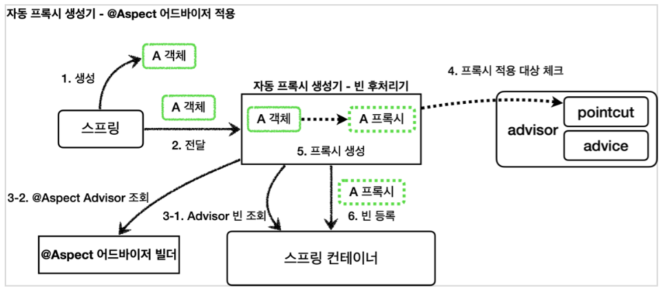
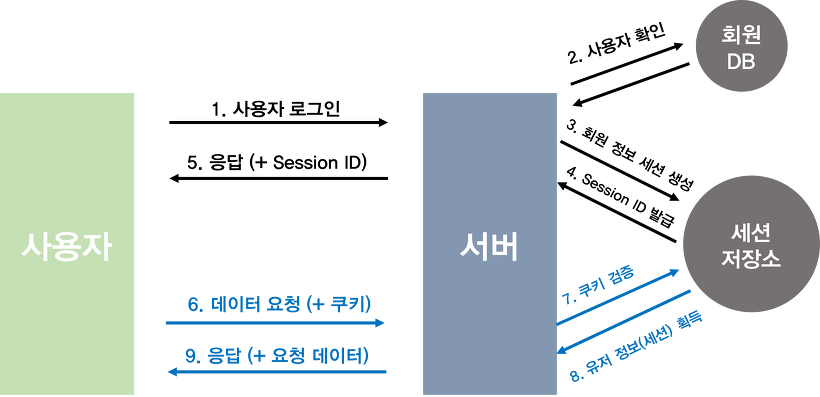
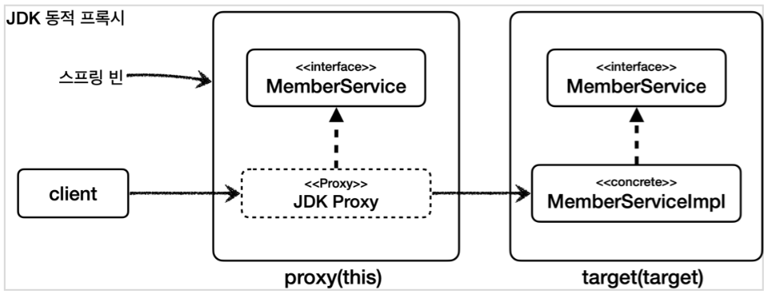

최종 작성일 : 2023.07.26.</br>

## AOP란 무엇인가

관점 지향은 로직을 핵심적인 관점, 부가적인 관점으로 나누어 보는 것입니다.
(핵심 : 비즈니스 로직, 부가 : 로깅, DB연결, 파일 입출력)

AOP는 이처럼 자주 사용되는 관점을 모듈화하여 프로그래밍하는 방법입니다.

<br/>

## AOP 관련 용어

- Aspect : 흩어진 관심사를 모듈화 한 것.
- Target : Aspect를 적용하는 곳. (클래스, 메스드 등)
- Advice : 실질적 기능을 담은 구현제.
- Join Point : Advice가 적용될 위치 혹은 끼어들 수 있는 시점. (Spring의 Join Point는 메서드 실행 시점을 의미)
- Point Cut : Point의 상세한 스펙을 정의한 것.
- Weaving : 포인트컷에 의해 결정된 타켓의 조인 포인트에 어드바이스를 삽입하는 과정.

<br/>

## AOP 적용 방식 (Weaving 반영 시점)

1.  컴파일 타임 적용
    - 컴파일 시점 적용 (Compile-Time-Weaving)
      - 코드 소스를 입력 받고 Weaving 된 calss 파일을 AspectJ Compiler로 생성
      - 컴파일 시점에 하나의 바이트코드로 만들기 때문에 컴파일 이후 성능에 영향을 주지 않음.
      - Lombok과 같이 컴파일 과정에서 조작을 하는 플러그인과 높은 확률로 충돌하여 컴파일 오류가 발생할 수 있음.
    - 컴파일 후 적용 (Post-Compile-Weaving)
      - 이미 존재하는 class 파일, jar 파일에 Weaving

<br/>

2. 로드 타임 적용 (Load-Time-Weaving)
   - 순수하게 컴파일한 뒤, 클래스를 로딩하는 시점에(JVM 로드) 클래스 정보를 변경하는 방법.
   - CTW와 다르게 실행되기 전까지 바이트코드를 변경하지 않기때문에 컴파일 시간이 짧으나, 런타임 성능에 영향을 끼칠 수 있음.
   - 성능 하락을 방지하기 위해 추가적인 옵션 설정이 필요함.

<br/>

3. 런타임 적용
   - Spring AOP가 사용하는 방법.
   - Bean을 등록할 때, Proxy Bean을 만들어 Aspect 코드를 추가하여 동작하는 방법.

<br/>

## AOP 라이브러리

1. Spring AOP

   - CGlib등 바이트코드 조작을 이용한 다이나믹 프록시를 사용하여 AOP 기능을 제공.
   - 런타임 시점에 적용되며, 프록시 객체를 이용하므로 앱 성능에 영향을 끼칠 수 있음.
   - 프로그래머가 직면하는 일반적인 문제 해결을 위해 Spring IoC에서 제공하는 간편한 AOP기능.
   - 완벽한 AOP 솔루션이 아니라, Spring 컨테이너가 관리하는 Bean에만 사용하려고 만들었고, 실제로 Bean만 AOP를 적용 가능.
   - 메소드 실행 포인트 컷만 지원.
   - 각종 라이브러리와 호환성이 뛰어남. (Lombok)

   <br/>

2. AspectJ
   - [.aj 파일]을 이용한 AspectJ Compiler를 추가로 사용하여 컴파일 시점이나 로드 시점에 적용.
   - 런타임 시점에 영향을 끼치지 않으므로 앱 성능에 영향을 주지 않음.
   - 자바 코드에서 동작하는 모든 객체에 댄한 완벽한 AOP 솔루션을 제공하여 성능이 뛰어나고 기능이 매우 강력함.
   - Spring AOP에 비해 사용 방법이 다양하고 내부 구조가 굉장히 복잡함.
   - 모든 포인트 컷 지원
   - 3가지 유형의 Weaving을 제공함.

<br/>

## AOP 동작 과정

@Aspect가 있을 경우 Advisor로 변환해서 @Aspect Advisor 빌더 내부에 저장하는 작업을 수행함.


이후 다음 과정을 통해 Advisor 로직을 넣음.


1. 스프링 빈 대상이 되는 객체를 생성. (Component Scan 대상)
2. 생성된 객체를 빈 저장소에 등록하기 직전에 빈 후처리기에 전달.
3. 빈 후처리기에서 해당 빈의 프록시를 만들어 이를 @Aspect Advisor 빌더 내부에 전달.
4. 빌더 내부에 저장된 모든 Advisor 조회하여 포인트컷의 정보와 동일한 Advisor를 찾음.
   - Advisor를 찾은 경우 프록시를 생성하고 해당 프록시를 빈 저장소에 반환.
   - 못찾은 경우 전달받은 프록시를 그대로 빈 저장소에 반환.
5. 빈 저장소는 반환 받은 프록시로 스프링 컨테이너에 빈 등록.

<br/>

## AOP 사용 시 주의사항

### Bean 등록

@Aspect는 Advisor를 쉽게 만들 수 있도록 도와주는 역할을 하는 것이지 컴포넌트 스캔이 되는 것은 아님. 따라서 반드시 빈 등록을 해야함.

<br/>

### 프록시 내부 호출

```java
@Slf4j
@Component
public class CallService {

   @LogAOP
    public void external() {
        log.info("call external");
        internal(); //내부 메서드 호출(this.internal())
    }

    @LogAOP
    public void internal() {
        log.info("call internal");
    }

}
```



- 해당 소스일 경우, 빈 컨테이너에는 CallServic() 프록시가 있음.
- external(), internal()을 호출하면 해당 프록시를 통해 호출 됨.
- external(), internal()을 각각 호출하면 둘 다 적용이 됨. 그러나 external() 안의 internal()은 AOP가 적용되지 않음.
- 대안 방법으로는 구조 변경, 지연 조회 등이 있음. (지연 조회는 ObjectProvider, ApplicationContext를 사용)

<br/>

### JDK 동적 프록시 사용할 경우



- MemberServiceImpl을 대상으로 프록시를 생성할 경우 MemberService 기반으로 프록시를 생성하여 빈에 등록함.
- 해당 프록시는 MemberServiceImpl로 타입캐스팅이 불가능함. 따라서 의존관계 주입에서 문제가 발생함.

<br/>


- MemberServiceImpl을 대상으로 프록시를 생성할 경우 MemberServiceImpl을 기반으로 프록시를 만들어 빈으로 등록함.
- 해당 프록시는 MemberService로 타입캐스팅이 가능함.
- 그러나 CGLIB는 한계가 있음.
  - 대상 클래스에 기본 생성자가 필수
    - 구체 클래스를 상속받아 구현되기 때문에 자바에서는 자식 생성자에서 부모 클래스의 생성자를 반드시 호출해야함.
  - 부모 생성자 2번 호출
    - 실제 target의 객체를 생성할 때 1번
    - 프록시 객체를 생성할 때 부모 생성자 호출 1번
  - final 키워드 클래스, 메서드 사용 불가
    - final 키워드에서 오는 상속의 문제점이 있지만, 일반적인 웹 어플리케이션 개발에서는 final 키워드를 잘 사용하지 않아서 특별한 문제가 되진 않음.
- 스프링은 해당 문제를 해결하고 GCLIB 사용을 채택함.
  - objenesis 라이브러리로 기본 생성자 없이 객체 생성
  - target 생성할 때 생성자 호출 1번, objenesis 라이브러리로 프록시 객체 생성할 때는 생성자 호출 없이 객체 생성

<br/>
