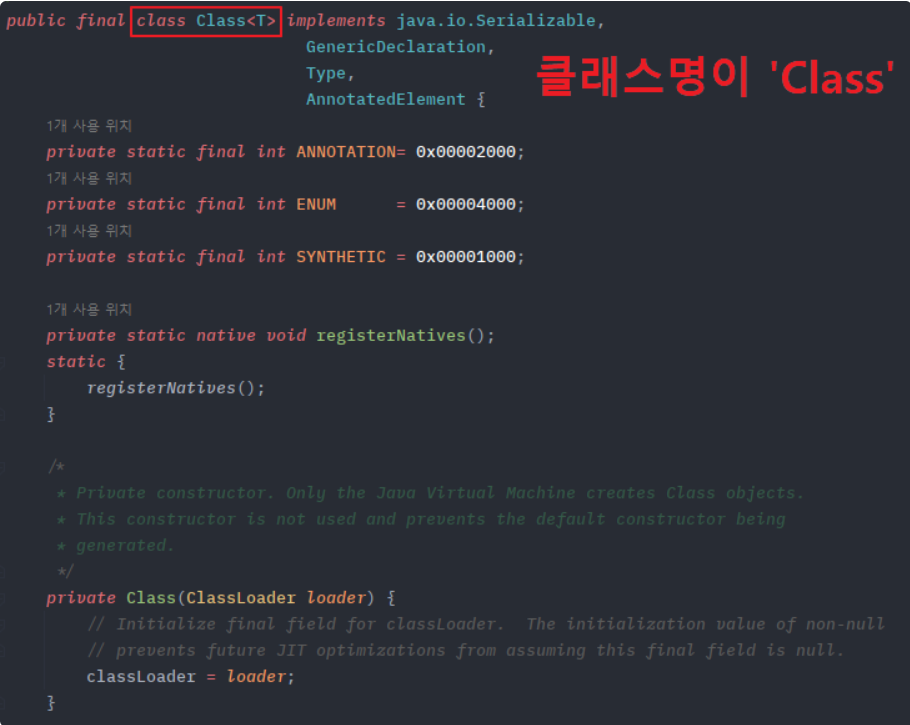
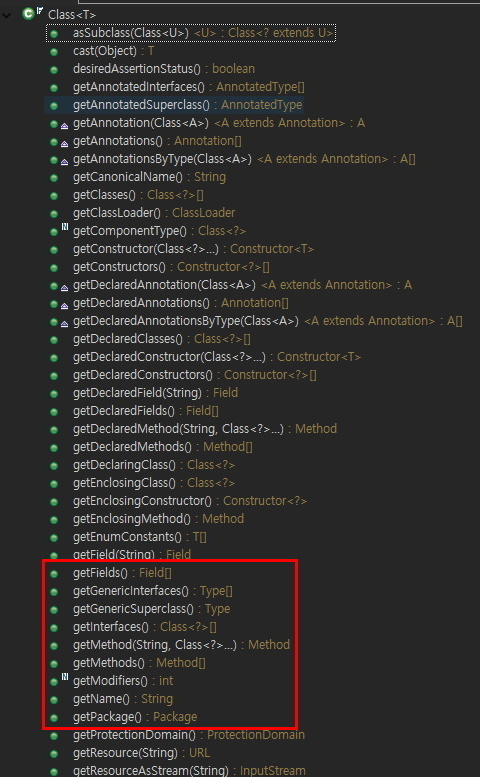

> ## 자바의 Class 클래스 (Java.lang.Class)

- 코드에서 클래스 정보를 얻어와 런타임 단에서 다이나믹하게 클래스를 핸들링 할 수 있게 만들어줌.
- 클래스명이 Class인 클래스임.
- 자바의 모든 클래스와 인터페이스는 컴파일 후 .class 파일로 변환됨. Class 클래스는 이 .class 파일의 클래스 정보들을 가져와 힙 영역에 자동으로 객체화 함. 따라서 new 인스턴스화 없이 바로 가져와 사용할 수 있음.
- 애플리케이션 개발에서보다 프레임워크, 라이브러리에서 많이 사용됨.
- 대표적으로 스프링의 DI, Proxy, ModelMapper, Hibernate, Lombok 등이 있음.




<br/>
<br/>

> ## Class 객체 얻는 법

<details>
    <summary>Object.getClass()</summary>

- 최상위 클래스인 Object가 제공하는 getClass()로 가져오는 방법.
- 가져오려는 클래스의 인스턴스가 있어야 가능.

```java
public static void main(String[] args) {

    // 스트링 클래스 인스턴스화
    String str = new String("Class클래스 테스트");

    // getClass() 메서드로 얻기
    Class<? extends String> cls = str.getClass();
    System.out.println(cls); // class java.lang.String
}
```
</details>

<details>
    <summary>.class 리터럴로 얻기</summary>

- 인스턴스가 없고, 컴파일 된 .class 파일만 있을 경우 사용.
- 가장 심플함.

```java
public static void main(String[] args) {

    // 클래스 리터럴(*.class)로 얻기
    Class<? extends String> cls2 = String.class;
    System.out.println(cls2); // class java.lang.String
}
```
</details>

<details>
    <summary>Class.forName()</summary>

- 리터럴 방식과 동일하게 컴파일 된 클래스 파일이 있다면 클래스 이름만으로 Class 객체 반환 가능.
- 단, 클래스의 도메인을 상세히 적어야 하며 오타가 없어야 함.
- 가장 메모리를 절약하면서 동적 로딩 가능.
- 컴파일에 바인딩 되지않고 런타임때 불러오기 때문에 동적 로딩이라 불림.
- 예외처리를 해줘야 함.

</details>

<br/>
<br/>

> ## Class 클래스 메서드 종류



- String getName() : 클래스의 이름을 리턴.
- Package getPackage() : 클래스의 패키지 정보를 Package 리턴.
- Field[] getFields() : public으로 선언된 변수 목록 Field[] 리턴.
- Field getField(String name) : public으로 선언된 변수명 name을 Field 리턴.
- Field[] getDeclaredFields() : 모든 변수 목록 Field[] 리턴.
- Field getDeclaredField(String name) : 모든 변수중 변수명 name을 Field 리턴.
- Method[] getMethods() : public 선언된 메소드 목록 Method[] 리턴.
- Method getMethod(String name, Class... parameterTypes) : public 메소드 중 메소드명 name이고 매개변수 type이 일치하는 Method 리턴.
- Method[] getDeclaredMethods() : 모든 메소드 정보 리턴.
- Method getDeclaredMethod(String name, Class... parameterType) : 모든 메소드 중 메소드명 name이고 매개변수 type 일치하는 Method 리턴.
- Constructor[] getConstructors() : public 생성자 목록 Constructor[] 리턴.
- Constructor[] getDeclaredConstructors() : 모든 생성자 목록 Constructor[] 리턴.
- int getModifiers() : 클래스의 접전자 정보를 int 리턴.

<br/>
<br/>

