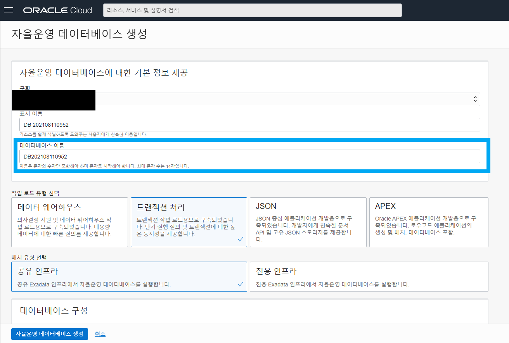
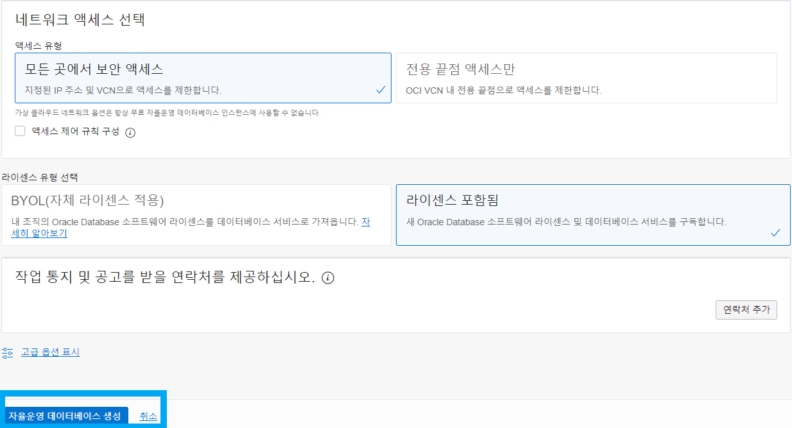
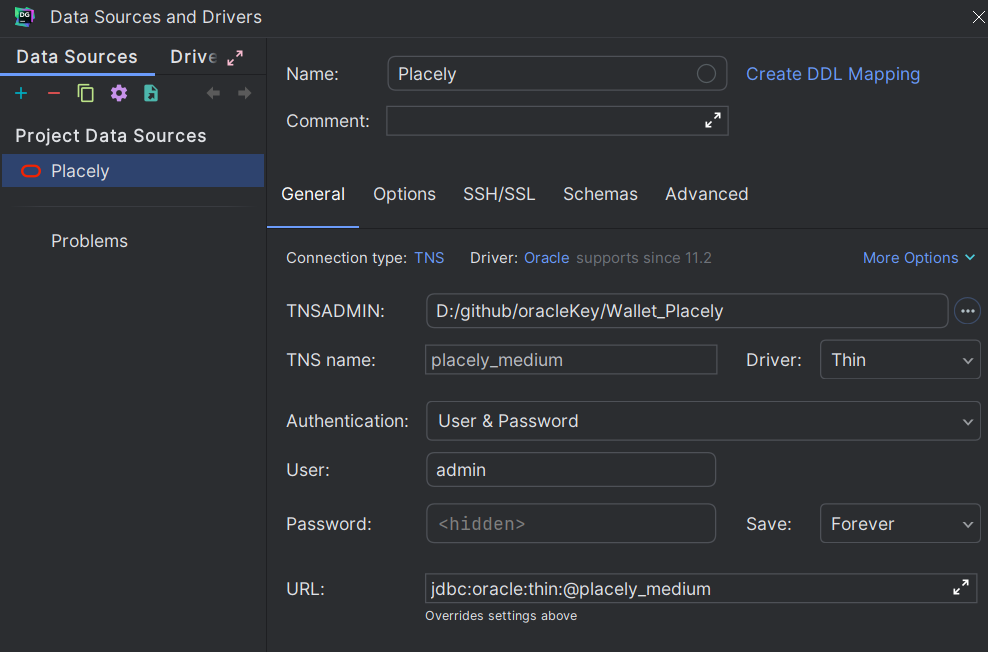
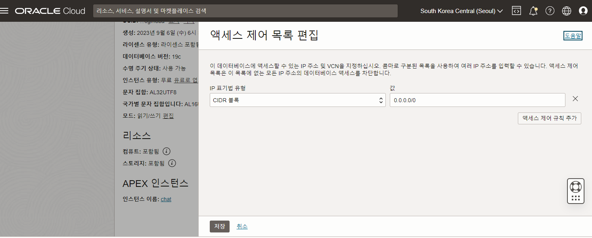
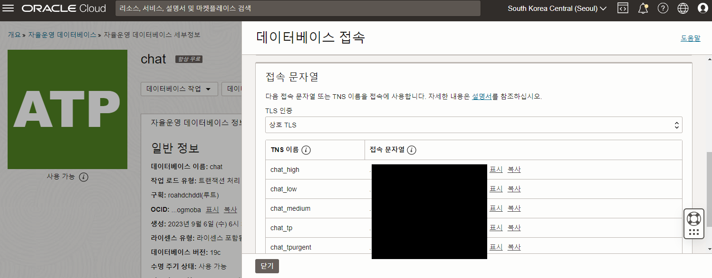

#APT-DB

<details>
    <summary>APT 생성</summary>

1. ATP 생성 클릭
   

2. DB 이름 설정
   

3. 버전 및 무료 체크
   

4. 비밀번호 설정
   

5. DB 생성
   

</details>

<details>
    <summary>DB 접속</summary>

1. DB 접속 클릭

   

<br/>

2. DB 접속을 위한 전자 지갑 다운. 비밀번호는 ATP에서 설정한 비번.

   

<br/>

3. sql developer로 접속.

   
   

<br/>

4. dataGrip 접속.

   

</details>

<details>
    <summary>Spring Boot 연결</summary>

- <details>
    <summary>전자 지갑을 사용하지 않은 방법</summary>
    
    1. 액세스 제어 목록 편집
    

    <br/>

  2. mTLS 인증 비활성화
     

    <br/>

  3. ojdbc 설치
     ```gradle
     implementation ('com.oracle.database.jdbc:ojdbc8-production:21.9.0.0') {
         exclude group: 'com.oracle.database.ha', module: 'simplefan'
         exclude group: 'com.oracle.database.ha', module: 'ons'
     }
     ```

    <br/>

  4. properties 추가
     ```properties
     spring.datasource.driverClassName=oracle.jdbc.driver.OracleDriver
     spring.datasource.url=jdbc:oracle:thin:@(description= .....)
     spring.datasource.username=PP0309
     spring.datasource.password=1Q2w3e4r!!!!
     spring.jpa.hibernate.ddl-auto=update
     ```
     - 여기서 url은 데이터베이스 접속에서 확인 가능
       

</details>

</details>
