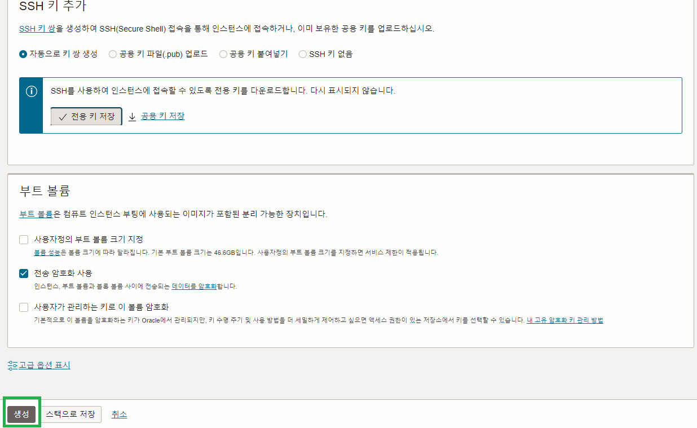
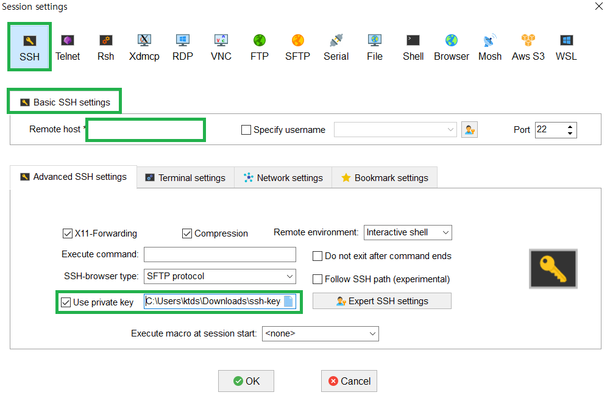
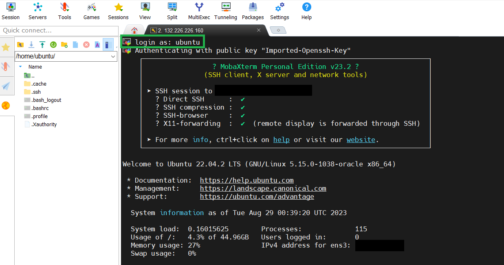
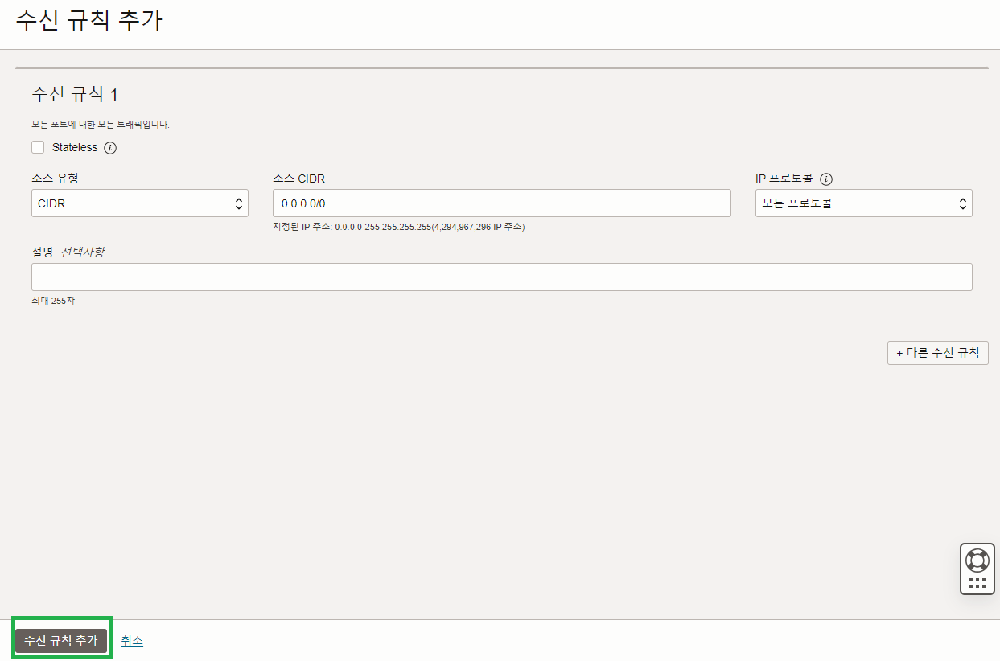

# Instance

<details>
    <summary>인스턴스 생성</summary>

1. [리소스 실행] VM 인스턴스 생성 클릭
   

<br/>

2. [이미지 및 구성] 이미지 변경 클릭
   

<br/>

3. [이미지 선택] 서버 운영체제 고른 후 이미지 선택
   

<br/>

4. [SSH키 추가] 서버에 접속할때 사용하기 위한 키 다운로드 (다시 발급받을 수 없으므로 파일을 관리해야함.)
   

<br/>

5. [생성] 인스턴스 생성
   

<br/>

6. [인스턴스] 기다리면 초록색으로 변경되고 구성이 완료됨.
   

</details>

<details>
    <summary>인스턴스 접속</summary>

1. [모바엑스텀 설치](https://mobaxterm.mobatek.net/)
2. [세션] 새로운 세션 만들기 위해 세션 클릭
   

<br/>

3. [SSH] Remote host : 인스턴스 공용 IPv4 주소를 넣어주고, 인스턴스 생성하며 발급 받은 키 파일을 등록.
   

<br/>

4. [접속] 기본 로그인은 ubuntu.
   

</details>

<details>
    <summary>방화벽 설정</summary>

1. 서브넷 방화벽 해제를 위해 서브넷 접속
   

<br/>

4. 보안 목록 선택
   

<br/>

4. 신규 규칙 추가
   

<br/>

5. 서버간 라우팅 허용 규칙 추가
   

<br/>

6. 해당 서버에서 포트 열기 (ubuntu ver.24)

```ubuntu

# 해당 포트 열기 (맨 위에 해당 룰 추가하여 아래 룰 무력화 시키기)
sudo iptables -I INPUT 1 -p tcp --dport 6379 -j ACCEPT

# 룰 확인하기
sudo iptables -L --line-numbers

# 재부팅 시에도 해당 룰 적용하기
sudo apt install iptables-persistent
sudo netfilter-persistent save


```

</details>
