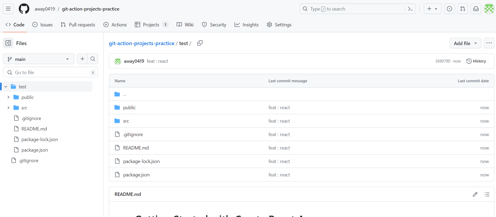
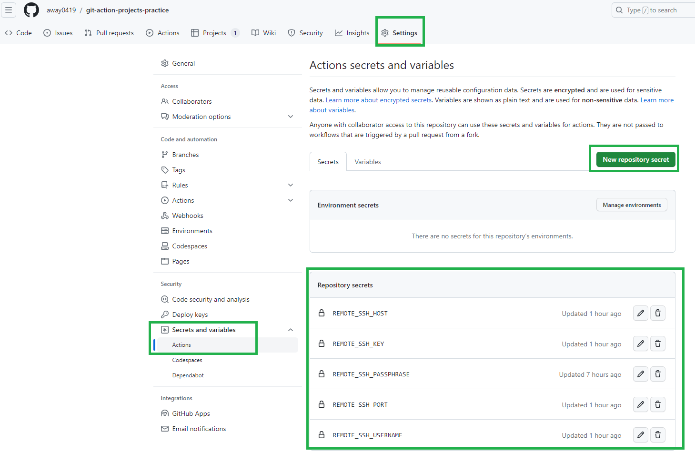

> ## GitHub Action

- GitHub에서 무료로 CI/CD를 위한 서버를 제공.
- 아무것도 설치되어 있지 않기 때문에 기본적인 툴 설치 해야함. (ex. linux, ubuntu)
- 필요한 툴 설치 후 CI/CD 진행.
- 현재 repository에 있는 소스를 이용함.
- Branch 별 CI/CD 적용 가능.

<br/>
<br/>

> ## project, yaml 생성

1. github 프로젝트 세팅
   

2. action에 들어가서 기본 파일 선택 (프로젝트랑 비슷한 것 고르면 됨. 아무거나 하고 수정해도 됨)
   

<br/>
<br/>

> ## 변수 생성

- GitHub Repository에 저장할 수 없는 민감한 정보들을 따로 저장하면 yaml에서 사용 가능.
  
  repository > settings > Secrets and variables > Actions > new repository secret 을 통해 yml에서 사용할 변수 등록.

<br/>
<br/>

> ## yaml 예시

```yaml
# yaml 용도
name: develop build
# 어떤 액션에 실행되는지 정의 (main에서 push가 발생하면 실행)
on:
  push:
    branches: ["main"]

# 실행 하려는 작업들
jobs:
  # Docker와 비슷한 원리. GitHub Action에 해당 컨테이너를 올려 실행.
  ci-cd:
    # Ubuntu 선택
    runs-on: ubuntu-latest

    # 단계 별 실행
    steps:
      # 아마 해당 브랜치로 이동하는 거인 듯?
      - name: Checkout
        uses: actions/checkout@v3

        # JDK 설치
      - name: Set up JDK 17
        uses: actions/setup-java@v3
        with:
          java-version: 17
          distribution: "temurin"

        # Repository에 올릴 수 없는 민감한 정보를 담은 설정 파일 만들기.
      - name: application-env.yaml create
        run: echo "${{ secrets.APPLICATION_ENV }}" > application-env.yaml
        working-directory: src/main/resources/

        # gradlew 권한 부여
      - name: Grant execute permission for gradlew
        run: sudo chmod +x ./gradlew

        # gradle 설치
      - name: Setup Gradle
        uses: gradle/gradle-build-action@v2
        with:
          gradle-version: 8.2.1

        # jar 생성
      - name: Build
        run: ./gradlew build

        # build 완료한 파일 실제 나의 서버에 배포. (SCP 이용)
      - name: Deploy
        uses: cross-the-world/ssh-scp-ssh-pipelines@latest
        with:
          host: ${{ secrets.REMOTE_SSH_HOST }}
          user: ${{ secrets.REMOTE_SSH_USERNAME }}
          key: ${{ secrets.REMOTE_SSH_KEY }}
          port: ${{ secrets.REMOTE_SSH_PORT }}
          scp: |
            ./build/libs/ => /home/ubuntu/github/fast-automl-api/build/libs/
          last_ssh: |
            cd /home/ubuntu/github/fast-automl-api/build/libs
            sudo pkill -f fast-automl-0.0.1-SNAPSHOT.jar
            sudo chmod 777 fast-automl-0.0.1-SNAPSHOT.jar
            nohup java -jar -Xms512M -Xmx512M /home/ubuntu/github/fast-automl-api/build/libs/fast-automl-0.0.1-SNAPSHOT.jar > output.log 2>&1 &

#       직접 나의 서버에 접속한 뒤, GitHub에서 pull 받고 build 하고 실행. (비추)
#      - name: execute remote ssh
#        uses: appleboy/ssh-action@master
#        with:
#          host: ${{ secrets.REMOTE_SSH_HOST }}
#          username: ${{ secrets.REMOTE_SSH_USERNAME }}
#          key: ${{ secrets.REMOTE_SSH_KEY }}
#          port: ${{ secrets.REMOTE_SSH_PORT }}
#          script: |
#            cd /home/ubuntu/github/fast-automl-api/
#            sudo git pull origin develop
#            sudo chmod +x ./gradlew
#            ./gradlew build
#            cd  build/libs
#            sudo chmod 777 fast-automl-0.0.1-SNAPSHOT.jar
#            nohup java -jar -Xms512M -Xmx512M fast-automl-0.0.1-SNAPSHOT.jar &
```
