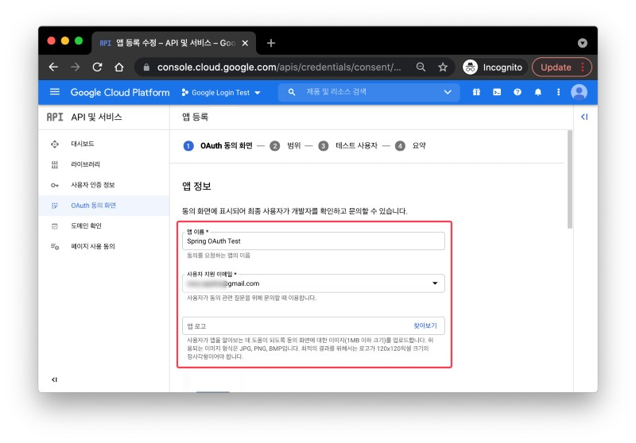
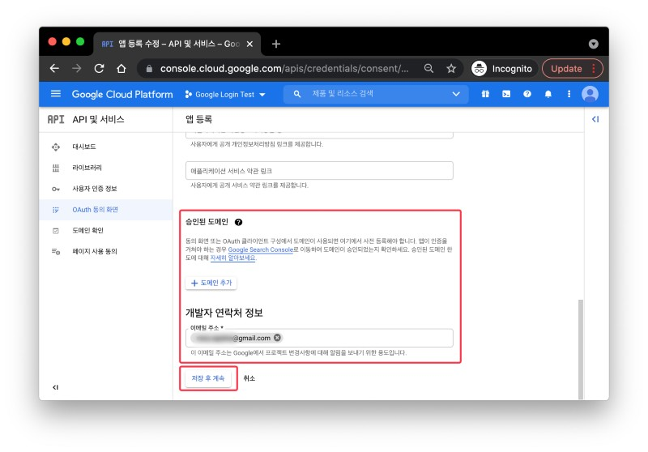
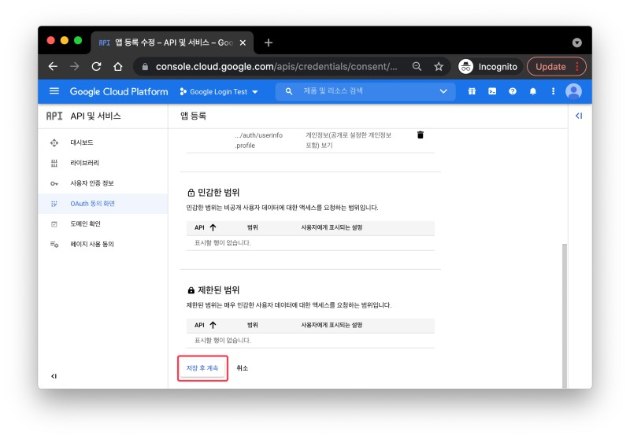
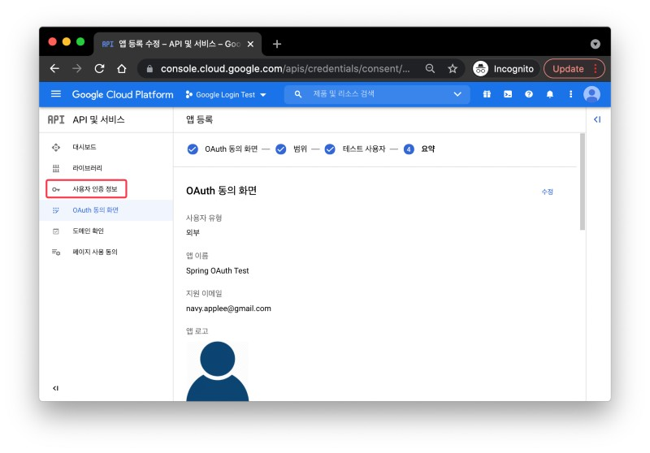
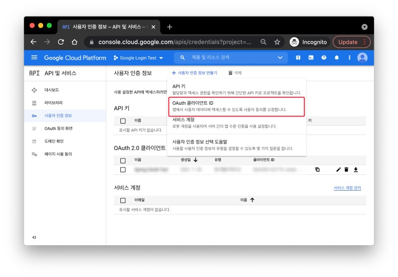
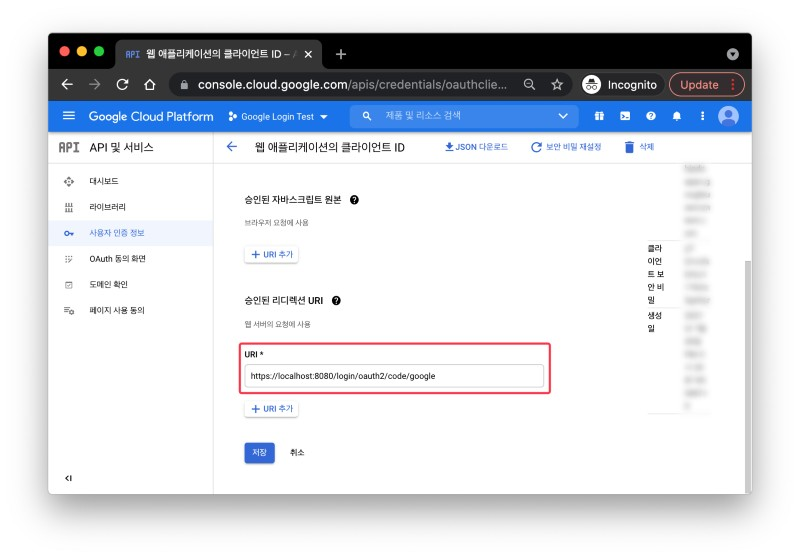
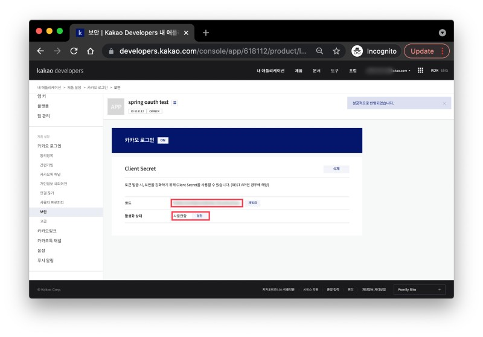

```
kotlin : 1.8
spring boot : 3.1.3
spring security : 6.1.4

- 해당 기록은 흐름에 맞춰 작성 되었음.
- 따라서, OAtuh2에서 작성한 코드가 JWT에서 다르게 작성 될 수 있음.
- 완성된 코드가 필요하다면 파일 소스를 직접 보는게 좋음.
```

<details>
  <summary>OAuth2</summary>

- google, naver, kakao 연동 로그인 구현

  ### OAuth2 서비스 등록

    <details>
        <summary>google</summary>

  [구글 프로젝트](https://console.cloud.google.com/apis/dashboard?project=powerful-atlas-401406)

  
  
  
  
  
  
  
  
  
  
  
  
  
  

  ```text
  http://localhost:8080/login/oauth2/code/google
  ```

  
  

    </details>

    <details>
        <summary>naver</summary>

  [naver](https://developers.naver.com/main/)

  
  
  
  

  ```text
  서비스 URL: http://localhost:3000
  Callback URL: http://localhost:8080/login/ouath2/code/naver
  ```

  
  
  
    </details>

    <details>
        <summary>kakao</summary>

  [kakao](https://developers.kakao.com/)

  
  
  
  
  
  
  
  
  
  
  
  

  ```text
  http://localhost:8080/login/oauth2/code/kakao
  ```

  

    </details>

  ### 라이브러리 및 yml

    <details>
        <summary>gradle</summary>

  ```gradle
  implementation("org.springframework.boot:spring-boot-starter-data-jpa")
  implementation("org.springframework.boot:spring-boot-starter-data-redis")
  implementation("org.springframework.boot:spring-boot-starter-oauth2-client")
  implementation("org.springframework.boot:spring-boot-starter-security")
  implementation("org.springframework.boot:spring-boot-starter-web")
  implementation("com.fasterxml.jackson.module:jackson-module-kotlin")
  implementation("org.jetbrains.kotlin:kotlin-reflect")
  compileOnly("org.projectlombok:lombok:1.18.24")
  developmentOnly("org.springframework.boot:spring-boot-devtools")
  runtimeOnly("com.h2database:h2")
  testImplementation("org.springframework.boot:spring-boot-starter-test")
  testImplementation("org.springframework.security:spring-security-test")
  testImplementation("com.h2database:h2:2.1.214")
  ```

    </details>

    <details>
        <summary>application.yaml</summary>

  ```yaml
  spring:
      profiles:
      active:
          - local
      # h2 설정
      h2:
      console:
          enabled: true
          path: /h2-console
      datasource:
      driver-class-name: org.h2.Driver
      url: jdbc:h2:mem:test
      username: admin
      password: admin
      # JPA 설정
      jpa:
      properties:
          hibernate:
          format_sql: true
          show_sql: true
      # H2에서 JPA 사용하기 위한 설정
      sql:
      init:
          mode: always
      # security 설정
      # 구글, 페북, 깃헙 등은 spring security에서 지원함.
      # 네이버, 카카오는 지원하지 않음. 따라서 추가 설정 필요함.
      security:
      oauth2.client:
          registration:
          google:
              clientId: ${oauth2.client.google.id}
              clientSecret: ${oauth2.client.google.secret}
              scope:
              - email
              - profile
          naver:
              clientId: ${oauth2.client.naver.id}
              clientSecret: ${oauth2.client.naver.secret}
              clientAuthenticationMethod: client_secret_post
              authorizationGrantType: authorization_code
              # application이 가지고 있는 기본 변수를 불러옴.
              redirectUri: "{baseUrl}/{action}/oauth2/code/{registrationId}"
              scope:
              - nickname
              - email
              - profile_image
              clientName: Naver
          kakao:
              clientId: ${oauth2.client.kakao.id}
              clientSecret: ${oauth2.client.kakao.secret}
              clientAuthenticationMethod: client_secret_post
              authorizationGrantType: authorization_code
              redirectUri: "{baseUrl}/{action}/oauth2/code/{registrationId}"
              scope:
              - profile_nickname
              - profile_image
              - account_email
              clientName: Kakao
          provider:
          kakao:
              authorization_uri: https://kauth.kakao.com/oauth/authorize
              token_uri: https://kauth.kakao.com/oauth/token
              user-info-uri: https://kapi.kakao.com/v2/user/me
              # 해당 서비스에 요청하여 받은 데이터 안에는 user 정보가 있는데 이 정보를 담음 필드 명이 무엇인지 설정하는 것.
              user_name_attribute: properties
          naver:
              authorization_uri: https://nid.naver.com/oauth2.0/authorize
              token_uri: https://nid.naver.com/oauth2.0/token
              user-info-uri: https://openapi.naver.com/v1/nid/me
              user_name_attribute: response

  logging.level:
      org.hibernate.SQL: debug

  --- #local
  jpa:
      hibernate:
      ddl-auto: create-drop
  --- #env
  spring:
      profiles.include:
      - env
  ```

    </details>

    <details>
        <summary>application-env.yaml</summary>

  ```yaml
  oauth2.client:
      google:
      id: google에서 받은 ID
      secret: google에서 받은 KEY
      naver:
      id: naver에서 받은 ID
      secret: naver에서 받은 KEY
      kakao:
      id: kakao에서 받은 ID
      secret: kakao에서 받은 KEY
  ```

    </details>

  ### 멤버

  - security 실습을 위한 도메인

    <details>
        <summary>Role</summary>

    - 사용자 권한

    ```kotlin
    package com.example.kotlin.member

    enum class Role(
        val key: String,
        val title: String
    ) {
        ROLE_ADMIN("ROLE_ADMIN", "관리자"),
        ROLE_USER("ROLE_USER", "사용자")
    }
    ```

    </details>

    <details>
        <summary>Member</summary>

    - db 저장 할 멤버 정보

    ```kotlin
    package com.example.kotlin.member

    import jakarta.persistence.*
    import java.util.*

    @Entity
    @Table(name = "MEMBER_TABLE")
    class Member(
        @Id
        @GeneratedValue(strategy = GenerationType.UUID)
        @Column(name = "member_id", nullable = false)
        var id: UUID?,

        @Column(name = "name", nullable = false)
        var name: String?,

        @Column(name = "email")
        var email: String?,

        @Column(name = "picture")
        var picture: String?,

        @Enumerated(EnumType.STRING)
        var role: Role?

    )
    ```

    </details>

    <details>
        <summary>MemberRepository</summary>

    - JPA를 이용한 멤버 등록

    ```kotlin
    package com.example.kotlin.member.repository

    import com.example.kotlin.member.Member
    import org.springframework.data.jpa.repository.JpaRepository

    interface MemberRepository : JpaRepository<Member, Long> {
        fun findByEmail(email: String): Member?
    }
    ```

    </details>
    <details>
        <summary>MemberController</summary>

    - 멤버 컨트롤러

    ```kotlin
    package com.example.kotlin.member.controller

    import org.springframework.web.bind.annotation.GetMapping
    import org.springframework.web.bind.annotation.PostMapping
    import org.springframework.web.bind.annotation.RequestMapping
    import org.springframework.web.bind.annotation.RestController

    @RestController
    @RequestMapping("/api/v1/member")
    class MemberController {

        @GetMapping("/login/success")
        fun login() : String?{
            return "login success"
        }

    }
    ```

    </details>

  ### OAuth2

  - security의 OAuth2를 사용하기 위한 설정 및 로직 구현

    <details>
        <summary>Oauth2UserInfo</summary>

    - OAuth2에서 가져온 사용자 정보를 담을 클래스. - 가져온 사용자 정보를 토대로 Member Entity 생성 - 첫 로그인의 경우 관리자는 아닐 것이라 판단하여 ROLE_USER로 줌

    ```kotlin
    package com.example.kotlin.security.oauth2

    import com.example.kotlin.member.Member
    import com.example.kotlin.member.Role

    class Oauth2UserInfo(
        val id: String?,
        val name: String?,
        val email: String?,
        val picture: String?
    ){
        fun toEntity(): Member {
            return Member(id=null, name=name, email=email, picture=picture, role = Role.ROLE_USER)
        }
    }
    ```

    </details>

    <details>
        <summary>OAuth2Attribute</summary>

    - 사용자가 이용한 OAuth2 서비스가 무엇인지 판단하고, 해당 서비스의 정보를 알맞게 가져오기 위한 클래스
    - naver와 kakao는 Spring Security가 제공하지 않으므로 추가 설정이 필요함.

    ```kotlin
    package com.example.kotlin.security.oauth2

    enum class OAuth2Attributes(
        val nameAttributeKey: String?,
        val oauth2UserInfo: (Map<String, Any>?) -> Oauth2UserInfo
    ) {
        GOOGLE("google", { map ->
            Oauth2UserInfo(
                map?.get("sub").toString(),
                map?.get("name").toString(),
                map?.get("email").toString(),
                map?.get("picture").toString()
            )
        }),

        NAVER("naver", { attributes ->
            val content = attributes?.get("response");
            val map: Map<String, Any>? = if (content is Map<*, *>) {
                content as? Map<String, Any>
            } else {
                emptyMap()
            }
            Oauth2UserInfo(
                map?.get("id").toString(),
                map?.get("nickname").toString(),
                map?.get("email").toString(),
                map?.get("profile_image").toString()
            )
        }),

        KAKAO("kakao", { attributes ->
            val content = attributes?.get("properties");
            val map: Map<String, Any>? = if (content is Map<*, *>) {
                content as? Map<String, Any>
            } else {
                emptyMap()
            }
            Oauth2UserInfo(
                map?.get("sub").toString(),
                map?.get("name").toString(),
                map?.get("account_email").toString(),
                map?.get("thumbnail_image").toString()
            )
        });

        companion object {
            fun extract(registrationId: String, attributes: Map<String, Any>?): Oauth2UserInfo? {
                return values().find { it.nameAttributeKey == registrationId }?.oauth2UserInfo?.invoke(attributes)
            }
        }
    }
    ```

    </details>

    <details>
        <summary>CustomOAuth2MemberService</summary>

    - 사용자가 OAuth2 로그인 할 때 수행되는 비즈니스 로직 - 서비스 별 가져온 사용자의 필드가 다르므로 개발자가 구현한 OAut2UserInfo 형식으로 매핑 후 반환. - 반환된 DefaultOAuth2User는 Authentication가 됨.

    ```kotlin
    package com.example.kotlin.security.oauth2.service

    import com.example.kotlin.member.Member
    import com.example.kotlin.member.repository.MemberRepository
    import com.example.kotlin.security.oauth2.OAuth2Attributes
    import com.example.kotlin.security.oauth2.Oauth2UserInfo
    import jakarta.servlet.http.HttpSession
    import org.springframework.security.core.authority.SimpleGrantedAuthority
    import org.springframework.security.oauth2.client.userinfo.DefaultOAuth2UserService
    import org.springframework.security.oauth2.client.userinfo.OAuth2UserRequest
    import org.springframework.security.oauth2.client.userinfo.OAuth2UserService
    import org.springframework.security.oauth2.core.OAuth2AuthenticationException
    import org.springframework.security.oauth2.core.user.DefaultOAuth2User
    import org.springframework.security.oauth2.core.user.OAuth2User
    import org.springframework.stereotype.Service

    @Service
    class CustomOAuth2MemberService(
        private val memberRepository: MemberRepository,
        private val httpSession: HttpSession
    ): OAuth2UserService<OAuth2UserRequest, OAuth2User> {
        override fun loadUser(userRequest: OAuth2UserRequest?): OAuth2User {
            if (userRequest == null) throw OAuth2AuthenticationException("Oauth2 UserRequest Error")

            // userRequest에서 user 정보 가져오기
            val delegate = DefaultOAuth2UserService()
            val oAuth2User = delegate.loadUser(userRequest)

            // registrationId는 Oauth2 서비스 이름 (구글, 네이버, 카카오 등)
            val registrationId = userRequest.clientRegistration.registrationId
            // OAuth2 로그인 하면 서비스 별 유저가 가지는 고유 키가 있는 듯. 그 키의 필드 값.
            val userNameAttributeName = userRequest.clientRegistration.providerDetails.userInfoEndpoint.userNameAttributeName
            // OAuth2 서비스의 유저 정보들
            val attributes = oAuth2User.attributes;
            // 서비스의 유저 정보를 개발자가 만든 객체 형태로 매핑
            val oauth2UserInfo = OAuth2Attributes.extract(registrationId, attributes)

            // 전달받은 OAuth2User의 attribute를 이용하여 회원가입 및 수정의 역할을 한다.
            val member = oauth2UserInfo?.let { saveOrUpdate(it) }

            // session에 SessionUser(user의 정보를 담는 객체)를 담아 저장한다.
    //        httpSession.setAttribute("user", SessionUser(user))

            return DefaultOAuth2User(
                setOf(SimpleGrantedAuthority(member?.role?.key)),
                attributes,
                userNameAttributeName
            )
        }

        fun saveOrUpdate(oauth2UserInfo: Oauth2UserInfo): Member {
            val member = memberRepository.findByEmail(oauth2UserInfo.email?:"")
                ?: oauth2UserInfo.toEntity()

            return memberRepository.save(member)
        }
    }
    ```

    </details>

    <details>
        <summary>CustomSuccessHandler</summary>

    - OAuth2 로그인 성공 시 실행 되는 로직.

    ```kotlin
    package com.example.kotlin.security.oauth2.handler

    import jakarta.servlet.http.HttpServletRequest
    import jakarta.servlet.http.HttpServletResponse
    import org.slf4j.LoggerFactory
    import org.springframework.security.core.Authentication
    import org.springframework.security.oauth2.core.user.DefaultOAuth2User
    import org.springframework.security.web.authentication.AuthenticationSuccessHandler
    import org.springframework.stereotype.Component

    @Component
    class CustomSuccessHandler() :AuthenticationSuccessHandler  {
        private val log = LoggerFactory.getLogger(this.javaClass)!!
        override fun onAuthenticationSuccess(
            request: HttpServletRequest?,
            response: HttpServletResponse?,
            authentication: Authentication?
        ) {

            val principal = authentication?.principal // 인증 완료한 객체의 principal을 가져옴. 이때 OAuth2의 principal에는 DefaultOAuth2User가 들어간다.
            val authorization = authentication?.authorities // 권한 목록
            val details = authentication?.details // 기타 정보
            val name = authentication?.name // DefaultOAuth2User 에 있는 userNameAttributeName 인듯
            val defaultOAuth2User = principal as? DefaultOAuth2User // 일단 DefaultOAuth2User로 형변환
            val authorities = defaultOAuth2User?.attributes // DefaultOAuth2User에 있는 attributes 즉, Oauth2 로그인 시 서비스에서 보낸 정보

            log.info("========CustomSuccessHandelr=========")
            log.info("authentication : {}",authentication)
            log.info("principal : {} ",principal)
            log.info("details : {} ",details)
            log.info("name : {} ",name)
            log.info("authorization : {} ",authorization)
            log.info ("authorities : {}", authorities)


            response?.sendRedirect("/page")
        }
    }
    ```

    </details>

    <details>
        <summary>SecurityConfig</summary>

    - OAuth2를 적용하기 위한 설정 추가.

    ```kotlin
    package com.example.kotlin.security.config

    import com.example.kotlin.security.oauth2.handler.CustomSuccessHandler
    import com.example.kotlin.security.oauth2.service.CustomOAuth2MemberService
    import lombok.RequiredArgsConstructor
    import org.springframework.context.annotation.Bean
    import org.springframework.context.annotation.Configuration
    import org.springframework.security.config.annotation.web.builders.HttpSecurity
    import org.springframework.security.config.http.SessionCreationPolicy
    import org.springframework.security.web.authentication.LoginUrlAuthenticationEntryPoint
    import org.springframework.security.web.util.matcher.AntPathRequestMatcher

    @Configuration
    @RequiredArgsConstructor
    class SecurityConfig(
        private val customOAuth2MemberService: CustomOAuth2MemberService,
        private val customSuccessHandler: CustomSuccessHandler
    ) {
        private val urls = arrayOf(AntPathRequestMatcher("/h2-console/**"), AntPathRequestMatcher("/api/member/signup"), AntPathRequestMatcher("/api/member/login"), AntPathRequestMatcher("/api/member/oauth2/**"))

        @Bean
        fun filterChain(http: HttpSecurity) = http
            .headers {it.frameOptions{it.disable()}}
            .csrf { it.disable() } // csrf off
            .cors { it.disable() } // cors off
            .formLogin { it.disable() } // security login page off
            .sessionManagement { it.sessionCreationPolicy(SessionCreationPolicy.NEVER) } //필요하다면 세션 생성. (API는 session이 필요 없지만 google 계정 정보를 가져오기 위해 session이 필요함)
            .authorizeHttpRequests {
                it.requestMatchers(*urls).anonymous() // [signup, login] 누구나 접근 가능
                    .anyRequest().authenticated()
            } // 나머지 api 호출은 인증 받아야함
            .oauth2Login {
                it.userInfoEndpoint { point -> point.userService(customOAuth2MemberService) } // oauth2Login는 loadUser라는 함수를 호출하는게 기본임. 이를 custom하여 사용하는 것.
                it.successHandler(customSuccessHandler) // 성공 시 핸들러
                // it.defaultSuccessUrl("/myspace") // 성공시 이동 페이지
                it.failureUrl("/fail") // 실패시
            }
            .exceptionHandling { it.authenticationEntryPoint(LoginUrlAuthenticationEntryPoint("/login")) } // 인증 되지 않은 사용자가 접근시 login으로 이동
            .build()!!
    }
    ```

      </details>
    </details>

---

<details>
  <summary>JWT</summary>

- OAuth2 로그인 후 이후 API 요청을 처리할 때 JWT를 이용하기 위한 로직 구현

  ### 라이브러리 추가

  <details>
    <summary>gradle</summary>

  - jwt 라이브러리 추가

    ```gradle
    import org.jetbrains.kotlin.gradle.tasks.KotlinCompile

    plugins {
        id("org.springframework.boot") version "3.1.3"
        id("io.spring.dependency-management") version "1.1.3"
        kotlin("jvm") version "1.8.22"
        kotlin("plugin.spring") version "1.8.22"
        kotlin("plugin.jpa") version "1.8.22"
        kotlin("plugin.allopen") version "1.8.22"
        kotlin("plugin.noarg") version "1.8.22"
    }

    allOpen{
        annotation("jakarta.persistence.Entity")
        annotation("jakarta.persistence.Embeddable")
        annotation("jakarta.persistence.MappedSuperclass")
    }

    noArg{
        annotation("jakarta.persistence.Entity")
    }

    group = "com.example"
    version = "0.0.1-SNAPSHOT"

    java {
        sourceCompatibility = JavaVersion.VERSION_17
    }

    repositories {
        mavenCentral()
    }

    dependencies {
        implementation("org.springframework.boot:spring-boot-starter-data-jpa")
        implementation("org.springframework.boot:spring-boot-starter-data-redis")
        implementation("org.springframework.boot:spring-boot-starter-oauth2-client")
        implementation("org.springframework.boot:spring-boot-starter-security")
        implementation("org.springframework.boot:spring-boot-starter-web")
        implementation("com.fasterxml.jackson.module:jackson-module-kotlin")
        implementation("org.jetbrains.kotlin:kotlin-reflect")
        implementation("io.jsonwebtoken:jjwt-api:0.11.2")
        implementation("io.jsonwebtoken:jjwt-impl:0.11.2")
        implementation("io.jsonwebtoken:jjwt-jackson:0.11.2")
        implementation("com.sun.xml.bind:jaxb-impl:4.0.1")
        implementation("com.sun.xml.bind:jaxb-core:4.0.1")
        implementation ("com.fasterxml.jackson.datatype:jackson-datatype-jsr310")	// LocalDateTime 역직렬화 해결 패키지
        implementation ("com.googlecode.json-simple:json-simple:1.1.1")	// Google Simple JSON
        implementation ("com.fasterxml.jackson.core:jackson-databind")	// Jackson Databind
        compileOnly("org.projectlombok:lombok:1.18.24")
        developmentOnly("org.springframework.boot:spring-boot-devtools")
        runtimeOnly("com.h2database:h2")
        testImplementation("org.springframework.boot:spring-boot-starter-test")
        testImplementation("org.springframework.security:spring-security-test")
        testImplementation("com.h2database:h2:2.1.214")
        runtimeOnly("com.oracle.database.jdbc:ojdbc8")
    }

    tasks.withType<KotlinCompile> {
        kotlinOptions {
            freeCompilerArgs += "-Xjsr305=strict"
            jvmTarget = "17"
        }
    }

    tasks.withType<Test> {
        useJUnitPlatform()
    }
    ```

    </details>

    ### 로그인 시 JWT 발급

    <details>
        <summary>AuthConstants</summary>

    - security에서 사용하는 상수 파일

      ```kotlin
      package com.example.kotlin.security

      object AuthConstants {
          const val AUTH_HEADER = "Authorization"
          const val TOKEN_TYPE = "Bearer " // 띄어 쓰기가 있어야 한다.
          const val COOKIE_HEADER = "Set-Cookie"
          const val REFRESH_TOKEN_PREFIX = "refresh_token"
      }
      ```

    </details>

    <details>
        <summary>MemberPrincipal</summary>

    - 인증 완료 된 객체에 넣으려는 사용자의 Claims를 담은 객체

      ```kotlin
      package com.example.kotlin.security.jwt

      import com.example.kotlin.member.Member
      import com.example.kotlin.member.Role
      import java.util.*


      class MemberPrincipal(
          val id: UUID?,
          val name: String?,
          val email: String?,
          val picture: String?,
          val role: Role?
      ){
          constructor(member: Member) : this(
              id = member.id,
              name = member.name,
              email = member.email,
              picture = member.picture,
              role = member.role
          )

          override fun toString(): String {
              return "MemberPrincipal(id=$id, name=$name, email=$email, picture=$picture, role=$role)"
          }

      }
      ```

    </details>

    <details>
        <summary>JWTProvider</summary>

    - JWT에 필요한 기능 구현

      ```kotlin
      package com.example.kotlin.security.jwt.provider

      import com.example.kotlin.security.AuthConstants
      import com.example.kotlin.security.jwt.MemberPrincipal
      import io.jsonwebtoken.Claims
      import io.jsonwebtoken.ExpiredJwtException
      import io.jsonwebtoken.Jwts
      import io.jsonwebtoken.SignatureAlgorithm
      import io.jsonwebtoken.security.Keys
      import jakarta.servlet.http.Cookie
      import jakarta.xml.bind.DatatypeConverter
      import org.slf4j.LoggerFactory
      import org.springframework.http.ResponseCookie
      import org.springframework.security.oauth2.jwt.JwtException
      import org.springframework.stereotype.Component
      import java.security.Key
      import java.util.*

      @Component
      class JWTProvider {
          private val jwtSecretKey = "exampleSecretKeyExampleSecretKeyExampleSecretKeyExampleSecretKey"
          private val log = LoggerFactory.getLogger(this.javaClass)!!

          private fun createHeader(): Map<String, Any> {
              val header: MutableMap<String, Any> = HashMap()
              header["typ"] = "JWT" // 토큰 타입
              header["alg"] = "HS256" // signature(서명) 알고리즘
              return header
          }

          private fun createClaims(memberPrincipal: MemberPrincipal): Map<String, Any> {
              val claims: MutableMap<String, Any> = HashMap()
              claims["email"] = memberPrincipal.email as Any
              claims["role"] = memberPrincipal.role as Any
              claims["https://github.com/away0419/spring-security/tree/main/springBoot"] = true
              return claims
          }

          private fun createSignature(): Key {
              val apiKeySecretBytes = DatatypeConverter.parseBase64Binary(jwtSecretKey)
              return Keys.hmacShaKeyFor(apiKeySecretBytes)
          }

          private fun createExpiredDate(): Date {
              val c = Calendar.getInstance()
              c.add(Calendar.MINUTE, 30) // 30분
              return c.time
          }

          fun generateJwtToken(memberPrincipal: MemberPrincipal): String {
              return Jwts.builder()
                  .setHeader(createHeader())
                  .setClaims(createClaims(memberPrincipal))
                  .setSubject(memberPrincipal.id.toString())
                  .setExpiration(createExpiredDate())
                  .setIssuedAt(Date())
                  .signWith(createSignature(), SignatureAlgorithm.HS256)
                  .compact()
          }

          fun getTokenFromHeader(header: String): String? {
              if (!header.startsWith(AuthConstants.TOKEN_TYPE)) {
                  return null
              }
              return header.split(" ")[1]
          }

          fun isValidToken(token: String): Boolean {
              return try {
                  val claims = getClaimsFromToken(token)
                  log.info("email : {}", claims["email"])
                  log.info("role : {}", claims["role"])
                  log.info("토큰 발급자 : {}", claims.subject)
                  log.info("토큰 만료 시간 : {}", claims.expiration)
                  log.info("토큰 발급 시간 : {}", claims.issuedAt)
                  true
              } catch (e: ExpiredJwtException) {
                  log.error("Token Expired")
                  false
              } catch (e: JwtException) {
                  log.error("Token Tampered or Invalid")
                  false
              } catch (e: NullPointerException) {
                  log.error("Token is null")
                  false
              }
          }

          private fun getClaimsFromToken(token: String): Claims {
              return Jwts.parserBuilder()
                  .setSigningKey(createSignature())
                  .build()
                  .parseClaimsJws(token)
                  .body
          }

          fun getUserEmailFromToken(token: String): String {
              return getClaimsFromToken(token)["email"].toString()
          }

          fun getUserRoleFromToken(token: String): String {
              return getClaimsFromToken(token)["role"].toString()
          }

          private fun createRefreshTokenExpiredDate(): Date {
              val c = Calendar.getInstance()
              c.add(Calendar.MONTH, 1) // 1개월
              return c.time
          }

          fun generateRefreshToken(): String {
              return Jwts.builder()
                  .setHeader(createHeader())
                  .setExpiration(createRefreshTokenExpiredDate())
                  .setIssuedAt(Date())
                  .signWith(createSignature(), SignatureAlgorithm.HS256)
                  .compact()
          }

          fun generateRefreshTokenCookie(refreshToken: String): ResponseCookie {
              return ResponseCookie.from(AuthConstants.REFRESH_TOKEN_PREFIX, refreshToken)
                  .httpOnly(true)
                  .sameSite("None")
                  .path("/")
                  .maxAge(60 * 60 * 24 * 30) // 30일
                  .build()
          }

          fun getRefreshToken(cookies: Array<Cookie>): String? {
              return cookies.firstOrNull { it.name == AuthConstants.REFRESH_TOKEN_PREFIX }?.value
          }

          fun isNeedToUpdateRefreshToken(refreshToken: String): Boolean {
              val expiresAt = getClaimsFromToken(refreshToken).expiration
              val calendar = Calendar.getInstance()
              calendar.time = Date()
              calendar.add(Calendar.DATE, 7)
              return expiresAt.before(calendar.time)
          }
      }
      ```

    </details>

    <details>
        <summary>CustomOAuth2User</summary>

    - OAuth2 서비스 별로 로그인 시 해당 서비스에서 우리 서버로 보내주는 정보가 다름.

      - 이러한 정보를 우리가 필요한 정보로만 매핑하여 사용해야함.
      - 이때 이 매핑한 정보를 주고 받기 위해서 필드를 추가해야함.
      - 따라서 DefaultOAuth2User를 상속 받아 우리가 보내고자 하는 매핑된 정보를 가진 객체가 필요하여 구현함.

      ```kotlin
      package com.example.kotlin.security.oauth2

      import com.example.kotlin.security.jwt.MemberPrincipal
      import org.springframework.security.core.GrantedAuthority
      import org.springframework.security.oauth2.core.user.DefaultOAuth2User
      import org.springframework.security.oauth2.core.user.OAuth2User

      class CustomOAuth2User(
          authorities: Collection<GrantedAuthority>,
          attributes: Map<String, Any>,
          userNameAttributeName: String,
          val memberPrincipal: MemberPrincipal // MemberVO 추가
      ) : DefaultOAuth2User(authorities, attributes, userNameAttributeName), OAuth2User

      ```

    </details>

    <details>
        <summary>CustomOAuth2MemberService</summary>

    - 서비스가 보내준 정보를 우리가 필요한 정보로 매핑.

      - CustomOAuth2User를 반환.

      ```kotlin
      package com.example.kotlin.security.oauth2.service

      import com.example.kotlin.member.Member
      import com.example.kotlin.member.repository.MemberRepository
      import com.example.kotlin.security.jwt.MemberPrincipal
      import com.example.kotlin.security.oauth2.CustomOAuth2User
      import com.example.kotlin.security.oauth2.OAuth2Attributes
      import com.example.kotlin.security.oauth2.Oauth2UserInfo
      import jakarta.servlet.http.HttpSession
      import org.springframework.security.core.authority.SimpleGrantedAuthority
      import org.springframework.security.oauth2.client.userinfo.DefaultOAuth2UserService
      import org.springframework.security.oauth2.client.userinfo.OAuth2UserRequest
      import org.springframework.security.oauth2.client.userinfo.OAuth2UserService
      import org.springframework.security.oauth2.core.OAuth2AuthenticationException
      import org.springframework.security.oauth2.core.user.OAuth2User
      import org.springframework.stereotype.Service

      @Service
      class CustomOAuth2MemberService(
          private val memberRepository: MemberRepository,
          private val httpSession: HttpSession
      ): OAuth2UserService<OAuth2UserRequest, OAuth2User> {
          override fun loadUser(userRequest: OAuth2UserRequest?): CustomOAuth2User? {
              if (userRequest == null) throw OAuth2AuthenticationException("Oauth2 UserRequest Error")

              // userRequest에서 user 정보 가져오기
              val delegate = DefaultOAuth2UserService()
              val oAuth2User = delegate.loadUser(userRequest)

              // registrationId는 Oauth2 서비스 이름 (구글, 네이버, 카카오 등)
              val registrationId = userRequest.clientRegistration.registrationId
              // OAuth2 로그인 하면 서비스 별 유저가 가지는 고유 키가 있는 듯. 그 키의 필드 값.
              val userNameAttributeName = userRequest.clientRegistration.providerDetails.userInfoEndpoint.userNameAttributeName
              // OAuth2 서비스의 유저 정보들
              val attributes = oAuth2User.attributes;
              // 서비스의 유저 정보를 개발자가 만든 객체 형태로 매핑
              val oauth2UserInfo = OAuth2Attributes.extract(registrationId, attributes)

              // 전달받은 OAuth2User의 attribute를 이용하여 회원가입 및 수정의 역할을 한다.
              val member = oauth2UserInfo?.let { saveOrUpdate(it) }

              // 만들어낸 member entity로 principal 생성
              val memberPrincipal = member?.let { MemberPrincipal(it) }

              // session에 SessionUser(user의 정보를 담는 객체)를 담아 저장한다.
      //        httpSession.setAttribute("user", SessionUser(user))

              return memberPrincipal?.let {
                  CustomOAuth2User(
                      setOf(SimpleGrantedAuthority(member.role?.key)),
                      attributes,
                      userNameAttributeName,
                      it
                  )
              }
          }

          fun saveOrUpdate(oauth2UserInfo: Oauth2UserInfo): Member {
              val member = memberRepository.findByEmail(oauth2UserInfo.email?:"")
                  ?: oauth2UserInfo.toEntity()

              return memberRepository.save(member)
          }
      }
      ```

    </details>

    <details>
        <summary>CustomSuccessHandler</summary>

    - 로그인 성공 시 accessToken, refreshToken 발급

      ```kotlin
      package com.example.kotlin.security.oauth2.handler

      import com.example.kotlin.security.AuthConstants
      import com.example.kotlin.security.jwt.provider.JWTProvider
      import com.example.kotlin.security.oauth2.CustomOAuth2User
      import com.example.kotlin.security.oauth2.OAuth2Attributes
      import jakarta.servlet.http.HttpServletRequest
      import jakarta.servlet.http.HttpServletResponse
      import lombok.RequiredArgsConstructor
      import org.slf4j.LoggerFactory
      import org.springframework.security.core.Authentication
      import org.springframework.security.oauth2.core.user.DefaultOAuth2User
      import org.springframework.security.web.authentication.AuthenticationSuccessHandler
      import org.springframework.stereotype.Component

      @Component
      @RequiredArgsConstructor
      class CustomSuccessHandler(
          private val jwtProvider: JWTProvider
      ) :AuthenticationSuccessHandler  {
          private val log = LoggerFactory.getLogger(this.javaClass)!!
          override fun onAuthenticationSuccess(
              request: HttpServletRequest?,
              response: HttpServletResponse?,
              authentication: Authentication?
          ) {

              val principal = authentication?.principal // 인증 완료한 객체의 principal을 가져옴. 이때 OAuth2의 principal에는 DefaultOAuth2User가 들어간다.
              val authorization = authentication?.authorities // 권한 목록
              val details = authentication?.details // 기타 정보
              val name = authentication?.name // DefaultOAuth2User 에 있는 userNameAttributeName 인듯
              val customOAuth2User = principal as? CustomOAuth2User // 일단 DefaultOAuth2User로 형변환
              val attributes = customOAuth2User?.attributes // DefaultOAuth2User에 있는 attributes 즉, Oauth2 로그인 시 해당 서비스가 보낸 정보들
              val memberPrincipal = customOAuth2User?.memberPrincipal
              val accessToken = memberPrincipal?.let { jwtProvider.generateJwtToken(it) }
              val refreshToken = jwtProvider.generateRefreshToken()

              response?.addHeader(AuthConstants.AUTH_HEADER, AuthConstants.TOKEN_TYPE + accessToken)
              response?.addHeader(AuthConstants.COOKIE_HEADER, refreshToken)

              log.info("========CustomSuccessHandelr=========")
              log.info("authentication : {}", authentication)
              log.info("principal : {} ",principal)
              log.info("details : {} ",details)
              log.info("name : {} ",name)
              log.info("authorization : {} ",authorization)
              log.info ("authorities : {}", attributes)
              log.info ("memberPrincipal : {}", memberPrincipal)
              log.info ("accessToken : {}", accessToken)
              log.info ("refreshToken : {}", refreshToken)

              response?.sendRedirect("/api/v1/member/login/success")
          }
      }
      ```

    </details>

    ### 로그인 후 접근 시 인가 확인

    - 로그인 후 접근 권한 필요한 페이지 요청 시 처리 로직 구현

    <details>
        <summary>Role</summary>

    - 권한 수정

      ```kotlin
      package com.example.kotlin.member

      enum class Role(
          val key: String,
          val title: String
      ) {
          ROLE_ADMIN("ADMIN", "관리자"),
          ROLE_USER("USER", "사용자")
      }
      ```

    </details>

    <details>
        <summary>MemberController</summary>

    - 권한 필요한 요청 추가

      ```kotlin
      package com.example.kotlin.member.controller

      import org.springframework.web.bind.annotation.GetMapping
      import org.springframework.web.bind.annotation.PostMapping
      import org.springframework.web.bind.annotation.RequestMapping
      import org.springframework.web.bind.annotation.RestController

      @RestController
      @RequestMapping("/api/v1/member")
      class MemberController {

          @GetMapping("/login/success")
          fun login() : String?{
              return "login success"
          }

          @GetMapping("/space")
          fun getSpace() : String?{
              return "space"
          }

      }
      ```

    </details>

    <details>
        <summary>AdminController</summary>

    - 권한이 필요한 요청 추가

      ```kotlin
      package com.example.kotlin.member.controller

      import org.springframework.web.bind.annotation.GetMapping
      import org.springframework.web.bind.annotation.RequestMapping
      import org.springframework.web.bind.annotation.RestController

      @RestController
      @RequestMapping("/api/v1/admin")
      class AdminController {

          @GetMapping("/space")
          fun getSpace() : String?{
              return "space"
          }

      }
      ```

    </details>

    <details>
        <summary>JWTProvider</summary>

    - 일부 오류 수정

      ```kotlin
      package com.example.kotlin.security.jwt.provider

      import com.example.kotlin.security.AuthConstants
      import com.example.kotlin.security.jwt.MemberPrincipal
      import io.jsonwebtoken.Claims
      import io.jsonwebtoken.ExpiredJwtException
      import io.jsonwebtoken.Jwts
      import io.jsonwebtoken.SignatureAlgorithm
      import io.jsonwebtoken.security.Keys
      import jakarta.servlet.http.Cookie
      import jakarta.xml.bind.DatatypeConverter
      import org.slf4j.LoggerFactory
      import org.springframework.http.ResponseCookie
      import org.springframework.security.oauth2.jwt.JwtException
      import org.springframework.stereotype.Component
      import java.security.Key
      import java.util.*
      import javax.crypto.spec.SecretKeySpec

      @Component
      class JWTProvider {
          private val jwtSecretKey = "exampleSecretKeyExampleSecretKeyExampleSecretKeyExampleSecretKey"
          private val log = LoggerFactory.getLogger(this.javaClass)!!

          private fun createHeader(): Map<String, Any> {
              val header: MutableMap<String, Any> = HashMap()
              header["typ"] = "JWT" // 토큰 타입
              header["alg"] = "HS256" // signature(서명) 알고리즘
              return header
          }

          private fun createClaims(memberPrincipal: MemberPrincipal): Map<String, Any> {
              val claims: MutableMap<String, Any> = HashMap()
              claims["email"] = memberPrincipal.email as Any
              claims["role"] = memberPrincipal.role as Any
              claims["https://github.com/away0419/spring-security/tree/main/springBoot"] = true
              return claims
          }

          private fun createSignature(): Key {
              val apiKeySecretBytes = DatatypeConverter.parseBase64Binary(jwtSecretKey)
              return SecretKeySpec(apiKeySecretBytes, SignatureAlgorithm.HS256.jcaName)
          }

          private fun createExpiredDate(): Date {
              val c = Calendar.getInstance()
              c.add(Calendar.MINUTE, 30) // 30분
              return c.time
          }

          fun generateJwtToken(memberPrincipal: MemberPrincipal): String {
              return Jwts.builder()
                  .setHeader(createHeader())
                  .setClaims(createClaims(memberPrincipal))
                  .setSubject(memberPrincipal.id.toString())
                  .setExpiration(createExpiredDate())
                  .setIssuedAt(Date())
                  .signWith(createSignature(), SignatureAlgorithm.HS256)
                  .compact()
          }

          fun getTokenFromHeader(header: String): String {
              if (!header.startsWith(AuthConstants.TOKEN_TYPE)) {
                  throw Exception("${AuthConstants.TOKEN_TYPE} is not match")
              }
              return header.split(" ")[1]
          }

          fun isValidToken(token: String): Boolean {
              return try {
                  val claims = getClaimsFromToken(token)
                  log.info("email : {}", claims["email"])
                  log.info("role : {}", claims["role"])
                  log.info("토큰 발급자 : {}", claims.subject)
                  log.info("토큰 만료 시간 : {}", claims.expiration)
                  log.info("토큰 발급 시간 : {}", claims.issuedAt)
                  true
              } catch (e: ExpiredJwtException) {
                  throw Exception("Token Expired")
              } catch (e: JwtException) {
                  throw Exception("Token Tampered or Invalid")
              } catch (e: NullPointerException) {
                  throw Exception("Token is null")
              }
          }

          private fun getClaimsFromToken(token: String): Claims {
              return Jwts.parserBuilder()
                  .setSigningKey(DatatypeConverter.parseBase64Binary(jwtSecretKey))
                  .build()
                  .parseClaimsJws(token)
                  .body
          }

          fun getUserEmailFromToken(token: String): String {
              return getClaimsFromToken(token)["email"].toString()
          }

          fun getUserRoleFromToken(token: String): String {
              return getClaimsFromToken(token)["role"].toString()
          }

          private fun createRefreshTokenExpiredDate(): Date {
              val c = Calendar.getInstance()
              c.add(Calendar.MONTH, 1) // 1개월
              return c.time
          }

          fun generateRefreshToken(): String {
              return Jwts.builder()
                  .setHeader(createHeader())
                  .setExpiration(createRefreshTokenExpiredDate())
                  .setIssuedAt(Date())
                  .signWith(createSignature(), SignatureAlgorithm.HS256)
                  .compact()
          }

          fun generateRefreshTokenCookie(refreshToken: String): ResponseCookie {
              return ResponseCookie.from(AuthConstants.REFRESH_TOKEN_PREFIX, refreshToken)
                  .httpOnly(true)
                  .sameSite("None")
                  .path("/")
                  .maxAge(60 * 60 * 24 * 30) // 30일
                  .build()
          }

          fun getRefreshToken(cookies: Array<Cookie>): String? {
              return cookies.firstOrNull { it.name == AuthConstants.REFRESH_TOKEN_PREFIX }?.value
          }

          fun isNeedToUpdateRefreshToken(refreshToken: String): Boolean {
              val expiresAt = getClaimsFromToken(refreshToken).expiration
              val calendar = Calendar.getInstance()
              calendar.time = Date()
              calendar.add(Calendar.DATE, 7)
              return expiresAt.before(calendar.time)
          }
      }
      ```

    </details>

    <details>
        <summary>CustomSuccessHandler</summary>

    - 일부 오류 수정

      ```kotlin
      package com.example.kotlin.security.oauth2.handler

      import com.example.kotlin.security.AuthConstants
      import com.example.kotlin.security.jwt.provider.JWTProvider
      import com.example.kotlin.security.oauth2.CustomOAuth2User
      import jakarta.servlet.http.HttpServletRequest
      import jakarta.servlet.http.HttpServletResponse
      import org.json.simple.JSONObject
      import org.slf4j.LoggerFactory
      import org.springframework.security.core.Authentication
      import org.springframework.security.web.authentication.AuthenticationSuccessHandler

      class CustomSuccessHandler(
          private val jwtProvider: JWTProvider
      ) :AuthenticationSuccessHandler  {
          private val log = LoggerFactory.getLogger(this.javaClass)!!
          override fun onAuthenticationSuccess(
              request: HttpServletRequest?,
              response: HttpServletResponse?,
              authentication: Authentication?
          ) {

              val principal = authentication?.principal // 인증 완료한 객체의 principal을 가져옴. 이때 OAuth2의 principal에는 DefaultOAuth2User가 들어간다.
              val authorization = authentication?.authorities // 권한 목록
              val details = authentication?.details // 기타 정보
              val name = authentication?.name // DefaultOAuth2User 에 있는 userNameAttributeName 인듯
              val customOAuth2User = principal as? CustomOAuth2User // 일단 DefaultOAuth2User로 형변환
              val attributes = customOAuth2User?.attributes // DefaultOAuth2User에 있는 attributes 즉, Oauth2 로그인 시 해당 서비스가 보낸 정보들
              val memberPrincipal = customOAuth2User?.memberPrincipal // 인증 완료한 유저 정보
              val accessToken = memberPrincipal?.let { jwtProvider.generateJwtToken(it) }
              val refreshToken = jwtProvider.generateRefreshToken()
              val responsecookie = jwtProvider.generateRefreshTokenCookie(refreshToken)
              val data = mapOf("msg" to "login success", "code" to "200")
              val jsonObject = JSONObject(data)
              val print = response?.writer

              response?.addHeader(AuthConstants.AUTH_HEADER, AuthConstants.TOKEN_TYPE + accessToken)
              response?.addHeader(AuthConstants.COOKIE_HEADER, responsecookie.toString())
              response?.characterEncoding = "UTF-8";
              response?.contentType = "application/json";
              print?.print(jsonObject)
              print?.flush()
              print?.close()

              log.info("========CustomSuccessHandelr=========")
              log.info("authentication : {}", authentication)
              log.info("principal : {} ",principal)
              log.info("details : {} ",details)
              log.info("name : {} ",name)
              log.info("authorization : {} ",authorization)
              log.info ("authorities : {}", attributes)
              log.info ("memberPrincipal : {}", memberPrincipal)
              log.info ("accessToken : {}", accessToken)
              log.info ("refreshToken : {}", refreshToken)

              // 아래의 경우 보낼 수는 있는데 이러면 jwt filter를 한번 타게 된다. 왜그럴까?
              // handler가 실행 되면 따로 jwt filter가 작동 하지 않는것으로 알고 있는데 밑에 구문을 하면 왜 타는지 모르겠다.
              // 성공 시 요청 경로는 누구나 접근할 수 있게 설정 했지만, 현재 요청을 그대로 가져가는 것인지 헤더 값이 없다며 오류가 발생한다.
              // 추측컨데, 리다이렉트와 디스페쳐를 할 경우 미상의 api 요청이 발생하는 것 같다. 미상의 API는 따로 누구나 접근할 수 있게 설정하지 않아 JWT가 돌아 가는것 아닐까 하는 생각이 든다.

      //        val requestDispatcher = request?.getRequestDispatcher("/api/v1/member/login/success")
      //        requestDispatcher?.forward(request, response)
      //        response?.sendRedirect("/api/v1/member/login/success")

          }
      }
      ```

    </details>

    <details>
        <summary>JWTAuthorizationFilter</summary>

    - JWT 인가 필터 추가

      ```kotlin
      package com.example.kotlin.security.jwt.filter

      import com.example.kotlin.security.AuthConstants
      import com.example.kotlin.security.jwt.provider.JWTProvider
      import jakarta.servlet.FilterChain
      import jakarta.servlet.http.HttpServletRequest
      import jakarta.servlet.http.HttpServletResponse
      import org.slf4j.LoggerFactory
      import org.springframework.security.authentication.UsernamePasswordAuthenticationToken
      import org.springframework.security.core.authority.SimpleGrantedAuthority
      import org.springframework.security.core.context.SecurityContextHolder
      import org.springframework.web.filter.OncePerRequestFilter
      import java.util.*

      class JWTAuthorizationFilter (
          private val jwtProvider: JWTProvider
      ): OncePerRequestFilter() {
          private val log = LoggerFactory.getLogger(this.javaClass)!!
          override fun doFilterInternal(
              request: HttpServletRequest,
              response: HttpServletResponse,
              filterChain: FilterChain
          ) {
              log.info("===========JWTAuthorizationFilter============")

              val header = request.getHeader(AuthConstants.AUTH_HEADER)

              val token = jwtProvider.getTokenFromHeader(header)

              jwtProvider.isValidToken(token)

              val userEmail = jwtProvider.getUserEmailFromToken(token)

              val userRole = jwtProvider.getUserRoleFromToken(token)

              val autentication = UsernamePasswordAuthenticationToken(userEmail, null, Collections.singleton(SimpleGrantedAuthority(userRole)))

              SecurityContextHolder.getContext().authentication=autentication

              log.info("userEmail : {}", userEmail)
              log.info("userRole : {}", userRole)

              filterChain.doFilter(request, response)

          }
      }
      ```

    </details>

    <details>
        SecurityConfig</summary>

    - 인가 필터 추가 (필터 bean 등록 시 자동으로 적용 되므로 이를 피하려면 Bean 등록 빼야함)

      - 권한 요청 URL 생성

      ```kotlin
      package com.example.kotlin.security.config

      import com.example.kotlin.member.Role
      import com.example.kotlin.security.jwt.filter.JWTAuthorizationFilter
      import com.example.kotlin.security.jwt.provider.JWTProvider
      import com.example.kotlin.security.oauth2.handler.CustomSuccessHandler
      import com.example.kotlin.security.oauth2.service.CustomOAuth2MemberService
      import lombok.RequiredArgsConstructor
      import org.springframework.context.annotation.Bean
      import org.springframework.context.annotation.Configuration
      import org.springframework.security.config.annotation.web.builders.HttpSecurity
      import org.springframework.security.config.http.SessionCreationPolicy
      import org.springframework.security.web.authentication.LoginUrlAuthenticationEntryPoint
      import org.springframework.security.web.authentication.www.BasicAuthenticationFilter
      import org.springframework.security.web.util.matcher.AntPathRequestMatcher

      @Configuration
      @RequiredArgsConstructor
      class SecurityConfig(
          private val customOAuth2MemberService: CustomOAuth2MemberService,
          private val jwtProvider: JWTProvider
      ) {
          private val urls = arrayOf(
              AntPathRequestMatcher("/"),
              AntPathRequestMatcher("/h2-console/**"),
              AntPathRequestMatcher("/api/v1/member/signup"),
              AntPathRequestMatcher("/api/v1/member/login/success"),
              AntPathRequestMatcher("/api/member/oauth2/**"),
              AntPathRequestMatcher("/login/oauth2/code/**")
          )
          private val memberUrls = arrayOf(AntPathRequestMatcher("/api/v1/member/**"))
          private val adminUrls = arrayOf(AntPathRequestMatcher("/api/v1/admin/**"))

          fun customSuccessHandler(): CustomSuccessHandler {
              return CustomSuccessHandler(jwtProvider)
          }

          fun jwtAuthorizationFilter(): JWTAuthorizationFilter {
              return JWTAuthorizationFilter(jwtProvider)
          }

          @Bean
          fun filterChain(http: HttpSecurity) = http
              .headers { it.frameOptions { it.disable() } }
              .csrf { it.disable() } // csrf off
              .cors { it.disable() } // cors off
              .formLogin { it.disable() } // security login page (UsernamePasswordAuthenticationFilter) off
              .httpBasic{it.disable()} // security Authentication (BasicAuthenticationFilter) off
              .sessionManagement { it.sessionCreationPolicy(SessionCreationPolicy.NEVER) } //필요하다면 세션 생성. (API는 session이 필요 없지만 google 계정 정보를 가져오기 위해 session이 필요함)
              .authorizeHttpRequests { // 경로가 겹칠 경우 먼저 작성 된 룰을 따른다.
                  it.requestMatchers(*urls).permitAll() // [signup, login] 누구나 접근 가능
                      .requestMatchers(*memberUrls).hasAnyRole(Role.ROLE_USER.key, Role.ROLE_ADMIN.key) // 가입자만 접근 가능
                      .requestMatchers(*adminUrls).hasRole(Role.ROLE_ADMIN.key) // 관리자만 접근 가능
                      .anyRequest().authenticated()
              } // 나머지 api 호출은 인증 받아야함
              .oauth2Login {
                  it.userInfoEndpoint { point -> point.userService(customOAuth2MemberService) } // oauth2Login는 loadUser라는 함수를 호출하는게 기본임. 이를 custom하여 사용하는 것.
                  it.successHandler(customSuccessHandler()) // 성공 시 핸들러
      //            it.defaultSuccessUrl("/myspace") // 성공시 이동 페이지
      //            it.failureUrl("/fail") // 실패시
              }
              .addFilterBefore(jwtAuthorizationFilter(), BasicAuthenticationFilter::class.java)
              .exceptionHandling { it.authenticationEntryPoint(LoginUrlAuthenticationEntryPoint("/login")) } // 인증 되지 않은 사용자가 접근시 login으로 이동
              .build()!!
      }
      ```

    </details>

</details>

---

<details>
    <summary>인증 인가 실패 시 처리</summary>

- 수정 사항이 많음.
- JWT 처리 후 토큰 재발급 까지 구현.

  ### 자잘한 수정 | 추가

    <details>
        <summary>MemberController</summary>

  - login 요청 삭제

  ```kotlin
  package com.example.kotlin.member.controller

  import org.springframework.web.bind.annotation.GetMapping
  import org.springframework.web.bind.annotation.RequestMapping
  import org.springframework.web.bind.annotation.RestController

  @RestController
  @RequestMapping("/api/v1/member")
  class MemberController {
      @GetMapping("/space")
      fun getSpace() : String?{
          return "space"
      }

  }
  ```

    </details>

    <details>
        <summary>SecurityProvider</summary>

  - String으로 받은 url -> AntPathRequestMatcher 변환.

  ```kotlin
  package com.example.kotlin.security.provider

  import org.springframework.security.web.util.matcher.AntPathRequestMatcher
  import org.springframework.stereotype.Component

  @Component
  class SecurityProvider {
      /**
      * url 형 변환
      * @param urls Array<out String>
      * @return Array<AntPathRequestMatcher>
      */
      fun createRequestMatchers(vararg urls: String): Array<AntPathRequestMatcher> {
          return urls.map { AntPathRequestMatcher(it) }.toTypedArray()
      }
  }
  ```

    </details>

    <details>
        <summary>로그</summary>

  - 로그 팩토리 추가

    ```kotlin
    package com.example.kotlin.common

    import org.slf4j.LoggerFactory

    inline fun <reified T> T.logger() = LoggerFactory.getLogger(T::class.java)!!
    ```

    </details>

    <details>
        <summary>OAuth2CustomUser</summary>

    - 클래스 이름 변경

    ```kotlin
    package com.example.kotlin.security.oauth2

    import com.example.kotlin.security.jwt.MemberPrincipal
    import org.springframework.security.core.GrantedAuthority
    import org.springframework.security.oauth2.core.user.DefaultOAuth2User
    import org.springframework.security.oauth2.core.user.OAuth2User

    class OAuth2CustomUser(
        authorities: Collection<GrantedAuthority>,
        attributes: Map<String, Any>,
        userNameAttributeName: String,
        val memberPrincipal: MemberPrincipal // MemberVO 추가
    ) : DefaultOAuth2User(authorities, attributes, userNameAttributeName), OAuth2User
    ```

    </details>

  ### Exception Handling

  - 개발자가 직접 exception 구현
  - security에서 발생하는 에러는 filter에서 발생함.
  - 따라서 controllerAdvice를 사용하려면 발생한 예외를 controllerAdvice에 던져주는 resolver를 통해 중간에 가로채야함.

    <details>
        <summary>SecurityCustomErrorCode</summary>

    - 사용자가 정의한 예외 코드

    ```kotlin
    package com.example.kotlin.security.exception

    import org.springframework.http.HttpStatus

    enum class SecurityCustomErrorCode (
        val httpStatus: HttpStatus,
        val code: String,
        val msg: String
    ) {
        /* oauth2 */
        OAUTH2_SERVICE_IS_NOT_FOUND(HttpStatus.INTERNAL_SERVER_ERROR,"O001","OAuth2 Service is not found"),
        OAUTH2_CONTENT_IS_NOT_FOUND(HttpStatus.INTERNAL_SERVER_ERROR,"O002","OAuth2 Content is not found"),
        OAUTH2_CONTENT_TYPE_MISMATCH(HttpStatus.INTERNAL_SERVER_ERROR,"O003","OAuth2 Content Type Mismatch"),
        OAUTH2_USER_INFO_IS_NULL(HttpStatus.INTERNAL_SERVER_ERROR,"O004","OAuth2 User Info is null"),
        OAUTH2_USER_INFO_KEY_IS_NULL(HttpStatus.INTERNAL_SERVER_ERROR,"O005","OAuth2 User Info Key is null"),
        OAUTH2_USER_INFO_EMAIL_IS_NULL(HttpStatus.INTERNAL_SERVER_ERROR,"O006","OAuth2 User Info Email is null"),
        OAUTH2_USER_INFO_NAME_IS_NULL(HttpStatus.INTERNAL_SERVER_ERROR,"O007","OAuth2 User Info Name is null"),

        /* security */
        SECURITY_PRINCIPAL_IS_NULL(HttpStatus.INTERNAL_SERVER_ERROR,"S008","Security Principal is null"),

        /* jwt */
        JWT_TOKEN_TYPE_MISMATCH(HttpStatus.UNAUTHORIZED,"J001","JWT Token Type Mismatch"),
        JWT_COOKIE_IS_NOT_FOUND(HttpStatus.UNAUTHORIZED,"J002","JWT Cookie is not found"),
        JWT_AUTH_HEADER_IS_NOT_FOUND(HttpStatus.UNAUTHORIZED,"J003","JWT Auth Header is not found"),
        JWT_TOKEN_EXPIRED(HttpStatus.UNAUTHORIZED,"J004","JWT Token Expired"),
        JWT_TOKEN_IS_NULL(HttpStatus.UNAUTHORIZED,"J005","JWT Token is null"),
        JWT_TAMPERED_INVALID(HttpStatus.UNAUTHORIZED,"J006","JWT Token Tampered or Invalid"),
        JWT_TOKEN_MALFORMED(HttpStatus.UNAUTHORIZED,"J007","JWT Token Malformed"),
        JWT_TOKEN_ILLEGAL_ARGUMENT(HttpStatus.UNAUTHORIZED,"J008","JWT Token illegal argument"),
        JWT_TOKEN_ACCESS_DENIED(HttpStatus.FORBIDDEN,"J009","JWT Token access denied"),
    }

    ```

    </details>

    <details>
        <summary>SecurityCustomException</summary>

    - 커스텀 예외 추가.
    - 런타임 예외 상속.

    ```kotlin
    package com.example.kotlin.security.exception


    class SecurityCustomException(
        val securityCustomErrorCode: SecurityCustomErrorCode
    ) : RuntimeException(securityCustomErrorCode.msg)
    ```

      </details>

      <details>
          <summary>SecurityCustomExceptionHandler</summary>

    - 커스텀 예외 발생 시 예외 핸들링

    ```kotlin
    package com.example.kotlin.security.exception

    import org.springframework.http.ResponseEntity
    import org.springframework.web.bind.annotation.ExceptionHandler
    import org.springframework.web.bind.annotation.RestControllerAdvice

    @RestControllerAdvice
    class SecurityCustomExceptionHandler {

        /**
        * Controller에서 SecurityCustomException 발생한 경우 실행 되는 메소드
        * @param securityCustomException SecurityCustomException
        * @return ResponseEntity<Map<String, Any>>
        */
        @ExceptionHandler(SecurityCustomException::class)
        fun securityCustomException(securityCustomException: SecurityCustomException): ResponseEntity<Map<String, Any>> {
            // 출력 메시지 (Response 객체를 만들어 한번에 관리하는 것이 좋으나 넘어가겠음)
            val map = mapOf("code" to securityCustomException.securityCustomErrorCode.code,"msg" to securityCustomException.securityCustomErrorCode.msg)
            return ResponseEntity(map, securityCustomException.securityCustomErrorCode.httpStatus)
        }

    }
    ```

    </details>

  ### 멤버 수정

  - 어느 OAuth2 서비스를 이용했는지 확인하기 위해 수정함.

    <details>
        <summary>Member</summary>

    - OAuth2 관련 필드 추가

      ```kotlin
      package com.example.kotlin.member

      import jakarta.persistence.*
      import java.util.*

      @Entity
      @Table(name = "MEMBER_TABLE")
      class Member(
          @Id
          @GeneratedValue(strategy = GenerationType.UUID)
          @Column(name = "id", nullable = false)
          var id: UUID?,

          @Column(name = "name", nullable = false)
          var name: String,

          @Column(name = "email", nullable = false)
          var email: String,

          @Column(name = "picture")
          var picture: String?,

          @Enumerated(EnumType.STRING)
          var role: Role,

          @Column(name = "oauth2_key")
          var oAuth2Key: String?,

          @Column(name = "oauth2_provider")
          var oAuth2Provider: String?
      )

      ```

    </details>

    <details>
        <summary>MemberPrincipal</summary>

    - Member가 바뀌면서 필드 값도 변경됨.
    - token에 정보를 주거나 가져올 때, Json 형태로 직렬화, 역직렬화가 필요하여 각 필드에 어노테이션 추가. (무조건 이름을 써야한다.)

    ```kotlin
    package com.example.kotlin.security.jwt

    import com.example.kotlin.member.Member
    import com.example.kotlin.member.Role
    import com.fasterxml.jackson.annotation.JsonProperty
    import java.util.*

    /**
    * Access token에 담고 싶은 정보들. 또는 JWT 로직 간 주고 받는 데이터를 가지는 객체.
    * @property id String?
    * @property name String?
    * @property email String?
    * @property picture String?
    * @property role String?
    * @constructor
    */
    data class MemberPrincipal(
        // JsonProperty -> access token 정보 교환을 할 때 필요한 직렬화, 역직렬화 를 위한 어노테이션
        @JsonProperty("id") val id: String?,
        @JsonProperty("name") val name: String?,
        @JsonProperty("email") val email: String?,
        @JsonProperty("picture") val picture: String?,
        @JsonProperty("role") val role: String?
    ){
        constructor(member: Member) : this(
            id = member.id.toString(),
            name = member.name,
            email = member.email,
            picture = member.picture,
            role = member.role.toString()
        )
    }
    ```

    </details>

    <details>
        <summary>MemberRepository</summary>

    - OAuth2 서비스 별 개인 키가 있음.
    - 서비스에서 동일한 키가 발생할 확률은 낮음.
    - 따라서, 가입된 유저인지 찾을 때 OAuth2 키 사용.

    ```kotlin
    package com.example.kotlin.member.repository

    import com.example.kotlin.member.Member
    import org.springframework.data.jpa.repository.JpaRepository

    interface MemberRepository : JpaRepository<Member, Long> {
        fun findByoAuth2Key(oAuth2Key: String): Member?
    }
    ```

    </details>

    <details>
        <summary>OAuth2UserInfo</summary>

    - Member 필드 변경에 따른 코드 수정

    ```kotlin
    package com.example.kotlin.security.oauth2

    import com.example.kotlin.member.Member
    import com.example.kotlin.member.Role

    class OAuth2UserInfo(
        val name: String,
        val email: String,
        val picture: String?,
        val oAuth2Key : String,
        val oAuth2Provider : String
    ){
        fun toEntity(): Member {
            return Member(id=null, name=name, email=email, picture=picture, oAuth2Key = oAuth2Key, oAuth2Provider=oAuth2Provider, role = Role.ROLE_USER)
        }
    }
    ```

    </details>

    <details>
        <summary>OAuth2Attributes</summary>

    - Member 필드 변경에 따른 수정
    - 커스텀 예외로 변경

    ```kotlin
    package com.example.kotlin.security.oauth2

    import com.example.kotlin.security.exception.SecurityCustomErrorCode
    import com.example.kotlin.security.exception.SecurityCustomException

    enum class OAuth2Attributes(
        val nameAttributeKey: String,
        val oauth2UserInfo: (Map<String, Any>) -> OAuth2UserInfo
    ) {
        GOOGLE("google", { map ->
            OAuth2UserInfo(
                map["name"]?.toString()
                    ?: throw SecurityCustomException(SecurityCustomErrorCode.OAUTH2_USER_INFO_NAME_IS_NULL),
                map["email"]?.toString()
                    ?: throw SecurityCustomException(SecurityCustomErrorCode.OAUTH2_USER_INFO_EMAIL_IS_NULL),
                map["picture"]?.toString(),
                map["sub"]?.toString()
                    ?: throw SecurityCustomException(SecurityCustomErrorCode.OAUTH2_USER_INFO_KEY_IS_NULL),
                "google"
            )
        }),

        NAVER("naver", { attributes ->
            val content =
                attributes["response"] ?: throw SecurityCustomException(SecurityCustomErrorCode.OAUTH2_CONTENT_IS_NOT_FOUND)
            val map: Map<String, Any> =
                content as? Map<String, Any>
                    ?: throw SecurityCustomException(SecurityCustomErrorCode.OAUTH2_CONTENT_TYPE_MISMATCH)
            OAuth2UserInfo(
                map["nickname"]?.toString()
                    ?: throw SecurityCustomException(SecurityCustomErrorCode.OAUTH2_USER_INFO_NAME_IS_NULL),
                map["email"]?.toString()
                    ?: throw SecurityCustomException(SecurityCustomErrorCode.OAUTH2_USER_INFO_EMAIL_IS_NULL),
                map["profile_image"]?.toString(),
                map["id"]?.toString()
                    ?: throw SecurityCustomException(SecurityCustomErrorCode.OAUTH2_USER_INFO_KEY_IS_NULL),
                "naver"
            )
        }),

        KAKAO("kakao", { attributes ->
            val properties = attributes["properties"]
                ?: throw SecurityCustomException(SecurityCustomErrorCode.OAUTH2_CONTENT_IS_NOT_FOUND)
            val kakao_account = attributes["kakao_account"]
                ?: throw SecurityCustomException(SecurityCustomErrorCode.OAUTH2_CONTENT_IS_NOT_FOUND)
            val map: Map<String, Any> =
                properties as? Map<String, Any>
                    ?: throw SecurityCustomException(SecurityCustomErrorCode.OAUTH2_CONTENT_TYPE_MISMATCH)
            val map2: Map<String, Any> =
                kakao_account as? Map<String, Any>
                    ?: throw SecurityCustomException(SecurityCustomErrorCode.OAUTH2_CONTENT_TYPE_MISMATCH)
            OAuth2UserInfo(
                map["nickname"]?.toString()
                    ?: throw SecurityCustomException(SecurityCustomErrorCode.OAUTH2_USER_INFO_NAME_IS_NULL),
                map2["email"]?.toString()
                    ?: throw SecurityCustomException(SecurityCustomErrorCode.OAUTH2_USER_INFO_EMAIL_IS_NULL),
                map["profile_image"]?.toString(),
                attributes["id"]?.toString()
                    ?: throw SecurityCustomException(SecurityCustomErrorCode.OAUTH2_USER_INFO_KEY_IS_NULL),
                "kakao"
            )
        });

        companion object {
            fun extract(registrationId: String, attributes: Map<String, Any>): OAuth2UserInfo {
                return values().find { it.nameAttributeKey == registrationId }?.oauth2UserInfo?.invoke(attributes)
                    ?: throw SecurityCustomException(SecurityCustomErrorCode.OAUTH2_SERVICE_IS_NOT_FOUND)
            }
        }
    }
    ```

    </details>

    <details>
        <summary>JWTProvider</summary>

    - 커스텀 에러 상황 발생.
    - 기능 설명 추가.
    - 필드 변경에 따른 수정.

    ```kotlin
    package com.example.kotlin.security.jwt.provider

    import com.example.kotlin.common.logger
    import com.example.kotlin.security.AuthConstants
    import com.example.kotlin.security.exception.SecurityCustomErrorCode
    import com.example.kotlin.security.exception.SecurityCustomException
    import com.example.kotlin.security.jwt.MemberPrincipal
    import com.fasterxml.jackson.databind.ObjectMapper
    import io.jsonwebtoken.*
    import jakarta.servlet.http.Cookie
    import jakarta.xml.bind.DatatypeConverter
    import org.springframework.http.ResponseCookie
    import org.springframework.stereotype.Component
    import java.security.Key
    import java.util.*
    import javax.crypto.spec.SecretKeySpec

    @Component
    class JWTProvider {
        //    @Value("\${jwt.secret}")
        private val jwtSecretKey: String = "exampleSecretKeyExampleSecretKeyExampleSecretKeyExampleSecretKey"
        private val log = logger()
        private val objectMapper = ObjectMapper()

        /**
        * token 헤더 만들기
        * @return Map<String, Any>
        */
        private fun createHeader(): Map<String, Any> {
            val header: MutableMap<String, Any> = HashMap()
            header["typ"] = "JWT" // 토큰 타입
            header["alg"] = "HS256" // signature(서명) 알고리즘
            return header
        }

        /**
        * token 공개, 비공개 claims 만들기
        * @param memberPrincipal MemberPrincipal
        * @return Map<String, Any>
        */
        private fun createClaims(memberPrincipal: MemberPrincipal): Map<String, Any> {
            val claims: MutableMap<String, Any> = HashMap()
            claims["email"] = memberPrincipal.email as Any
            claims["role"] = memberPrincipal.role as Any
            claims["memberPrincipal"] = objectMapper.writeValueAsString(memberPrincipal) // 객체를 json 형식으로 만들기
            return claims
        }

        /**
        * token 사인 만들기
        * @return Key
        */
        private fun createSignature(): Key {
            val apiKeySecretBytes = DatatypeConverter.parseBase64Binary(jwtSecretKey)
            return SecretKeySpec(apiKeySecretBytes, SignatureAlgorithm.HS256.jcaName)
        }

        /**
        * access token 유효 기간 설정
        * @return Date
        */
        private fun createExpiredDate(): Date {
            val c = Calendar.getInstance()
            c.add(Calendar.MINUTE, 30) // 30분
            return c.time
        }

        /**
        * access token 생성
        * @param memberPrincipal MemberPrincipal
        * @return String
        */
        fun generateJwtToken(memberPrincipal: MemberPrincipal): String {
            return Jwts.builder()
                .setHeader(createHeader())
                .setClaims(createClaims(memberPrincipal))
                .setSubject(memberPrincipal.id.toString())
                .setExpiration(createExpiredDate())
                .setIssuedAt(Date())
                .signWith(createSignature(), SignatureAlgorithm.HS256)
                .compact()
        }

        /**
        * 헤더에서 token 추출
        * @param header String
        * @return String
        */
        fun getTokenFromHeader(header: String): String {
            // 만약 개발자가 지정한 토큰 타입이 아닌 경우 에러 발생
            if (!header.startsWith(AuthConstants.TOKEN_TYPE)) {
                throw SecurityCustomException(SecurityCustomErrorCode.JWT_TOKEN_TYPE_MISMATCH)
            }
            return header.split(" ")[1]
        }

        /**
        * token claims 추출
        * @param token String
        * @return Claims
        */
        fun getClaimsFromToken(token: String): Claims {

            return try {
                Jwts.parserBuilder()
                    .setSigningKey(DatatypeConverter.parseBase64Binary(jwtSecretKey))
                    .build()
                    .parseClaimsJws(token)
                    .body
            } catch (e: MalformedJwtException) {
                throw SecurityCustomException(SecurityCustomErrorCode.JWT_TOKEN_MALFORMED)
            } catch (e: ExpiredJwtException) {
                throw SecurityCustomException(SecurityCustomErrorCode.JWT_TOKEN_EXPIRED)
            } catch (e: UnsupportedJwtException) {
                throw SecurityCustomException(SecurityCustomErrorCode.JWT_TAMPERED_INVALID)
            } catch (e: IllegalArgumentException) {
                throw SecurityCustomException(SecurityCustomErrorCode.JWT_TOKEN_ILLEGAL_ARGUMENT)
            } catch (e: NullPointerException) {
                throw SecurityCustomException(SecurityCustomErrorCode.JWT_TOKEN_IS_NULL)
            }
        }

        /**
        * token에서 email 추출
        * @param token String
        * @return String
        */
        fun getUserEmailFromToken(token: String): String {
            return getClaimsFromToken(token)["email"].toString()
        }

        /**
        * token에서 role 추출
        * @param token String
        * @return String
        */
        fun getUserRoleFromToken(token: String): String {
            return getClaimsFromToken(token)["role"].toString()
        }

        /**
        * token에서 memberPrincipal 추출
        * @param token String
        * @return MemberPrincipal
        */
        fun getMemberPrincipalFromToken(token: String): MemberPrincipal {
            val memberPrincipalInfo = getClaimsFromToken(token)["memberPrincipal"] ?: throw SecurityCustomException(
                SecurityCustomErrorCode.OAUTH2_USER_INFO_IS_NULL
            )
            return objectMapper.readValue(memberPrincipalInfo.toString(), MemberPrincipal::class.java)
        }

        /**
        * refresh token 유효 기간 설정
        * @return Date
        */
        private fun createRefreshTokenExpiredDate(): Date {
            val c = Calendar.getInstance()
            c.add(Calendar.MONTH, 1) // 1개월
            return c.time
        }

        /**
        * refresh token 생성
        * @return String
        */
        fun generateRefreshToken(): String {
            return Jwts.builder()
                .setHeader(createHeader())
                .setExpiration(createRefreshTokenExpiredDate())
                .setIssuedAt(Date())
                .signWith(createSignature(), SignatureAlgorithm.HS256)
                .compact()
        }

        /**
        * cookie 생성
        * @param refreshToken String
        * @return ResponseCookie
        */
        fun generateRefreshTokenCookie(refreshToken: String): ResponseCookie {
            return ResponseCookie.from(AuthConstants.REFRESH_TOKEN_PREFIX, refreshToken)
                .httpOnly(true)
                .sameSite("None")
                .path("/")
                .maxAge(60 * 60 * 24 * 30) // 30일
                .build()
        }

        /**
        * cookie에서 refresh token 추출
        * @param cookies Array<Cookie>
        * @return String
        */
        fun getRefreshToken(cookies: Array<Cookie>): String {
            return cookies.firstOrNull { it.name == AuthConstants.REFRESH_TOKEN_PREFIX }?.value
                ?: throw SecurityCustomException(SecurityCustomErrorCode.JWT_COOKIE_IS_NOT_FOUND)
        }

        /**
        * refresh token 남은 유효 기간이 7일 이하 여부 판단.
        * @param refreshToken String
        * @return Boolean
        */
        fun isNeedToUpdateRefreshToken(refreshToken: String): Boolean {
            val expiresAt = getClaimsFromToken(refreshToken).expiration
            val calendar = Calendar.getInstance()
            calendar.time = Date()
            calendar.add(Calendar.DATE, 7)
            return expiresAt.before(calendar.time)
        }
    }
    ```

    </details>

  ### Filter와 Handling

    <details>
        <summary>JWTAuthorizationFilter</summary>

  - 커스텀 에외 발생 시 처리 로직 추가 (try-catch)

  ```kotlin
  package com.example.kotlin.security.jwt.filter

  import com.example.kotlin.common.logger
  import com.example.kotlin.security.AuthConstants
  import com.example.kotlin.security.exception.SecurityCustomErrorCode
  import com.example.kotlin.security.exception.SecurityCustomException
  import com.example.kotlin.security.jwt.provider.JWTProvider
  import jakarta.servlet.FilterChain
  import jakarta.servlet.http.HttpServletRequest
  import jakarta.servlet.http.HttpServletResponse
  import org.springframework.security.authentication.UsernamePasswordAuthenticationToken
  import org.springframework.security.core.authority.SimpleGrantedAuthority
  import org.springframework.security.core.context.SecurityContextHolder
  import org.springframework.stereotype.Component
  import org.springframework.web.filter.OncePerRequestFilter
  import java.util.*

  @Component
  class JWTAuthorizationFilter(
      private val jwtProvider: JWTProvider
  ) : OncePerRequestFilter() {
      private val log = logger()

      override fun doFilterInternal(
          request: HttpServletRequest,
          response: HttpServletResponse,
          filterChain: FilterChain
      ) {
          log.info("===========JWTAuthorizationFilter============")
          try {
              val header = request.getHeader(AuthConstants.AUTH_HEADER) // 개발자가 지정한 헤더 추출

              if (header == null) { // 개발자가 지정한 헤더가 없는 경우 넘김. (인증 정보가 저장 되지 않아서 넘겨도 상관 없음)
                  log.info(SecurityCustomErrorCode.JWT_AUTH_HEADER_IS_NOT_FOUND.msg);
                  filterChain.doFilter(request, response)
                  return
              }

              val token = jwtProvider.getTokenFromHeader(header)
              val userEmail = jwtProvider.getUserEmailFromToken(token)
              val userRole = jwtProvider.getUserRoleFromToken(token)
              val authentication = UsernamePasswordAuthenticationToken(   // 인증 완료 된 객체 생성
                  userEmail, null, Collections.singleton(
                      SimpleGrantedAuthority(userRole)
                  )
              )

              SecurityContextHolder.getContext().authentication = authentication // 인증 완료 된 객체 저장

              log.info("userEmail : {}", userEmail)
              log.info("userRole : {}", userRole)
          } catch (e: SecurityCustomException) { // 만약 에러 발생한 경우 request에 담아 넘김. 이후 AuthenticationEntryPoint에서 확인함.
              request.setAttribute("securityCustomException", e)
          }

          filterChain.doFilter(request, response)
      }
  }
  ```

    </details>

    <details>
        <summary>OAuth2CustomMemberService</summary>

  - MemberPrincipal 변경에 따른 수정
  - 클래스 이름 수정

  ```kotlin
  package com.example.kotlin.security.oauth2.service

  import com.example.kotlin.member.Member
  import com.example.kotlin.member.repository.MemberRepository
  import com.example.kotlin.security.jwt.MemberPrincipal
  import com.example.kotlin.security.oauth2.OAuth2Attributes
  import com.example.kotlin.security.oauth2.OAuth2CustomUser
  import com.example.kotlin.security.oauth2.OAuth2UserInfo
  import jakarta.servlet.http.HttpSession
  import org.slf4j.LoggerFactory
  import org.springframework.security.core.authority.SimpleGrantedAuthority
  import org.springframework.security.oauth2.client.userinfo.DefaultOAuth2UserService
  import org.springframework.security.oauth2.client.userinfo.OAuth2UserRequest
  import org.springframework.security.oauth2.client.userinfo.OAuth2UserService
  import org.springframework.security.oauth2.core.OAuth2AuthenticationException
  import org.springframework.security.oauth2.core.user.OAuth2User
  import org.springframework.stereotype.Service

  @Service
  class OAuth2CustomMemberService(
      private val memberRepository: MemberRepository,
      private val httpSession: HttpSession
  ) : OAuth2UserService<OAuth2UserRequest, OAuth2User> {
      private val log = LoggerFactory.getLogger(this.javaClass)!!

      override fun loadUser(userRequest: OAuth2UserRequest?): OAuth2CustomUser {
          log.info("=========OAuth2UserService=========")

          if (userRequest == null) throw OAuth2AuthenticationException("Oauth2 UserRequest Error") // 만약 user request 가 없다면 에러 발생

          val delegate = DefaultOAuth2UserService() // Security에 있는 Default Oauth2 service를 가져옴.
          val oAuth2User = delegate.loadUser(userRequest) // userRequest에서 oAuth2User 정보 가져오기
          val registrationId =
              userRequest.clientRegistration.registrationId // registrationId는 Oauth2 서비스 이름 (구글, 네이버, 카카오 등)
          val userNameAttributeName =
              userRequest.clientRegistration.providerDetails.userInfoEndpoint.userNameAttributeName // OAuth2 로그인 진행시 키가 되는 필드값
          val attributes = oAuth2User.attributes; // OAuth2 서비스의 유저 정보들
          val oauth2UserInfo =
              OAuth2Attributes.extract(registrationId, attributes) // Oauth2 서비스 별 들어 있는 정보를 통일 된 userInfo로 추출
          val member = saveOrUpdate(oauth2UserInfo) // 통일된 정보를 이용하여 DB에 있는지 확인 후 반환. 없을 경우 DB에 등록 후 등록 된 Entity 반환.
          val memberPrincipal = MemberPrincipal(member) // token에 담을 memberPrincipal 생성

          return OAuth2CustomUser( // 개발자가 memberPrincipal 담기 위해 구현한 객체
              setOf(SimpleGrantedAuthority(member.role.key)),
              attributes,
              userNameAttributeName,
              memberPrincipal
          )
      }

      fun saveOrUpdate(oauth2UserInfo: OAuth2UserInfo): Member {
          return memberRepository.findByoAuth2Key(oauth2UserInfo.oAuth2Key)
              ?: memberRepository.save(oauth2UserInfo.toEntity())

      }
  }
  ```

    </details>

    <details>
        <summary>OAuth2CustomSuccessHandler</summary>

  - 로그인 성공 후 처리 로직 수정

  ```kotlin
  package com.example.kotlin.security.oauth2.handler

  import com.example.kotlin.common.logger
  import com.example.kotlin.security.AuthConstants
  import com.example.kotlin.security.exception.SecurityCustomErrorCode
  import com.example.kotlin.security.exception.SecurityCustomException
  import com.example.kotlin.security.jwt.provider.JWTProvider
  import com.example.kotlin.security.oauth2.OAuth2CustomUser
  import jakarta.servlet.http.HttpServletRequest
  import jakarta.servlet.http.HttpServletResponse
  import org.json.simple.JSONObject
  import org.slf4j.LoggerFactory
  import org.springframework.security.core.Authentication
  import org.springframework.security.web.authentication.AuthenticationSuccessHandler
  import org.springframework.stereotype.Component

  @Component
  class OAuth2CustomSuccessHandler(
      private val jwtProvider: JWTProvider
  ) :AuthenticationSuccessHandler  {
      private val log = logger()

      override fun onAuthenticationSuccess(
          request: HttpServletRequest?,
          response: HttpServletResponse?,
          authentication: Authentication?
      ) {
          log.info("========CustomSuccessHandelr=========")

          val principal = authentication?.principal ?: throw SecurityCustomException(SecurityCustomErrorCode.SECURITY_PRINCIPAL_IS_NULL) // 인증 완료한 객체의 principal을 가져옴. 이때 OAuth2의 principal에는 DefaultOAuth2User가 들어간다. (우리는 현재 개발자가 만든 OAuth2CustomUser가 들어 있음.)
          val oAuth2CustomUser = principal as OAuth2CustomUser // OAuth2CustomUser 형변환
          val memberPrincipal = oAuth2CustomUser.memberPrincipal // 인증 완료한 유저 정보
          val accessToken = jwtProvider.generateJwtToken(memberPrincipal) // access token 발급
          val refreshToken = jwtProvider.generateRefreshToken() // refresh token 발급
          val responseCookie = jwtProvider.generateRefreshTokenCookie(refreshToken) // refresh token 담은 쿠키 생성
          val data = mapOf("msg" to "login success", "code" to "200") // 로그인 성공 메시지
          val jsonObject = JSONObject(data) // Json 형태로 변환
          val print = response?.writer

          val authorization = authentication.authorities // 권한 목록
          val details = authentication.details // 기타 정보 (sessionID 등)
          val name = authentication.name // userNameAttributeName이 내부 로직을 통해 name에 들어간다.
          val attributes = oAuth2CustomUser.attributes // OAuth2CustomUser 있는 attributes 즉, Oauth2 로그인 시 해당 서비스가 보낸 정보들

          response?.addHeader(AuthConstants.AUTH_HEADER, AuthConstants.TOKEN_TYPE + accessToken)
          response?.addHeader(AuthConstants.COOKIE_HEADER, responseCookie.toString())
          response?.characterEncoding = "UTF-8";
          response?.contentType = "application/json";
          print?.print(jsonObject)
          print?.flush()
          print?.close()

          log.info("========CustomSuccessHandelr=========")
          log.info("authentication : {}", authentication)
          log.info("principal : {} ",principal)
          log.info("details : {} ",details)
          log.info("name : {} ",name)
          log.info("authorization : {} ",authorization)
          log.info ("authorities : {}", attributes)
          log.info ("memberPrincipal : {}", memberPrincipal)
          log.info ("accessToken : {}", accessToken)
          log.info ("refreshToken : {}", refreshToken)

          // CustomSuccessHandler 실행 되면 로그인 완료로 끝나야 하는데 JWT Filter 실행 됨.
          // 성공 시 요청 경로는 누구나 접근할 수 있게 설정 했지만, 현재 요청을 그대로 가져가는 것인지 헤더 값이 없다며 오류가 발생한다.
          // 추측컨데, 리다이렉트와 디스페쳐를 할 경우 미상의 api 요청이 발생하는 것 같다. 미상의 API는 따로 누구나 접근할 수 있게 설정하지 않아 JWT가 돌아 가는것 아닐까 하는 생각이 든다.
          // 찾아보니 성공 이후 http/localhost:8080/favicon.ico을 요청함. 따라서 JWT Filter가 발생하는데 이때, Header에 값이 없어 오류가 발생하는 거였음.
  //        val requestDispatcher = request?.getRequestDispatcher("/api/v1/member/login/success")
  //        requestDispatcher?.forward(request, response)
  //        response?.sendRedirect("/api/v1/member/login/success")

      }
  }
  ```

    </details>

    <details>
        <summary>SecurityCustomAccessDeniedHandler</summary>

  - 인증 완료 후 권한 없어 예외가 발생한 경우 처리 기능

  ```kotlin
  package com.example.kotlin.security.handler

  import com.example.kotlin.common.logger
  import com.example.kotlin.security.exception.SecurityCustomErrorCode
  import jakarta.servlet.http.HttpServletRequest
  import jakarta.servlet.http.HttpServletResponse
  import org.json.simple.JSONObject
  import org.springframework.security.access.AccessDeniedException
  import org.springframework.security.web.access.AccessDeniedHandler
  import org.springframework.stereotype.Component

  /**
  * access token 인증은 되었으나 접근 권한이 없어 발생하는 AccessDeniedException 여기서 처리함.
  * @property log Logger
  */
  @Component
  class SecurityCustomAccessDeniedHandler () : AccessDeniedHandler{
      private val log = logger();

      override fun handle(
          request: HttpServletRequest?,
          response: HttpServletResponse?,
          accessDeniedException: AccessDeniedException?
      ) {
          log.info("=========AccessDeniedHandler===========")

          val jsonObject: JSONObject // response로 내보려는 정보를 담은 Json 객체
          val responseMap = HashMap<String?, Any?>() // response 할 데이터를 담기 위한 맵

          responseMap["msg"] = SecurityCustomErrorCode.JWT_TOKEN_ACCESS_DENIED.msg
          responseMap["code"] = SecurityCustomErrorCode.JWT_TOKEN_ACCESS_DENIED.code
          jsonObject = JSONObject(responseMap)

          response?.characterEncoding = "UTF-8"
          response?.contentType = "application/json"
          response?.status = SecurityCustomErrorCode.JWT_TOKEN_ACCESS_DENIED.httpStatus.value()

          val printWriter = response?.writer
          printWriter?.print(jsonObject)
          printWriter?.flush()
          printWriter?.close()

      }
  }
  ```

    </details>

    <details>
        <summary>SecurityCustomAuthenticationEntryPoint</summary>

  - 인증 실패 시 발생하는 예외 확인.
  - 커스텀 예외의 경우 resolver에 예외 위임.

  ```kotlin
  package com.example.kotlin.security.handler

  import com.example.kotlin.common.logger
  import com.example.kotlin.security.exception.SecurityCustomException
  import jakarta.servlet.http.HttpServletRequest
  import jakarta.servlet.http.HttpServletResponse
  import org.json.simple.JSONObject
  import org.springframework.beans.factory.annotation.Qualifier
  import org.springframework.security.core.AuthenticationException
  import org.springframework.security.web.AuthenticationEntryPoint
  import org.springframework.stereotype.Component
  import org.springframework.web.servlet.HandlerExceptionResolver

  /**
  * 주로 인증 단계에서 발생하는 AuthenticationException 처리
  * @property resolver HandlerExceptionResolver
  * @property log Logger
  * @constructor
  */
  @Component
  class SecurityCustomAuthenticationEntryPoint(
      @Qualifier("handlerExceptionResolver")
      private val resolver: HandlerExceptionResolver // Spring Boot가 기본적으로 가지고 있는 것. 해당 예외를 어떤 핸들러에 보낼 것인지 판단함.
  ) : AuthenticationEntryPoint {
      private val log = logger()

      override fun commence(
          request: HttpServletRequest?,
          response: HttpServletResponse?,
          authException: AuthenticationException?
      ) {
          log.info("==========SecurityCustomAuthenticationEntryPoint==========")

          // 개발자가 만든 오류가 발생 했는지 확인.
          val securityCustomException = request?.getAttribute("securityCustomException") as? SecurityCustomException

          // 없을 경우 개발자가 예상치 못한 예외.
          if(securityCustomException == null){
              val jsonObject: JSONObject // response로 내보려는 정보를 담은 Json 객체
              val responseMap = HashMap<String, Any>() // response 할 데이터를 담기 위한 맵

              responseMap["msg"] = "알 수 없는 오류 발생."
              responseMap["code"] = "S---"
              jsonObject = JSONObject(responseMap)

              response?.characterEncoding = "UTF-8"
              response?.contentType = "application/json"
              response?.status = HttpServletResponse.SC_INTERNAL_SERVER_ERROR

              val printWriter = response?.writer
              printWriter?.print(jsonObject)
              printWriter?.flush()
              printWriter?.close()
              return
          }

          // 개발자가 만든 예외 상황인 경우 예외 위임.
          resolver.resolveException(request, response!!, null, securityCustomException)
      }
  }
  ```

    </details>

    <details>
        <summary>SecurityConfig</summary>

  - 추가된 handler 설정.

  ```kotlin
  package com.example.kotlin.security.config

  import com.example.kotlin.member.Role
  import com.example.kotlin.security.jwt.filter.JWTAuthorizationFilter
  import com.example.kotlin.security.oauth2.handler.OAuth2CustomSuccessHandler
  import com.example.kotlin.security.oauth2.service.OAuth2CustomMemberService
  import com.example.kotlin.security.provider.SecurityProvider
  import com.example.kotlin.security.handler.SecurityCustomAccessDeniedHandler
  import com.example.kotlin.security.handler.SecurityCustomAuthenticationEntryPoint
  import lombok.RequiredArgsConstructor
  import org.springframework.boot.autoconfigure.security.StaticResourceLocation
  import org.springframework.context.annotation.Bean
  import org.springframework.context.annotation.Configuration
  import org.springframework.security.config.annotation.web.builders.HttpSecurity
  import org.springframework.security.config.http.SessionCreationPolicy
  import org.springframework.security.web.authentication.www.BasicAuthenticationFilter

  @Configuration
  @RequiredArgsConstructor
  class SecurityConfig(
      private val oAuth2CustomMemberService: OAuth2CustomMemberService,
      private val oAuth2CustomSuccessHandler: OAuth2CustomSuccessHandler,
      private val jwtAuthorizationFilter: JWTAuthorizationFilter,
      private val securityProvider: SecurityProvider,
      private val securityCustomAuthenticationEntryPoint: SecurityCustomAuthenticationEntryPoint,
      private val securityCustomAccessDeniedHandler: SecurityCustomAccessDeniedHandler

  ) {
      private val staticResourcePatterns: Array<String> = StaticResourceLocation.values() // 정적 파일 경로
          .flatMap { it.patterns.toList() }
          .toTypedArray()
      private val anyoneUrls =
          securityProvider.createRequestMatchers("/", "/h2-console/**", "/login/oauth2/code/**", *staticResourcePatterns) // 누구나 접근 가능 url
      private val adminUrls = securityProvider.createRequestMatchers("/api/admin/**") // admin 접근 가능 url
      private val memberUrls = securityProvider.createRequestMatchers("/api/member/**") // member 접근 가능 url

      @Bean
      fun filterChain(http: HttpSecurity) = http
          .headers { it.frameOptions { it.disable() } }
          .csrf { it.disable() } // csrf off
          .cors { it.disable() } // cors off
          .formLogin { it.disable() } // security login page (UsernamePasswordAuthenticationFilter) off
          .httpBasic{it.disable()} // security Authentication (BasicAuthenticationFilter) off
          .sessionManagement { it.sessionCreationPolicy(SessionCreationPolicy.NEVER) } //필요하다면 세션 생성. (API는 session이 필요 없지만 google 계정 정보를 가져오기 위해 session이 필요함)
          .authorizeHttpRequests { // 경로가 겹칠 경우 먼저 작성 된 룰을 따른다.
              it.requestMatchers(*anyoneUrls).permitAll() // 누구나 접근 가능. 단, 이는 인증이 필요 없을 뿐, JWT Filter를 거치므로 JWT Filter에서 해당 Url 처리를 해야 함.
                  .requestMatchers(*memberUrls).hasAnyRole(Role.ROLE_USER.key, Role.ROLE_ADMIN.key) // 인증 된 가입자 중 해당 권한을 하나라도 가진 멤버만 접근 가능
                  .requestMatchers(*adminUrls).hasRole(Role.ROLE_ADMIN.key) // 인증 된 가입자 중 관리자만 접근 가능
                  .anyRequest().authenticated()
          } // 나머지 api 호출은 인증 받아야함
          .oauth2Login {
              it.userInfoEndpoint { point -> point.userService(oAuth2CustomMemberService) } // oauth2Login는 loadUser라는 함수를 호출하는게 기본임. 이를 custom하여 사용하는 것.
              it.successHandler(oAuth2CustomSuccessHandler) // 성공 시 핸들러
  //            it.defaultSuccessUrl("/myspace") // 성공시 이동 페이지
  //            it.failureUrl("/fail") // 실패시
          }
          .addFilterBefore(jwtAuthorizationFilter, BasicAuthenticationFilter::class.java)
          .exceptionHandling {
              it.authenticationEntryPoint(securityCustomAuthenticationEntryPoint) // 인증 관련 에러 처리
              it.accessDeniedHandler(securityCustomAccessDeniedHandler) // 인가 관련 에러 처리
          }
          .build()!!
  }
  ```

    </details>

  ### Access Token 재발급

  - refresh token 확인 후 access token 재발급.
  - 이는 Security에서 처리하는 것이 아닌 따로 요청을 받아야 한다.

    <details>
        <summary>LoginController</summary>

    - access token 만료된 경우, 먼저 401 에러가 발생하고 해당 커스텀 예외 코드가 발생할 것임.
    - 이를 클라이언트가 확인하고 해당 코드 발생 시 토큰 재발급 요청을 보냄.
    - 이를 처리하는 controller.

    ```kotlin
    package com.example.kotlin.member.controller

    import com.example.kotlin.common.logger
    import com.example.kotlin.security.AuthConstants
    import com.example.kotlin.security.exception.SecurityCustomErrorCode
    import com.example.kotlin.security.exception.SecurityCustomException
    import com.example.kotlin.security.jwt.provider.JWTProvider
    import jakarta.servlet.http.HttpServletRequest
    import jakarta.servlet.http.HttpServletResponse
    import org.springframework.web.bind.annotation.GetMapping
    import org.springframework.web.bind.annotation.PostMapping
    import org.springframework.web.bind.annotation.RequestMapping
    import org.springframework.web.bind.annotation.RestController

    @RestController
    @RequestMapping("/api/v1/login")
    class LoginController(
        private val jwtProvider: JWTProvider
    ) {
        private val log = logger()

        @GetMapping("/success")
        fun login(): String? {
            return "login success"
        }

        @PostMapping("/token/issuance")
        fun issuance(request: HttpServletRequest, response: HttpServletResponse): String {
            log.info("========={}=========", request.requestURI)

            val cookies = request.cookies
            var refreshToken = jwtProvider.getRefreshToken(cookies)

            jwtProvider.getClaimsFromToken(refreshToken)

            val header = request.getHeader(AuthConstants.AUTH_HEADER) ?: throw SecurityCustomException(
                SecurityCustomErrorCode.JWT_AUTH_HEADER_IS_NOT_FOUND
            )
            var accessToken = jwtProvider.getTokenFromHeader(header)
            val memberPrincipal =
                jwtProvider.getMemberPrincipalFromToken(accessToken)

            accessToken = jwtProvider.generateJwtToken(memberPrincipal)
            refreshToken = jwtProvider.generateRefreshToken()
            val responseCookie = jwtProvider.generateRefreshTokenCookie(refreshToken)
            response.addHeader(AuthConstants.AUTH_HEADER, AuthConstants.TOKEN_TYPE + accessToken)
            response.addHeader(AuthConstants.COOKIE_HEADER, responseCookie.toString())
            return "issuance success"
        }
    }
    ```

    </details>

</details>
