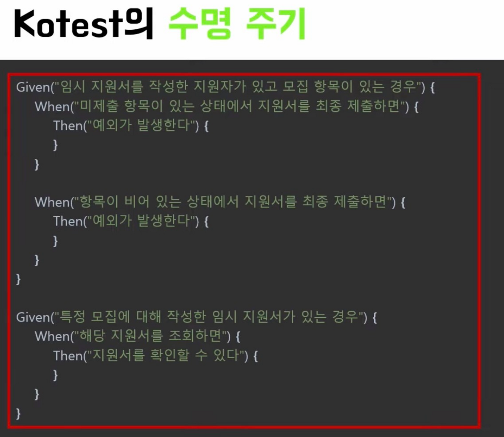
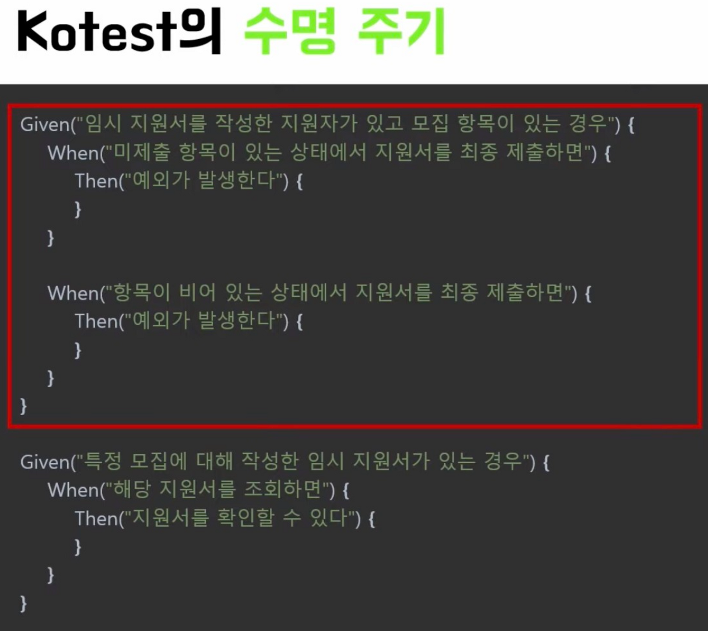
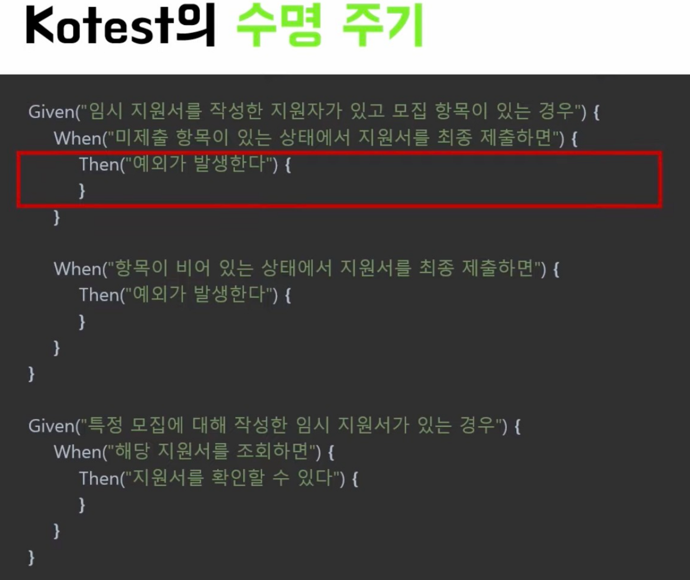

[선행 학습 : Spring Boot (java)](https://github.com/away0419/Study-2023/tree/main/%5B23.11%5DTDD/springBoot)

[공식 문서](https://kotest.io/docs/quickstart/)

<br/>

> ## Kotlin test 방식
- Java에서 사용하는 Junit, Assertion, Mockito 사용할 수 있으나, 코틀린 스타일을 사용할 수 없었음.
- 코틀린 스타일 및 코틀린 DSL 작성을 위해 사용 되는 도구들이 존재함. (kotest, mockk)

<br/>
<br/>

> ## Kotest
- 코틀린에서 사장 많이 사용되는 테스트 프레임워크.
- 다양한 테스트 레이아웃 제공. (String Spec, Describe Spec, Behavior Spec 등)
- 코틀린 DSL 스타일의 Assertion 제공.

<br/>
<br/>

> ## Kotest layout
- 10여개 이상의 레이아웃이 있음.
- 그 중에 3개 예시는 다음과 같음.

<details>
    <summary>Annotation Spec</summary>

- 기존 Junit 방식과 가장 유사한 방식.
- Junit에서 Kotest로 마이그레이션이 필요한 경우 사용.
- TDD용 스타일.

    ```kotlin
    internal class CalculatorAnnotationSpec: AnnotationSpec() {
        private val sut = Calculator()
    
        @Test
        fun `1과 2를 더하면 3이 반환된다`() {
            val result = sut.calculate("1 + 2")
    
            result shouldBe 3
        }
    
        @Test
        fun `식을 입력하면, 해당하는 결과값이 반환된다`() {
            calculations.forAll { (expression, answer) ->
                val result = sut.calculate(expression)
    
                result shouldBe answer
            }
        }
    
        @Test
        fun `입력값이 null 이거나 빈 공백 문자일 경우 IllegalArgumentException 예외를 던진다`() {
            blanks.forAll {
                shouldThrow<IllegalArgumentException> {
                    sut.calculate(it)
                }
            }
        }
    
        @Test
        fun `사칙연산 기호 이외에 다른 문자가 연산자로 들어오는 경우 IllegalArgumentException 예외를 던진다 `() {
            invalidInputs.forAll {
                shouldThrow<IllegalArgumentException> {
                    sut.calculate(it)
                }
            }
        }
    
        companion object {
            private val calculations = listOf(
                "1 + 3 * 5" to 20.0,
                "2 - 8 / 3 - 3" to -5.0,
                "1 + 2 + 3 + 4 + 5" to 15.0
            )
            private val blanks = listOf("", " ", "      ")
            private val invalidInputs = listOf("1 & 2", "1 + 5 % 1")
        }
    }
    ```
</details>

<details>
    <summary>Behavior Spec</summary>

- Given, When, Then 패턴으로 작성하는 방법.
- 테스트 결과에 Given, When, Then이 표시됨.
- BDD용 스타일.

    ```kotlin
    internal class CalculatorBehaviorSpec : BehaviorSpec({
        val sut = Calculator()
    
        given("calculate") {
            val expression = "1 + 2"
            `when`("1과 2를 더하면") {
                val result = sut.calculate(expression)
                then("3이 반환된다") {
                    result shouldBe 3
                }
            }
    
            `when`("수식을 입력하면") {
                then("해당하는 결과값이 반환된다") {
                    calculations.forAll { (expression, answer) ->
                        val result = sut.calculate(expression)
    
                        result shouldBe answer
                    }
                }
            }
    
            `when`("입력값이 null이거나 빈 값인 경우") {
                then("IllegalArgumentException 예외를 던진다") {
                    blanks.forAll {
                        shouldThrow<IllegalArgumentException> {
                            sut.calculate(it)
                        }
                    }
                }
            }
    
            `when`("사칙연산 기호 이외에 다른 연산자가 들어오는 경우") {
                then("IllegalArgumentException 예외를 던진다") {
                    invalidInputs.forAll {
                        shouldThrow<IllegalArgumentException> {
                            sut.calculate(it)
                        }
                    }
                }
            }
        }
    }) {
        companion object {
            private val calculations = listOf(
                "1 + 3 * 5" to 20.0,
                "2 - 8 / 3 - 3" to -5.0,
                "1 + 2 + 3 + 4 + 5" to 15.0
            )
            private val blanks = listOf("", " ", "      ")
            private val invalidInputs = listOf("1 & 2", "1 + 5 % 1")
        }
    }
    ```
</details>

<details>
    <summary>Describe Spec</summary>

- Describe, Context, It 패턴.
- BDD용 스타일.

    ```kotlin
    internal class CalculatorDescribeSpec : DescribeSpec({
        val sut = Calculator()
    
        describe("calculate") {
            context("식이 주어지면") {
                it("해당 식에 대한 결과값이 반환된다") {
                    calculations.forAll { (expression, data) ->
                        val result = sut.calculate(expression)
    
                        result shouldBe data
                    }
                }
            }
    
            context("0으로 나누는 경우") {
                it("Infinity를 반환한다") {
                    val result = sut.calculate("1 / 0")
    
                    result shouldBe Double.POSITIVE_INFINITY
                }
            }
    
            context("입력값이 null이거나 공백인 경우") {
                it("IllegalArgumentException 예외를 던진다") {
                    blanks.forAll {
                        shouldThrow<IllegalArgumentException> {
                            sut.calculate(it)
                        }
                    }
                }
            }
    
            context("사칙연산 기호 이외에 다른 문자가 연산자로 들어오는 경우") {
                it("IllegalArgumentException 예외를 던진다") {
                    invalidInputs.forAll {
                        shouldThrow<IllegalArgumentException> {
                            sut.calculate(it)
                        }
                    }
                }
            }
        }
    }) {
        companion object {
            val calculations = listOf(
                "1 + 3 * 5" to 20.0,
                "2 - 8 / 3 - 3" to -5.0,
                "1 + 2 + 3 + 4 + 5" to 15.0
            )
            val blanks = listOf("", " ", "      ")
            val invalidInputs = listOf("1 & 2", "1 + 5 % 1")
        }
    }
    ```
</details>

<br/>
<br/>

> ## Kotest Assertions

- kotest에서 사용하는 Assertions.
- 해당 조건을 만족하지 못하면 Test 실패.

    ```kotlin
    name shouldBe "kyunam" // 동일한지 확인.
    
    mylist.forExactly(3) {
        it.city shouldBe "Chicago"
    } // 정확히 3번 일치 했는지 확인.
    
    val xs = listOf("sam", "gareth", "timothy", "muhammad")
    xs.forAtLeast(2) {
        it.shouldHaveMinLength(7)
    } // 최소한 2번 일치 했는지 확인.
    
    shouldThrow {
        // code in here that you expect to throw an IllegalAccessException
    } // 특정 예외가 발생 했는지 확인.
    
    val exception = shouldThrowAny {
        // test here can throw any type of Throwable!
    } // 어떤 예외든 발생 했는지 확인.
    
    ```

<br/>
<br/>

> ## Kotest LifeCycle

- 사용하는 layout에 따라 범위가 다를 수 있음.
- 테스트 별 생명 주기이며, 이에 맞춰 특정 시점에 실행 되는 메소드를 구현할 수 있음.
- @BeforEach, @AfterEach 처럼 어노테이션을 사용할 수 있으나, 따로 메소드를 오버라이드 하여 사용 가능.

  ```kotlin
  interface SpecFunctionCallbacks {
     fun beforeSpec(spec: Spec) {}
     fun afterSpec(spec: Spec) {}
     fun beforeTest(testCase: TestCase) {}
     fun afterTest(testCase: TestCase, result: TestResult) {}
     fun beforeContainer(testCase: TestCase) {}
     fun afterContainer(testCase: TestCase, result: TestResult) {}
     fun beforeEach(testCase: TestCase) {}
     fun afterEach(testCase: TestCase, result: TestResult) {}
     fun beforeAny(testCase: TestCase) {}
     fun afterAny(testCase: TestCase, result: TestResult) {}
  }
  ```
<details>
  <summary>Spec</summary>

- 테스트 영역 전체가 spec.



</details>

<details>
  <summary>Container</summary>

- 하나의 given을 영역.



</details>

<details>
  <summary>Leaf</summary>

- 테스트 영역 전체가 spec.



</details>

<br/>
<br/>

> ## Kotest Isolation Mode

- 테스트 간 격리 설정. (Isolation Mode)
  - SingleInstance - Default (1개의 인스턴스 실행)
  - InstancePerTest (Test 단위로 인스턴스 실행)
  - InstancePerLeaf (Leaf 단위로 인스턴스 실행)
- 기본 값일 때, mocking 등의 이유로 테스트간 충돌이 발생할 수 있음. 테스트 간 완전한 격리를 위해선 InstancePerLeaf 로 지정 해야 함.
- 한마디로 Mock 객체 재사용을 방지할 수 있음. 

    ```kotlin
    internal class CalculatorDescribeSpec : DescribeSpec({
        isolationMode = IsolationMode.InstancePerLeaf
        // ...
    })
    ```

<br/>  
<br/>  

> ## Kotest extensions

- Test class, Method 확장이 가능해짐.
- 통합 테스트 환경을 구축할 때 적용 해야 함.
  - 만약 설정 하지 않으면 rollback 안함.
- Transaction 범위를 설정 할 수도 있음.
  - extensions(SpringTestExtension(SpringTestLifecycleMode.Test)) - default (Leaf 끝나면 rollback)
  - extensions(SpringTestExtension(SpringTestLifecycleMode.Root)) (해당 Test 끝나면 rollback)

  ```kotlin
  @Transactional
  @SpringBootTest
  class LanguageServiceTest(
      private val languageService: LanguageService
  ) : StringSpec({
      extensions(SpringExtension)
      // extensions(SpringTestExtension(SpringTestLifecycleMode.Test)) 설정 추가 안해도 extensions(SpringExtension) 설정 했다면 기본적으로 설정이 됨. 
      extensions(SpringTestExtension(SpringTestLifecycleMode.Root))
  
    "언어를 추가한다." {
          val language = languageService.create(code = "ko", name = "한국어")
          assertSoftly(language) {
              id shouldNotBe 0
              code shouldBe "ko"
              name shouldBe "한국어"
      }
    } 
  })
  ```

<br/>
<br/>

> ## Mockk
- 코틀린 스타일의 Mock 프레임워크.
- 사용법은 mockito와 거의 동일.
- mockito 보다 mockk의 시작 시간이 느림.

<details>
    <summary>Mock</summary>

- mockito와 유사.

    ```kotlin
    @Mockk
    val permissionRepository : PermissionRepository
    
    // 또는
    
    val permissionRepository = mockk<PermissionRepository>()
    ```

</details>

<details>
    <summary>SpyK</summary>

- mockito와 유사.

    ```kotlin
    @SpyK
    val car : Car
    
    // 또는
    
    val car = spyk(Car()) // or spyk<Car>() to call default constructor
    ```

</details>

<details>
    <summary>Relaxed mock</summary>

- stubbing 하지 않은 상태에서 mock이 호출 되더라도 예외가 발생하지 않도록 설정하는 옵션.

    ```kotlin
    val car = mockk<PermissionRepository>(relaxed = true)
    ```
</details>

<details>
    <summary>stubbing</summary>

- 가짜 객체 stubbing 하는 방식.

    ```kotlin
    // answers
    every { permissionRepository.save(permission) } answers { permission }
    
    // throws 
    every { permissionRepository.findByIdOrNull(id) } throws EntityNotFoundException()
    
    // just Runs 
    every { permissionRepository.delete(id) } just Runs
    
    // returnsMany 
    every { permissionRepository.save(permission) } returnsMany listOf(firstPermission, secondPermission)
    
    // returns 
    every { permissionRepository.save(permission) } returns permission
    every { permissionRepository.save(permission) } returns firstPermission andThen secondPermission
    ```

</details>

<details>
    <summary>Argument Matching</summary>

- Argument 값에 맞을 경우만 stubbing

    ```kotlin
    every { permissionRepository.save(any()) } retunrs permission // 어떤 객체가 오던 반환.
    every { memberRepository.findMemberById(ofType(UUID::class)) } returns response // UUID 객체만 반환.
    
    every { obj.manyMany(5, 6, *varargAll { it == 7 }) } returns 3 // 5, 6, 7, 7, 7 ... 일때만 반환.
    //println(obj.manyMany(5, 6, 7)) // 3
    //println(obj.manyMany(5, 6, 7, 7)) // 3
    //println(obj.manyMany(5, 6, 7, 7, 7)) // 3
    
    every { obj.manyMany(5, 6, *varargAny { nArgs > 5 }, 7) } returns 5 
    //println(obj.manyMany(5, 6, 4, 5, 6, 7)) // 5
    //println(obj.manyMany(5, 6, 4, 5, 6, 7, 7)) // 5
    ```
</details>

<details>
    <summary>Verification</summary>

- 메소드가 호출 되었는지 검증할 때 사용.
- 해당 조건을 만족하지 못하면 Test 실패.

```kotlin
verify(atLeast = 3) { car.accelerate(allAny()) } // car.accelerate() 최소 3번 이상 호출 되었는지 확인.
verify(atMost  = 2) { car.accelerate(fromSpeed = 10, toSpeed = or(20, 30)) } // 최대 2번까지 호출 되었는지 확인. (매개변수 fromSpeed = 10 이고 toSpeed = 10 또는 20 인 경우만 해당) 
verify(exactly = 1) { car.accelerate(fromSpeed = 10, toSpeed = 20) } // 정확히 1번 호출 되었는지 확인.
verify(exactly = 0) { car.accelerate(fromSpeed = 30, toSpeed = 10) } // 전혀 호출되지 않았는지 확인.

verifyAll {
    obj.sum(1, 3)
    obj.sum(1, 2)
    obj.sum(2, 2)
} // 해당 매개변수를 가진 메소드들 모두 호출 되었는지 확인.

verifySequence {
    obj.sum(1, 2)
    obj.sum(1, 3)
    obj.sum(2, 2)
}// 순서에 맞게 호출 되었는지 확인.
```

</details>

<br/>
<br/>

> ## Spring Mockk

- @MockkBean, @SpykBean 제공.
- 위의 Mockk과 다른 Dependency 이므로 따로 받아야 함.

<br/>
<br/>


> ## 라이브러리 설치

<details>
  <summary>gradle</summary>

```gradle
testImplementation("io.kotest:kotest-runner-junit5:5.8.0") // kotest
testImplementation("io.kotest:kotest-assertions-core:5.8.0") // kotest
testImplementation("io.kotest:kotest-property:5.8.0") // kotest
implementation("io.kotest.extensions:kotest-extensions-spring:1.1.3") // kotest spring
testImplementation("io.mockk:mockk:1.12.0") // mockk
testImplementation("com.ninja-squad:springmockk:3.0.1") // mockk spring
```
</details>

<br/>
<br/>

> ## Repository Test

<details>
  <summary>부분 테스트</summary>

- db 연결 후 테스트 진행.
- 테스트용 설정 파일을 불러옴.
- 부분 테스트이므로 extensions 설정을 해줘야 함.

  ```kotlin
  package com.example.kotlin.domain.member.repository
  
  import com.example.kotlin.domain.member.Member
  import io.kotest.core.spec.style.DescribeSpec
  import io.kotest.extensions.spring.SpringExtension
  import io.kotest.matchers.nulls.shouldBeNull
  import io.kotest.matchers.shouldBe
  import org.springframework.beans.factory.annotation.Autowired
  import org.springframework.boot.test.autoconfigure.orm.jpa.DataJpaTest
  import java.util.*
  
  @DataJpaTest(properties = ["spring.config.location=classpath:application-test.yaml"]) // test 용 설정 파일 불러오기
  //@TestPropertySource(properties = ["spring.config.location=classpath:application-test.yaml"])
  internal class MemberRepositoryTest(
      @Autowired
      private val memberRepository: MemberRepository
  ) : DescribeSpec({
  
      extensions(SpringExtension)
  
      describe("MemberRepository") {
          context("회원 가입 시 옳바른 형식을 보낸 경우") {
              it("성공") {
                  val member = Member(name = "홍길동", email = "hong@gmail.com")
                  val response = memberRepository.save(member)
  
                  member.email shouldBe response.email
                  member.name shouldBe response.name
              }
          }
  
          context("회원 ID로 조회할 때") {
              it("찾지 못한 경우 null을 반환한다.") {
                  val response = memberRepository.findMemberById(UUID.randomUUID())
  
                  response.shouldBeNull()
              }
  
              it("찾은 경우 member 반환한다."){
                  val request = UUID.fromString("4a9e5e6b-0b68-4eaa-9e38-53590a0332d4")
                  val response = Member(UUID.fromString("4a9e5e6b-0b68-4eaa-9e38-53590a0332d4"), "홍길동", "hong@gmail.com")
  
                  val result = memberRepository.findMemberById(request)
  
                  result?.run {
                      id shouldBe response.id
                      name shouldBe response.name
                      email shouldBe response.email
                  }
              }
          }
      }
  })
  ```

</details>

<br/>
<br/>

> ## Service Test

<details>
  <summary>단위 테스트</summary>

- 테스트 설정 파일 불러옴.
- 가짜 객체의 경우 동일한 context 안에서 설정이 공유 됨을 유의할 것.

  ```kotlin
  package com.example.kotlin.domain.member.service
  
  import com.example.kotlin.domain.member.Member
  import com.example.kotlin.domain.member.MemberDTO
  import com.example.kotlin.domain.member.repository.MemberRepository
  import io.kotest.core.spec.style.DescribeSpec
  import io.kotest.matchers.nulls.shouldBeNull
  import io.kotest.matchers.shouldBe
  import io.mockk.every
  import io.mockk.spyk
  import org.springframework.test.context.TestPropertySource
  import java.util.*
  
  @TestPropertySource(properties = ["spring.config.location=classpath:application-test.yaml"])
  internal class MemberServiceTest: DescribeSpec({
      val memberRepository = spyk<MemberRepository>()
      val memberService = MemberService(memberRepository)
  
      context("회원 가입"){
          it("성공"){
              val request = MemberDTO(email = "hong.gmail@com", name = "홍길동")
              val response = Member(email = "hong.gmail@com", name = "홍길동")
  
              every { memberRepository.save(ofType(Member::class)) } returns response
              val result = memberService.save(request)
  
              result.name shouldBe response.name
              result.email shouldBe response.email
          }
      }
  
      context("회원 찾기"){
          it("없다면 null 반환"){
              val request = UUID.randomUUID()
  
              val result = memberService.findById(request)
  
              result?.shouldBeNull()
          }
          // DB에 연결하지 않았음에도 통과하는 이유는 다음과 같다.
          // spyk 이므로 실제 기능을 가져온다. 이때, 실제 기능은 DB가 연결 되어 있어야만 동작한다.
          // DB가 연결 되지 않은 현재, 실제 기능이 없는 null이 되어버린다.
          // 즉, stubbing 하지 않고 memberService.findByid()를 한다면 memberRepository 가 null이므로 null을 반환한다.
          // 현재는 service 자체만 확인하면 되기 때문에 굳이 db를 연결할 필요없다. 어차피 순서상 repository test를 먼저하기 때문이다.
  
          it("멤버가 있다면 찾은 멤버 반환"){
              val request = UUID.fromString("4a9e5e6b-0b68-4eaa-9e38-53590a0332d4")
              val response = Member(UUID.fromString("4a9e5e6b-0b68-4eaa-9e38-53590a0332d4"), "홍길동", "hong@gmail.com")
  
              every { memberRepository.findMemberById(ofType(UUID::class)) } returns response
              val result = memberService.findById(request)
  
              result?.run {
                  id shouldBe response.id
                  name shouldBe response.name
                  email shouldBe response.email
              }
          } // 동일한 context 안에서 spyk<>()가 공유 되므로, 아래에 있는 다른 it도  stubbing 적용 됨을 주의 하자.
  
      }
  })
  ```
</details>

<br/>
<br/>


> ## Controller Test

<details>
  <summary>단위 테스트</summary>

- 통합 테스트 이므로 extensions 설정 해줄 것.

  ```kotlin
  package com.example.kotlin.domain.member.controller
  
  import com.example.kotlin.domain.member.Member
  import com.example.kotlin.domain.member.MemberDTO
  import com.example.kotlin.domain.member.service.MemberService
  import com.fasterxml.jackson.databind.ObjectMapper
  import io.kotest.core.spec.style.DescribeSpec
  import io.kotest.extensions.spring.SpringExtension
  import io.mockk.every
  import io.mockk.mockk
  import org.springframework.http.MediaType
  import org.springframework.test.web.servlet.MockMvc
  import org.springframework.test.web.servlet.get
  import org.springframework.test.web.servlet.post
  import org.springframework.test.web.servlet.setup.MockMvcBuilders
  import java.util.*
  
  internal class MemberControllerTest : DescribeSpec({
      val memberService = mockk<MemberService>()
      val memberController = MemberController(memberService)
      val mockMvc: MockMvc = MockMvcBuilders.standaloneSetup(memberController).build()
  
      extensions(SpringExtension)
      
      describe("MemberControllerTest") {
          context("회원 가입 요청") {
              it("email, name 주어진 경우") {
                  // Given
                  val request = MemberDTO(email = "hong.gmail@com", name = "홍길동")
                  val response = Member(UUID.fromString("4a9e5e6b-0b68-4eaa-9e38-53590a0332d4"), "홍길동", "hong@gmail.com")
  
                  every { memberService.save(ofType(MemberDTO::class)) } returns response
  
                  // When
                  val result = mockMvc.post("/save") {
                      contentType = MediaType.APPLICATION_JSON
                      content = ObjectMapper().writeValueAsString(request)
                  }
  
                  // Then
                  result.andExpect {
                      status { isOk() }
                      jsonPath("id") { exists() }
                      jsonPath("name") { exists() }
                      jsonPath("email") { exists() }
                  }
              }
          }
  
          context("회원 조회") {
              it("찾는 유저가 없는 경우") {
  
                  // Given
                  val request = "4a9e5e6b-0b68-4eaa-9e38-53590a0332d4"
  
                  every { memberService.findById(ofType(UUID::class)) } returns null
  
                  // When
                  val result = mockMvc.get("/find/$request") {
                      contentType = MediaType.APPLICATION_JSON
                  }
  
                  // Then
                  result.andExpect {
                      status { isOk() }
                  }
              }
  
              it("찾는 유저가 있는 경우") {
  
                  // Given
                  val request = "4a9e5e6b-0b68-4eaa-9e38-53590a0332d4"
                  val response = Member(UUID.fromString("4a9e5e6b-0b68-4eaa-9e38-53590a0332d4"), "홍길동", "hong@gmail.com")
  
                  every { memberService.findById(ofType(UUID::class)) } returns response
  
                  // When
                  val result = mockMvc.get("/find/$request") {
                      contentType = MediaType.APPLICATION_JSON
                  }
  
                  // Then
                  result.andExpect {
                      status { isOk() }
                      jsonPath("id") { exists() }
                      jsonPath("name") { exists() }
                      jsonPath("email") { exists() }
                  }
              }
          }
      }
  })
  ```

</details>