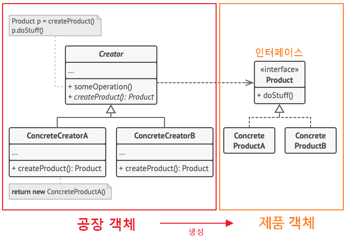
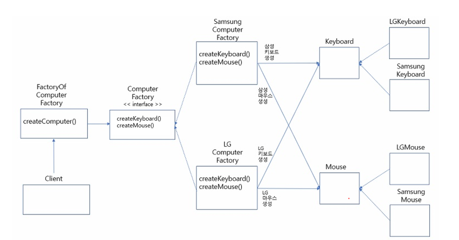

> ## 디자인 패턴

- 공통적으로 발생하는 문제의 해결 방법을 패턴화 한 것.
- 템플릿이라 생각할 수 있으며 재사용 가능함.
- 소프트웨어 아키텍처와 다르게 패턴은 코드 수준에서 담당하는 것. 즉, 더 작은 범주의 설계를 담당함.
- 디자인 패턴은 독립적으로 서술 된 패턴이 아닐 수 있음.
  - 싱글톤 패턴이 다른 패턴에서 사용될 수 있는 것처럼 패턴 안에 다른 패턴이 포함되어 있을 수 있음.

 
 

> ## 디자인 패턴 종류

  
생성 패턴

- 객체 인스턴스를 생성하는 패턴.
- 클라이언트와 생성해야 하는 객체 인스턴스 사이의 연결을 끊어 주는 역할.

  

    
싱글톤 (Singleton)

  - 객체 인스턴스를 하나만 만들고 이 인스턴스에 대한 전역 접근을 제공하는 패턴.
  - 장점
    - 메모리 낭비를 방지할 수 있음.
    - 생성된 인스턴스를 활용하므로 속도 측면에서 이점이 있음.
    - 다른 클래스 간 데이터 공유가 쉬움.
  - 단점
    - 동시성 이슈 발생할 수 있음.
    - 코드량 증가.
    - 격리된 테스트 수행에 어려움이 있음.
    - 자식 클래스를 만들 수 없음.
    - 내부 상태 변경이 어려움.
    - 개방-폐쇄 원칙에 어긋남.
  - 주로 사용되는 상황.

    - 커넥션풀
    - 스레드풀
    - 캐시
    - 로그 기록 객체

  

  

    
팩토리 메소드 (Factory Method)

  

  - 객체 생성을 생성자로 하는 것이 아닌, 객체 생성 메소드를 가진 [인터페이스 또는 추상 클래스]를 만들고(캡슐화) 이를 상속 받은 서브 클래스를 만들거나 다이렉트로 객체 생성 메소드만 가진 클래스를 만들어 사용하는 패턴. (상황에 맞춰 중 선택)
  - 장점
    - 생성자와 구현 객체의 강한 결합을 피할 수 있음.
    - 리턴 타입을 해당 클래스가 아닌 부모 타입으로 할 수 있음.
    - 기존 객체를 재구성하는 대신 확장하여 리소스를 절약할 수 있음.
    - 단일 책임 원칙 준수할 수 있음. (객체 생성이라는 하나의 목적을 가진 클래스를 한 곳에 모아 관리 가능)
    - 개방-폐쇄 원칙 준수할 수 있음. (기존 객체 확장)
  - 단점

    - [인터페이스, 추상클래스, 서브클래스] 구현으로 인한 클래스 증가.
      - 생성자로 객체 생성하면 만들 필요가 없기 때문.
    - 코드 복잡성 증가.
      - 어떤 클래스와 이어져 있는지 확인 해야 함.

  

  

    
추상 팩토리 (Abstract Factory)

  

  - 연관되는 객체를 집합으로 묶어 추상화 한 뒤, 해당 집합의 객체들을 한번에 생성할 수 있게 구현하여 연관 객체들을 생성하는 패턴.
  - 객체 생성을 생성자로 바로 하는 것이 아니고 캡슐화 한다는 점은 팩토리 메소드와 같으나 상위 개념은 아님.
    - 이해가 안된다면 팩토리 메소드는 단일, 추상 팩토리는 다수의 객체를 생성한다고 생각하면 됨.
    - 팩토리 메소드 -> 키보드, 마우스, 모니터 각각 단일 생성
    - 추상 팩토리 -> 삼성세트(키보드, 마우스, 모니터), LG세트(키보드, 마우스, 모니터)
  - 장점
    - 객체 생성 코드를 분리하여 클라이언트 코드와 결합도를 낮출 수 있음.
    - 단일 책임 원칙 준수.
    - 개방/폐쇄 원칙 준수.
  - 단점

    - 객체가 늘어날때 마다 클래스가 증가.
    - 코드의 복잡성 증가.
    - 객체 집한에 새로운 객체를 추가할 경우 수정해야 되는 부분이 많음.

  

  

    
정적 팩토리 메소드 패턴 (Static Factory Method)

  - static Method를 이용하여 객체를 생성하는 패턴.
  - 장점
    - 생성 목적에 대한 이름 표현 가능. (팩토리 동일)
    - 인스턴스 통제 가능. (싱글톤으로 만들기)
    - 하위 자료형 리턴 가능. (팩토리 동일)
    - 인자에 따라 다른 값 변경 가능. (팩토리 동일)
    - 객체 생성 캡슐화 가능. (팩토리 동일)
    - 불필요한 인터페이스, 서브 클래스 줄일 수 있음.
    - 실제 객체 없이 메소드 이용 가능.
  - 단점
    - 부모가 되기 위해선 public 혹은 protected 생성자가 필요하므로 정적 팩토리 메소드만 제공할 경우 상속 불가.
  - 정적 팩토리 메소드 네이밍 규칙

    - from : 자신의 타입 객체를 생성. (매개변수 0개 이상, 타입 상관 x, 주로 다른 타입)
    - of : 적절한 타입 객체 생성. (매겨변수 0개 이상, 타입 상관 x)
    - valueOf : from과 of의 자세한 버전. (매개변수 1개, 해당 매개변수의 타입을 현재 클래스의 타입으로 바꿀 때 주로 사용)
    - getInstance | instance : 인스턴스를 생성 혹은 반환. (매개변수를 받을 경우 명시한 인스턴스를 반환. 그러나 같은 인스턴스임을 보장하지는 않음)
    - newInstance | create : 항상 새로운 인스턴스 생성 (항상 새로운 인스턴스를 생성하여 다른 인스턴스임을 보장)
    - get[orderType] : 다른 타입의 인스턴스 생성. (getInstance와 동일. 단, 인스턴스의 타입은 [orderType])
    - new[orderType] : 항상 다른 타입의 새로운 인스턴스 생성. (getInstance와 동일. 단, 인스턴스의 타입은 [orderType])

  

  

    
이넘 팩토리 메소드 패턴 (Enum Factory Method)

  - Enum을 이용한 객체 생성 패턴.
  - 장점
    - 정적 팩토리 메소드와 동일.
  - 단점
    - 정적 팩토리 메소드와 동일.
  - static과 차이가 별로 나지 않음.

  

  

    
다이나믹 팩토리 패턴 (Dynamic Factory)

  - 자바의 Class 클래스를 이용한 [Reflection API](https://github.com/away0419/Study-2023/tree/main/%5B23.01%5DLanguage/Java/ReflectionAPI) 기법을 이용한 패턴.
  - 장점
    - 이넘 팩토리 메소드의 문제점인 객체 상속을 해결.
  - 단점

    - 예외 처리 필수.

  

  

    
빌더 패턴 (Builder)

  - 복잡한 객체 생성 방법을 단계별로 나누어 생성하는 패턴.
  - 기존의 자바 빈 패턴의 경우 일관성과 불변성에 문제가 발생함.
    - 객체 생성 후 setter를 깜빡할 경우 일관성 문제 발생.
    - 객체 생성 후 setter로 값을 변경할 경우 불변성 문제 발생.
  - 장점
    - 매개변수가 많을 때 일관된 프로세스로 표현하여 가독성을 증가시킴.
    - 필수 멤버와 선택 멤버 분리 가능.
    - 단일 책임 원칙, 복잡한 생성 코드를 고립시킬 수 있음.
    - 객체 생성을 지연할 수 있음.
  - 단점

    - 빌더 클래스를 따로 만들어야 하므로 코드 복잡성 증가.
      - 이를 해결하려면 빌더 클래스를 해당 객체의 정적 이너 클래스로 만들면 됨.
    - 생성자 보다 성능이 떨어짐.
    - 필드 개수가 적다면 빌더 패턴은 과함.

  

  

    
프로토타입 (Prototype)

  - 원본 객체를 새로운 객체에 복사하는 패턴.
  - 객체를 처음부터 생성하기엔 비용이 많이 들 경우, 이미 존재하는 객체를 복사할때 사용.
    - ex) 동일한 목록을 DB에서 가져오는 경우. (가져온 정보는 같으나 새로운 객체에 담고 있는 경우)
    - ex) 객체 생성에 수 많은 설정을 해줘야 하는 경우.
  - 장점
    - 복잡한 객체 생성 과정을 숨길 수 있음.
    - 비용을 줄일 수 있음. (객체생성보다 복사가 효율적일 수 있기 때문)
    - 구체 클래스 없이 객체를 복사할 수 있음.
  - 단점 - 순환 참조가 있는 객체들은 복제 과정 자체가 복잡할 수 있음.

  

 

  
구조 패턴

- 클래스와 객체를 더 큰 구조로 만들 수 있게 구성을 사용하는 패턴.

  

    
어댑터

  - 호환되지 않는 인터페이스를 가진 객체들이 협업할 수 있도록 하는 패턴.
  - 어댑터 패턴 구조는 2가지가 있음.
    - 객체 어댑터 (합성, 추천)
      - 새로운 기능을 가진 인터페이스 생성.
      - 해당 인터페이스를 상속받으며 멤버 변수로 기본 서비스 객체를 가지는 새로운 클래스 생성.
      - 이를 통해 새로운 클래스는 기존 서비스 객체를 이용하여 기존 서비스 기능을(메소드) 사용할 수 있으며, 새로운 기능을 구현하여 사용할 수 있음.
      - 멤버 변수로 인해 공간 차지 비용이 발생함.
    - 클래스 어댑터 (상속)
      - 새로운 기능을 가진 인터페이스 생성.
      - 해당 인터페이스와 기존 서비스 객체를 동시에 상속 받는 새로운 클래스 생성.
      - 기존 서비스 객체의 기능을 오버라이딩 할 수 있으며, 새로운 기능을 구현하여 사용 가능.
      - 다중 상속이 문제가 될 수 있음.
  - 장점
    - 호환성 및 기능 확장 가능.
    - 단일 책임 원칙 준수.
    - 개방/폐쇄 원칙 준수.
  - 단점
    - 다수의 인터페이스와 클래스 도입으로 코드 복잡성 증가.

  

  

    
브릿지

  - 기능 혹은 부속 객체가 많은 큰 클래스를 추상으로 나누어 구현하는 패턴.
  - 즉, [기능, 특징]별 [인터페이스, 추상클래스]를 만들고 이를 상속 받거나, [인터페이스, 추상클래스]를 구현한 객체를 멤버 변수로 가지는 큰 객체를 만드는 것.
  - 하나의 클래스를 통해 여러 종류의 객체를 만들 수 있음.
    - ex) 파란색 버튼, 노란색 버튼, 빨간색 버튼
    - ex) 발사 버튼, 정지 버튼, 시작 버튼
  - 일반적으로 사전에 설계됨. 따라서 어댑터와 비슷한 구조이나, 개념이 다름.
  - 장점
    - 플랫폼 독립적인 클래스들 생성 가능.
    - 추상화를 통해 세부 정보 노출 방지.
    - 개방/폐쇄 원칙 준수.
    - 단일 책임 원칙 준수.
  - 단점
    - 큰 클래스일수록 코드 복잡도 상승.

  

- 컴포짓
- 데코레이터
- 퍼사드
- 플라이웨이트
- 프록시
  

 

  
행동 패턴

- 클래스와 객체들이 상호 작용하는 방법과 역할을 분담하는 방법을 다루는 패턴.
  - 책임 연쇄
  - 커맨드
  - 인터프리터
  - 이터레이터
  - 중재자
  - 메멘토
  - 옵저버
  - 상태
  - 전략
  - 템플릿 메소드
  - 비지터
  

 
 
