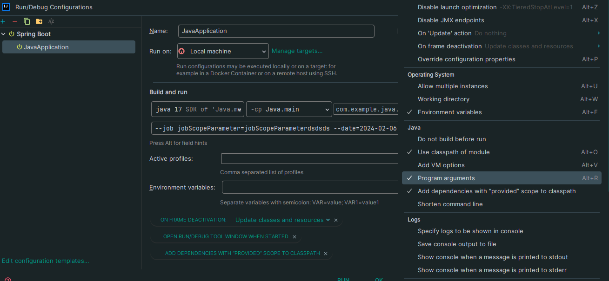

> ## Version

- Spring Boot, Spring Batch 각각의 버전별 사용법이 다름. 현재 실습 버전은 다음과 같음.
  - Spring Boot : 3.2.2
  - Spring Batch : 5
  - JDK : 17
- 해당 실습 기준 인터넷에 보이는 Spring Batch 실습은 대게 Spring Boot 2, Spring Batch 4 버전임.
- Spring Batch 5의 경우 JDK 17 이상만 가능.


<br/>
<br/>

> ## Dependency

<details>
    <summary>Gradle</summary>

- Batch를 사용하기 위해선 메타 데이터를 저장할 DB가 필요함.
  - h2는 메타 데이터용 테이블을 자동으로 만들어주지만 다른 DB는 테이블을 만들어야함.
  - Spring Batch 라이브러리에 org.springframework.batch.core 폴더에 가보면 schema-mysql.sql 파일이 있음.
- lombok은 로그를 찍기 위해 추가함.

    ```gradle
    dependencies {
        implementation 'org.springframework.boot:spring-boot-starter-web'
        developmentOnly 'org.springframework.boot:spring-boot-devtools'
        testImplementation 'org.springframework.boot:spring-boot-starter-test'
    
        compileOnly 'org.projectlombok:lombok'
        annotationProcessor 'org.projectlombok:lombok'
        implementation 'com.h2database:h2'
        implementation 'org.springframework.boot:spring-boot-starter-batch'
        implementation 'org.springframework.boot:spring-boot-starter-quartz:2.7.5'
    }
    ```

</details>

<br/>
<br/>

> ## Single Step

<details>
    <summary>JavaApplication</summary>

- SpringBoot 3 이상은 @EnableAspectJAutoProxy 설정을 하면 오류가 발생함.

    ```java
    package com.example.java;
    
    import org.springframework.boot.SpringApplication;
    import org.springframework.boot.autoconfigure.SpringBootApplication;
    import org.springframework.context.annotation.EnableAspectJAutoProxy;
    
    @SpringBootApplication
    //@EnableAspectJAutoProxy // Batch 기능 활성화. Batch Config 클래스가 여러개 존재 한다면 Main에 적용하는 것이 좋음.
    public class JavaApplication {
    
        public static void main(String[] args) {
            SpringApplication.run(JavaApplication.class, args);
        }
    
    }
    ```

</details>

<details>
    <summary>SingleJobConfiguration</summary>

- 실행 후 로그를 확인해보면 Job이 언제 실행 되는지 알 수 있음.
- 먼저 Step이 등록되고, Step에서 JobRepository를 사용하므로 Job이 등록됨. 이후 Step에서 taskLet을 사용하므로 TaskLet이 등록됨.

  ```java
  package com.example.java.batch;
  
  import lombok.extern.slf4j.Slf4j;
  import org.springframework.batch.core.Job;
  import org.springframework.batch.core.JobParametersValidator;
  import org.springframework.batch.core.Step;
  import org.springframework.batch.core.job.builder.JobBuilder;
  import org.springframework.batch.core.repository.JobRepository;
  import org.springframework.batch.core.step.builder.StepBuilder;
  import org.springframework.batch.core.step.tasklet.Tasklet;
  import org.springframework.batch.repeat.RepeatStatus;
  import org.springframework.context.annotation.Bean;
  import org.springframework.context.annotation.Configuration;
  import org.springframework.transaction.PlatformTransactionManager;
  
  @Slf4j
  @Configuration // Job @Configuration에 등록.
  public class SingleJobConfiguration {
      @Bean
      public Tasklet singleTasklet() {
          return (contribution, chunkContext) -> {
              log.info(">>>> SingleTaskLet");
              return RepeatStatus.FINISHED;
          };
      }
  
      @Bean
      public Step singleStep(JobRepository jobRepository, Tasklet singleTasklet, PlatformTransactionManager platformTransactionManager) {
          log.info(">>>> SingleStep");
          return new StepBuilder("singleStep", jobRepository).tasklet(singleTasklet, platformTransactionManager).build();
      }
  
      @Bean
      public Job singleJob(JobRepository jobRepository, Step singleStep) {
          log.info(">>>> SingleJob");
          return new JobBuilder("singleJob", jobRepository)
                  .start(singleStep)
  //                .incrementer(JobParametersIncrementer) // JobParameter 값을 자동으로 증가해 주는 설정
  //                .preventRestart(true) // Job 재시작 가능 여부 설정. 기본은 true. false 설정 시, Job 실패해도 재시작 되지 않으며 재시작하려 하면 예외 발생.
  //                .validator(JobParametersValidator) // JobParameter 검증 설정. 여기서 Exception 발생 시 Job 실행 안되므로 JobInstance, JobExecution 등이 생성되지 않음.
  //                .listener(JobExecutionLister) // Job 라이프 사이클의 특정 시점에 콜백 제공받도록 하는 설정. JobParameter 변경없이 Job을 여러번 실행하고자 하거나, 파라미터 중 필요한 값을 증가시켜야할 때 사용.
                  .build();
      }
  }
  
  ```

</details>

<br/>
<br/>


> ## Multi Step

<details>
  <summary>설정</summary>

- Spring Boot 3은 다중 작업을 지원하지 않음. 즉, Job이 여러 개일 경우 하나만 작업할 수 있음. 
- 설정 파일에서 어떤 작업을 실행할지 설정해야 함.

  ```yaml
  spring:
    batch:
      job:
        enabled: true # default true. false 하면 모든 job 비활성화.
        name: multiJob # 해당 이름으로 된 job만 실행.
  ```

</details>

<details>
  <summary>MultiJobConfiguration</summary>

- 단일 스텝과 동일한 구조.
- next() 함수를 통해 다음 Step을 설정.

  ```java
  package com.example.java.batch;
  
  import lombok.extern.slf4j.Slf4j;
  import org.springframework.batch.core.Job;
  import org.springframework.batch.core.Step;
  import org.springframework.batch.core.job.builder.JobBuilder;
  import org.springframework.batch.core.repository.JobRepository;
  import org.springframework.batch.core.step.builder.StepBuilder;
  import org.springframework.batch.core.step.tasklet.Tasklet;
  import org.springframework.batch.repeat.RepeatStatus;
  import org.springframework.context.annotation.Bean;
  import org.springframework.context.annotation.Configuration;
  import org.springframework.transaction.PlatformTransactionManager;
  
  @Slf4j
  @Configuration
  public class MultiJobConfiguration {
  
      @Bean
      public Tasklet multiTaskLet(){
          return (contribution, chunkContext) -> {
              log.info(">>>> multiTaskLet");
              return RepeatStatus.FINISHED;
          };
      }
  
      @Bean
      public Step multiStep1(JobRepository jobRepository, Tasklet multiTaskLet, PlatformTransactionManager platformTransactionManager){
          log.info(">>>> multiStep1");
          return new StepBuilder("multiStep1", jobRepository).tasklet(multiTaskLet, platformTransactionManager).build();
      }
  
      @Bean
      public Step multiStep2(JobRepository jobRepository, Tasklet multiTaskLet, PlatformTransactionManager platformTransactionManager){
          log.info(">>>> multiStep2");
          return new StepBuilder("multiStep2", jobRepository).tasklet(multiTaskLet, platformTransactionManager).build();
      }
  
      @Bean
      public Step multiStep3(JobRepository jobRepository, Tasklet multiTaskLet, PlatformTransactionManager platformTransactionManager) {
          log.info(">>>> multiStep3");
          return new StepBuilder("multiStep3", jobRepository).tasklet(multiTaskLet, platformTransactionManager)
  //                .startLimit() // Step의 실행 횟수. 기본값 Integer.MAX_VALUE. 실행 횟수 초과해서 다시 실행하려하는 경우 예외 발생.
  //                .allowStartIfComplete() // 재시작 가능한 Job에서 Step 이전 성공 여부와 상관없이 항상 실행하기 위한 설정. True여야 항상 실행. 실행마다 유효성 검증이 필요하거나 사전 작업이 필요한 Step일 경우 사용.
                  .build();
      }
  
      @Bean
      public Job multiJob(JobRepository jobRepository, Step multiStep1, Step multiStep2, Step multiStep3) {
          log.info(">>>> multiJob");
          return new JobBuilder("multiJob", jobRepository)
                  .start(multiStep1)
                  .next(multiStep2)
                  .next(multiStep3)
                  .build();
      }
  }
  ```

</details>

<br/>
<br/>

> ## Flow

<details>
  <summary>설정</summary>

- 딱히 없음.

  ```yaml
  spring:
    batch:
      job:
        enabled: true
        name: flowJob
  ```

</details>

<details>
  <summary>FlowJobConfiguration</summary>

- flow 설정은 Job에서 할 수 있음.
- 현재 스텝의 결과 상태에 따라 분기를 나누어 설정하는 방식임. 
  - BatchStatus가 아닌 ExitStatus 결과에 따라 분기가 나뉘어 지는 것임.
  - ExitStatus 코드는 StepExecutionListenerSupport 상속 받아 커스텀이 가능함. (Spring Batch5는 StepExecutionListenerSupport를 더이상 사용 하지 않음. 다른 방법을 찾아 봐야할 듯.)

  ```java
  package com.example.java.batch;
  
  import lombok.extern.slf4j.Slf4j;
  import org.springframework.batch.core.ExitStatus;
  import org.springframework.batch.core.Job;
  import org.springframework.batch.core.Step;
  import org.springframework.batch.core.job.builder.JobBuilder;
  import org.springframework.batch.core.repository.JobRepository;
  import org.springframework.batch.core.step.builder.StepBuilder;
  import org.springframework.batch.core.step.tasklet.Tasklet;
  import org.springframework.batch.repeat.RepeatStatus;
  import org.springframework.context.annotation.Bean;
  import org.springframework.context.annotation.Configuration;
  import org.springframework.transaction.PlatformTransactionManager;
  
  @Slf4j
  @Configuration
  public class FlowJobConfiguration {
      @Bean
      public Tasklet flowTasklet(){
          return (contribution, chunkContext) -> {
              log.info(">>>> flowTaskLet");
              contribution.setExitStatus(ExitStatus.FAILED); // Step 실행 후 상태. 기본적으로 BatchStatus와 ExitStatus 값이 동일하도록 설정되어 있음.
              return RepeatStatus.FINISHED;
          };
      }
  
      @Bean
      public Step flowStep1(JobRepository jobRepository, Tasklet flowTasklet, PlatformTransactionManager platformTransactionManager){
          log.info(">>>> flowStep1");
          return new StepBuilder("flowStep1", jobRepository).tasklet(flowTasklet, platformTransactionManager).build();
      }
  
      @Bean
      public Step flowStep2(JobRepository jobRepository, Tasklet flowTasklet, PlatformTransactionManager platformTransactionManager){
          log.info(">>>> flowStep2");
          return new StepBuilder("flowStep2", jobRepository).tasklet(flowTasklet, platformTransactionManager).build();
      }
  
      @Bean
      public Step flowStep3(JobRepository jobRepository, Tasklet flowTasklet, PlatformTransactionManager platformTransactionManager) {
          log.info(">>>> flowStep3");
          return new StepBuilder("flowStep3", jobRepository).tasklet(flowTasklet, platformTransactionManager).build();
      }
  
      @Bean
      public Job flowJob(JobRepository jobRepository, Step flowStep1, Step flowStep2, Step flowStep3) {
          log.info(">>>> flowJob");
          return new JobBuilder("flowJob", jobRepository)
                  .start(flowStep1)
                      .on("FAILED") // FAILED 일 경우 -> 이때 FAILED BatchStatus 결과가 아니라 ExitStatus 결과 값임.
                      .to(flowStep2) // step2로 이동.
                      .on("*") // step2의 (모든 결과)일 때
                      .end() // flow 종료
                  .from(flowStep1) // 만약 step1의 결과가
                      .on("*") // *(모든 결과) 일 경우 -> 위에서 이미 FAILED Flow가 있어 걸러지므로 결국 FAILED 제외한 결과로 볼 수 있음.
                      .to(flowStep3) // step3으로 이동.
                      .next(flowStep2) // step3 이후 step2로 이동.
                      .on("*") // step2의 결과가 *(모든 결과) 일 경우
                      .end() // flow 종료
                  .end()// job 종료
                  .build();
      }
  }
  ```

</details>

<details>
  <summary>customFlowConfiguration</summary>

- 직접 ExitStatus 만들어 flow 처리하는 방법임.
- Step에서 ExitStatus 설정을 하지 않고 분기 처리 로직을 따로 만드는 방법.

  ```java
  package com.example.java.batch;
  
  import lombok.extern.slf4j.Slf4j;
  import org.springframework.batch.core.*;
  import org.springframework.batch.core.job.builder.JobBuilder;
  import org.springframework.batch.core.job.flow.FlowExecutionStatus;
  import org.springframework.batch.core.job.flow.JobExecutionDecider;
  import org.springframework.batch.core.repository.JobRepository;
  import org.springframework.batch.core.step.builder.StepBuilder;
  import org.springframework.batch.core.step.tasklet.Tasklet;
  import org.springframework.batch.repeat.RepeatStatus;
  import org.springframework.context.annotation.Bean;
  import org.springframework.context.annotation.Configuration;
  import org.springframework.transaction.PlatformTransactionManager;
  
  import java.util.Random;
  
  @Slf4j
  @Configuration
  public class CustomFlowJobConfiguration {
      @Bean
      public Tasklet customFlowTasklet(){
          return (contribution, chunkContext) -> {
              log.info(">>>> customFlowTaskLet");
              return RepeatStatus.FINISHED;
          };
      }
  
      @Bean
      public Step customFlowStep1(JobRepository jobRepository, Tasklet customFlowTasklet, PlatformTransactionManager platformTransactionManager){
          log.info(">>>> customFlowStep1");
          return new StepBuilder("customFlowStep1", jobRepository).tasklet(customFlowTasklet, platformTransactionManager).build();
      }
  
      @Bean
      public Step customFlowStep2(JobRepository jobRepository, Tasklet customFlowTasklet, PlatformTransactionManager platformTransactionManager){
          log.info(">>>> customFlowStep2");
          return new StepBuilder("customFlowStep2", jobRepository).tasklet(customFlowTasklet, platformTransactionManager).build();
      }
  
      @Bean
      public Step customFlowStep3(JobRepository jobRepository, Tasklet customFlowTasklet, PlatformTransactionManager platformTransactionManager) {
          log.info(">>>> customFlowStep3");
          return new StepBuilder("customFlowStep3", jobRepository).tasklet(customFlowTasklet, platformTransactionManager).build();
      }
  
      @Bean
      public JobExecutionDecider decider() {
          return new OddDecider();
      }
  
      public static class OddDecider implements JobExecutionDecider {
          @Override
          public FlowExecutionStatus decide(JobExecution jobExecution, StepExecution stepExecution) {
              Random rand = new Random();
  
              int randomNumber = rand.nextInt(50) + 1;
              log.info("랜덤숫자: {}", randomNumber);
  
              if(randomNumber % 2 == 0) {
                  return new FlowExecutionStatus("EVEN");
              } else {
                  return new FlowExecutionStatus("ODD");
              }
          }
      }
  
      @Bean
      public Job customFlowJob(JobRepository jobRepository, Step customFlowStep1, Step customFlowStep2, Step customFlowStep3) {
          log.info(">>>> customFlowJob");
          return new JobBuilder("customFlowJob", jobRepository)
                  .start(customFlowStep1)// step1 시작.
                  .next(decider()) // step1 이후 decider 시작.
                  .on("EVEN") // decider 결과가 EVEN 일 경우
                  .to(customFlowStep2) // step2로 이동.
                  .on("*") // step2의 (모든 결과)일 때
                  .end() // customFlow 종료
                  .from(decider()) // 만약 decider 결과가
                  .on("*") // *(모든 결과) 일 경우
                  .to(customFlowStep3) // step3으로 이동.
                  .next(customFlowStep2) // step3 이후 step2로 이동.
                  .on("*") // step2의 결과가 *(모든 결과) 일 경우
                  .end() // customFlow 종료
                  .end()// job 종료
                  .build();
      }
  
  
  }
  ```

</details>


<br/>
<br/>

> ## Scope

<details>
  <summary>JobParameterConfiguration</summary>

- JobParameter를 가져오는 방법이 여러개임.
  - Bean 등록, 환경 변수 설정, ApplicationRunner Interface 구현 등.
- 사용법은 StepScope와 동일함.

  ```java
  package com.example.java.batch;
  
  import lombok.RequiredArgsConstructor;
  import lombok.extern.slf4j.Slf4j;
  import org.springframework.batch.core.Job;
  import org.springframework.batch.core.JobParameters;
  import org.springframework.batch.core.JobParametersBuilder;
  import org.springframework.batch.core.Step;
  import org.springframework.batch.core.configuration.annotation.JobScope;
  import org.springframework.batch.core.configuration.annotation.StepScope;
  import org.springframework.batch.core.job.builder.JobBuilder;
  import org.springframework.batch.core.launch.JobLauncher;
  import org.springframework.batch.core.repository.JobRepository;
  import org.springframework.batch.core.step.builder.StepBuilder;
  import org.springframework.batch.core.step.tasklet.Tasklet;
  import org.springframework.batch.repeat.RepeatStatus;
  import org.springframework.beans.factory.annotation.Value;
  import org.springframework.boot.ApplicationArguments;
  import org.springframework.boot.ApplicationRunner;
  import org.springframework.context.annotation.Bean;
  import org.springframework.context.annotation.Configuration;
  import org.springframework.stereotype.Component;
  import org.springframework.transaction.PlatformTransactionManager;
  
  @Slf4j
  @Configuration
  @RequiredArgsConstructor
  public class JobParameterConfiguration {
  
      private final StepScopeParameter stepScopeParameter;
  
      @Bean
      @StepScope
      public Tasklet parameterTasklet() {
          return (contribution, chunkContext) -> {
              log.info(">>>> parameterTaskLet");
              log.info(">>>> stepScopeParameter: {}", stepScopeParameter.getDate());
              return RepeatStatus.FINISHED;
          };
      }
  
      // Bean 등록 하여 해당 Parameter 사용하기.
      @Bean
      public String jobScopeParameter(){
          return "jobScopeParameter";
      }
      @Bean
      @JobScope
      public Step parameterStep(String jobScopeParameter, JobRepository jobRepository, Tasklet parameterTasklet, PlatformTransactionManager platformTransactionManager) {
          log.info(">>>> parameterStep");
          log.info(">>>> jobScopeParameter: {}", jobScopeParameter);
          return new StepBuilder("parameterStep", jobRepository).tasklet(parameterTasklet, platformTransactionManager).build();
      }
  
  //    두 번째 방법. 환경 변수에 등록하여 사용하기.
  //    @Bean
  //    @JobScope
  //    public Step parameterStep(@Value("#{jobParameters[jobScopeParameter]}")String jobScopeParameter, JobRepository jobRepository, Tasklet parameterTasklet, PlatformTransactionManager platformTransactionManager) {
  //        log.info(">>>> parameterStep");
  //        log.info(">>>> jobScopeParameter: {}", jobScopeParameter);
  //        return new StepBuilder("parameterStep", jobRepository).tasklet(parameterTasklet, platformTransactionManager).build();
  //    }
  
  
  // 세 전째 방법은 ApplicationRunner를 상속 받은 클래스를 구현하여 직접 파라미터를 주입해 job을 실행 시키는 방법.
  //    @Component
  //    @RequiredArgsConstructor
  //    public class JobRunner implements ApplicationRunner {
  //
  //        private final JobLauncher jobLauncher;
  //        private final Job job;
  //
  //        @Override
  //        public void run(ApplicationArguments args) throws Exception {
  //
  //            JobParameters jobParameters = new JobParametersBuilder()
  //                    .addString("name", "user1")
  //                    .addLong("seq", 2L)
  //                    .addDate("date", new Date())
  //                    .addDouble("age", 16.5)
  //                    .toJobParameters();
  //
  //            jobLauncher.run(job, jobParameters);
  //        }
  //    }
  
      @Bean
      public Job parameterJob(JobRepository jobRepository, Step parameterStep) {
          log.info(">>>> parameterJob");
          return new JobBuilder("parameterJob", jobRepository)
                  .start(parameterStep)
                  .build();
      }
  
  }
  ```


</details>

<details>
  <summary>StepScopeParameter</summary>

- 따로 Bean에 등록할 클래스를 구현함.
- 이때, 필요한 값은 환경 변수에서 가져올 수 있도록 함.

```java
package com.example.java.batch;

import lombok.Getter;
import org.springframework.batch.core.configuration.annotation.StepScope;
import org.springframework.beans.factory.annotation.Value;
import org.springframework.stereotype.Component;

import java.time.LocalDate;
import java.time.format.DateTimeFormatter;

@Component
@Getter
@StepScope
public class StepScopeParameter {
    private LocalDate date;

    @Value("${date}")
    public void setDate(String date){
        this.date = LocalDate.parse(date, DateTimeFormatter.ISO_DATE);
    }

}
```

</details>

<details>
  <summary>환경 변수 설정</summary>

- yaml 파일에 직접 변수를 넣거나, jar 실행할 때 아규먼트로 넣어주면 됨.
- @Value() 어노테이션 사용시 주의점은 다음과 같음.
  - @Value("${date}") 처럼 $일 경우, yaml에서 설정한 값이나 아래 사진처럼 설정한 값에서 찾아서 가져옴. (동일한 키가 있을 경우, 아래 사진에 적용한 값을 불러옴.)
  - @Value("#{jobParameters[jobScopeParameter]}") 처럼 #일 경우, yaml에 있는 값이 아닌 아래 사진 처럼 적용 해야 값을 불러옴.
  


```yaml
spring:
  batch:
    job:
      enabled: true
      name: parameterJob
#date: 2024-02-06
```

</details>

<br/>
<br/>


> ## Tasklet
<details>
  <summary>TaskLetJobConfig1 (Lambda)</summary>

- 비즈니스 로직을 람다로 구현함.


  ```java
  package com.example.java.batch;
  
  import lombok.extern.slf4j.Slf4j;
  import org.springframework.batch.core.Job;
  import org.springframework.batch.core.Step;
  import org.springframework.batch.core.job.builder.JobBuilder;
  import org.springframework.batch.core.repository.JobRepository;
  import org.springframework.batch.core.step.builder.StepBuilder;
  import org.springframework.batch.core.step.tasklet.Tasklet;
  import org.springframework.batch.repeat.RepeatStatus;
  import org.springframework.context.annotation.Bean;
  import org.springframework.context.annotation.Configuration;
  import org.springframework.transaction.PlatformTransactionManager;
  
  // 람다 형식
  @Slf4j
  @Configuration
  public class TaskLetJobConfig1 {
  
      @Bean
      public Step taskStep(JobRepository jobRepository, PlatformTransactionManager platformTransactionManager) {
          log.info(">>>> SingleStep");
          return new StepBuilder("taskStep", jobRepository).tasklet(((contribution, chunkContext) -> {
              for(int i =0; i<10; i++){
                  log.info(i+": 비즈니스 로직");
              }
              return RepeatStatus.FINISHED;
          }), platformTransactionManager).build();
      }
  
      @Bean
      public Job taskJob(JobRepository jobRepository, Step taskStep) {
          log.info(">>>> SingleJob");
          return new JobBuilder("taskJob", jobRepository)
                  .start(taskStep)
                  .build();
      }
  }
  ```

</details>

<details>
  <summary>TaskLetJobConfig2 (MethodInvokingAdapter)</summary>

- 먼저 비즈니스 로직을 구현한 서비스 클래스 생성. (Bean 등록)
- methodInvokingTaskletAdapter 생성하는 메소드 구현. (Bean 등록)
  - 이때 생성한 methodInvokingTaskletAdapter는 구현한 service를 가지고 있지 않음.
  - 따라서, 서비스 객체를 직접 주입하고 해당 서비스 객체의 어떤 메소드를 사용할 지 Set 해주어야함. 
- Bean에 등록된 methodInvokingTaskletAdapter를 Tasklet에 넣어 사용.

  ```java
  package com.example.java.batch;
  
  import lombok.extern.slf4j.Slf4j;
  
  @Slf4j
  public class CustomService {
      public void businessLogic(){
          for(int i =0; i<10; i++){
              log.info(i+": 비즈니스 로직");
          }
      }
  }
  ```
  
  ```java
  package com.example.java.batch;
  
  import lombok.extern.slf4j.Slf4j;
  import org.springframework.batch.core.Job;
  import org.springframework.batch.core.Step;
  import org.springframework.batch.core.job.builder.JobBuilder;
  import org.springframework.batch.core.repository.JobRepository;
  import org.springframework.batch.core.step.builder.StepBuilder;
  import org.springframework.batch.core.step.tasklet.MethodInvokingTaskletAdapter;
  import org.springframework.batch.core.step.tasklet.Tasklet;
  import org.springframework.batch.repeat.RepeatStatus;
  import org.springframework.context.annotation.Bean;
  import org.springframework.context.annotation.Configuration;
  import org.springframework.transaction.PlatformTransactionManager;
  
  // 람다 형식
  @Slf4j
  @Configuration
  public class TaskLetJobConfig2 {
  
      @Bean
      public CustomService businessLogic() {
          return new CustomService();
      }
  
      @Bean
      public MethodInvokingTaskletAdapter myTasklet() {
          MethodInvokingTaskletAdapter adapter = new MethodInvokingTaskletAdapter();
  
          adapter.setTargetObject(businessLogic());
          adapter.setTargetMethod("businessLogic");
  
          return adapter;
      }
  
      @Bean
      public Step task2Step(JobRepository jobRepository, PlatformTransactionManager platformTransactionManager) {
          log.info(">>>> task2Step");
          return new StepBuilder("task2Step", jobRepository).tasklet(myTasklet(), platformTransactionManager).build();
      }
  
      @Bean
      public Job task2Job(JobRepository jobRepository, Step task2Step) {
          log.info(">>>> task2Job");
          return new JobBuilder("task2Job", jobRepository)
                  .start(task2Step)
                  .build();
      }
  }
  
  ```

</details>

<details>
  <summary>TaskLetJobConfig3 (Tasklet)</summary>

- Tasklet을 상속받는 클래스를 직접 구현.

  ```java
  package com.example.java.batch;
  
  import lombok.extern.slf4j.Slf4j;
  import org.springframework.batch.core.ExitStatus;
  import org.springframework.batch.core.StepContribution;
  import org.springframework.batch.core.StepExecution;
  import org.springframework.batch.core.StepExecutionListener;
  import org.springframework.batch.core.scope.context.ChunkContext;
  import org.springframework.batch.core.step.tasklet.Tasklet;
  import org.springframework.batch.repeat.RepeatStatus;
  
  @Slf4j
  public class BusinessTasklet implements Tasklet, StepExecutionListener {
  
      @Override
      public RepeatStatus execute(StepContribution contribution, ChunkContext chunkContext) throws Exception {
  
          for(int i =0; i<10; i++){
              log.info(i+": 비즈니스 로직");
          }
  
          return RepeatStatus.FINISHED;
  
      }
  
      @Override
      public void beforeStep(StepExecution stepExecution) {
          log.info("Before Step");
          StepExecutionListener.super.beforeStep(stepExecution);
      }
  
      @Override
      public ExitStatus afterStep(StepExecution stepExecution) {
          log.info("after Step");
          return StepExecutionListener.super.afterStep(stepExecution);
      }
  }
  
  ```

  ```java
  package com.example.java.batch;
  
  import lombok.extern.slf4j.Slf4j;
  import org.springframework.batch.core.Job;
  import org.springframework.batch.core.Step;
  import org.springframework.batch.core.job.builder.JobBuilder;
  import org.springframework.batch.core.repository.JobRepository;
  import org.springframework.batch.core.step.builder.StepBuilder;
  import org.springframework.batch.core.step.tasklet.MethodInvokingTaskletAdapter;
  import org.springframework.context.annotation.Bean;
  import org.springframework.context.annotation.Configuration;
  import org.springframework.transaction.PlatformTransactionManager;
  
  // 외부 클래스에 Tasklet 구현
  @Slf4j
  @Configuration
  public class TaskLetJobConfig3 {
  
      @Bean
      public Step task3Step(JobRepository jobRepository, PlatformTransactionManager platformTransactionManager) {
          log.info(">>>> task3Step");
          return new StepBuilder("task3Step", jobRepository).tasklet(new BusinessTasklet(), platformTransactionManager).build();
      }
  
      @Bean
      public Job task3Job(JobRepository jobRepository, Step task3Step) {
          log.info(">>>> task3Job");
          return new JobBuilder("task3Job", jobRepository)
                  .start(task3Step)
                  .build();
      }
  }
  
  ```

</details>

<br>
<br>

> ## Chunk

<details>
  <summary>ChunkConfiguration</summary>

- 먼저 Item을 읽기 위한 ItemReader() 작성.
- 읽어온 Item을 어떤 형식으로 가공하는 로직 ItemProcessor() 작성.
- 가공된 Item을 내보내는 ItemWriter() 작성.
- 작성한 기능을 Step에 적용.

  ```java
  package com.example.java.chunk;
  
  import lombok.extern.slf4j.Slf4j;
  import org.springframework.batch.core.Job;
  import org.springframework.batch.core.Step;
  import org.springframework.batch.core.job.builder.JobBuilder;
  import org.springframework.batch.core.repository.JobRepository;
  import org.springframework.batch.core.step.builder.StepBuilder;
  import org.springframework.batch.item.ItemProcessor;
  import org.springframework.batch.item.ItemReader;
  import org.springframework.batch.item.ItemWriter;
  import org.springframework.batch.item.support.ListItemReader;
  import org.springframework.context.annotation.Bean;
  import org.springframework.context.annotation.Configuration;
  import org.springframework.transaction.PlatformTransactionManager;
  
  import java.util.Arrays;
  
  @Slf4j
  @Configuration
  public class ChunkConfiguration {
  
      @Bean
      public ItemReader<String> reader() {
          return new ListItemReader<>(Arrays.asList("one", "two", "Three"));
  
      }
  
      @Bean
      public ItemProcessor<String, String> processor() {
          return String::toUpperCase;
      }
  
      @Bean
      public ItemWriter<String> writer() {
          return items -> items.forEach(log::info);
      }
  
      @Bean
      public Step chunkStep(JobRepository jobRepository, PlatformTransactionManager platformTransactionManager) {
          log.info("chunk Step");
          return new StepBuilder("chunkStep", jobRepository)
                  .<String, String>chunk(10, platformTransactionManager)
                  .reader(reader())
                  .processor(processor())
                  .writer(writer())
                  .build();
      }
  
      @Bean
      public Job chunkJob(JobRepository jobRepository, Step chunkStep) {
          log.info(">>>> chunkJob");
          return new JobBuilder("chunkJob", jobRepository)
                  .start(chunkStep)
                  .build();
      }
  }
  
  ```

</details>

<br/>
<br/>

> ## ItemReader

<details>
  <summary>Data 설정.</summary>

- 테스트를 위한 H2에 초기 데이터 입력 설정 및 Entity 생성.

  ```java
  package com.example.java.itemReader.cursor;
  
  import jakarta.persistence.Entity;
  import jakarta.persistence.GeneratedValue;
  import jakarta.persistence.GenerationType;
  import jakarta.persistence.Id;
  import lombok.Getter;
  import lombok.NoArgsConstructor;
  import lombok.Setter;
  import lombok.ToString;
  
  import java.time.LocalDateTime;
  import java.time.format.DateTimeFormatter;
  
  @Entity
  @ToString
  @Getter
  @Setter
  @NoArgsConstructor
  public class Pay {
      private static final DateTimeFormatter FORMATTER = DateTimeFormatter.ofPattern("yyyy-MM-dd hh:mm:ss");
  
      @Id
      @GeneratedValue(strategy = GenerationType.IDENTITY)
      private Long id;
      private Long amount;
      private String txName;
      private LocalDateTime txDateTime;
  
      public Pay(Long id, Long amount, LocalDateTime txDateTime) {
          this.id = id;
          this.amount = amount;
          this.txDateTime = txDateTime;
      }
  
      public Pay(Long id, Long amount, String txName, LocalDateTime txDateTime) {
          this.id = id;
          this.amount = amount;
          this.txName = txName;
          this.txDateTime = txDateTime;
      }
  }
  
  ```

  ```yaml
  spring:
    batch:
      job:
        enabled: true
        name: jdbcCursorItemReaderJob
  
    datasource:
      url: jdbc:h2:mem:testdb;DB_CLOSE_DELAY=-1;DB_CLOSE_ON_EXIT=FALSE
      driverClassName: org.h2.Driver
      username: sa
      password:
  
    jpa:
      database-platform: org.hibernate.dialect.H2Dialect
      hibernate:
        ddl-auto: update
      defer-datasource-initialization: true
  
    h2:
      console:
        enabled: true
        path: /h2-console
  
    sql:
      init:
        data-locations: classpath:test.sql
  
  logging:
    level:
      org:
        springframework:
          batch: DEBUG
  
  job:
    jobScopeParameter: jobScopeParameter
  #date: 2024-02-06
  
  ```
  
  ```sql
  insert into pay (amount, tx_name, tx_date_time) VALUES (1000, 'trade1', '2018-09-10 00:00:00');
  insert into pay (amount, tx_name, tx_date_time) VALUES (2000, 'trade2', '2018-09-10 00:00:00');
  insert into pay (amount, tx_name, tx_date_time) VALUES (3000, 'trade3', '2018-09-10 00:00:00');
  insert into pay (amount, tx_name, tx_date_time) VALUES (4000, 'trade4', '2018-09-10 00:00:00');
  ```

</details>
<details>
  <summary>JdbcCursorItemReaderJobConfiguration</summary>

- Thread safe 하지 않음. (read 시 중복 row 가져올 수도 있음.)
- 읽은 데이터를 크게 변경하는 로직이 없어 processor 생략함.
- fetchSize: Paging은 실제 쿼리를 limit, offset을 이용하여 분할 처리함. Cursor은 분할 처리 없이 실행되지만, 내부적으로 FetchSize만큼 데이터를 가져와 read()를 통해 하나씩 읽어옴. 
- rowMapper: 조회한 데이터를 Java 인스턴스로 매핑하기 위한 Mapper. Mapper 클래스를 커스텀 생성하여 사용할 수 있지만 보편적으로 Spring에서 공식 지원하는 mapper 클래스를 사용함.

  ```java
  package com.example.java.itemReader.cursor;
  
  import lombok.extern.slf4j.Slf4j;
  import org.springframework.batch.core.Job;
  import org.springframework.batch.core.Step;
  import org.springframework.batch.core.job.builder.JobBuilder;
  import org.springframework.batch.core.repository.JobRepository;
  import org.springframework.batch.core.step.builder.StepBuilder;
  import org.springframework.batch.item.ItemWriter;
  import org.springframework.batch.item.database.JdbcCursorItemReader;
  import org.springframework.batch.item.database.builder.JdbcCursorItemReaderBuilder;
  import org.springframework.context.annotation.Bean;
  import org.springframework.context.annotation.Configuration;
  import org.springframework.jdbc.core.BeanPropertyRowMapper;
  import org.springframework.transaction.PlatformTransactionManager;
  
  import javax.sql.DataSource;
  
  @Slf4j
  @Configuration
  public class JdbcCursorItemReaderJobConfiguration {
  
      private ItemWriter<Pay> jdbcCursorItemWriter() {
          return list -> {
              for (Pay pay :
                      list) {
                  log.info("Current Pay={}", pay);
              }
          };
      }
  
      @Bean
      public JdbcCursorItemReader<Pay> jdbcCursorItemReader(DataSource dataSource) {
          return new JdbcCursorItemReaderBuilder<Pay>()
                  .name("jdbcCursorItemReader") // Bean의 이름이 아니며 Spring Batch의 ExecutionContext에서 저장되어질 이름
                  .fetchSize(10) // DB에서 한번에 가져올 데이터 양. PagingSize랑은 다름.
                  .dataSource(dataSource) // DB 객체
                  .rowMapper(new BeanPropertyRowMapper<>(Pay.class)) // 쿼리 결과를 Java 인스턴스로 매핑하기 위한 Mapper
                  .sql("SELECT id, amount, tx_name, tx_date_time FROM pay")
  //                .beanRowMapper(Class<T>) // 별도의 rowMapper 설정하지 않을 때, 클래스 타입을 설정하면 자동으로 객체와 매핑.
  //                .queryArguments(Object... args) // 쿼리 파라미터 설정. sql에서 ? 있는 경우 해당 순서에 맞는 곳에 자동으로 들어감.
  //                .maxItemCount(int count) // 조회 할 최대 Item 수
  //                .currentItemCount(int conunt) // 조회 Item의 시작 지점
  //                .maxRows(int maxRows) // ResultSet 오브젝트가 포함 할 수 있는 최대 행 수
                  .build();
      }
  
  
      @Bean
      public Step jdbcCursorItemReaderStep(JobRepository jobRepository, PlatformTransactionManager platformTransactionManager, JdbcCursorItemReader<Pay> jdbcCursorItemReader) {
          log.info(">>>> jdbcCursorItemReaderStep");
          return new StepBuilder("jdbcCursorItemReaderStep", jobRepository)
                  .<Pay, Pay>chunk(10, platformTransactionManager)
                  .reader(jdbcCursorItemReader)
  //                .processor(processor())
                  .writer(jdbcCursorItemWriter())
                  .build();
      }
  
      @Bean
      public Job jdbcCursorItemReaderJob(JobRepository jobRepository, Step jdbcCursorItemReaderStep) {
          log.info(">>>> jdbcCursorItemReaderJob");
          return new JobBuilder("jdbcCursorItemReaderJob", jobRepository)
                  .start(jdbcCursorItemReaderStep)
                  .build();
      }
  }
  
  ```

</details>

<details>
  <summary>JpaCursorItemReaderJobConfiguration</summary>

- JPA 구현체를 이용하기 위해선 EntityManagerFactory 객체가 필요함.
- JPQL을 사용함. (안해도 실행 되는듯)
- fetchSize 정하지 않아도 JDBC의 FetchSize 따름. (설정 안해도 자동으로 적절한 크기로 조절된다함. 만약 바꾸고 싶다면 추가 설정이 필요.)

  ```java
  package com.example.java.itemReader.cursor;
  
  import jakarta.persistence.EntityManager;
  import jakarta.persistence.EntityManagerFactory;
  import lombok.extern.slf4j.Slf4j;
  import org.springframework.batch.core.Job;
  import org.springframework.batch.core.Step;
  import org.springframework.batch.core.job.builder.JobBuilder;
  import org.springframework.batch.core.repository.JobRepository;
  import org.springframework.batch.core.step.builder.StepBuilder;
  import org.springframework.batch.item.ItemWriter;
  import org.springframework.batch.item.database.JpaCursorItemReader;
  import org.springframework.batch.item.database.builder.JpaCursorItemReaderBuilder;
  import org.springframework.context.annotation.Bean;
  import org.springframework.context.annotation.Configuration;
  import org.springframework.transaction.PlatformTransactionManager;
  
  import javax.sql.DataSource;
  
  @Slf4j
  @Configuration
  public class JpaCursorItemReaderJobConfiguration {
  
      private ItemWriter<Pay> jpaCursorItemWriter() {
          return list -> {
              for (Pay pay :
                      list) {
                  log.info("Current Pay={}", pay);
              }
          };
      }
  
      @Bean
      public JpaCursorItemReader<Pay> jpaCursorItemReader(EntityManagerFactory entityManagerFactory) {
          return new JpaCursorItemReaderBuilder<Pay>()
                  .name("jpaCursorItemReader") // Bean의 이름이 아니며 Spring Batch의 ExecutionContext에서 저장되어질 이름
                  .queryString("SELECT id, amount, tx_name, tx_date_time FROM pay") // 조회 시 사용할 JPQL 문장 설정.
                  .entityManagerFactory(entityManagerFactory) // JPQL 실행을 위한 EntityManager 생성 팩토리.
  //                .parameterValues(Map<String,Object> parameters) // 쿼리 파라미터 설정
  //                .maxItemCount(int count) // 조회 할 최대 Item 수
  //                .currentItemCount(int count) // 조회 Item 시작 지점.
                  .build();
      }
  
  
      @Bean
      public Step jpaCursorItemReaderStep(JobRepository jobRepository, PlatformTransactionManager platformTransactionManager, JpaCursorItemReader<Pay> jpaCursorItemReader) {
          log.info(">>>> jpaCursorItemReaderStep");
          return new StepBuilder("jpaCursorItemReaderStep", jobRepository)
                  .<Pay, Pay>chunk(10, platformTransactionManager)
                  .reader(jpaCursorItemReader)
  //                .processor(processor())
                  .writer(jpaCursorItemWriter())
                  .build();
      }
  
      @Bean
      public Job jpaCursorItemReaderJob(JobRepository jobRepository, Step jdbcCursorItemReaderStep) {
          log.info(">>>> jpaCursorItemReaderJob");
          return new JobBuilder("jpaCursorItemReaderJob", jobRepository)
                  .start(jdbcCursorItemReaderStep)
                  .build();
      }
  
  }
  ```
</details>

<details>
  <summary>JdbcPagingItemReaderJobConfiguration</summary>

- Paging 기반으로 자동적으로 PagingSize에 맞게 offset, limit 지정되어 실행.
- 순서 보장을 위해서 Order By 구문이 필요함.
- Thread 안정성 보장하므로 동기화 따로 필요 없음.
- PagingQueryProvider
  - 쿼리 실행에 필요한 쿼리문을 제공하는 클래스.
  - DB마다 Paging 전략이 다르므로 유형마다 다른 PagingQueryProvider 사용해야함.
    - 구현할 때 SqlPagingQueryProviderFactoryBean 객체에 현재 DB 객체를 넣어주면 자동으로 알맞은 Paging 전략을 선택해 줌.
  - Select, From, sortKey는 필수. where, group by는 선택.

  ```java
  package com.example.java.itemReader.cursor;
  
  import lombok.extern.slf4j.Slf4j;
  import org.springframework.batch.core.Job;
  import org.springframework.batch.core.Step;
  import org.springframework.batch.core.job.builder.JobBuilder;
  import org.springframework.batch.core.repository.JobRepository;
  import org.springframework.batch.core.step.builder.StepBuilder;
  import org.springframework.batch.item.ItemWriter;
  import org.springframework.batch.item.database.JdbcCursorItemReader;
  import org.springframework.batch.item.database.JdbcPagingItemReader;
  import org.springframework.batch.item.database.Order;
  import org.springframework.batch.item.database.PagingQueryProvider;
  import org.springframework.batch.item.database.builder.JdbcCursorItemReaderBuilder;
  import org.springframework.batch.item.database.builder.JdbcPagingItemReaderBuilder;
  import org.springframework.batch.item.database.support.SqlPagingQueryProviderFactoryBean;
  import org.springframework.context.annotation.Bean;
  import org.springframework.context.annotation.Configuration;
  import org.springframework.jdbc.core.BeanPropertyRowMapper;
  import org.springframework.transaction.PlatformTransactionManager;
  
  import javax.sql.DataSource;
  import java.util.HashMap;
  import java.util.Map;
  
  @Slf4j
  @Configuration
  public class JdbcPagingItemReaderJobConfiguration {
  
      private ItemWriter<Pay> jdbcPagingItemWriter() {
          return list -> {
              for (Pay pay :
                      list) {
                  log.info("Current Pay={}", pay);
              }
          };
      }
  
      private PagingQueryProvider createQueryProvider(DataSource dataSource) throws Exception{
          SqlPagingQueryProviderFactoryBean queryProviderFactoryBean = new SqlPagingQueryProviderFactoryBean();
          queryProviderFactoryBean.setDataSource(dataSource);
          queryProviderFactoryBean.setSelectClause("id, amount, tx_name, tx_date_time");
          queryProviderFactoryBean.setFromClause("FROM pay");
          queryProviderFactoryBean.setWhereClause("WHERE amount >= :amount");
  
          Map<String, Order> sortKeys = new HashMap<>();
          sortKeys.put("id", Order.ASCENDING);
  
          queryProviderFactoryBean.setSortKeys(sortKeys);
  
          return queryProviderFactoryBean.getObject();
      }
  
      @Bean
      public JdbcPagingItemReader<Pay> jdbcPagingItemReader(DataSource dataSource) throws Exception {
          Map<String, Object> parameterValues = new HashMap<>();
          parameterValues.put("amount", 2000);
  
          return new JdbcPagingItemReaderBuilder<Pay>()
                  .name("jdbcPagingItemReader")
                  .pageSize(10) // 쿼리당 요청할 레코드 수
                  .dataSource(dataSource) // 접근할 DB 객체
                  .beanRowMapper(Pay.class) // 쿼리 결과 데이터 매핑
                  .parameterValues(parameterValues) // 쿼리 파라미터 설정
                  .queryProvider(createQueryProvider(dataSource)) // DB 페이징 전략에 따른 설정
  //                .selectClause(String selectClause) // select 절 설정 (PagingQueryProvider 에서 설정 가능)
  //                .fromClause(String fromClause) // from 절 설정 (PagingQueryProvider 에서 설정 가능)
  //                .whereClause(String whereClause) // where 절 설정 (PagingQueryProvider 에서 설정 가능)
  //                .groupClause(String groupClause) // group 절 설정 (PagingQueryProvider 에서 설정 가능)
  //                .sortKeys(Map<String, Order> sortKeys) // 정렬을 위한 유니크 키 설정
  //                .maxItemCount(int count) // 조회 할 최대 item 수
  //                .currentItemCount(int count) // 조회 Item의 시작지점
                  .build();
      }
  
  
      @Bean
      public Step jdbcPagingItemReaderStep(JobRepository jobRepository, PlatformTransactionManager platformTransactionManager, JdbcPagingItemReader<Pay> jdbcPagingItemReader) {
          log.info(">>>> jdbcPagingItemReaderStep");
          return new StepBuilder("jdbcPagingItemReaderStep", jobRepository)
                  .<Pay, Pay>chunk(10, platformTransactionManager)
                  .reader(jdbcPagingItemReader)
  //                .processor(processor())
                  .writer(jdbcPagingItemWriter())
                  .build();
      }
  
      @Bean
      public Job jdbcPagingItemReaderJob(JobRepository jobRepository, Step jdbcPagingItemReaderStep) {
          log.info(">>>> jdbcPagingItemReaderJob");
          return new JobBuilder("jdbcPagingItemReaderJob", jobRepository)
                  .start(jdbcPagingItemReaderStep)
                  .build();
      }
  }
  ```

</details>

<details>
  <summary>JpaPagingItemReaderJobConfiguration</summary>

- JQLD 사용해야함. 테이블명도 대소문자 일치해야 작동함.

  ```java
  package com.example.java.itemReader.cursor;
  
  
  import jakarta.persistence.EntityManagerFactory;
  import lombok.RequiredArgsConstructor;
  import lombok.extern.slf4j.Slf4j;
  import org.springframework.batch.core.Job;
  import org.springframework.batch.core.Step;
  import org.springframework.batch.core.job.builder.JobBuilder;
  import org.springframework.batch.core.repository.JobRepository;
  import org.springframework.batch.core.step.builder.StepBuilder;
  import org.springframework.batch.item.ItemWriter;
  import org.springframework.batch.item.database.JpaPagingItemReader;
  import org.springframework.batch.item.database.builder.JpaPagingItemReaderBuilder;
  import org.springframework.context.annotation.Bean;
  import org.springframework.context.annotation.Configuration;
  import org.springframework.transaction.PlatformTransactionManager;
  
  @Slf4j
  @Configuration
  @RequiredArgsConstructor
  public class JpaPagingItemReaderJobConfiguration {
      private ItemWriter<Pay> jpaPagingItemWriter() {
          return list -> {
              for (Pay pay :
                      list) {
                  log.info("Current Pay={}", pay);
              }
          };
      }
  
      @Bean
      public JpaPagingItemReader<Pay> jpaPagingItemReader(EntityManagerFactory entityManagerFactory) {
          return new JpaPagingItemReaderBuilder<Pay>()
                  .name("jpaPagingItemReader")
                  .pageSize(10)
                  .queryString("SELECT p FROM Pay p")
                  .entityManagerFactory(entityManagerFactory)
                  .build();
      }
  
      @Bean
      public Step jpaPagingItemReaderStep(JobRepository jobRepository, PlatformTransactionManager platformTransactionManager, JpaPagingItemReader<Pay> jpaPagingItemReader) {
          log.info(">>>> jpaPagingItemReaderStep");
          return new StepBuilder("jpaPagingItemReaderStep", jobRepository)
                  .<Pay, Pay>chunk(10, platformTransactionManager)
                  .reader(jpaPagingItemReader)
  //                .processor(processor())
                  .writer(jpaPagingItemWriter())
                  .build();
      }
  
      @Bean
      public Job jpaPagingItemReaderJob(JobRepository jobRepository, Step jpaPagingItemReaderStep) {
          log.info(">>>> jpaPagingItemReaderJob");
          return new JobBuilder("jpaPagingItemReaderJob", jobRepository)
                  .start(jpaPagingItemReaderStep)
                  .build();
      }
  }
  
  ```

</details>

<br/>
<br/>

> ## ItemWriter

<details>
  <summary>JdbcBatchItemWriterJobConfiguration</summary>

- Writer 만들 때 주의점은 Reader에서 읽어온 파일의 클래스 타입을 맞춰야 된다는 것.
- 일괄 처리 방식.

  ```java
  package com.example.java.itemWriter;
  
  import com.example.java.itemReader.cursor.Pay;
  import lombok.extern.slf4j.Slf4j;
  import org.springframework.batch.core.Job;
  import org.springframework.batch.core.Step;
  import org.springframework.batch.core.job.builder.JobBuilder;
  import org.springframework.batch.core.repository.JobRepository;
  import org.springframework.batch.core.step.builder.StepBuilder;
  import org.springframework.batch.item.database.JdbcBatchItemWriter;
  import org.springframework.batch.item.database.JdbcCursorItemReader;
  import org.springframework.batch.item.database.builder.JdbcBatchItemWriterBuilder;
  import org.springframework.batch.item.database.builder.JdbcCursorItemReaderBuilder;
  import org.springframework.context.annotation.Bean;
  import org.springframework.context.annotation.Configuration;
  import org.springframework.jdbc.core.BeanPropertyRowMapper;
  import org.springframework.transaction.PlatformTransactionManager;
  
  import javax.sql.DataSource;
  
  @Slf4j
  @Configuration
  public class JdbcBatchItemWriterJobConfiguration {
  
      @Bean
      public JdbcBatchItemWriter<Pay> jdbcBatchItemWriter(DataSource dataSource){
          return new JdbcBatchItemWriterBuilder<Pay>()
                  .dataSource(dataSource)
                  .sql("insert into pay2(amount, tx_name, tx_date_time) values (:amount, :txName, :txDateTime)")
                  .beanMapped() // Pojo 기반으로 SQL values 매핑. 사용시 @Bean 등록 필수
  //                .columnMapped() // MAP<Key, Value> 기반으로 SQL values 매핑.
  //                .assertUpdates(boolean) // 트랜잭션 이후 적어도 하나의 항목이 변하지 않을 경우 예외 발생여부를 설정함. 기본값은 true
                  .build();
      }
  
      @Bean
      public JdbcCursorItemReader<Pay> jdbcBatchItemReader(DataSource dataSource) {
          return new JdbcCursorItemReaderBuilder<Pay>()
                  .name("jdbcCursorItemReader") // Bean의 이름이 아니며 Spring Batch의 ExecutionContext에서 저장되어질 이름
                  .fetchSize(10) // DB에서 한번에 가져올 데이터 양. PagingSize랑은 다름.
                  .dataSource(dataSource) // DB 객체
                  .rowMapper(new BeanPropertyRowMapper<>(Pay.class)) // 쿼리 결과를 Java 인스턴스로 매핑하기 위한 Mapper
                  .sql("SELECT id, amount, tx_name, tx_date_time FROM pay")
                  .build();
      }
  
  
      @Bean
      public Step jdbcBatchItemWriterStep(JobRepository jobRepository, PlatformTransactionManager platformTransactionManager, JdbcCursorItemReader<Pay> jdbcBatchItemReader, JdbcBatchItemWriter<Pay> jdbcBatchItemWriter) {
          log.info(">>>> jdbcBatchItemWriterStep");
          return new StepBuilder("jdbcBatchItemWriterStep", jobRepository)
                  .<Pay, Pay>chunk(10, platformTransactionManager)
                  .reader(jdbcBatchItemReader)
  //                .processor(processor())
                  .writer(jdbcBatchItemWriter)
                  .build();
      }
  
      @Bean
      public Job jdbcBatchItemWriterJob(JobRepository jobRepository, Step jdbcBatchItemWriterStep) {
          log.info(">>>> jdbcBatchItemWriterJob");
          return new JobBuilder("jdbcBatchItemWriterJob", jobRepository)
                  .start(jdbcBatchItemWriterStep)
                  .build();
      }
  
  }
  
  ```

</details>

<details>
  <summary>JpaItemWriterJobConfiguration</summary>

- EntityManagerFactory를 필수로 설정해야함.
- JPA는 Entity를 그대로 가져와 사용하기 때문에 중간에 데이터를 변환해주는 Processor가 있어야 함.

  ```java
  package com.example.java.itemWriter;
  
  
  import com.example.java.itemReader.cursor.Pay;
  import jakarta.persistence.EntityManagerFactory;
  import lombok.extern.slf4j.Slf4j;
  import org.springframework.batch.core.Job;
  import org.springframework.batch.core.Step;
  import org.springframework.batch.core.job.builder.JobBuilder;
  import org.springframework.batch.core.repository.JobRepository;
  import org.springframework.batch.core.step.builder.StepBuilder;
  import org.springframework.batch.item.ItemProcessor;
  import org.springframework.batch.item.database.JpaItemWriter;
  import org.springframework.batch.item.database.JpaPagingItemReader;
  import org.springframework.batch.item.database.builder.JpaPagingItemReaderBuilder;
  import org.springframework.context.annotation.Bean;
  import org.springframework.context.annotation.Configuration;
  import org.springframework.transaction.PlatformTransactionManager;
  
  @Slf4j
  @Configuration
  public class JpaItemWriterJobConfiguration {
  
      @Bean
      public JpaItemWriter<Pay2> jpaItemWriter(EntityManagerFactory entityManagerFactory) {
          JpaItemWriter<Pay2> jpaItemWriter = new JpaItemWriter<>();
          jpaItemWriter.setEntityManagerFactory(entityManagerFactory);
          return jpaItemWriter;
      }
  
      @Bean
      public ItemProcessor<Pay, Pay2> jpaItemWriterProcessor() {
          return pay -> new Pay2(pay.getAmount(), pay.getTxName(), pay.getTxDateTime());
      }
  
      @Bean
      public JpaPagingItemReader<Pay> jpaItemWriterPagingItemReader(EntityManagerFactory entityManagerFactory) {
          return new JpaPagingItemReaderBuilder<Pay>()
                  .name("jpaItemWriterPagingItemReader")
                  .pageSize(10)
                  .queryString("SELECT p FROM Pay p")
                  .entityManagerFactory(entityManagerFactory)
                  .build();
      }
  
  
      @Bean
      public Step jpaItemWriterStep(JobRepository jobRepository, PlatformTransactionManager platformTransactionManager, JpaPagingItemReader<Pay> jpaItemWriterPagingItemReader, JpaItemWriter<Pay2> jpaItemWriter, ItemProcessor<Pay, Pay2> jpaItemWriterProcessor) {
          log.info(">>>> jpaItemWriterStep");
          return new StepBuilder("jpaItemWriterStep", jobRepository)
                  .<Pay, Pay2>chunk(10, platformTransactionManager)
                  .reader(jpaItemWriterPagingItemReader)
                  .processor(jpaItemWriterProcessor)
                  .writer(jpaItemWriter)
                  .build();
      }
  
      @Bean
      public Job jpaItemWriterJob(JobRepository jobRepository, Step jpaItemWriterStep) {
          log.info(">>>> jpaItemWriterJob");
          return new JobBuilder("jpaItemWriterJob", jobRepository)
                  .start(jpaItemWriterStep)
                  .build();
      }
  
  }
  ```

</details>

<br/>
<br/>

> ## ItemProcessor

<details>
  <summary>compositeItemProcessorJobConfiguration</summary>

- 비즈니스 로직을 분할하고 싶을 때 사용. 

  ```java
  package com.example.java.itemProcessor;
  
  import com.example.java.itemReader.cursor.Pay;
  import com.example.java.itemWriter.Pay2;
  import jakarta.persistence.EntityManagerFactory;
  import lombok.extern.slf4j.Slf4j;
  import org.springframework.batch.core.Job;
  import org.springframework.batch.core.Step;
  import org.springframework.batch.core.job.builder.JobBuilder;
  import org.springframework.batch.core.repository.JobRepository;
  import org.springframework.batch.core.step.builder.StepBuilder;
  import org.springframework.batch.item.ItemProcessor;
  import org.springframework.batch.item.database.JpaItemWriter;
  import org.springframework.batch.item.database.JpaPagingItemReader;
  import org.springframework.batch.item.database.builder.JpaPagingItemReaderBuilder;
  import org.springframework.batch.item.support.CompositeItemProcessor;
  import org.springframework.context.annotation.Bean;
  import org.springframework.context.annotation.Configuration;
  import org.springframework.transaction.PlatformTransactionManager;
  
  import java.util.ArrayList;
  import java.util.List;
  
  @Slf4j
  @Configuration
  public class compositeItemProcessorJobConfiguration {
      @Bean
      public JpaItemWriter<Pay2> compositeItemProcessorWriter(EntityManagerFactory entityManagerFactory) {
          JpaItemWriter<Pay2> jpaItemWriter = new JpaItemWriter<>();
          jpaItemWriter.setEntityManagerFactory(entityManagerFactory);
          return jpaItemWriter;
      }
  
      public ItemProcessor<Pay, Pay2> compositeItemProcessor1() {
          return pay -> {
              log.info("Processor1 실행");
              return new Pay2(pay.getAmount(), pay.getTxName(), pay.getTxDateTime());
          };
      }
  
      public ItemProcessor<Pay2, Pay2> compositeItemProcessor2() {
          return item -> {
              log.info("processor2 실행");
              return item;
          };
      }
  
      @Bean
      public CompositeItemProcessor compositeItemProcessor() {
          CompositeItemProcessor processor = new CompositeItemProcessor<>();
          List<ItemProcessor> delegates = new ArrayList<>();
  
          delegates.add(compositeItemProcessor1());
          delegates.add(compositeItemProcessor2());
          processor.setDelegates(delegates);
  
          return processor;
      }
  
      @Bean
      public JpaPagingItemReader<Pay> compositeItemProcessorReader(EntityManagerFactory entityManagerFactory) {
          return new JpaPagingItemReaderBuilder<Pay>()
                  .name("compositeItemProcessorReader")
                  .pageSize(10)
                  .queryString("SELECT p FROM Pay p")
                  .entityManagerFactory(entityManagerFactory)
                  .build();
      }
  
      @Bean
      public Step compositeItemProcessorStep(JobRepository jobRepository, PlatformTransactionManager platformTransactionManager, JpaPagingItemReader<Pay> compositeItemProcessorReader, JpaItemWriter<Pay2> compositeItemProcessorWriter, CompositeItemProcessor compositeItemProcessor) {
          log.info(">>>> compositeItemProcessorStep");
          return new StepBuilder("compositeItemProcessorStep", jobRepository)
                  .<Pay, Pay2>chunk(10, platformTransactionManager)
                  .reader(compositeItemProcessorReader)
                  .processor(compositeItemProcessor)
                  .writer(compositeItemProcessorWriter)
                  .build();
      }
  
      @Bean
      public Job compositeItemProcessorJob(JobRepository jobRepository, Step compositeItemProcessorStep) {
          log.info(">>>> compositeItemProcessorJob");
          return new JobBuilder("compositeItemProcessorJob", jobRepository)
                  .start(compositeItemProcessorStep)
                  .build();
      }
  }
  
  ```

</details>

<br/>
<br/>

> ## Repeat

<details>
  <summary>repeatJobConfiguration</summary>

- tasklet이 두개인 이유는 다음과 같음.
  - repeatTemplate가 로직을 반복 시키기위한 객체임.
  - repeatTemplate는 할당받은 tasklet의 리턴값을 보고 반복할지 완료되었는지 판단함.
  - Step은 할당받은 tasklet의 리턴값이 완료여야지 끝남.
  - 즉, Step안의 첫번째 tasklet은 return으로 Finished를 받아야하고 repeatTemplate는 실제 비즈니스를 처리하는 tasklet이 필요함.
  - 여기서 repeatTemplate.itater는 기본적으로 Finished를 받거나 횟수를 채울때까지 반복함.
  - repeatBusinessTasklet().execute(contribution, chunkContext) 는 비즈니스를 함수로 정의한 것뿐 바로 구현해도 됨.

  ```java
  package com.example.java.repeat;
  
  import lombok.extern.slf4j.Slf4j;
  import org.springframework.batch.core.Job;
  import org.springframework.batch.core.Step;
  import org.springframework.batch.core.job.builder.JobBuilder;
  import org.springframework.batch.core.repository.JobRepository;
  import org.springframework.batch.core.step.builder.StepBuilder;
  import org.springframework.batch.core.step.tasklet.Tasklet;
  import org.springframework.batch.repeat.RepeatStatus;
  import org.springframework.batch.repeat.policy.SimpleCompletionPolicy;
  import org.springframework.batch.repeat.support.RepeatTemplate;
  import org.springframework.context.annotation.Bean;
  import org.springframework.context.annotation.Configuration;
  import org.springframework.transaction.PlatformTransactionManager;
  
  @Slf4j
  @Configuration
  public class repeatJobConfiguration {
      public Tasklet repeatBusinessTasklet() {
          return (contribution, chunkContext) -> {
              log.info("businessTasklet 실행");
  
              return RepeatStatus.CONTINUABLE;
          };
      }
  
      @Bean
      public Tasklet repeatTasklet() {
          return (contribution, chunkContext) -> {
              log.info(">>>> repeatTasklet");
              RepeatTemplate repeatTemplate = new RepeatTemplate();
              repeatTemplate.setCompletionPolicy(new SimpleCompletionPolicy(3));
              repeatTemplate.iterate((repeatCallBack) -> repeatBusinessTasklet().execute(contribution, chunkContext));
  
              return RepeatStatus.FINISHED;
          };
      }
  
      @Bean
      public Step repeatStep(JobRepository jobRepository, Tasklet repeatTasklet, PlatformTransactionManager platformTransactionManager) {
          log.info(">>>> repeatStep");
          return new StepBuilder("repeatStep", jobRepository)
                  .tasklet(repeatTasklet, platformTransactionManager)
                  .build();
      }
  
      @Bean
      public Job repeatJob(JobRepository jobRepository, Step repeatStep) {
          log.info(">>>> repeatJob");
          return new JobBuilder("repeatJob", jobRepository)
                  .start(repeatStep)
                  .build();
      }
  }
  
  ```

</details>

<details>
  <summary>repeatChunkJobConfiguration</summary>

- 비즈니스 로직을 담당하는 ItemProcessor에서 구현함.

  ```java
  package com.example.java.repeat;
  
  import lombok.extern.slf4j.Slf4j;
  import org.springframework.batch.core.Job;
  import org.springframework.batch.core.Step;
  import org.springframework.batch.core.job.builder.JobBuilder;
  import org.springframework.batch.core.repository.JobRepository;
  import org.springframework.batch.core.step.builder.StepBuilder;
  import org.springframework.batch.item.ItemProcessor;
  import org.springframework.batch.item.ItemReader;
  import org.springframework.batch.item.ItemWriter;
  import org.springframework.batch.item.support.ListItemReader;
  import org.springframework.batch.repeat.RepeatCallback;
  import org.springframework.batch.repeat.RepeatContext;
  import org.springframework.batch.repeat.RepeatStatus;
  import org.springframework.batch.repeat.policy.SimpleCompletionPolicy;
  import org.springframework.batch.repeat.support.RepeatTemplate;
  import org.springframework.context.annotation.Bean;
  import org.springframework.context.annotation.Configuration;
  import org.springframework.transaction.PlatformTransactionManager;
  
  import java.util.Arrays;
  
  @Slf4j
  @Configuration
  public class repeatChunkJobConfiguration {
  
      @Bean
      public ItemReader<String> repeatItemReader() {
          return new ListItemReader<>(Arrays.asList("one", "two", "Three"));
  
      }
  
      @Bean
      public ItemProcessor<String, String> repeatItemProcessor() {
          RepeatTemplate repeatTemplate = new RepeatTemplate();
          repeatTemplate.setCompletionPolicy(new SimpleCompletionPolicy(3));
          repeatTemplate.iterate(repeatCallBack -> {
              log.info("repeatChunk Test");
              return RepeatStatus.CONTINUABLE;
          });
  
          return String::toUpperCase;
      }
  
      @Bean
      public ItemWriter<String> repeatItemWriter() {
          return items -> items.forEach(log::info);
      }
  
      @Bean
      public Step repeatChunkStep(JobRepository jobRepository, PlatformTransactionManager platformTransactionManager) {
          log.info("chunk Step");
          return new StepBuilder("chunkStep", jobRepository)
                  .<String, String>chunk(10, platformTransactionManager)
                  .reader(repeatItemReader())
                  .processor(repeatItemProcessor())
                  .writer(repeatItemWriter())
                  .build();
      }
  
      @Bean
      public Job repeatChunkJob(JobRepository jobRepository, Step repeatChunkStep) {
          log.info(">>>> repeatChunkJob");
          return new JobBuilder("repeatChunkJob", jobRepository)
                  .start(repeatChunkStep)
                  .build();
      }
  
  }
  ```

</details>

<br/>
<br/>

> ## Skip

<details>
  <summary>skipJobConfiguration</summary>

- skipPolicy 종류
  - AlwaysSkipItemSkipPolicy: 항상 스킵.
  - ExceptionClassifierSkipPolicy: 예외 대상을 분류하여 Skip 여부 결정.
  - CompositeSkipPolicy: 여러 SkipPolicy 탐색하며 Skip 여부 결정.
  - LimitCheckingItemSkipPolicy: Skip 카운터 및 예외 등록 결과에 따라 skip 여부 결정.
  - NeverSkipItemSkipPolicy: skip 하지 않음.

    ```java
    package com.example.java.skip;
  
  
    import lombok.extern.slf4j.Slf4j;
    import org.springframework.batch.core.Job;
    import org.springframework.batch.core.Step;
    import org.springframework.batch.core.job.builder.JobBuilder;
    import org.springframework.batch.core.repository.JobRepository;
    import org.springframework.batch.core.step.builder.StepBuilder;
    import org.springframework.batch.core.step.skip.LimitCheckingItemSkipPolicy;
    import org.springframework.batch.item.ItemProcessor;
    import org.springframework.batch.item.ItemReader;
    import org.springframework.batch.item.ItemWriter;
    import org.springframework.batch.item.support.ListItemReader;
    import org.springframework.batch.repeat.RepeatStatus;
    import org.springframework.batch.repeat.policy.SimpleCompletionPolicy;
    import org.springframework.batch.repeat.support.RepeatTemplate;
    import org.springframework.context.annotation.Bean;
    import org.springframework.context.annotation.Configuration;
    import org.springframework.transaction.PlatformTransactionManager;
  
    import java.util.Arrays;
  
    @Slf4j
    @Configuration
    public class skipJobConfiguration {
        @Bean
        public ItemReader<String> skipItemReader() {
            return new ListItemReader<>(Arrays.asList("one", "two", "Three"));
  
        }
  
        @Bean
        public ItemProcessor<String, String> skipItemProcessor() {
            RepeatTemplate repeatTemplate = new RepeatTemplate();
            repeatTemplate.setCompletionPolicy(new SimpleCompletionPolicy(3));
            repeatTemplate.iterate(repeatCallBack -> {
                log.info("repeatChunk Test");
                return RepeatStatus.CONTINUABLE;
            });
            log.info("itemProcessor");
  
            return String::toUpperCase;
        }
  
        @Bean
        public ItemWriter<String> skipItemWriter() {
            return items -> {
                items.forEach(item -> {
                    log.info("skipItemWriter: " + item);
                    if(item.contains("O")){
                        log.info("예외발생: " + item);
                        throw new IllegalArgumentException("에러발생"); // writer에서 발생했으므로 chunk 다시 실행. 로그 확인하면 이해하기 쉬움
                    }
                });
            };
        }
  
        @Bean
        public Step skipChunkStep(JobRepository jobRepository, PlatformTransactionManager platformTransactionManager) {
            log.info("chunk Step");
            return new StepBuilder("chunkStep", jobRepository)
                    .<String, String>chunk(10, platformTransactionManager)
                    .reader(skipItemReader())
                    .processor(skipItemProcessor())
                    .writer(skipItemWriter())
                    .faultTolerant() // 내결함성 기능 활성화
                    .skip(IllegalArgumentException.class) // skip 하려는 예외 타입 설정
                    .skipLimit(2) // skip 제한 횟수 설정
                    .skipPolicy(new LimitCheckingItemSkipPolicy()) // skip을 어떤 조건과 기준으로 적용할 것인지 정책 설정. default: LimitCheckingItemSkipPolicy
                    .noSkip(NullPointerException.class) // skip 하지 않을 예외 타입 설정
                    .build();
        }
  
        @Bean
        public Job skipChunkJob(JobRepository jobRepository, Step skipChunkStep) {
            log.info(">>>> skipChunkJob");
            return new JobBuilder("skipChunkJob", jobRepository)
                    .start(skipChunkStep)
                    .build();
        }
  
    }
    ```

</details>

<br/>
<br/>


> ## Retry

<details>
  <summary>RetryJobConfiguration</summary>

- retryPolicy 종류
  - AlwaysRetryPolicy: 항상 재시도를 허용함.
  - ExceptionClassifierRetryPolicy: 예외대상을 분류하여 재시도 여부를 결정함.
  - CompositeRetryPolicy: 여러 RetryPolicy를 탐색하면서 재시도 여부를 결정함.
  - SimpleRetryPolicy: 재시도 횟수 및 예외 등록 결과에 따라 재시도 여부를 결정함.
  - MaxAttemptsRetryPolicy: 재시도 횟수에 따라 재시도 여부를 결정함.
  - TimeoutRetryPolicy: 주어진 시간동안 재시도를 허용함.
  - NeverRetryPolicy: 최초 한번만 허용하고 이후로는 허용하지 않음.

  ```java
  package com.example.java.retry;
  
  import lombok.extern.slf4j.Slf4j;
  import org.springframework.batch.core.Job;
  import org.springframework.batch.core.Step;
  import org.springframework.batch.core.job.builder.JobBuilder;
  import org.springframework.batch.core.repository.JobRepository;
  import org.springframework.batch.core.step.builder.StepBuilder;
  import org.springframework.batch.core.step.skip.LimitCheckingItemSkipPolicy;
  import org.springframework.batch.item.ItemProcessor;
  import org.springframework.batch.item.ItemReader;
  import org.springframework.batch.item.ItemWriter;
  import org.springframework.batch.item.support.ListItemReader;
  import org.springframework.context.annotation.Bean;
  import org.springframework.context.annotation.Configuration;
  import org.springframework.retry.policy.SimpleRetryPolicy;
  import org.springframework.transaction.PlatformTransactionManager;
  
  import java.util.Arrays;
  
  @Configuration
  @Slf4j
  public class RetryJobConfiguration {
      @Bean
      public ItemReader<String> retryItemReader() {
          return new ListItemReader<>(Arrays.asList("one", "two", "Three"));
  
      }
  
      @Bean
      public ItemProcessor<String, String> retryItemProcessor() {
          log.info("itemProcessor");
  
          return String::toUpperCase;
      }
  
      @Bean
      public ItemWriter<String> retryItemWriter() {
          return items -> {
              items.forEach(item -> {
                  log.info("retryItemWriter: " + item);
                  if (item.contains("O")) {
                      log.info("예외발생: " + item);
                      throw new IllegalArgumentException("에러발생"); // writer에서 발생했으므로 chunk 다시 실행. 로그 확인하면 이해하기 쉬움
                  }
              });
          };
      }
  
      @Bean
      public Step retryChunkStep(JobRepository jobRepository, PlatformTransactionManager platformTransactionManager) {
          log.info("retryChunk Step");
          return new StepBuilder("retryChunkStep", jobRepository)
                  .<String, String>chunk(10, platformTransactionManager)
                  .reader(retryItemReader())
                  .processor(retryItemProcessor())
                  .writer(retryItemWriter())
                  .faultTolerant() // 내결함성 기능 활성화
                  .retry(IllegalArgumentException.class) // retry 하려는 예외 타입 설정
                  .retryLimit(2) // retry 제한 횟수 설정
                  .retryPolicy(new SimpleRetryPolicy()) // retry 어떤 조건과 기준으로 적용할 것인지 정책 설정. default: SimpleRetryPolicy
                  .noRetry(NullPointerException.class) // retry 하지 않을 예외 타입 설정
                  .noRollback(NullPointerException.class) // rollback 하지 않을 예외 타입 설정
                  .build();
      }
  
      @Bean
      public Job retryChunkJob(JobRepository jobRepository, Step retryChunkStep) {
          log.info(">>>> retryChunkJob");
          return new JobBuilder("retryChunkJob", jobRepository)
                  .start(retryChunkStep)
                  .build();
      }
  
  }
  ```

</details>


<br/>
<br/>

> ## Listener

<details>
  <summary>CustomStepListener</summary>

  - JobExecutionListener
    - Job 성공 여부와 상관없이 호출함.
    - 성공/실패 여부는 JobExecution 통해 확인 가능.
  - StepExecutionListener
    - Step 성공 여부와 상관 없이 호출함.
    - 성공/실패 여부는 StepExecution 통해 확인 가능.
  
    ```java
    package com.example.java.lisntener;
  
    import org.springframework.batch.core.StepExecution;
    import org.springframework.batch.core.annotation.AfterStep;
    import org.springframework.batch.core.annotation.BeforeStep;
    
    import lombok.extern.slf4j.Slf4j;
    
    @Slf4j
    public class CustomStepListener {
      @BeforeStep
      public void beforeStep(StepExecution stepExecution) {
        log.info("@Before step: " + stepExecution.getStepName());
      }
    
      @AfterStep
      public void afterStep(StepExecution stepExecution) {
        log.info("@After step: " + stepExecution.getStepName());
      }
    }
  
    ```

</details>
<details>
  <summary>ListenerJobConfiguration</summary>

- 커스텀리스너 추가

  ```java
  package com.example.java.lisntener;
  
  import org.springframework.batch.core.Job;
  import org.springframework.batch.core.Step;
  import org.springframework.batch.core.job.builder.JobBuilder;
  import org.springframework.batch.core.repository.JobRepository;
  import org.springframework.batch.core.step.builder.StepBuilder;
  import org.springframework.batch.core.step.tasklet.Tasklet;
  import org.springframework.batch.repeat.RepeatStatus;
  import org.springframework.context.annotation.Bean;
  import org.springframework.context.annotation.Configuration;
  import org.springframework.transaction.PlatformTransactionManager;
  
  import lombok.extern.slf4j.Slf4j;
  
  @Slf4j
  @Configuration
  public class ListenerJobConfiguration {
      @Bean
      public Tasklet listenerTasklet() {
          return (contribution, chunkContext) -> {
              log.info(">>>> listenerTaskLet");
              return RepeatStatus.FINISHED;
          };
      }
  
      @Bean
      public Step listenerStep(
          JobRepository jobRepository, Tasklet listenerTasklet, PlatformTransactionManager platformTransactionManager) {
          log.info(">>>> listenerStep");
          return new StepBuilder("listenerStep", jobRepository).tasklet(listenerTasklet, platformTransactionManager)
              .listener(new CustomStepListener())
              .build();
      }
  
      @Bean
      public Job listenerJob(JobRepository jobRepository, Step listenerStep) {
          log.info(">>>> listenerJob");
          return new JobBuilder("listenerJob", jobRepository)
              .start(listenerStep)
              //                .incrementer(JobParametersIncrementer) // JobParameter 값을 자동으로 증가해 주는 설정
              //                .preventRestart(true) // Job 재시작 가능 여부 설정. 기본은 true. false 설정 시, Job 실패해도 재시작 되지 않으며 재시작하려 하면 예외 발생.
              //                .validator(JobParametersValidator) // JobParameter 검증 설정. 여기서 Exception 발생 시 Job 실행 안되므로 JobInstance, JobExecution 등이 생성되지 않음.
              //                .listener(JobExecutionLister) // Job 라이프 사이클의 특정 시점에 콜백 제공받도록 하는 설정. JobParameter 변경없이 Job을 여러번 실행하고자 하거나, 파라미터 중 필요한 값을 증가시켜야할 때 사용.
              .build();
      }
  
  }
  
  ```


</details>

<br/>
<br/>

> ## Test

<details>
  <summary>ListenerJobTest</summary>

- 통합 테스트
- jobLauncherTestUtils 경우 bean 등록해주어야 함.
- @SpringBootTest(classes = {JavaApplication.class, ListenerJobConfiguration.class})를 해준 이유는 해당 설정만 추가하려고 한것일 뿐 굳이 class를 따로 추가 하지 않아도 됨.

  ```java
  package com.example.java.lisntener;
  
  import static org.assertj.core.api.Assertions.*;
  
  import org.junit.jupiter.api.BeforeEach;
  import org.junit.jupiter.api.Test;
  import org.junit.jupiter.api.extension.ExtendWith;
  import org.springframework.batch.core.Job;
  import org.springframework.batch.core.JobExecution;
  import org.springframework.batch.core.JobParameters;
  import org.springframework.batch.core.StepExecution;
  import org.springframework.batch.test.JobLauncherTestUtils;
  import org.springframework.batch.test.context.SpringBatchTest;
  import org.springframework.beans.factory.annotation.Autowired;
  import org.springframework.boot.test.context.SpringBootTest;
  import org.springframework.boot.test.context.TestConfiguration;
  import org.springframework.context.annotation.Bean;
  import org.springframework.jdbc.core.JdbcTemplate;
  import org.springframework.test.context.junit.jupiter.SpringExtension;
  
  import com.example.java.JavaApplication;
  
  @SpringBatchTest
  @ExtendWith(SpringExtension.class)
  @SpringBootTest(classes = {JavaApplication.class, ListenerJobConfiguration.class})
  public class ListenerJobTest {
      @Autowired
      private JobLauncherTestUtils jobLauncherTestUtils;
  
      @Autowired
      private Job listenerJob;
  
      @Autowired
      private JdbcTemplate jdbcTemplate;
  
      @BeforeEach
      void setUp() {
          // JobLauncherTestUtils에 Job 설정
          jobLauncherTestUtils.setJob(listenerJob);
      }
  
      @Test
      void testListenerJob() throws Exception {
          // given
          JobParameters jobParameters = jobLauncherTestUtils.getUniqueJobParameters();
  
          // when
          JobExecution jobExecution = jobLauncherTestUtils.launchJob(jobParameters);
  
          // then
          assertThat(jobExecution.getStatus()).isEqualTo(org.springframework.batch.core.BatchStatus.COMPLETED);
  
          // StepExecution 검증
          StepExecution stepExecution = jobExecution.getStepExecutions().iterator().next();
          assertThat(stepExecution.getStepName()).isEqualTo("listenerStep");
          assertThat(stepExecution.getCommitCount()).isEqualTo(1); // Tasklet은 보통 한 번만 커밋
          assertThat(stepExecution.getReadCount()).isEqualTo(0);  // Tasklet에서는 기본적으로 읽기가 없음
          assertThat(stepExecution.getWriteCount()).isEqualTo(0); // Tasklet에서는 기본적으로 쓰기가 없음
      }
  
      /**
       * BatchTestConfig: JobLauncherTestUtils 빈을 등록하기 위한 설정
       */
      @TestConfiguration
      static class BatchTestConfig {
          @Bean
          public JobLauncherTestUtils jobLauncherTestUtils() {
              return new JobLauncherTestUtils();
          }
      }
  
  }
  
  ```

</details>

<br/>
<br/>

> ## Quartz

<details>
  <summary>BatchJob</summary>

- Spring Batch 필수 기능을 추상화한 커스텀 인터페이스
- 따로 만든 이유는 다른 사용자가 쿼츠를 이용한 배치를 만들 때 강제성을 주기 위해 만듬

  ```java
  package com.example.java.quartz;
  
  import org.springframework.batch.core.Job;
  import org.springframework.batch.core.JobParameters;
  import org.springframework.batch.core.Step;
  import org.springframework.batch.item.ItemProcessor;
  import org.springframework.batch.item.ItemReader;
  import org.springframework.batch.item.ItemWriter;
  
  /**
   * Batch 기본 정보
   * @param <T> 입력 클래스
   * @param <V> 출력 클래스
   */
  public interface BatchJob<T, V> {
  
      Job job(); // Spring Batch JobBuilder
  
      Step step(); // Spring Batch StepBuilder
  
      ItemReader<T> reader(); // Spring Batch ItemReader
  
      ItemWriter<V> writer(); // Spring Batch ItemWriter
  
      ItemProcessor<T, V> processor(); // Spring Batch ItemProcessor
  
      JobParameters createJobParameters(); // Spring Batch Job Parameters
  
      String getJobName(); // Job ClassName
  
      String getTriggerInterval(); // Quartz Scheduler Trigger Interval
  }
  ```

</details>

<details>
  <summary>QuartzJob</summary>

- 위에서 작성한 BatchJob 상속 받으며, 여러 배치에서 동일하게 사용될 Quartz 설정 기능을 구현한 추상 클래스.

  ```java
  package com.example.java.quartz;
  
  import org.quartz.CronScheduleBuilder;
  import org.quartz.Job;
  import org.quartz.JobBuilder;
  import org.quartz.JobDetail;
  import org.quartz.JobExecutionContext;
  import org.quartz.JobExecutionException;
  import org.quartz.Trigger;
  import org.quartz.TriggerBuilder;
  import org.springframework.batch.core.launch.JobLauncher;
  import org.springframework.batch.core.repository.JobRepository;
  import org.springframework.transaction.PlatformTransactionManager;
  
  import lombok.Getter;
  import lombok.Setter;
  
  /**
   * 커스텀한 Spring Batch + Quartz Scheduler 추상 클래스
   * 다른 개발자는 Batch Job 설정만 하면 자동으로 Quartz 관련 설정이 되도록 만들고자 만듬.
   * @param <T> 입력 클래스
   * @param <V> 출력 클래스
   */
  
  @Getter
  @Setter
  public abstract class QuartzJob<T,V> implements Job, BatchJob<T,V> {
      private final JobLauncher jobLauncher;
      private final JobRepository jobRepository;
      private final PlatformTransactionManager transactionManager;
      private org.springframework.batch.core.Job job;
  
      // QuartzJob 생성자 주입
      protected QuartzJob(JobLauncher jobLauncher, JobRepository jobRepository, PlatformTransactionManager transactionManager) {
          this.jobLauncher = jobLauncher;
          this.jobRepository = jobRepository;
          this.transactionManager = transactionManager;
      }
  
      // Quartz JobDetail 생성.
      public JobDetail jobDetailBuilder() {
          return JobBuilder.newJob(this.getClass())
              .withIdentity(this.getJobName())
              .storeDurably()
              .build();
      }
  
      // Quartz Scheduler Trigger 설정. 다른 개발자가 Batch Job Class 만들 때 getTriggerInterval() 정의해야함.
      public Trigger trigger(JobDetail jobDetail) {
          return TriggerBuilder.newTrigger()
              .forJob(jobDetail)
              .withIdentity(this.getJobName() + "Trigger")
              .withSchedule(CronScheduleBuilder.cronSchedule(this.getTriggerInterval()))
              .build();
      }
  
      // Quartz Job 실행. 다른 개발자가 Batch Job Class 만들 때 job() 정의해야함.
      @Override
      public void execute(JobExecutionContext jobExecutionContext) throws JobExecutionException {
          try {
              if (job == null) {
                  job = this.job();
              }
              jobLauncher.run(job, this.createJobParameters()); // 다른 개발자가 만든 Batch Job 실행
          } catch (Exception e) {
              throw new JobExecutionException(e);
          }
      }
  
      // 다른 개발자가 만든 Spring Batch Job Class Name
      @Override
      public String getJobName() {
          return this.getClass().getName();
      }
  }
  ```

</details>

<details>
  <summary>TestBatchJob</summary>

- 사용자가 만든 Batch Job.
- 추상 클래스인 QuartzJob 상속 받아 사용자가 기능을 완성 시킨 클래스. 
- Bean 등록하였으나 등록 하지않고 Scheduler 등록 할 수 도 있음.

  ```java
  package com.example.java.quartz;
  
  import java.util.Arrays;
  
  import org.springframework.batch.core.Job;
  import org.springframework.batch.core.JobParameters;
  import org.springframework.batch.core.JobParametersBuilder;
  import org.springframework.batch.core.Step;
  import org.springframework.batch.core.job.builder.JobBuilder;
  import org.springframework.batch.core.launch.JobLauncher;
  import org.springframework.batch.core.repository.JobRepository;
  import org.springframework.batch.core.step.builder.StepBuilder;
  import org.springframework.batch.item.ItemProcessor;
  import org.springframework.batch.item.ItemReader;
  import org.springframework.batch.item.ItemWriter;
  import org.springframework.batch.item.support.ListItemReader;
  import org.springframework.stereotype.Component;
  import org.springframework.transaction.PlatformTransactionManager;
  
  import lombok.extern.slf4j.Slf4j;
  
  /**
   * 다른 개발자가 만든 Batch Job
   * QuartzJob 상속 받고 Batch 관련 설정만 한다면 Quartz 자동 등록 됨.
   * yaml 추가 하지 않아도 실행됨.
   */
  @Slf4j
  @Component
  public class TestBatchJob extends QuartzJob<Integer,String>{
  
      public TestBatchJob(JobLauncher jobLauncher, JobRepository jobRepository,
          PlatformTransactionManager transactionManager) {
          super(jobLauncher, jobRepository, transactionManager);
      }
  
      // Spring Batch Job 생성
      @Override
      public Job job() {
          return new JobBuilder(getJobName(), super.getJobRepository())
              .start(step())
              .build();
      }
  
      // Spring Batch Step 생성
      // 필요시 여러개 생성 가능
      @Override
      public Step step() {
          log.info(">>>> TestBatchJob Step1");
          return new StepBuilder(getJobName() + "Step", super.getJobRepository())
              .<Integer, String>chunk(10, super.getTransactionManager())
              .reader(reader())
              .processor(processor())
              .writer(writer())
              .build();
      }
  
      // Trigger Interval 세팅
      @Override
      public String getTriggerInterval() {
          // 초 분 시 일 월 요일
          return "*/1 * * * * ?";
      }
  
      // 가져올 데이터
      @Override
      public ItemReader<Integer> reader() {
          return new ListItemReader<>(Arrays.asList(1,2,3));
      }
  
      // 데이터 가공
      @Override
      public ItemProcessor<Integer, String> processor() {
          return String::valueOf;
      }
  
      // 가공된 데이터 저장
      @Override
      public ItemWriter<String> writer() {
          return items -> items.forEach(log::info);
      }
  
      // Job Parameter 생성
      @Override
      public JobParameters createJobParameters() {
          return new JobParametersBuilder()
              .addLong("time", System.currentTimeMillis())
              .toJobParameters();
      }
  }
  
  ```
</details>

<details>
  <summary>CustomQuartzScheduler</summary>

- 사용자가 만든 BatchJob (TestBatchJob) 클래스를 Scheduler 등록해주는 클래스.
- 등록 된 Bean 중 QuartzJob 클래스를 상속 받은 모든 Bean 을 찾아 스케줄러에 등록한 뒤 스케줄러 실행.

  ```java
  package com.example.java.quartz;
  
  import java.util.Map;
  
  import org.quartz.JobDetail;
  import org.quartz.Scheduler;
  import org.quartz.SchedulerException;
  import org.springframework.context.ApplicationContext;
  import org.springframework.stereotype.Component;
  
  import jakarta.annotation.PostConstruct;
  import lombok.extern.slf4j.Slf4j;
  
  @Slf4j
  @Component
  public class CustomQuartzScheduler {
      private final Scheduler scheduler;
      private final ApplicationContext applicationContext;
  
      // QuartzScheduler 생성자 주입
      public CustomQuartzScheduler(Scheduler scheduler, ApplicationContext applicationContext) {
          this.scheduler = scheduler;
          this.applicationContext = applicationContext;
      }
  
      // QuartzJob 타입의 모든 빈 가져오기
      public Map<String, QuartzJob> getAllQuartzJobs() {
          // QuartzJob 타입으로 등록된 모든 빈을 검색
          return applicationContext.getBeansOfType(QuartzJob.class);
      }
  
      @PostConstruct
      public void scheduleJobs() throws SchedulerException {
  
          Map<String, QuartzJob> quartzJobs = this.getAllQuartzJobs();
          quartzJobs.forEach((key, value) -> {
              try {
                  // 1. 스케줄러 인스턴스 생성
                  JobDetail jobDetail = value.jobDetailBuilder();
                  // 2. 스케줄러에 JobDetail과 Trigger 등록
                  scheduler.scheduleJob(jobDetail, value.trigger(jobDetail));
              } catch (Exception e) {
                  log.error(e.getMessage(), e);
              }
          });
  
          // 3. 스케줄러 시작
          scheduler.start();
      }
  }
  
  ```


</details>


<br/>
<br/>

> ## API

<details>
  <summary>application.yaml</summary>

- Quartz 제공하는 DB를 사용하고 싶다면 다음과 같이 yaml 추가하면 됨.
- 해당 DB를 사용하려면 Config 설정도 필요함. (DB 연결 및 Quartz Bean 등록 등)

  ```yaml
    datasource:
      main: # 데이터소스 타입으로 Config 설정에서 연결해 주어야 함. main 안쓰면 바로 연결 되는 듯함.
      url: jdbc:h2:mem:testdb;DB_CLOSE_DELAY=-1;DB_CLOSE_ON_EXIT=FALSE
      driverClassName: org.h2.Driver
      username: sa
      password:
  
    quartz:
      job-store-type: jdbc
      jdbc:
        initialize-schema: always # DB 테이블 자동 생성. never - 테이블 생성 x
      properties:
        org:
          quartz:
            scheduler:
              instanceName: ksmsQuartzScheduler # 스케줄러 이름
            jobStore:
              class: org.quartz.impl.jdbcjobstore.JobStoreTX # 쿼츠 라이브러리 안에 있음.
              driverDelegateClass: org.quartz.impl.jdbcjobstore.StdJDBCDelegate # 위와 동일. MySQL 기반?
              tablePrefix: QRTZ_ # 테이블 접두사
              isClustered: false # 클러스터링 
              dataSource: quartzDataSource # 이 부분은 바꾸지 않는걸 추천. 바꾸면 제대로 작동하지 않을 수 있음.
            threadPool:
              class: org.quartz.simpl.SimpleThreadPool # 배치를 동시에 몇개까지 허용할 건지 설정
              threadCount: 10
              threadPriority: 5
  ```
</details>

<details>
  <summary>BatchConfig</summary>

- 등록된 Job 목록 확인하기 위한 기본 설정. (선택사항)
- Job 이름과 Bean 이름은 서로 다를 수 있으므로 구현 시 주의해야 함.

  ```java
  package com.example.java.api.jobs;
  
  import org.springframework.batch.core.configuration.JobRegistry;
  import org.springframework.boot.ApplicationArguments;
  import org.springframework.boot.ApplicationRunner;
  import org.springframework.context.annotation.Configuration;
  
  import lombok.RequiredArgsConstructor;
  
  @Configuration
  @RequiredArgsConstructor
  public class BatchConfig implements ApplicationRunner {
      private final JobRegistry jobRegistry;
  
      @Override
      public void run(ApplicationArguments args) {
          try {
              System.out.println("=== 등록된 Job 목록 ===");
              jobRegistry.getJobNames().forEach(System.out::println);
          } catch (Exception e) {
              e.printStackTrace();
          }
      }
  }
  ```
</details>

<details>
  <summary>ControllerTestJobConfig</summary>

- 구현하고자 하는 Batch.Job 설정 파일.
- API Batch 구동 시 주의점을 소스안 주석에 서술했으니 확인 요망.

  ```java
  package com.example.java.api.jobs;
  
  import java.util.Arrays;
  
  import org.springframework.batch.core.Job;
  import org.springframework.batch.core.Step;
  import org.springframework.batch.core.configuration.annotation.StepScope;
  import org.springframework.batch.core.job.builder.JobBuilder;
  import org.springframework.batch.core.repository.JobRepository;
  import org.springframework.batch.core.step.builder.StepBuilder;
  import org.springframework.batch.item.ItemProcessor;
  import org.springframework.batch.item.ItemReader;
  import org.springframework.batch.item.ItemWriter;
  import org.springframework.batch.item.support.ListItemReader;
  import org.springframework.context.annotation.Bean;
  import org.springframework.context.annotation.Configuration;
  import org.springframework.transaction.PlatformTransactionManager;
  
  import lombok.RequiredArgsConstructor;
  import lombok.extern.slf4j.Slf4j;
  
  @Slf4j
  @Configuration
  @RequiredArgsConstructor
  public class ControllerTestJobConfig {
      private final JobRepository jobRepository;
      private final PlatformTransactionManager transactionManager;
  
      private String getJobName() {
          return "ControllerTestJob";
      }
  
      // Bean 네임은 ControllerTestJob 가 되고 Job 네임은 getJobName()이 된다. jobRegistry에는 getJobName()으로 등록됨.
      @Bean(name = "ControllerTestJob")
      public Job job() {
          return new JobBuilder(getJobName(), jobRepository)
              .start(this.step())
              .build();
      }
  
      @Bean(name = "ControllerTestStep")
      public Step step() {
          log.info(">>>> {} Step 시작", getJobName());
          return new StepBuilder(getJobName() + "Step", jobRepository)
              .<Integer, String>chunk(10, transactionManager)
              .reader(this.reader())
              .processor(processor())
              .writer(writer())
              .build();
      }
  
      /*
          해당 부분을 Bean 등록 하고 StepScope 를 넣는 이유는 다음과 같다.
          만약 하나라도 없다면 reader() 메소드를 사용하는 Step에서 한번만 실행하고 생성된 ItemReader를 계속 사용한다.
          따라서 한번 호출 이후에는 이미 Writer를 통해 데이터가 빠져나가 ItemReader 데이터가 없어지므로 정상 작동하지 않는다.
          왜 한번만 호출하냐 Job이 @Bean 등록 되어 있기때문으로 추측된다. Job이라는 객체를 한번만 만들어지기 때문에 연쇄적으로
          step(), reader(), writer() 등은 하나만 만들어 진다. 이후 해당 Job + Parameter로 새로운 인스턴스를 만들어도 결국
          Job은 동일한 하나의 객체를 공유하여 사용하기 때문에 원하는 결과가 나오지 않는 것이다.
          결국, Job을 새로 생성해서 jobLauncher.run(job, jobParameters); 해야 하는데 이럴 경우 Spring Batch의 기능을 활용하기 어려워진다.
          이를 해결하는 방법은 결국 reader()에 @StepScope 적용하여 job 실행될 때마다 새로운 ItemReader 만드는게 최선이다.
          따라서 Reader 에 @Bean, @StepScope 적용해야 한다.
       */
      @Bean(name = "ControllerTestReader")
      @StepScope
      public ItemReader<Integer> reader() {
          return new ListItemReader<>(Arrays.asList(123123, 2, 3));
      }
  
      private ItemProcessor<Integer, String> processor() {
          return String::valueOf;
      }
  
      private ItemWriter<String> writer() {
          return items -> items.forEach(log::info);
      }
  
  }
  
  ```
  
  ```java
  package com.example.java.api.jobs;
  
  import java.util.Arrays;
  
  import org.springframework.batch.core.Job;
  import org.springframework.batch.core.Step;
  import org.springframework.batch.core.configuration.annotation.StepScope;
  import org.springframework.batch.core.job.builder.JobBuilder;
  import org.springframework.batch.core.repository.JobRepository;
  import org.springframework.batch.core.step.builder.StepBuilder;
  import org.springframework.batch.item.ItemProcessor;
  import org.springframework.batch.item.ItemReader;
  import org.springframework.batch.item.ItemWriter;
  import org.springframework.batch.item.support.ListItemReader;
  import org.springframework.context.annotation.Bean;
  import org.springframework.context.annotation.Configuration;
  import org.springframework.transaction.PlatformTransactionManager;
  
  import lombok.RequiredArgsConstructor;
  import lombok.extern.slf4j.Slf4j;
  
  @Slf4j
  @Configuration
  @RequiredArgsConstructor
  public class ControllerTestJob2Config {
      private final JobRepository jobRepository;
      private final PlatformTransactionManager transactionManager;
  
      private String getJobName() {
          return "ControllerTestJob2";
      }
  
      @Bean(name = "ControllerTestJob2")
      public Job job() {
          return new JobBuilder(getJobName(), jobRepository)
              .start(this.step())
              .build();
      }
  
      @Bean(name = "ControllerTestStep2")
      public Step step() {
          log.info(">>>> {} Step 시작", getJobName());
          return new StepBuilder(getJobName() + "Step", jobRepository)
              .<Integer, String>chunk(10, transactionManager)
              .reader(this.reader())
              .processor(processor())
              .writer(writer())
              .build();
      }
  
      /*
          해당 부분을 Bean 등록 하고 StepScope 를 넣는 이유는 다음과 같다.
          만약 하나라도 없다면 reader() 메소드를 사용하는 Step에서 한번만 실행하고 생성된 ItemReader를 계속 사용한다.
          따라서 한번 호출 이후에는 이미 Writer를 통해 데이터가 빠져나가 ItemReader 데이터가 없어지므로 정상 작동하지 않는다.
          왜 한번만 호출하냐 Job이 @Bean 등록 되어 있기때문으로 추측된다. Job이라는 객체를 한번만 만들어지기 때문에 연쇄적으로
          step(), reader(), writer() 등은 하나만 만들어 진다. 이후 해당 Job + Parameter로 새로운 인스턴스를 만들어도 결국
          Job은 동일한 하나의 객체를 공유하여 사용하기 때문에 원하는 결과가 나오지 않는 것이다.
          결국, Job을 새로 생성해서 jobLauncher.run(job, jobParameters); 해야 하는데 이럴 경우 Spring Batch의 기능을 활용하기 어려워진다.
          이를 해결하는 방법은 결국 reader()에 @StepScope 적용하여 job 실행될 때마다 새로운 ItemReader 만드는게 최선이다.
          따라서 Reader 에 @Bean, @StepScope 적용해야 한다.
          (Step, Job 은 Builder 시 매개변수로 던지는 이름이 Bean name이 되지만 reader() 는 그렇지 못하므로 명시해줘야하는 번거러움이 있다.)
       */
      @Bean(name = "ControllerTestReader2")
      @StepScope
      public ItemReader<Integer> reader() {
          return new ListItemReader<>(Arrays.asList(321321, 2, 3));
      }
  
      private ItemProcessor<Integer, String> processor() {
          return String::valueOf;
      }
  
      private ItemWriter<String> writer() {
          return items -> items.forEach(log::info);
      }
  
  }
  
  ```  

</details>


<details>
  <summary>QuartzJobRunner</summary>

- 커스텀 Quartz.Job 실행 클래스.

  ```java
  package com.example.java.api.jobs;
  
  import java.util.UUID;
  
  import org.quartz.JobExecutionContext;
  import org.springframework.batch.core.Job;
  import org.springframework.batch.core.JobParameters;
  import org.springframework.batch.core.JobParametersBuilder;
  import org.springframework.batch.core.configuration.JobRegistry;
  import org.springframework.batch.core.launch.JobLauncher;
  import org.springframework.batch.core.launch.NoSuchJobException;
  import org.springframework.stereotype.Component;
  
  import com.example.java.api.code.OmErrorMessage;
  
  import lombok.RequiredArgsConstructor;
  import lombok.extern.slf4j.Slf4j;
  
  @Slf4j
  @Component
  @RequiredArgsConstructor
  public class QuartzJobRunner implements org.quartz.Job {
      private final JobLauncher jobLauncher;
      private final JobRegistry jobRegistry;
  
      @Override
      public void execute(JobExecutionContext context) {
          try {
              String jobName = context.getJobDetail().getJobDataMap().getString("jobName");
              log.info("jobName: {}", jobName);
              Job job = jobRegistry.getJob(jobName);
  
              JobParameters jobParameters = new JobParametersBuilder()
                  .addString("runId", UUID.randomUUID().toString()) // 새로운 인스턴스 실행
                  .toJobParameters();
  
              jobLauncher.run(job, jobParameters);
          } catch (NoSuchJobException e) {
              throw new RuntimeException(OmErrorMessage.SPRING_BATCH_JOB_BEAN_NOT_FOUND.getDesc());
          } catch (Exception e) {
              throw new RuntimeException(OmErrorMessage.QUARTZ_JOB_EXECUTION_ERROR.getDesc());
          }
  
      }
  }
  ```

</details>

<details>
  <summary>SpringJobFactory</summary>

- quartz 라이브러리 DB 설정 사용할 경우 커스텀으로 만듬 QuartzJob.class 가 아닌 기본 라이브러리에 있는 quart.job 인터페이스를 사용함.
- 따라서, DB에 데이터를 정상적으로 적재하고자 할 경우 커스텀한 QuartzJob.class 사용하도록 설정해야함.
- Quartz.job 사용할 때 QuartzJob.class 사용하도록 주입하는 설정임.
 

  ```java
  package com.example.java.api.config;
  
  import org.quartz.Job;
  import org.quartz.spi.JobFactory;
  import org.quartz.spi.TriggerFiredBundle;
  import org.springframework.context.ApplicationContext;
  
  import com.example.java.quartz.QuartzJob;
  
  public class SpringJobFactory implements JobFactory {
  
      private final ApplicationContext applicationContext;
  
      public SpringJobFactory(ApplicationContext applicationContext) {
          this.applicationContext = applicationContext;
      }
  
      @Override
      public Job newJob(TriggerFiredBundle bundle, org.quartz.Scheduler scheduler) {
          return applicationContext.getBean(QuartzJob.class);
      }
  }
  
  
  ```
</details>

<details>
  <summary>QuartzConfig</summary>

- yaml에서 설정한 main 데이터베이스를 스케줄러에서 사용하도록 주입.
- 또한 Quartz.job 생성 시 위에서 설정한 것처럼 QuartJob.class 사용하도록 주입.

  ```java
  package com.example.java.api.config;
  
  import javax.sql.DataSource;
  
  import org.quartz.spi.JobFactory;
  import org.springframework.beans.factory.annotation.Autowired;
  import org.springframework.beans.factory.annotation.Qualifier;
  import org.springframework.context.ApplicationContext;
  import org.springframework.context.annotation.Bean;
  import org.springframework.context.annotation.Configuration;
  import org.springframework.scheduling.quartz.SchedulerFactoryBean;
  
  @Configuration
  public class QuartzConfig {
      @Autowired
      private ApplicationContext applicationContext;
  
      // Spring의 JobFactory를 사용하여 Quartz가 Spring 빈을 사용할 수 있게 설정
      @Bean
      public JobFactory jobFactory() {
          return new SpringJobFactory(applicationContext);
      }
  
      @Bean
      public SchedulerFactoryBean schedulerFactoryBean(@Qualifier("dataSource") DataSource mainDataSource, JobFactory jobFactory) {
          SchedulerFactoryBean factory = new SchedulerFactoryBean();
          factory.setDataSource(mainDataSource);  // main 데이터 소스를 설정
          factory.setJobFactory(jobFactory);      // Quartz에서 Spring 빈을 사용할 수 있도록 설정
          factory.setWaitForJobsToCompleteOnShutdown(true); // applicationContext 종료 전에 먼저 shutdown
          return factory;
      }
  }
  
  ```
</details>

<details>
  <summary>DTO</summary>

- 사용자 요청용 DTO

  ```java
  package com.example.java.api.dto;
  
  import lombok.AllArgsConstructor;
  import lombok.Builder;
  import lombok.Getter;
  import lombok.NoArgsConstructor;
  import lombok.Setter;
  
  @Getter
  @Setter
  @AllArgsConstructor
  @NoArgsConstructor
  @Builder
  public class JobRequest {
      private String jobName;
      private String cronExpression;
  }
  
  ```
  
  ```java
  package com.example.java.api.dto;
  
  import lombok.AllArgsConstructor;
  import lombok.Builder;
  import lombok.Getter;
  import lombok.NoArgsConstructor;
  import lombok.Setter;
  
  @Getter
  @Setter
  @AllArgsConstructor
  @NoArgsConstructor
  @Builder
  public class ScheduleRequest {
      private String jobName;
      private String cronExpression;
      private String triggerName;
  }
  
  ```
</details>

<details>
  <summary>MessageCode</summary>

- 성공, 오류용 코드

  ```java
  package com.example.java.api.code;
  
  import lombok.Getter;
  
  @Getter
  public enum OmMessage {
  
      // 1201~1300: 배치 관련 성공 메시지
      QUARTZ_JOB_REGISTERED("I-OM-1201", "Quartz Job 등록 성공"),
      QUARTZ_JOB_PAUSED("I-OM-1202", "Quartz Job 정지 성공"),
      QUARTZ_JOB_RESUMED("I-OM-1203", "Quartz Job 재시작 성공"),
      QUARTZ_JOB_DELETED("I-OM-1204", "Quartz Job 삭제 성공"),
  
      TRIGGER_REGISTERED("I-OM-1220", "Trigger 등록 성공"),
      TRIGGER_UPDATED("I-OM-1221", "Trigger 수정 성공"),
      TRIGGER_PAUSED("I-OM-1222", "Trigger 정지 성공"),
      TRIGGER_RESUMED("I-OM-1223", "Trigger 재시작 성공"),
      TRIGGER_DELETED("I-OM-1224", "Trigger 삭제 성공"),
  
      SPRING_BATCH_JOB_SUCCESS("I-OM-1240", "배치 실행 성공"),
      SPRING_BATCH_JOB_RETRIEVE_LIST("I-OM-1241", "배치 목록 조회 성공");
  
      private final String code;
      private final String desc;
  
      OmMessage(String code, String desc) {
          this.code = code;
          this.desc = desc;
      }
  }
  
  ```

  ```java
  package com.example.java.api.code;
  
  import lombok.Getter;
  
  @Getter
  public enum OmErrorMessage {
  
      // 1201~1300 배치
      QUARTZ_JOB_ALREADY_EXISTS("E-OM-1201", "이미 존재하는 Quartz Job"),
      QUARTZ_JOB_NOT_FOUND("E-OM-1202", "존재하지 않는 Quartz Job"),
      QUARTZ_JOB_CHECK_FAILED("E-OM-1203", "Quartz Job 존재 여부 확인 중 오류 발생"),
      QUARTZ_JOB_CREATION_FAILED("E-OM-1204", "Quartz Job 생성 실패"),
      QUARTZ_JOB_PAUSE_FAILED("E-OM-1205", "Quartz Job 정지 실패"),
      QUARTZ_JOB_RESUME_FAILED("E-OM-1206", "Quartz Job 재시작 실패"),
      QUARTZ_JOB_DELETE_FAILED("E-OM-1207", "Quartz Job 삭제 실패"),
      QUARTZ_JOB_EXECUTION_ERROR("E-OM-1208", "Quartz Job 실행 중 오류 발생"),
  
      TRIGGER_ALREADY_EXISTS("E-OM-1220", "이미 존재하는 Trigger"),
      TRIGGER_NOT_FOUND("E-OM-1221", "존재하지 않는 Trigger"),
      TRIGGER_CREATION_FAILED("E-OM-1222", "Trigger 생성 실패"),
      TRIGGER_PAUSE_FAILED("E-OM-1223", "Trigger 정지 실패"),
      TRIGGER_RESUME_FAILED("E-OM-1224", "Trigger 재시작 실패"),
      TRIGGER_DELETE_FAILED("E-OM-1225", "Trigger 삭제 실패"),
      TRIGGER_UPDATE_FAILED("E-OM-1226", "Trigger 수정 실패"),
      TRIGGER_CHECK_FAILED("E-OM-1227", "Trigger 여부 판별 중 실패"),
      TRIGGER_RETRIEVE_LIST_ERROR("E-OM-1228", "Trigger 목록 조회 중 오류 발생"),
  
      SPRING_BATCH_JOB_NOT_FOUND("E-OM-1240", "존재하지 않는 Spring Batch Job"),
      SPRING_BATCH_JOB_EXECUTION_ERROR("E-OM-1241", "Spring Batch Job 실행 중 오류 발생"),
      SPRING_BATCH_JOB_RETRIEVE_LIST_ERROR("E-OM-1242", "Spring Batch Job 목록 조회 중 오류 발생"),
      SPRING_BATCH_JOB_BEAN_NOT_FOUND("E-OM-1243", "존재하지 않는 Spring Batch Job Bean");
  
      private final String code;
      private final String desc;
  
      OmErrorMessage(String code, String desc) {
          this.code = code;
          this.desc = desc;
      }
  
      }
  
  ```

</details>

<details>
  <summary>Service</summary>

- 비즈니스 로직.
- QuartJob, Trigger, Job 세가지로 분류.

  ```java
  package com.example.java.api.service;
  
  import java.util.UUID;
  
  import org.springframework.batch.core.Job;
  import org.springframework.batch.core.JobParameters;
  import org.springframework.batch.core.JobParametersBuilder;
  import org.springframework.batch.core.JobParametersInvalidException;
  import org.springframework.batch.core.configuration.JobRegistry;
  import org.springframework.batch.core.launch.JobLauncher;
  import org.springframework.batch.core.launch.NoSuchJobException;
  import org.springframework.batch.core.repository.JobExecutionAlreadyRunningException;
  import org.springframework.batch.core.repository.JobInstanceAlreadyCompleteException;
  import org.springframework.batch.core.repository.JobRestartException;
  import org.springframework.stereotype.Service;
  
  import lombok.RequiredArgsConstructor;
  import lombok.extern.slf4j.Slf4j;
  
  @Slf4j
  @Service
  @RequiredArgsConstructor
  public class JobService {
      private final JobLauncher jobLauncher;
      private final JobRegistry jobRegistry;
  
      // Job 단일 실행
      public void runJob(String jobName) {
          try {
              Job job = jobRegistry.getJob(jobName);
              JobParameters jobParameters = new JobParametersBuilder()
                  .addString("runId", UUID.randomUUID().toString())
                  .toJobParameters();
  
              jobLauncher.run(job, jobParameters);
              log.info("Job 실행 완료: {}", jobName);
  
          } catch (NoSuchJobException e) {
              log.error("존재하지 않는 Job: {}", jobName, e);
              throw new RuntimeException("존재하지 않는 Job입니다: " + jobName, e);
  
          } catch (JobExecutionAlreadyRunningException |
                   JobRestartException |
                   JobInstanceAlreadyCompleteException |
                   JobParametersInvalidException e) {
              log.error("Job 실행 중 예외 발생: {}", jobName, e);
              throw new RuntimeException("Job 실행 중 예외 발생: " + jobName, e);
          }
      }
  }
  
  ```
  
  ```java
  package com.example.java.api.service;
  
  import org.quartz.JobBuilder;
  import org.quartz.JobDetail;
  import org.quartz.JobKey;
  import org.quartz.Scheduler;
  import org.quartz.SchedulerException;
  import org.springframework.stereotype.Service;
  
  import com.example.java.api.code.OmErrorMessage;
  import com.example.java.api.dto.ScheduleRequest;
  import com.example.java.api.jobs.QuartzJobRunner;
  
  import lombok.RequiredArgsConstructor;
  import lombok.extern.slf4j.Slf4j;
  
  @Slf4j
  @Service
  @RequiredArgsConstructor
  public class QuartzJobService {
  
      private final Scheduler scheduler;
  
      // Job 등록
      public void createScheduledJob(String jobName) {
          JobKey jobKey = JobKey.jobKey(jobName);
  
          try {
              if (scheduler.checkExists(jobKey)) {
                  return;
              }
  
              JobDetail jobDetail = JobBuilder.newJob(QuartzJobRunner.class)
                  .withIdentity(jobKey)
                  .usingJobData("jobName", jobName)
                  .storeDurably()
                  .build();
  
              scheduler.addJob(jobDetail, true);
              log.info("Job 등록 완료: {}", jobName);
          } catch (SchedulerException e) {
              throw new RuntimeException(OmErrorMessage.QUARTZ_JOB_CREATION_FAILED.getDesc(), e);
          }
      }
  
      // Job 삭제 (트리거 포함)
      public void deleteScheduledJob(ScheduleRequest request) {
          JobKey jobKey = JobKey.jobKey(request.getJobName());
  
          try {
              validateQuartzJobExists(jobKey);
              scheduler.deleteJob(jobKey);
              log.info("Job 삭제 완료: {}", request.getJobName());
          } catch (SchedulerException e) {
              throw new RuntimeException(OmErrorMessage.QUARTZ_JOB_DELETE_FAILED.getDesc(), e);
          }
      }
  
      // Job 정지
      public void pauseScheduledJob(ScheduleRequest request) {
          JobKey jobKey = JobKey.jobKey(request.getJobName());
  
          try {
              validateQuartzJobExists(jobKey);
              scheduler.pauseJob(jobKey);
              log.info("Job 정지 완료: {}", request.getJobName());
          } catch (SchedulerException e) {
              throw new RuntimeException(OmErrorMessage.QUARTZ_JOB_PAUSE_FAILED.getDesc(), e);
          }
      }
  
      // Job 재시작
      public void resumeScheduledJob(ScheduleRequest request) {
          JobKey jobKey = JobKey.jobKey(request.getJobName());
  
          try {
              validateQuartzJobExists(jobKey);
              scheduler.resumeJob(jobKey);
              log.info("Job 재시작 완료: {}", request.getJobName());
          } catch (SchedulerException e) {
              throw new RuntimeException(OmErrorMessage.QUARTZ_JOB_RESUME_FAILED.getDesc(), e);
          }
      }
  
      // Job 존재 여부 검증 (외부 호출용)
      public void validateQuartzJobExists(String jobName) {
          validateQuartzJobExists(JobKey.jobKey(jobName));
      }
  
      // Job 존재 여부 검증 (내부 호출용)
      private void validateQuartzJobExists(JobKey jobKey) {
          try {
              if (!scheduler.checkExists(jobKey)) {
                  throw new RuntimeException(OmErrorMessage.QUARTZ_JOB_NOT_FOUND.getDesc());
              }
          } catch (SchedulerException e) {
              throw new RuntimeException(OmErrorMessage.QUARTZ_JOB_CHECK_FAILED.getDesc(), e);
          }
      }
  }
  
  ```

  ```java
  package com.example.java.api.service;
  
  import org.quartz.CronScheduleBuilder;
  import org.quartz.JobKey;
  import org.quartz.Scheduler;
  import org.quartz.SchedulerException;
  import org.quartz.Trigger;
  import org.quartz.TriggerBuilder;
  import org.quartz.TriggerKey;
  import org.springframework.stereotype.Service;
  
  import com.example.java.api.code.OmErrorMessage;
  
  import lombok.RequiredArgsConstructor;
  import lombok.extern.slf4j.Slf4j;
  
  @Slf4j
  @Service
  @RequiredArgsConstructor
  public class TriggerService {
      private final Scheduler scheduler;
  
      // 트리거 등록
      public void createTrigger(String jobName, String triggerName, String cronExpression) {
          TriggerKey triggerKey = buildTriggerKey(jobName, triggerName);
  
          try {
              if (scheduler.checkExists(triggerKey)) {
                  throw new RuntimeException(OmErrorMessage.TRIGGER_ALREADY_EXISTS.getDesc());
              }
  
              scheduler.scheduleJob(buildTrigger(jobName, triggerKey, cronExpression));
              log.info("트리거 등록 완료: {} / {}", triggerKey.getName(), cronExpression);
          } catch (SchedulerException e) {
              throw new RuntimeException(OmErrorMessage.TRIGGER_CREATION_FAILED.getDesc());
          }
      }
  
      // 트리거 갱신
      public void updateTrigger(String jobName, String triggerName, String cronExpression) {
          TriggerKey triggerKey = buildTriggerKey(jobName, triggerName);
          validateTriggerExists(triggerKey);
          try {
              scheduler.rescheduleJob(triggerKey, buildTrigger(jobName, triggerKey, cronExpression));
              log.info("트리거 갱신 완료: {} / {}", triggerKey.getName(), cronExpression);
          } catch (SchedulerException e) {
              throw new RuntimeException(OmErrorMessage.TRIGGER_UPDATE_FAILED.getDesc());
          }
      }
  
      // 트리거 일시정지
      public void pauseTrigger(String jobName, String triggerName) {
          TriggerKey triggerKey = buildTriggerKey(jobName, triggerName);
          validateTriggerExists(triggerKey);
          try {
              scheduler.pauseTrigger(triggerKey);
              log.info("트리거 정지 완료: {}", triggerKey.getName());
          } catch (SchedulerException e) {
              throw new RuntimeException(OmErrorMessage.TRIGGER_PAUSE_FAILED.getDesc());
          }
      }
  
      // 트리거 재시작
      public void resumeTrigger(String jobName, String triggerName) {
          TriggerKey triggerKey = buildTriggerKey(jobName, triggerName);
          validateTriggerExists(triggerKey);
          try {
              scheduler.resumeTrigger(triggerKey);
              log.info("트리거 재시작 완료: {}", triggerKey.getName());
          } catch (SchedulerException e) {
              throw new RuntimeException(OmErrorMessage.TRIGGER_RESUME_FAILED.getDesc());
          }
      }
  
      // 트리거 삭제
      public void deleteTrigger(String jobName, String triggerName) {
          TriggerKey triggerKey = buildTriggerKey(jobName, triggerName);
          validateTriggerExists(triggerKey);
          try {
              scheduler.unscheduleJob(triggerKey);
              log.info("트리거 삭제 완료: {}", triggerKey.getName());
          } catch (SchedulerException e) {
              throw new RuntimeException(OmErrorMessage.TRIGGER_DELETE_FAILED.getDesc());
          }
      }
  
      // ──────────────────────────────────────────────────────────────
      // 공통 유틸 메서드
      // ──────────────────────────────────────────────────────────────
  
      // triggerName 생성 로직을 별도의 메소드로 분리
      private TriggerKey buildTriggerKey(String jobName, String triggerName) {
          return TriggerKey.triggerKey(String.format("%s-%s-Trigger", jobName, triggerName));
      }
  
      // 트리거 객체 생성 공통 메서드
      private Trigger buildTrigger(String jobName, TriggerKey triggerKey, String cronExpression) {
          return TriggerBuilder.newTrigger()
              .withIdentity(triggerKey)
              .withSchedule(CronScheduleBuilder.cronSchedule(cronExpression))
              .forJob(JobKey.jobKey(jobName))
              .build();
      }
  
      // 트리거 존재 여부 검증 (내부 호출용)
      private void validateTriggerExists(TriggerKey triggerKey) {
          try {
              if (!scheduler.checkExists(triggerKey)) {
                  throw new RuntimeException(OmErrorMessage.TRIGGER_NOT_FOUND.getDesc());
              }
          } catch (SchedulerException e) {
              throw new RuntimeException(OmErrorMessage.TRIGGER_CHECK_FAILED.getDesc());
          }
      }
  }
  
  ```
</details>

<details>
  <summary>Controller</summary>

- 컨트롤러

  ```java
  package com.example.java.api.controller;
  
  import org.springframework.http.ResponseEntity;
  import org.springframework.web.bind.annotation.PostMapping;
  import org.springframework.web.bind.annotation.RequestBody;
  import org.springframework.web.bind.annotation.RequestMapping;
  import org.springframework.web.bind.annotation.RestController;
  
  import com.example.java.api.code.OmMessage;
  import com.example.java.api.dto.JobRequest;
  import com.example.java.api.service.JobService;
  
  import lombok.RequiredArgsConstructor;
  
  @RestController
  @RequestMapping("/job")
  @RequiredArgsConstructor
  public class JobController {
      private final JobService jobService;
  
      @PostMapping("/run")
      public ResponseEntity<String> runJob(@RequestBody JobRequest jobRequest) {
          jobService.runJob(jobRequest.getJobName());
          return ResponseEntity.ok(OmMessage.SPRING_BATCH_JOB_SUCCESS.getDesc());
      }
  }
  
  ```

  ```java
  package com.example.java.api.controller;
  
  import org.springframework.http.ResponseEntity;
  import org.springframework.web.bind.annotation.DeleteMapping;
  import org.springframework.web.bind.annotation.PostMapping;
  import org.springframework.web.bind.annotation.PutMapping;
  import org.springframework.web.bind.annotation.RequestBody;
  import org.springframework.web.bind.annotation.RequestMapping;
  import org.springframework.web.bind.annotation.RestController;
  
  import com.example.java.api.code.OmMessage;
  import com.example.java.api.dto.ScheduleRequest;
  import com.example.java.api.service.QuartzJobService;
  import com.example.java.api.service.TriggerService;
  
  import lombok.RequiredArgsConstructor;
  
  @RestController
  @RequestMapping("/schedule")
  @RequiredArgsConstructor
  public class ScheduleController {
      private final QuartzJobService quartzJobService;
      private final TriggerService triggerService;
  
      // Job & Trigger 등록
      @PostMapping("/register")
      public ResponseEntity<String> registerScheduledJob(@RequestBody ScheduleRequest scheduleRequest) {
          quartzJobService.createScheduledJob(scheduleRequest.getJobName()); // 등록 Job 없으면 새로 생성
          triggerService.createTrigger(scheduleRequest.getJobName(), scheduleRequest.getTriggerName(),
              scheduleRequest.getCronExpression()); // Trigger 등록
          return ResponseEntity.ok(OmMessage.QUARTZ_JOB_REGISTERED.getDesc());
      }
  
      // Job 정지
      @PostMapping("/job/pause")
      public ResponseEntity<String> pauseScheduledJob(@RequestBody ScheduleRequest scheduleRequest) {
          quartzJobService.pauseScheduledJob(scheduleRequest);
          return ResponseEntity.ok(OmMessage.QUARTZ_JOB_PAUSED.getDesc());
      }
  
      // Job 재시작
      @PostMapping("/job/resume")
      public ResponseEntity<String> resumeScheduledJob(@RequestBody ScheduleRequest scheduleRequest) {
          quartzJobService.resumeScheduledJob(scheduleRequest);
          return ResponseEntity.ok(OmMessage.QUARTZ_JOB_RESUMED.getDesc());
      }
  
      // Job 삭제
      @DeleteMapping("/job/delete")
      public ResponseEntity<String> deleteScheduledJob(@RequestBody ScheduleRequest scheduleRequest) {
          quartzJobService.deleteScheduledJob(scheduleRequest);
          return ResponseEntity.ok(OmMessage.QUARTZ_JOB_DELETED.getDesc());
      }
  
      // Trigger 수정
      @PutMapping("/trigger/update")
      public ResponseEntity<String> updateScheduledTrigger(@RequestBody ScheduleRequest scheduleRequest) {
          quartzJobService.validateQuartzJobExists(scheduleRequest.getJobName()); // 등록 Job 없으면 예외 발생
          triggerService.updateTrigger(scheduleRequest.getJobName(), scheduleRequest.getTriggerName(),
              scheduleRequest.getCronExpression()); // Trigger 수정
          return ResponseEntity.ok(OmMessage.TRIGGER_UPDATED.getDesc());
      }
  
      // Trigger 정지
      @PostMapping("/trigger/pause")
      public ResponseEntity<String> pauseTrigger(@RequestBody ScheduleRequest scheduleRequest) {
          quartzJobService.validateQuartzJobExists(scheduleRequest.getJobName()); // 등록 Job 없으면 예외 발생
          triggerService.pauseTrigger(scheduleRequest.getJobName(), scheduleRequest.getTriggerName()); // Trigger 정지
          return ResponseEntity.ok(OmMessage.TRIGGER_PAUSED.getDesc());
      }
  
      // Trigger 재시작
      @PostMapping("/trigger/resume")
      public ResponseEntity<String> resumeTrigger(@RequestBody ScheduleRequest scheduleRequest) {
          quartzJobService.validateQuartzJobExists(scheduleRequest.getJobName()); // 등록 Job 없으면 예외 발생
          triggerService.resumeTrigger(scheduleRequest.getJobName(), scheduleRequest.getTriggerName()); // Trigger 재시작
          return ResponseEntity.ok(OmMessage.TRIGGER_RESUMED.getDesc());
      }
  
      // Trigger 삭제
      @DeleteMapping("/trigger/delete")
      public ResponseEntity<String> deleteTrigger(@RequestBody ScheduleRequest scheduleRequest) {
          quartzJobService.validateQuartzJobExists(scheduleRequest.getJobName()); // 등록 Job 없으면 예외 발생
          triggerService.deleteTrigger(scheduleRequest.getJobName(), scheduleRequest.getTriggerName()); // Trigger 삭제
          return ResponseEntity.ok(OmMessage.TRIGGER_DELETED.getDesc());
      }
  
  }
  
  ```

</details>