> ## Spring Batch란

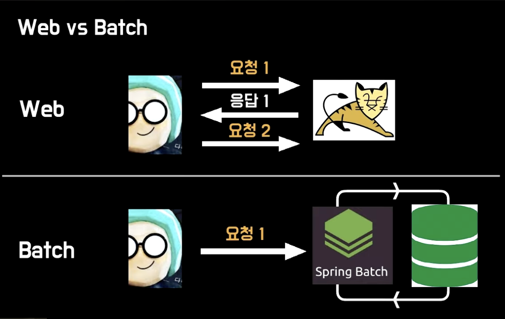

- 일련의 작업을 정해진 로직으로 수행하는 것. (일괄처리)
- 대용량 레코드 처리에 필수적인 기능을 제공함.
  - ex) 로깅/추적, 트랜잭션 관리, 작업 처리 통계, 작업 재시작, 건너뛰기, 리소스 관리
- 최적화 및 파티셔닝 기술을 통해 대용량 및 고성능 배치작업을 가능하게 하는 고급 기술 서비스 및 기능 제공.
- 배치가 실패하여 작업 재시작할 경우 실패한 지점부터 실행함.
- 중복 실행을 막기 위해 성공 이력이 있는 배치는 동일한 파라미터로 실행 시 예외 발생함.
- Scheduler & Quartz -> Batch Job 실행 시키기 위한 용도.
- Spring Batch는 Scheduler가 아님. Batch Job 관리 용도.
  - 배치는 대량의 데이터를 일괄적으로 처리하는 것.
  - 스케줄링은 특정 주기마다 자동으로 돌아가게 해주는 것.

 
 

> ## Spring Batch 특징

- 대용량 데이터 처리.
- 트랜잭션 관리.
- 재시도 기능.

 
 

> ## Spring Batch 구성

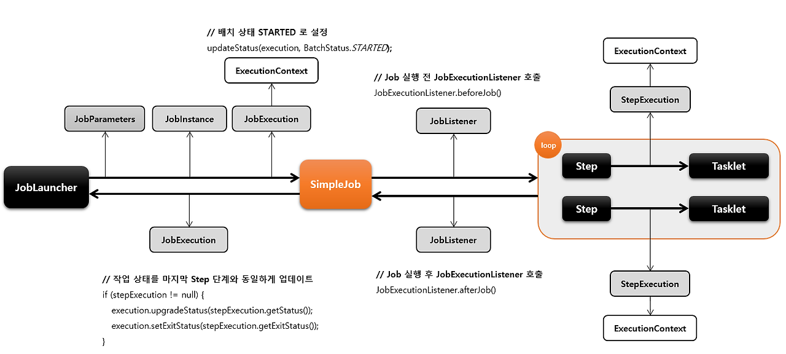

    
Job

- 배치 처리 과정을 하나의 단위로 만들어 놓은 객체.
- 배치 처리 과정에 있어 전체 계층 최상단에 위치.
- SimpleJob (순차적으로 step 실행 시키는 job)
- FlowJob (특정한 조건과 흐름에 따라 Step 구성하여 실행 시키는 job)

  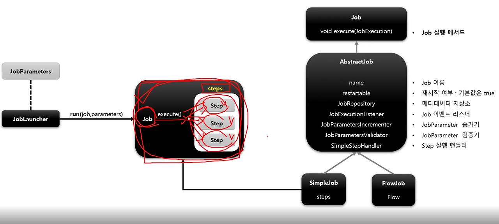

    
JobInstance

- Job 실행 될 때 생성되는 하나의 Job 논리 실행 단위이며, Job의 상태정보를 가짐.
- Job 실행 시점이 다르므로 Job 실행을 구분해야함.
- DB에서 저장된 캐시 ((Job + JobParameter)해싱) 확인 후 기존 캐시된 instance 없으면 새로 만듬.
- 기본적으로 SpringBoot는 job을 모두 실행함. 설정을 통해 ApplicationRunner 구현체를 통해 실행할 수 있도록 하기. (spring.batch.job.enabled = false)
- 

    
JobParameters

- JobInstance 구별 역할 및 JobInstance에 보내는 매개변수 역할.
- String, Double, Long, Date 4가지 형식만 지원함.
- 생성 및 바인딩 방법.
  - 앱 실행시 주입 (Java -jar LogBatch.jar requestDate=20210101)
  - 코드로 생성 (JobParameterBuilder, DefaultJobParametersConvertor)
  - SpEL 이용 (@Value("#{jobParameter[requestDate]}"), @JobScope, @StepScope)
- Step에서 사용가능.

    
JobExecution

- JobInstance 실행 결과 상태, 시작시간, 종료시간, 생성시간 등의 정보를 담고 있음.
- FAILED, COMPLETED 등 실행 결과 상태를 가지며, COMPLETED는 실행 완료로 간주되어 재실행 불가능. FAILED는 재실행 가능. 즉, 하나의 JobInstance 실행 결과가 COMPLETED가 될 때까지 JobInstance 재실행 가능.
- 캐시된 JobInstance가 있는 경우, Failed 경우에만 동일한 JobInstance 실행 가능.

  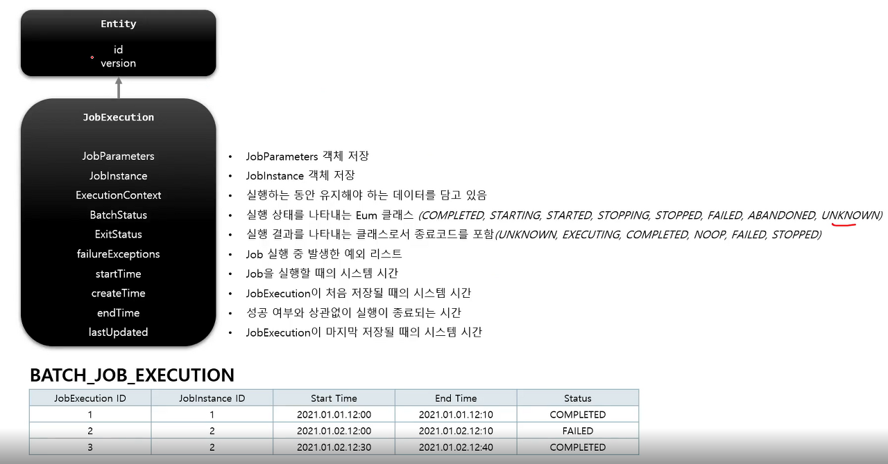
  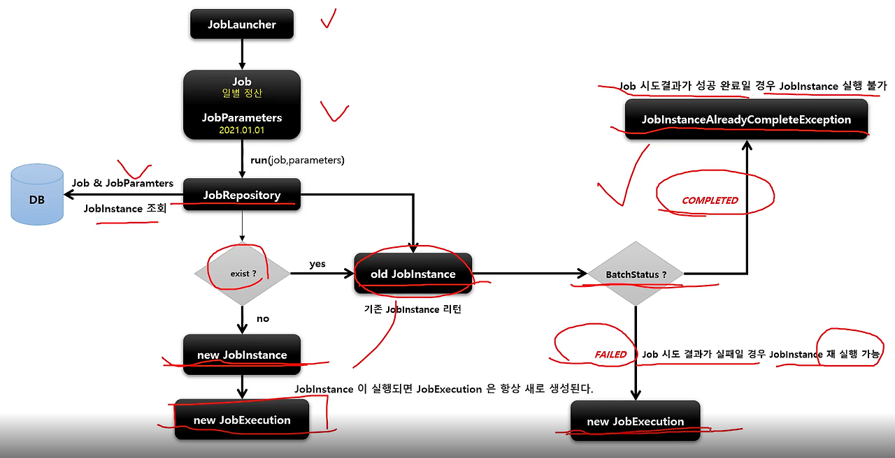

    
Step

- Job의 배치처리를 정의하고 컨트롤하는데 필요한 모든 정보를 가지고 있는 도메인 객체.
- 배치작업을 어떻게 구성하고 실행할 것인지 Job의 세부작업을 Task 기반으로 설정하고 명세한 객체.
- Job은 최소 1개 이상의 step을 가져야함.
- 기본 구현체
  - TaskletStep (가장 기본이 되는 클래스. Tasklet 타입의 구현체 제어)
  - PartitionStep (멀티스레드 방식으로 Step을 여러개로 분리해서 실행)
  - JobStep (Step 내에서 Job 실행. job->step->job->step)
  - FlowStep (Step 안에서 Flow 실행)
- 기본적으로 Job은 여러 Step으로 구성되며, 각 Step은 실제 해야할 일들이 정의되어 있음.

  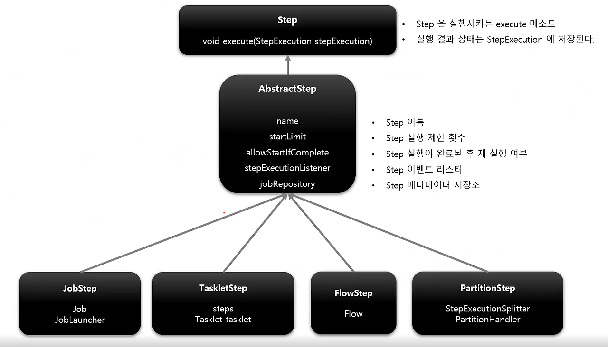

    
StepExecution

- Step 실행 시도를 의미하며 실행 중 발생한 정도들을 저장하는 객체.
- Step의 시작, 종료, 상태 등의 정보, JobExecution에 저장되는 정보 외에 Read Count, Write Count, Commit Count, Skip Count 등의 정보를 가짐.
- Job이 재실행 되더라도 이미 성공한 Step은 재실행하지 않으며 실패한 Step부터 실행됨.
- Job 하나에 여러 Step이 있을 때, 실패한 Step 이후의 Step은 실행 되지 않으므로 실패 이후의 Step은 StepExecution 생성 안됨.
- StepExecution 하나라도 실패한다면 JobExecution 실패함.

  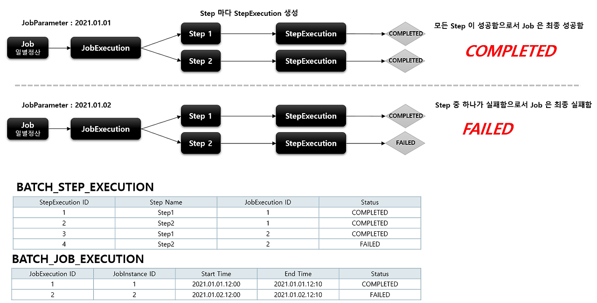

  
StepContribution

- 청크 프로세스의 변경사항을 버퍼링 한 후 StepExecution 업데이트하는 도메인 객체.
- 청크 커밋 직전 StepExecution의 apply 메서드를 호출하여 상태를 업데이트 함.

  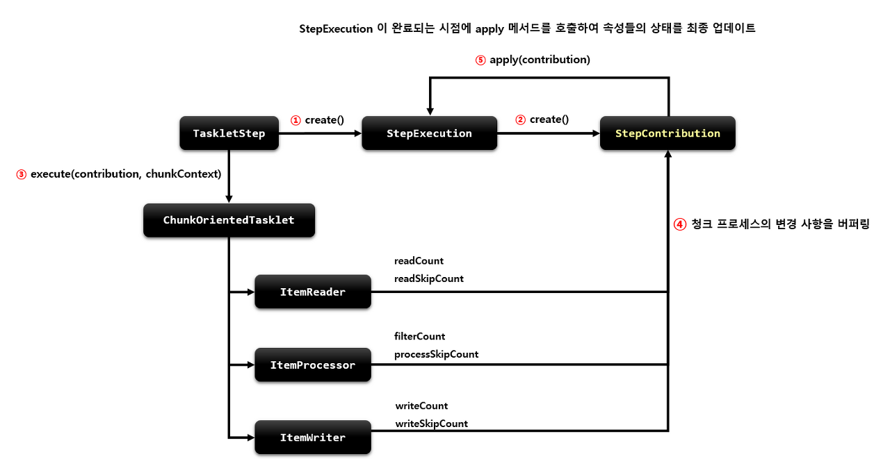

    
ExecutionContext

- 키 값으로 된 컬렉션으로 StepExecution, JobExecution 객체 상태를 저장하고 공유하는 객체.

  - JobExecutionContext: Commit 시점에 데이터 저장. 각 Job별 하나씩 가짐. Job 간 공유 안됨. 해당 Job의 Step간 공유 가능.
  - StepExecutionContext: 실행 사이에 데이터 저장. 각 Step별 하나씩 가짐. Step 간 공유 안됨.

  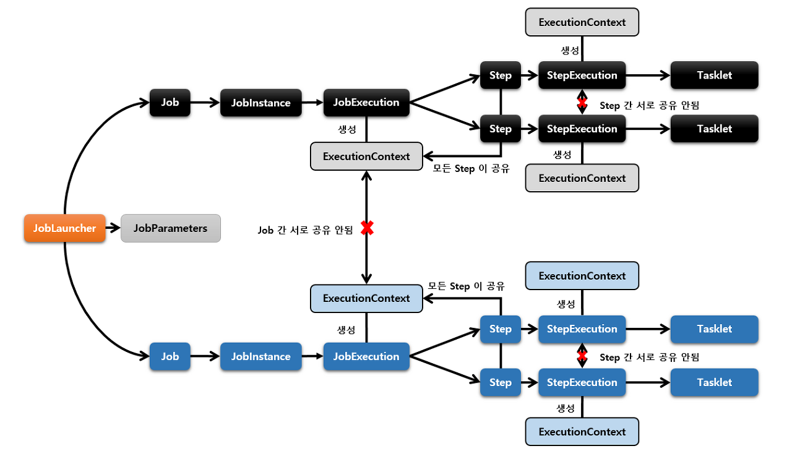

    
JobRepository

- 위에서 설명한 모든 용어의 처리 정보와 배치 작업 정보를 저장하는 저장소.

  

    
JobLauncher

- Job과 JobParameter 인자를 받아 Job 실행하고 최종 Client에게 JobExecution 반환.
- 동기적 실행. (기본값으로 JobExecution 획득하고 배치 처리를 완료한 이후 Client에게 JobExecution 반환. 스케줄러 배치 처리에 적합.)
- 비동기적 실행. (TaskExecutor를 SimpleAsyncTaskExecutor로 설정. JobExecution 획득 후 바로 Client에게 JobExecution 반환. http 요청에 의한 배치처리에 적합.)

  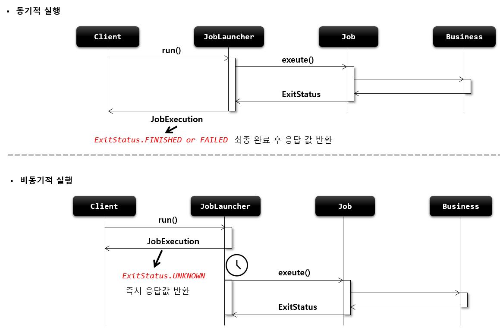

    
ItemReader

- Step에서 Item 읽어오는 인터페이스.
- 다양한 인터페이스가 존재하며 다양한 형식의 데이터(XML, Json, DB, MQ) Item 읽어올 수 있음.

    
ItemWriter

- 처리 된 Data Write 할 때 사용함.
- 처기 결과에 따라 Insert, Update, Send가 될 수 있음.
- Read와 동일하게 다양한 인터페이스가 존재함.
- 기본적으로 Item을 Chunk로 묶어서 처리함.

    
ItemProcessor

- Reader에서 읽어온 Item 처리하는 역할.
- 배치를 처리하는데 필수 요소는 아님.

  
ItemStream

- ItemReader와 ItemWriter 처리 과정 중 상태를 저장하고 오류가 발생하면 해당 상태를 참조하여 실패한 곳에서 재시작 하도록 지원함.
- ExecutionContext를 매개변수로 받아 상태 정보를 업데이트함.
- ItemReader, ItemWriter에서 ItemStream을 구현하고 있음.

    
BatchStatus

- JobExecution과 StepExecution의 속성.
- Job과 Step의 종료 후 최종 결과 상태.
- COMPLETED, STARTING, STARTED, STOPPING, STOPPED, FAILED, ABANDONED, UNKNOWN.

    
ExitStatus

- JobExecution과 StepExecution의 속성.
- Job과 Step의 실행 후 종료 되었을때의 상태.
- 기본적으로 BatchStatus와 동일한 값으로 설정함.
- UNKNOWN, EXECUTING, COMPLETED, NOOP, FAILED, STOPPED.

    
FlowExecutionStatus

- FlowExecution의 속성.
- Flow 실행 후 최종 결과 상태.
- Flow 내 Step의 ExitStatus 값을 FlowExecutionStatus 값으로 저장.
- COMPLETED, STOPPED, FAILED, UNKNOWN.

    
Scope

- 해당 어노테이션을 추가하면 해당 함수의 파라미터에 데이터 추가 가능.
- 해당 어노테이션을 사용하면 Bean의 생성 지점을 지정된 Scope가 실행 되는 시점으로 지연시킴.
- 장점
  - Bean 생성 지연을 통해 Application 실행되는 시점이 아닌 비즈니스 로직 처리 단계에서 Job Parameter를 할당 할 수 있음.
  - 동일한 컴포넌트 병렬 혹은 동시에 사용 시 유용함.
    - ex) 서로 다른 Step에서 하나의 Tasklet을 두고 마구잡이로 상태를 변경하는 것을 막을 수 있음.
- @JobScope
  - 해당 어노테이션과 @Bean을 사용하면 해당 컴포넌트 Job 실행 시점에 Spring Bean 생성함.
  - JobParameters, JobExecutionContext 사용 가능.
  - Step 선언문에 적용.
- @StepScope
  - 해당 어노테이션과 @Bean을 사용하면 해당 컴포넌트 Step 실행 시점에 Spring Bean으로 생성함.
  - JobParameters, JobExecutionContext, StepExecutionContext 사용 가능.
  - Tasklet, ItemReader, ItemWriter, ItemProcessor 선언문에 적용.

 
 

> ## 조건 별 흐름 제어 (Flow)

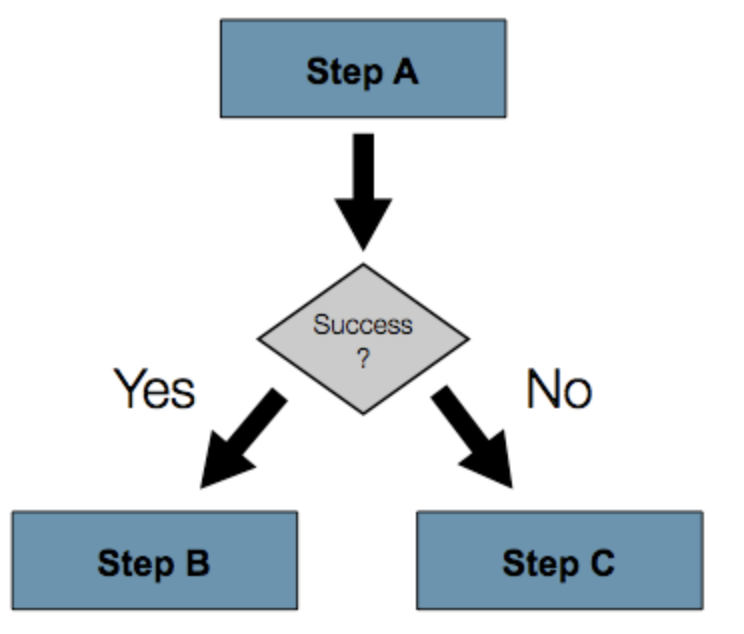

- Step을 순차적으로만 구성하는 것이 아닌 특정한 상태에 따라 흐름을 전환하도록 구성하는 것.
  - ex) Step이 실패하더라도 Job은 실패로 끝나지 않아야 하는 경우.
  - ex) Step이 성공했을 때 다음에 실행 해야 할 Step을 구분해서 실행해야 하는 경우.
  - ex) 특정 Step은 전혀 실행되지 않게 구성해야 하는 경우.
- Flow와 Job은 흐름을 구성하는데만 관여함. 실제 로직은 Step에서 구현함.
- 내부적으로 SimpleFlow 객체를 포함하고 있으며 Job 실행시 호출함.
- 분기 처리만 담당하는 JobExecutionDecider가 있음.
  - JobExecutionDecider를 상속 받는 클래스를 따로 만들어 분기 처리 로직을 분리함.

 
 

> ## Spring Batch Step 동작 방식

    
Tasklet

- Step 단계에서 '단일 레코드', '파일' 등 하나의 작업만 처리하는 방식.
- 각각의 처리를 하나의 트랜잭션에서 처리함.
- 파일을 읽고 처리한 다음 결과를 데이터베이스에 쓰는 등의 작업을 수행함.
- 단일 작업으로 작업이 끝날 때까지 대기 해야함.
- 대용량 데이터 처리에 적합하지 않음.
- Step은 Tasklet 단위로 처리되고, Tasklet 중에서 ChunkOrientedTasklet을 통해 Chunk를 처리함.

    
Chunk

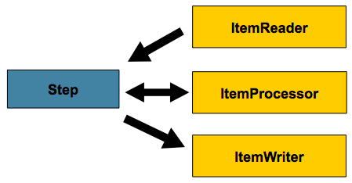
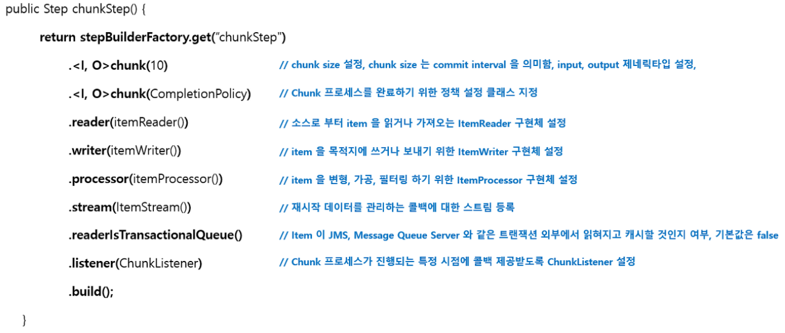

- Chunk: 데이터를 일정한 크기로 나눈 데이터 셋.
  - Chunk 단위로 나누면 전체 데이터를 한 번에 처리하지 않아도 되어 메모리 부하를 줄이고 성능을 향상시킬 수 있음.
- Step 단계에서 '단일 레코드를 묶어서' Chunk로 만들고 여러 Chunk 작업을 처리하는 방식.
- 묶인 레코드 Chunk를 각각 하나의 트랜잭션으로 처리하므로 실패시 해당 Chunk만 롤백.
- 병렬 처리를 위해 Chunk 사용하되, 순차적으로 처리하는 방식임.
- 대용량 데이터를 처리할 때 사용하며, 중복 처리나 실패한 레코드 처리 등 예외 상황에 대한 대처가 용이함.
- Reader로 하나의 데이터를 읽어옴.
- 읽어온 데이터를 Processor에서 가공.
- 가공된 데이터들을 별도의 공간에 Chunk 단위 만큼 모음.
- 다 쌓이면 Writer에 전달하고 Writer는 해당 데이터들을 일괄 저장함.
- Chunk Size vs Page Size
  - Chunk Size는 트랜잭션 범위를 설정하는 방법. 즉, 한 번에 처리할(커밋) 데이터의 수를 의미함.
  - Page Size는 처리할 데이터의 수를 설정하는 방법. 즉, 한 번에 몇개의 데이터를 처리할지 의미함.
  - 예를 들어, Chunk Size = 10, Page Size = 2 일 경우, Reader, Processor, Writer가 한번에 2개의 데이터 처리를 5번 반복하여 총 10개의 데이터를 처리해야 한번의 커밋이 발생함.
  - 따라서, 효과적인 성능 향상은 Page Size를 크게하고 해당 사이즈에 동일한 Chunk Size를 설정하여 대용량 처리 후 한번에 커밋하는 것이 좋음.
- PagingReader 주의사항
  - 페이징 처리 시 각 쿼리에 Offset, Limit를 지정해야함. 이때, 순서가 보장될 수 있도록 Order By를 사용해야 함.

    
Parallel Chunk

- Chunk 방식의 처리에서 더욱 빠른 처리 속도를 위해 Chunk를 독립적으로 처리하여 여러 개의 Chunk를 병렬로 처리 하는 방식.
- 여러 대의 서버에서 동시에 작업을 처리할 때 사용할 수 있음.

    
Remote Chunking

- 여러 대의 서버에서 대용량 데이터 처리를 수행할 때 사용함.
- 서버 간에 데이터를 공유하고 각 서버에서 병렬로 처리함.

 
 

> ## ItemReader

- DB, File, XML, JSON, JMS(Java Message Service) 등 다양한 데이터 소스를 읽어오는 역할.
  - FlatFileItemReader (2차원 데이터로 표현된 유형의 파일 처리)
  - StaxEventItemReader (XML 유형 파일 처리)
  - JsonItemReader (JSON 유형 파일 처리)
  - 자세한 사항은 필요할 때 찾아보기 [링크](https://tonylim.tistory.com/434)
- Spring Batch에서 지원하지 않는 Reader가 필요할 경우 인터페이스를 활용하여 직접 만들 수 있음.
- Spring의 JdbcTemplate는 분할 처리를 지원하지 않으므로(기본적으로 select만 사용할 경우 조건에 맞는 모든 데이터를 가져오므로) 개발자가 직접 limit, offset 작업을 해주어야 함. 이를 해결하기 위한 방법으로 Cursor, Paging가 있음.(DB 처리 방식)
- Cursor
  - JDBC ResultSet 기본 메커니즘을 사용함. (ResultSet이 Open 될 때마다 next() 메소드가 호출되어 DB 데이터를 반환하는 형식)
  - Streaming 형식으로 데이터를 처리함.
  - DB와 커넥션을 맺은 경우 fetchSize 만큼 조회 후 메모리에 저장. 저장된 메모리에서 하나씩 읽아옴. (fetchSize가 없으면 select 구문이 여러번 돌아 비효율적. 단, 메모리 사용량이 증가함.)
  - DB와의 SocketTimeout을 충분히 큰 값으로 설정해야 함. (하나의 Connection으로 Batch가 끝날때까지 사용되기 때문에 중간에 연결이 끊길 수 있음. 따라서 오래 걸리는 Batch는 PagingItemReader를 사용하는게 더 나음.)
- Paging
  - 한번에 Page 단위로 데이터를 처리.
  - 한번에 설정한 Page Size 만큼 데이터를 읽어옴. (페이징 단위의 결과만 메모리에 할당하므로 메모리 사용량을 줄일 수 있음.)
  - 페이지를 읽을 때 마다 Connection을 맺고 끊음. (Connection 유지 시간이 길지 않을 때 사용.)
  - Spring Batch는 offset과 limit을 PageSize에 맞게 자동으로 생성해줌. 단, 쿼리는 개별적으로 실행함.
  - 각 페이지마다 새로운 쿼리를 실행하므로 페이징시 결과를 정렬하는 것이 중요함. 따라서, Order By 사용 권장됨.

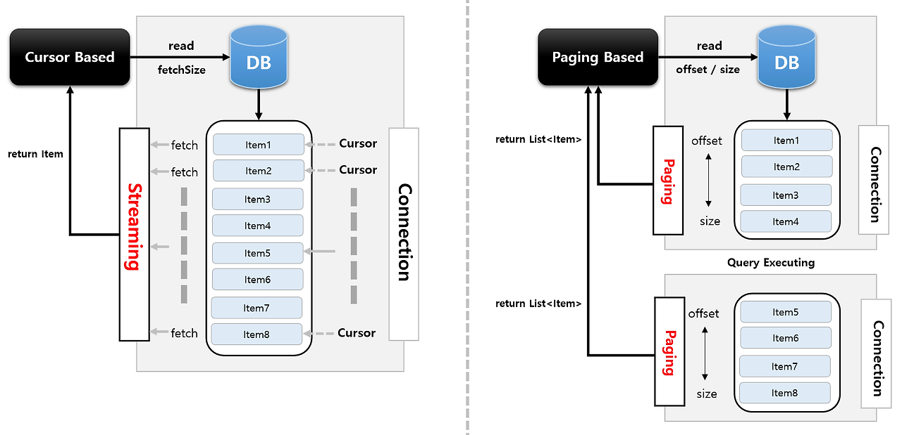

 
 

> ## ItemWriter

- DB, File, XML, JSON, JMS(Java Message Service) 등 다양한 형태로 데이터를 쓰는 역할.
  - FlatFileItemWriter (2차원 데이터 유형의 파일 처리)
  - StaxEventItemWriter (XML 유형 파일 처리)
  - JsonFileItemWriter (JSON 유형 파일 처리)
  - 자세한 사항은 필요할 때 찾아보기 [링크](https://tonylim.tistory.com/435)
- DB의 경우 ChunkSize 만큼 쌓아서 일괄 처리함.

 
 

> ## Scheduler

- Batch Job을 실행 시키기 위한 방법.
- Quartz, Scheduler, Jenkins 등이 있음.
- Spring에서 Quartz Scheduler 지원함.
