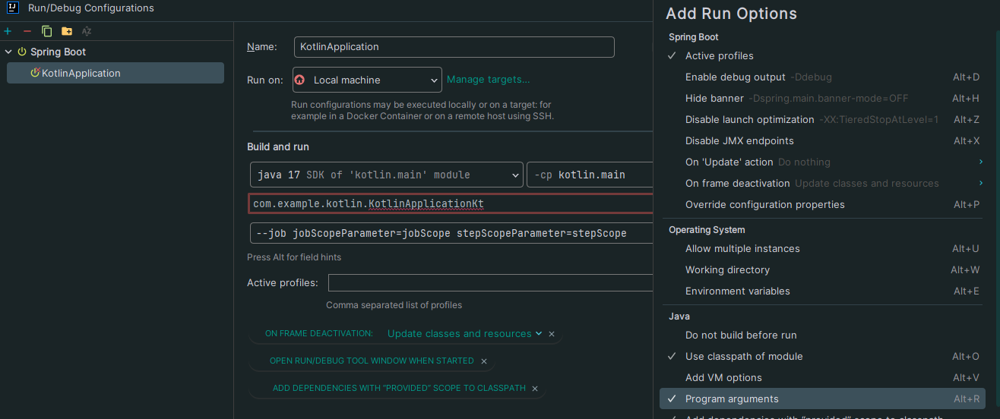

> ## Version

- Spring Boot, Spring Batch 각각의 버전별 사용법이 다름. 현재 실습 버전은 다음과 같음.
    - Spring Boot : 3.2.2
    - Spring Batch : 5
    - JDK : 17
    - kotlin("jvm") : 1.9.22
- 해당 실습 기준 인터넷에 보이는 Spring Batch 실습은 대게 Spring Boot 2, Spring Batch 4 버전임.
- Spring Batch 5의 경우 JDK 17 이상만 가능.


<br/>
<br/>

> ## Dependency

<details>
    <summary>Gradle</summary>

- Java와 동일.

    ```kotlin
    dependencies {
        implementation("org.springframework.boot:spring-boot-starter-batch")
        implementation("org.springframework.boot:spring-boot-starter-web")
        implementation("com.fasterxml.jackson.module:jackson-module-kotlin")
        implementation("org.jetbrains.kotlin:kotlin-reflect")
        developmentOnly("org.springframework.boot:spring-boot-devtools")
        runtimeOnly("com.h2database:h2")
        testImplementation("org.springframework.boot:spring-boot-starter-test")
        testImplementation("org.springframework.batch:spring-batch-test")
    }
    ```

</details>

<br/>
<br/>


> ## Single Step

<details>
    <summary>KotlinApplication</summary>

- Java와 동일.

</details>

<details>
    <summary>SingleJobConfiguration</summary>

- Java와 동일.

    ```kotlin
    package com.example.kotlin.Batch
    
    import org.slf4j.LoggerFactory
    import org.springframework.batch.core.Job
    import org.springframework.batch.core.Step
    import org.springframework.batch.core.StepContribution
    import org.springframework.batch.core.job.builder.JobBuilder
    import org.springframework.batch.core.repository.JobRepository
    import org.springframework.batch.core.scope.context.ChunkContext
    import org.springframework.batch.core.step.builder.StepBuilder
    import org.springframework.batch.core.step.tasklet.Tasklet
    import org.springframework.batch.repeat.RepeatStatus
    import org.springframework.context.annotation.Bean
    import org.springframework.context.annotation.Configuration
    import org.springframework.transaction.PlatformTransactionManager
    
    @Configuration
    class SingleJobConfiguration {
        private val log = LoggerFactory.getLogger(this.javaClass)!!
        @Bean
        fun singleTaskLet(): Tasklet {
            return Tasklet { contribution: StepContribution?, chunkContext: ChunkContext? ->
                log.info(">>>> SingleTaskLet")
                RepeatStatus.FINISHED
            };
        }
    
        @Bean
        fun singleStep(
            jobRepository: JobRepository,
            platformTransactionManager: PlatformTransactionManager,
        ): Step {
            log.info(">>>> SingleStep")
            return StepBuilder("singleStep", jobRepository)
                .tasklet(singleTaskLet(), platformTransactionManager).build()
        }
    
        @Bean
        fun job(jobRepository: JobRepository, platformTransactionManager: PlatformTransactionManager): Job {
            log.info(">>>> SingleJob")
            return JobBuilder("singleJob", jobRepository)
                .start(singleStep(jobRepository,platformTransactionManager))
                .build()
        }
    
    }
    ```


</details>

<br/>
<br/>

> ## MultiStep

<details>
  <summary>설정</summary>

- Java와 동일.

  ```yaml
  spring:
    batch:
      job:
        enabled: true # default true. false 하면 모든 job 비활성화.
        name: multiJob # 해당 이름으로 된 job만 실행.
  ```


</details>

<details>
  <summary>MultiJobConfiguration</summary>

- Java와 동일.

```kotlin
package com.example.kotlin.Batch

import org.slf4j.LoggerFactory
import org.springframework.batch.core.Job
import org.springframework.batch.core.Step
import org.springframework.batch.core.StepContribution
import org.springframework.batch.core.job.builder.JobBuilder
import org.springframework.batch.core.repository.JobRepository
import org.springframework.batch.core.scope.context.ChunkContext
import org.springframework.batch.core.step.builder.StepBuilder
import org.springframework.batch.core.step.tasklet.Tasklet
import org.springframework.batch.repeat.RepeatStatus
import org.springframework.beans.factory.annotation.Qualifier
import org.springframework.context.annotation.Bean
import org.springframework.context.annotation.Configuration
import org.springframework.transaction.PlatformTransactionManager

@Configuration
class MultiJobConfiguration {
    private val log = LoggerFactory.getLogger(this.javaClass)!!

    @Bean
    fun multiTasklet(): Tasklet {
        log.info(">>>> multiTaskLet")
        return Tasklet { contribution: StepContribution?, chunkContext: ChunkContext? ->
            log.info(">>>> multiTaskLet")
            RepeatStatus.FINISHED
        }
    }

    @Bean
    fun multiStep1(
        jobRepository: JobRepository,
        multiTasklet: Tasklet,
        platformTransactionManager: PlatformTransactionManager
    ): Step {
        log.info(">>>> multiStep1")
        return StepBuilder("multiStep1", jobRepository).tasklet(multiTasklet, platformTransactionManager).build()
    }

    @Bean
    fun multiStep2(
        jobRepository: JobRepository,
        multiTasklet: Tasklet,
        platformTransactionManager: PlatformTransactionManager
    ): Step {
        log.info(">>>> multiStep2")
        return StepBuilder("multiStep2", jobRepository).tasklet(multiTasklet, platformTransactionManager).build()
    }

    @Bean
    fun multiStep3(
        jobRepository: JobRepository,
        multiTasklet: Tasklet,
        platformTransactionManager: PlatformTransactionManager
    ): Step {
        log.info(">>>> multiStep3")
        return StepBuilder("multiStep3", jobRepository).tasklet(multiTasklet, platformTransactionManager).build()
    }

    @Bean
    fun multiJob(
        jobRepository: JobRepository,
        multiStep1: Step,
        multiStep2: Step,
        multiStep3: Step,
    ): Job {
        return JobBuilder("multiJob", jobRepository)
            .start(multiStep1)
            .next(multiStep2)
            .next(multiStep3)
            .build()
    }

}
```

</details>

<br/>
<br/>

> ## Flow

<details>
  <summary>설정</summary>

- 추가 설정 없음.

  ```yaml
  spring:
    batch:
      job:
        enabled: true # default true. false 하면 모든 job 비활성화.
        name: flowJob # 해당 이름으로 된 job만 실행.
  ```

</details>


<details>
  <summary>flowJobConfiguration</summary>

- Java는 Flow 종료 메소드인 .end()가 따로 필요했으나, Kotlin은 Flow 종료 메소드 .end()를 따로 하지 않아도 됨.

  ```kotlin
  package com.example.kotlin.Batch
  
  import org.slf4j.LoggerFactory
  import org.springframework.batch.core.ExitStatus
  import org.springframework.batch.core.Job
  import org.springframework.batch.core.Step
  import org.springframework.batch.core.job.builder.JobBuilder
  import org.springframework.batch.core.repository.JobRepository
  import org.springframework.batch.core.step.builder.StepBuilder
  import org.springframework.batch.core.step.tasklet.Tasklet
  import org.springframework.batch.repeat.RepeatStatus
  import org.springframework.context.annotation.Bean
  import org.springframework.context.annotation.Configuration
  import org.springframework.transaction.PlatformTransactionManager
  
  @Configuration
  class FlowJobConfiguration {
      private val log = LoggerFactory.getLogger(this.javaClass)!!
  
      @Bean
      fun flowTasklet(): Tasklet {
          return Tasklet { contribution, chunkContext ->
              log.info(">>>>> flowTasklet")
  //            contribution.exitStatus = ExitStatus.FAILED
              RepeatStatus.FINISHED
          }
      }
  
      @Bean
      fun flowStep1(
          jobRepository: JobRepository,
          flowTasklet: Tasklet,
          platformTransactionManager: PlatformTransactionManager
      ): Step {
          log.info(">>>> flowStep1")
          return StepBuilder("flowStep1", jobRepository).tasklet(flowTasklet, platformTransactionManager).build()
      }
  
      @Bean
      fun flowStep2(
          jobRepository: JobRepository,
          flowTasklet: Tasklet,
          platformTransactionManager: PlatformTransactionManager
      ): Step {
          log.info(">>>> flowStep2")
          return StepBuilder("flowStep2", jobRepository).tasklet(flowTasklet, platformTransactionManager).build()
      }
  
      @Bean
      fun flowStep3(
          jobRepository: JobRepository,
          flowTasklet: Tasklet,
          platformTransactionManager: PlatformTransactionManager
      ): Step {
          log.info(">>>> flowStep3")
          return StepBuilder("flowStep3", jobRepository).tasklet(flowTasklet, platformTransactionManager).build()
      }
  
      @Bean
      fun flowJob(
          jobRepository: JobRepository,
          flowStep1: Step,
          flowStep2: Step,
          flowStep3: Step,
      ): Job {
          return JobBuilder("flowJob", jobRepository)
              .start(flowStep1) // step1 시작.
              .on("FAILED") // step1 결과 값 FAILED 일 경우.
              .to(flowStep2) // flow2 실행.
              .from(flowStep1) // 만약 step1의 결과 값이
              .on("*") // 모든 결과 값일 경우
              .to(flowStep3) // step3 실행.
              .end() // job 종료
              .build()
      }
  
  }
  ```

</details>


<details>
  <summary>customFlowConfiguration</summary>

- 위에서 설명한 차이 말고는 Java와 동일.

  ```kotlin
  package com.example.kotlin.Batch
  
  import org.slf4j.LoggerFactory
  import org.springframework.batch.core.Job
  import org.springframework.batch.core.JobExecution
  import org.springframework.batch.core.Step
  import org.springframework.batch.core.StepExecution
  import org.springframework.batch.core.job.builder.JobBuilder
  import org.springframework.batch.core.job.flow.FlowExecutionStatus
  import org.springframework.batch.core.job.flow.JobExecutionDecider
  import org.springframework.batch.core.repository.JobRepository
  import org.springframework.batch.core.step.builder.StepBuilder
  import org.springframework.batch.core.step.tasklet.Tasklet
  import org.springframework.batch.repeat.RepeatStatus
  import org.springframework.context.annotation.Bean
  import org.springframework.context.annotation.Configuration
  import org.springframework.transaction.PlatformTransactionManager
  import java.util.*
  
  @Configuration
  class CustomFlowJobConfiguration {
      private val log = LoggerFactory.getLogger(this.javaClass)!!
  
      @Bean
      fun customFlowTasklet(): Tasklet {
          return Tasklet { contribution, chunkContext ->
              log.info(">>>>> customFlowTasklet")
              RepeatStatus.FINISHED
          }
      }
  
      @Bean
      fun customFlowStep1(
          jobRepository: JobRepository,
          customFlowTasklet: Tasklet,
          platformTransactionManager: PlatformTransactionManager
      ): Step {
          log.info(">>>> customFlowStep1")
          return StepBuilder("customFlowStep1", jobRepository).tasklet(customFlowTasklet, platformTransactionManager).build()
      }
  
      @Bean
      fun customFlowStep2(
          jobRepository: JobRepository,
          customFlowTasklet: Tasklet,
          platformTransactionManager: PlatformTransactionManager
      ): Step {
          log.info(">>>> customFlowStep2")
          return StepBuilder("customFlowStep2", jobRepository).tasklet(customFlowTasklet, platformTransactionManager).build()
      }
  
      @Bean
      fun customFlowStep3(
          jobRepository: JobRepository,
          customFlowTasklet: Tasklet,
          platformTransactionManager: PlatformTransactionManager
      ): Step {
          log.info(">>>> customFlowStep3")
          return StepBuilder("customFlowStep3", jobRepository).tasklet(customFlowTasklet, platformTransactionManager).build()
      }
  
      class OddDecider(): JobExecutionDecider {
          override fun decide(jobExecution: JobExecution, stepExecution: StepExecution?): FlowExecutionStatus {
              val rand = Random();
              val log = LoggerFactory.getLogger(this.javaClass)!!
  
              val randomNumber = rand.nextInt(50) + 1;
              log.info("랜덤숫자: {}", randomNumber);
  
              return if(randomNumber % 2 == 0) {
                  FlowExecutionStatus("EVEN");
              } else {
                  FlowExecutionStatus("ODD");
              }
          }
      }
  
      @Bean
      fun decider(): JobExecutionDecider{
          return OddDecider()
      }
  
      @Bean
      fun customFlowJob(
          jobRepository: JobRepository,
          customFlowStep1: Step,
          customFlowStep2: Step,
          customFlowStep3: Step,
      ): Job {
          return JobBuilder("customFlowJob", jobRepository)
              .start(customFlowStep1) // step1 시작.
              .next(decider()) // decider() 시작.
              .on("EVEN") // decider 결과 값 EVEN 일 경우.
              .to(customFlowStep2) // customFlow2 실행.
              .from(decider()) // 만약 decider() 결과 값이
              .on("ODD") // ODD 일 경우
              .to(customFlowStep3) // step3 실행.
              .end() // job 종료
              .build()
      }
      
  }
  ```

</details>


<br/>
<br/>

> ## Scope 

<details>
  <summary>설정</summary>

- 파라미터 입력 설정.



</details>


<details>
  <summary>JobParameterConfiguration</summary>

- 기본적인 틀 수정.
- @Value를 이용한 파라미터 가져오기.

  ```kotlin
  package com.example.kotlin.Batch
  
  import org.slf4j.LoggerFactory
  import org.springframework.batch.core.Job
  import org.springframework.batch.core.Step
  import org.springframework.batch.core.StepContribution
  import org.springframework.batch.core.configuration.annotation.JobScope
  import org.springframework.batch.core.configuration.annotation.StepScope
  import org.springframework.batch.core.job.builder.JobBuilder
  import org.springframework.batch.core.repository.JobRepository
  import org.springframework.batch.core.scope.context.ChunkContext
  import org.springframework.batch.core.step.builder.StepBuilder
  import org.springframework.batch.core.step.tasklet.Tasklet
  import org.springframework.batch.repeat.RepeatStatus
  import org.springframework.beans.factory.annotation.Value
  import org.springframework.context.annotation.Bean
  import org.springframework.context.annotation.Configuration
  import org.springframework.transaction.PlatformTransactionManager
  
  @Configuration
  class JobParameterConfiguration {
      private val log = LoggerFactory.getLogger(this.javaClass)!!
  
      @Bean
      @StepScope
      fun jobParameterTaskLet(
          @Value("#{jobParameters[stepScopeParameter]}") stepScopeParameter: String,
      ): Tasklet {
          return Tasklet { contribution: StepContribution?, chunkContext: ChunkContext? ->
              log.info(">>>> jobParameterTaskLet")
              log.info(">>>> stepScopeParameter: {}", stepScopeParameter);
              RepeatStatus.FINISHED
          };
      }
  
      @Bean
      @JobScope
      fun jobParameterStep(
          @Value("#{jobParameters[jobScopeParameter]}") jobScopeParameter: String,
          jobRepository: JobRepository,
          jobParameterTaskLet: Tasklet,
          platformTransactionManager: PlatformTransactionManager,
      ): Step {
          log.info(">>>> jobParameterStep")
              log.info(">>>> jobScopeParameter: {}", jobScopeParameter)
          return StepBuilder("jobParameterStep", jobRepository)
              .tasklet(jobParameterTaskLet, platformTransactionManager).build()
      }
  
  //    @Bean
  //    fun job(jobRepository: JobRepository, jobParameterTaskLet: Tasklet, platformTransactionManager: PlatformTransactionManager): Job {
  //        log.info(">>>> SingleJob")
  //        return JobBuilder("jobParameterJob", jobRepository)
  //            .start(jobParameterStep(jobRepository, jobParameterTaskLet, platformTransactionManager))
  //            .build()
  //    }
  
      @Bean
      fun jobParameterJob(jobRepository: JobRepository, jobParameterStep: Step): Job {
          log.info(">>>> jobParameterJob")
          return JobBuilder("jobParameterJob", jobRepository)
              .start(jobParameterStep)
              .build()
      }
  
  }
  ```

</details>

<br/>
<br/>

> ## Tasklet

<details>
  <summary>Lambda</summary>

- Java와 동일.

  ```kotlin
  package com.example.kotlin.tasklet
  
  import org.slf4j.LoggerFactory
  import org.springframework.batch.core.Job
  import org.springframework.batch.core.Step
  import org.springframework.batch.core.job.builder.JobBuilder
  import org.springframework.batch.core.repository.JobRepository
  import org.springframework.batch.core.step.builder.StepBuilder
  import org.springframework.batch.repeat.RepeatStatus
  import org.springframework.context.annotation.Bean
  import org.springframework.context.annotation.Configuration
  import org.springframework.transaction.PlatformTransactionManager
  
  @Configuration
  class TaskletJobConfig1 {
      private val log = LoggerFactory.getLogger(this.javaClass)!!
  
      @Bean
      fun taskletStep(
          jobRepository: JobRepository,
          platformTransactionManager: PlatformTransactionManager
      ): Step {
          log.info(">>>> taskletStep1")
          return StepBuilder("flowStep1", jobRepository).tasklet({ contribution, chunkContext ->
              for (i in 0..10) {
                  log.info("람다식 ${i}번째 비지니스 로직");
              }
              RepeatStatus.FINISHED
          }, platformTransactionManager).build()
      }
  
      @Bean
      fun taskletJob(jobRepository: JobRepository, taskletStep: Step): Job {
          log.info(">>>> taskletJob1")
          return JobBuilder("taskletJob1", jobRepository)
              .start(taskletStep)
              .build()
      }
  
  }
  ```

</details>

<details>
  <summary>MethodInvokingTaskletAdapter</summary>

- Java와 동일함.

  ```kotlin
  package com.example.kotlin.tasklet
  
  import org.slf4j.LoggerFactory
  
  class MethodInvokingTaskletAdapterService {
      private val log = LoggerFactory.getLogger(this.javaClass)!!
      fun businessLogic(){
          for (i in 1.. 10){
              log.info("MethodInvokingTaskletAdapterService : ${i}번째 비즈니스 로직")
          }
      }
  }
  ```

  ```kotlin
  package com.example.kotlin.tasklet
  
  import org.slf4j.LoggerFactory
  import org.springframework.batch.core.Job
  import org.springframework.batch.core.Step
  import org.springframework.batch.core.job.builder.JobBuilder
  import org.springframework.batch.core.repository.JobRepository
  import org.springframework.batch.core.step.builder.StepBuilder
  import org.springframework.batch.core.step.tasklet.MethodInvokingTaskletAdapter
  import org.springframework.context.annotation.Bean
  import org.springframework.context.annotation.Configuration
  import org.springframework.transaction.PlatformTransactionManager
  
  @Configuration
  class TaskletJobConfig2 {
      private val log = LoggerFactory.getLogger(this.javaClass)!!
  
      @Bean
      fun methodInvokingTaskletAdapterService(): MethodInvokingTaskletAdapterService{
          return MethodInvokingTaskletAdapterService()
      }
  
      @Bean
      fun methodInvokingTaskletAdapter() : MethodInvokingTaskletAdapter{
          val methodInvokingTaskletAdapter = MethodInvokingTaskletAdapter()
  
          methodInvokingTaskletAdapter.setTargetObject(methodInvokingTaskletAdapterService())
          methodInvokingTaskletAdapter.setTargetMethod("businessLogic")
  
          return methodInvokingTaskletAdapter
      }
  
      @Bean
      fun taskletStep2(
          jobRepository: JobRepository,
          platformTransactionManager: PlatformTransactionManager
      ): Step {
          log.info(">>>> taskletStep2")
          return StepBuilder("flowStep1", jobRepository).tasklet(methodInvokingTaskletAdapter(), platformTransactionManager).build()
      }
  
      @Bean
      fun taskletJob2(jobRepository: JobRepository, taskletStep2: Step): Job {
          log.info(">>>> taskletJob2")
          return JobBuilder("taskletJob2", jobRepository)
              .start(taskletStep2)
              .build()
      }
  
  }
  ```

</details>

<details>
  <summary>CustomTasklet</summary>

- Tasklet을 커스텀 하여 사용하는 방법.
- Java와 동일함.

  ```kotlin
  package com.example.kotlin.tasklet
  
  import org.slf4j.LoggerFactory
  import org.springframework.batch.core.ExitStatus
  import org.springframework.batch.core.StepContribution
  import org.springframework.batch.core.StepExecution
  import org.springframework.batch.core.StepExecutionListener
  import org.springframework.batch.core.scope.context.ChunkContext
  import org.springframework.batch.core.step.tasklet.Tasklet
  import org.springframework.batch.repeat.RepeatStatus
  
  class CustomTasklet (): Tasklet, StepExecutionListener{
      private val log = LoggerFactory.getLogger(this.javaClass)!!
  
      override fun execute(contribution: StepContribution, chunkContext: ChunkContext): RepeatStatus? {
          for (i in 1.. 10){
              log.info("CustomTasklet ${i}번째 비즈니스 로직")
          }
  
          return RepeatStatus.FINISHED
      }
  
      override fun beforeStep(stepExecution: StepExecution) {
          log.info("Before Step")
          super.beforeStep(stepExecution)
      }
  
      override fun afterStep(stepExecution: StepExecution): ExitStatus? {
          log.info("After Step")
          return super.afterStep(stepExecution)
      }
  }
  ```

  ```kotlin
  package com.example.kotlin.tasklet
  
  import org.slf4j.LoggerFactory
  import org.springframework.batch.core.Job
  import org.springframework.batch.core.Step
  import org.springframework.batch.core.job.builder.JobBuilder
  import org.springframework.batch.core.repository.JobRepository
  import org.springframework.batch.core.step.builder.StepBuilder
  import org.springframework.context.annotation.Bean
  import org.springframework.context.annotation.Configuration
  import org.springframework.transaction.PlatformTransactionManager
  
  @Configuration
  class TaskletJobConfig3 {
      private val log = LoggerFactory.getLogger(this.javaClass)!!
  
      @Bean
      fun customTasklet(): CustomTasklet{
          return CustomTasklet()
      }
  
      @Bean
      fun taskletStep3(
          jobRepository: JobRepository,
          platformTransactionManager: PlatformTransactionManager,
          customTasklet: CustomTasklet
      ): Step {
          log.info(">>>> taskletStep3")
          return StepBuilder("flowStep1", jobRepository).tasklet(customTasklet, platformTransactionManager).build()
      }
  
      @Bean
      fun taskletJob3(jobRepository: JobRepository, taskletStep3: Step): Job {
          log.info(">>>> taskletJob3")
          return JobBuilder("taskletJob3", jobRepository)
              .start(taskletStep3)
              .build()
      }
  
  }
  ```

</details>

<br/>
<br/>

> ## Chunk

<details>
  <summary>ChunkConfiguration</summary>

- Java와 동일.

  ```kotlin
  package com.example.kotlin.chunk
  
  import org.slf4j.LoggerFactory
  import org.springframework.batch.core.Job
  import org.springframework.batch.core.Step
  import org.springframework.batch.core.job.builder.JobBuilder
  import org.springframework.batch.core.repository.JobRepository
  import org.springframework.batch.core.step.builder.StepBuilder
  import org.springframework.batch.item.ItemProcessor
  import org.springframework.batch.item.ItemReader
  import org.springframework.batch.item.ItemWriter
  import org.springframework.batch.item.support.ListItemReader
  import org.springframework.batch.repeat.RepeatStatus
  import org.springframework.context.annotation.Bean
  import org.springframework.context.annotation.Configuration
  import org.springframework.transaction.PlatformTransactionManager
  import java.util.*
  
  @Configuration
  class ChunkConfiguration {
      private val log = LoggerFactory.getLogger(this.javaClass)!!
  
  
      @Bean
      fun reader(): ItemReader<String> = ListItemReader(listOf("one", "two", "three"))
  
      @Bean
      fun processor(): ItemProcessor<String, String> = ItemProcessor { it.uppercase(Locale.getDefault()) }
  
      @Bean
      fun writer(): ItemWriter<String> = ItemWriter { items -> items.forEach { log.info(it) } }
  
      @Bean
      fun chunkStep(
          jobRepository: JobRepository,
          platformTransactionManager: PlatformTransactionManager
      ): Step {
          log.info(">>>> chunkStep")
          return StepBuilder("chunkStep", jobRepository)
              .chunk<String, String>(10, platformTransactionManager)
              .reader(reader())
              .processor(processor())
              .writer(writer())
              .build()
      }
  
      @Bean
      fun chunkJob(jobRepository: JobRepository, chunkStep: Step): Job {
          log.info(">>>> chunkJob")
          return JobBuilder("chunkJob", jobRepository)
              .start(chunkStep)
              .build()
      }
  }
  ```

</details>

<br/>
<br/>

> ## ItemReader

<details>
  <summary>Data 설정</summary>

- Java와 동일.

  ```kotlin
  package com.example.kotlin.itemReader.cursor
  
  import jakarta.persistence.Column
  import jakarta.persistence.Entity
  import jakarta.persistence.GeneratedValue
  import jakarta.persistence.GenerationType
  import jakarta.persistence.Id
  import jakarta.persistence.Table
  import java.time.LocalDateTime
  import java.time.format.DateTimeFormatter
  
  @Entity
  @Table(name = "PAY")
  class Pay(
      @Id
      @GeneratedValue(strategy = GenerationType.IDENTITY)
      var id: Long? = null,
      var amount: Long? = null,
      var txName: String? = null,
      @Column(columnDefinition = "TIMESTAMP")
      var txDateTime: LocalDateTime? = null
  ) {
      companion object {
          private val FORMATTER = DateTimeFormatter.ofPattern("yyyy-MM-dd HH:mm:ss")
      }
  
      constructor(id: Long?, amount: Long?, txDateTime: LocalDateTime?) : this() {
          this.id = id
          this.amount = amount
          this.txDateTime = txDateTime
      }
  
      override fun toString(): String {
          return "Pay(id=$id, amount=$amount, txName=$txName, txDateTime=$txDateTime)"
      }
  
  }
  
  ```
  
  ```yaml
  spring:
    batch:
      job:
        enabled: true # default true. false 하면 모든 job 비활성화.
        name: jdbcCursorItemReaderJob # 해당 이름으로 된 job만 실행.
  
    datasource:
      url: jdbc:h2:mem:testdb;DB_CLOSE_DELAY=-1;DB_CLOSE_ON_EXIT=FALSE
      driverClassName: org.h2.Driver
      username: sa
      password:
  
    jpa:
      database-platform: org.hibernate.dialect.H2Dialect
      hibernate:
        ddl-auto: update
      defer-datasource-initialization: true
  
    h2:
      console:
        enabled: true
        path: /h2-console
  
    sql:
      init:
        data-locations: classpath:test.sql
  ```

  ```sql
  insert into pay (amount, tx_name, tx_date_time) VALUES (1000, 'trade1', '2018-09-10 00:00:00');
  insert into pay (amount, tx_name, tx_date_time) VALUES (2000, 'trade2', '2018-09-10 00:00:00');
  insert into pay (amount, tx_name, tx_date_time) VALUES (3000, 'trade3', '2018-09-10 00:00:00');
  insert into pay (amount, tx_name, tx_date_time) VALUES (4000, 'trade4', '2018-09-10 00:00:00');
  ```

</details>


<details>
  <summary>JdbcCursorItemReaderJobConfiguration</summary>

- Java와 동일.

  ```kotlin
  package com.example.kotlin.itemReader.cursor
  
  import org.slf4j.LoggerFactory
  import org.springframework.batch.core.Job
  import org.springframework.batch.core.Step
  import org.springframework.batch.core.job.builder.JobBuilder
  import org.springframework.batch.core.repository.JobRepository
  import org.springframework.batch.core.step.builder.StepBuilder
  import org.springframework.batch.item.ItemWriter
  import org.springframework.batch.item.database.JdbcCursorItemReader
  import org.springframework.batch.item.database.builder.JdbcCursorItemReaderBuilder
  import org.springframework.context.annotation.Bean
  import org.springframework.context.annotation.Configuration
  import org.springframework.jdbc.core.BeanPropertyRowMapper
  import org.springframework.transaction.PlatformTransactionManager
  import javax.sql.DataSource
  
  @Configuration
  class JdbcCursorItemReaderJobConfiguration {
      private val log = LoggerFactory.getLogger(this.javaClass)!!
  
      @Bean
      fun jdbcCursorItemReader(dataSource: DataSource): JdbcCursorItemReader<Pay> = JdbcCursorItemReaderBuilder<Pay>()
          .fetchSize(10)
          .dataSource(dataSource)
          .rowMapper(BeanPropertyRowMapper(Pay::class.java))
          .sql("SELECT id, amount, tx_name, tx_date_time FROM pay")
          .name("jdbcCursorItemReader")
          .build()
  
      @Bean
      fun jdbcCursorItemWriter(): ItemWriter<Pay> =
          ItemWriter { items -> items.forEach { log.info("Current com.example.kotlin.itemReader.cursor.Pay={}", it.toString()) } }
  
      @Bean
      fun jdbcCursorItemReaderStep(
          jobRepository: JobRepository,
          platformTransactionManager: PlatformTransactionManager,
          jdbcCursorItemReader: JdbcCursorItemReader<Pay>
      ): Step {
          log.info(">>>> jdbcCursorItemReaderStep")
          return StepBuilder("jdbcCursorItemReaderStep", jobRepository)
              .chunk<Pay, Pay>(10, platformTransactionManager)
              .reader(jdbcCursorItemReader)
              .writer(jdbcCursorItemWriter())
              .build()
      }
  
      @Bean
      fun jdbcCursorItemReaderJob(jobRepository: JobRepository, jdbcCursorItemReaderStep: Step): Job {
          log.info(">>>> jdbcCursorItemReaderJob")
          return JobBuilder("jdbcCursorItemReaderJob", jobRepository)
              .start(jdbcCursorItemReaderStep)
              .build()
      }
  
  }
  ```

</details>
