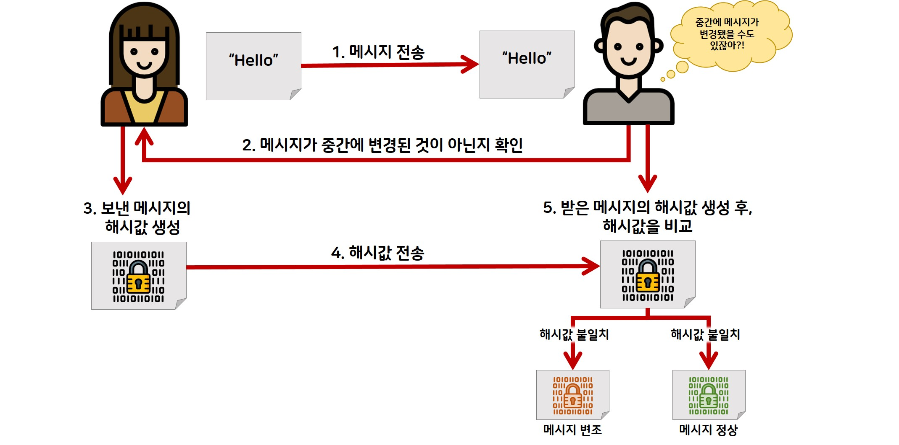
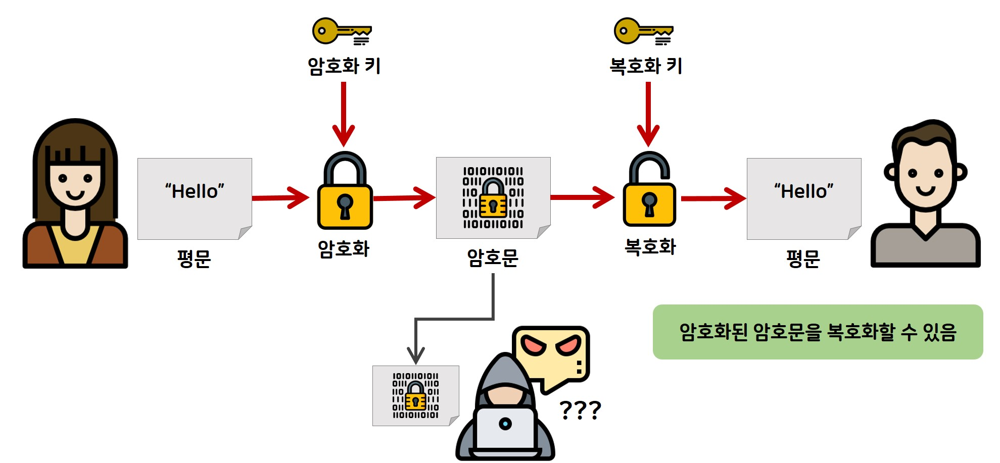

> ## 암복화, 복호화

  
단방향

- 해싱을 사용하여 암호화하는 방식. (해싱: 임의 값을 넣어도 고정된 길이의 값으로 매핑하는 알고리즘)
- 입력 받은 데이터를 알고리즘을 통해 특정한 값으로 암호화 함.
- 해싱을 통해 얻은 값은 데이터 손실이 일어나기 때문에 복호화 불가능.
- 동일한 입력은 동일한 해싱 값을 가짐. 즉, 해싱 값을 통해 기존 값을 유추할 수 있음. (해싱 값을 모아놓은 테이블 = 레인보우 테이블)
- 비밀번호 등 검증에 많이 사용되는 방식. (비밀번호 해싱 값 DB 저장. 이후 사용자 로그인 시 입력 받은 비밀번호를 해싱한 값이 DB에 저장된 값과 동일하다면 로그인 완료.)
  

  
양방향

- 키를 이용하여 입력 받은 데이터를 알고리즘을 통해 암호화, 복호화 하는 방식.
  - 대칭형: 암복화 키가 동일.
    - DES, AES, SEED 알고리즘이 대표적.
    - 비대칭키에 비해 속도가 빠름.
    - 키를 탈취 당하면 해독 당할 위험 있음.
  - 비대칭형: 암복화 키가 다름. - RSA, DSA 알고리즘이 대표적. - https 통신에서 사용하는 방식. - 대칭키에 비해 속도가 느림.
    

 
 

> ## AES

- 고급 암호화 표준이며 대칭형키 알고리즘
- 높은 안정성과 빠른 속도로 현재 가장 대중적으로 사용하고 있음.
- AES-128, AES-192, AES-256 등이 있으며 각 숫자는 키의 길이(bit)를 뜻함.
- AES의 블록 크기는 128 Bit 고정임.
- secretKey
  - 암복화에 사용되는 키.
  - AES의 숫자와 동일한 Bit를 가져야함. (영어 = 2byte = 16bit)
- Block Cipher (블록 암호)
  - 기밀성 있는 정보를 정해진 블록 단위로 암호화하는 것.
  - 평문을 블록 단위로 나누어 암호화 수행 후 합침.
- Initialization Vector (초기화 벡터)
  - 해시에서 사용하는 Salt와 비슷한 개념.
  - 동일한 입력의 암호화 값이 동일하게 나오는 것을 방지하기 위해 사용함.
  - CBC, CFB, OFB, GCM은 IV를 필요로함.
  - 첫번째 암호화 블록에 영향을 미치며, 그 이후 블록들은 이전 블록의 암호문제 영향 받음.
  - 블록 크기와 일치해야함. AES-128 이면 IV도 128Bit(byte)
- Padding (패딩)
  - 데이터 블록 길이가 블록 크기의 배수가 아닐 경우, 블록 크기의 배수로 맞추기 위해 추가하는 작업.
- Operation mode (운용모드)
  - 블록 암호를 사용할 때, 평문을 작은 블록으로 분할하고 블록 단위로 암호화를 수행하는 방법.
  - 블록을 분할하여 작은 블록 단위로 암호화함으로써 성능 및 보안 측면에서 이점 존재.
  - 대표적으로 ECB, CBC, CTR, OFB, CFB 등이 있음.

 
 

> ## SHA

- 해시를 이용한 단방향 암호화 알고리즘.
- SHA-256, SHA-512 등이 있으며 각 숫자는 해싱 값의 고정 길이(bit)를 뜻함.
- 레인보우 테이블을 방어하기 위해 Salt 방식 추가함.
  - 기존 데이터에 임의의 값을 더해 동일한 데이터라도 다른 해싱 값이 나오도록 만드는 방식.
  - DB 저장 시 해싱 값(기존 데이터 + Salt 데이터) + Salt 데이터 형식으로 저장하거나, Salt를 저장할 컬럼을 추가함.
- 해시이므로 해시 충돌이 일어날 수 있음. (DB 해시 테이블 해시 충돌 해결안 참고)
