```
kotlin : 1.8
spring boot : 3.1.3
spring security : 6.1.4
```


## Oauth2

- google, naver, kakao 연동 로그인 구현

### OAuth 서비스 등록

<details>
    <summary>google</summary>

[구글 프로젝트](https://console.cloud.google.com/apis/dashboard?project=powerful-atlas-401406)

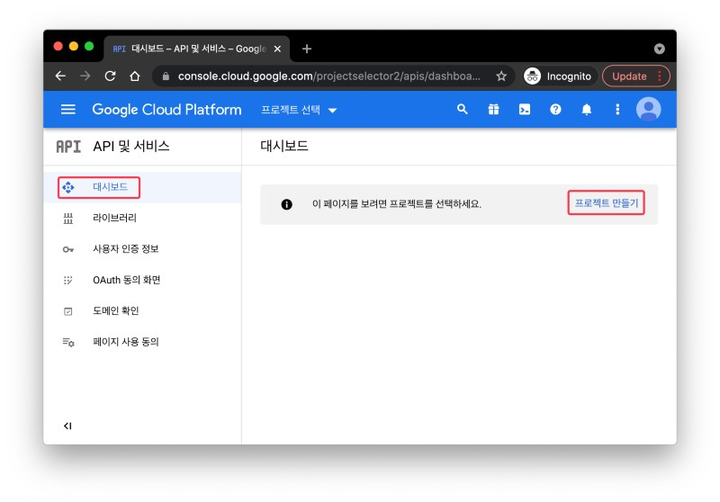
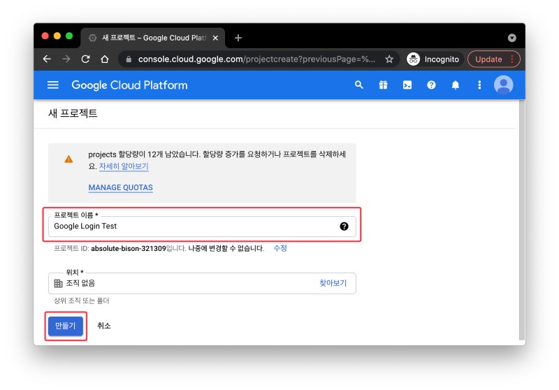


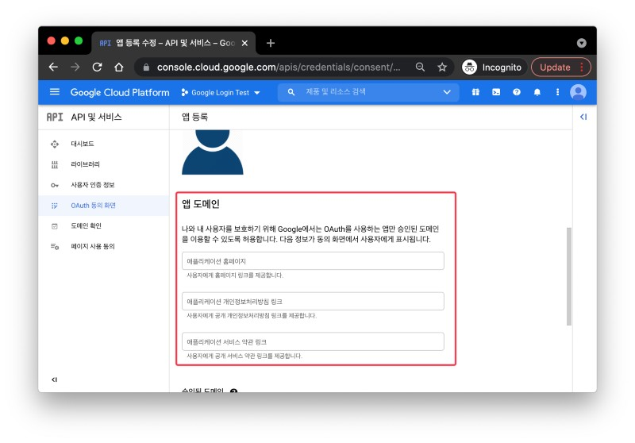


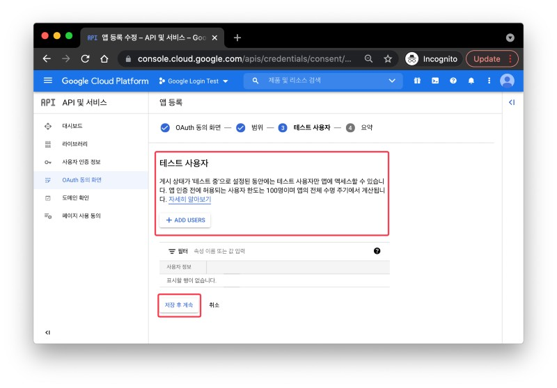

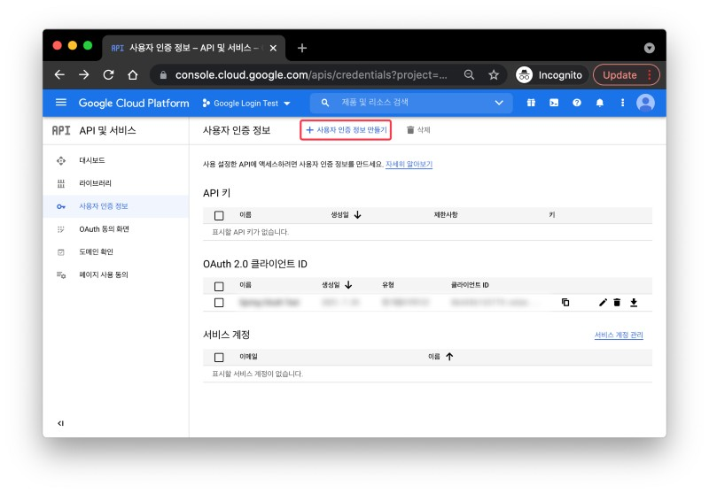

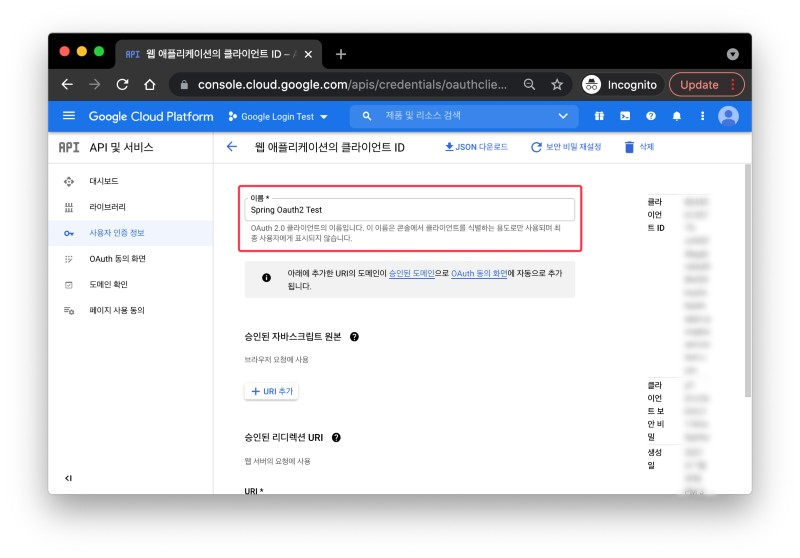
```text
http://localhost:8080/login/oauth2/code/google
```

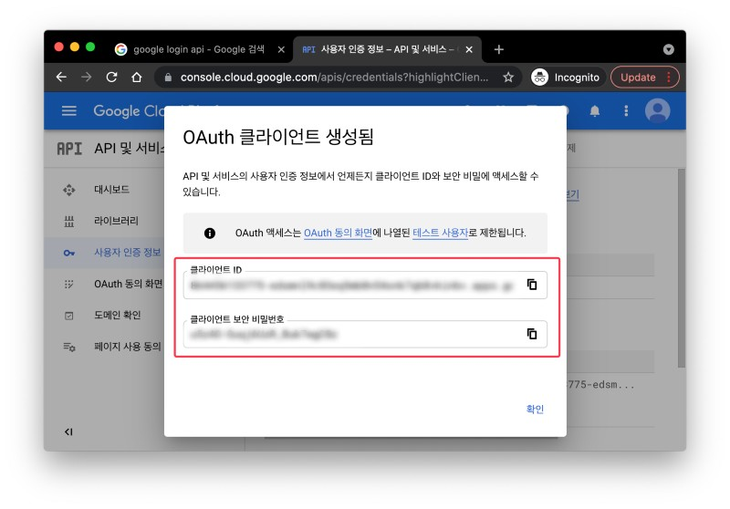

</details>

<details>
    <summary>naver</summary>

[naver](https://developers.naver.com/main/)


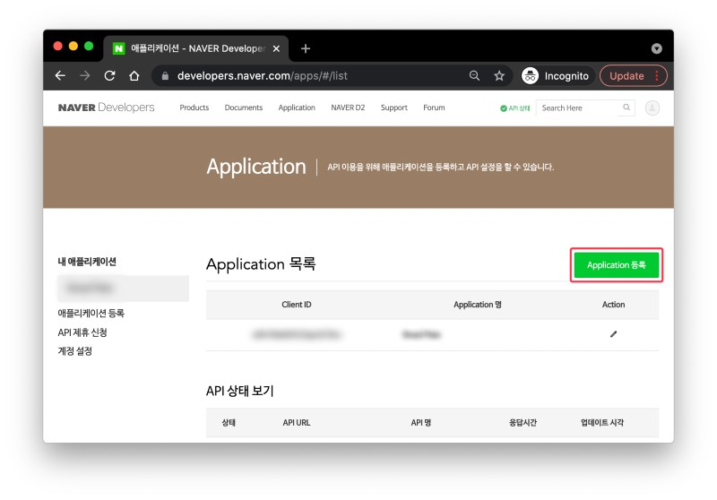

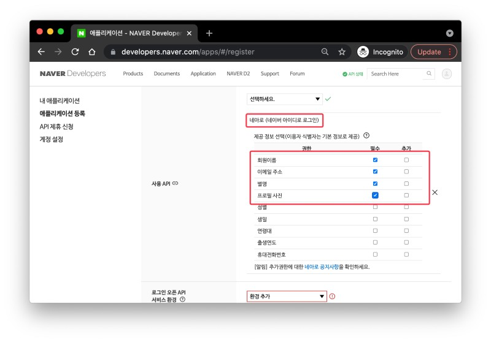
```text
서비스 URL: http://localhost:3000
Callback URL: http://localhost:8080/login/ouath2/code/naver
```


</details>

<details>
    <summary>kakao</summary>

[kakao](https://developers.kakao.com/)


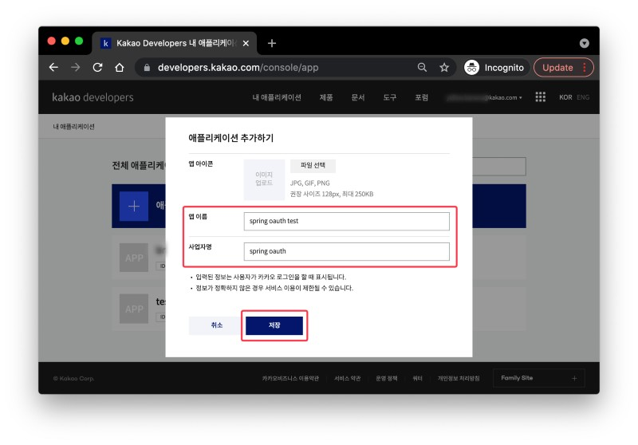


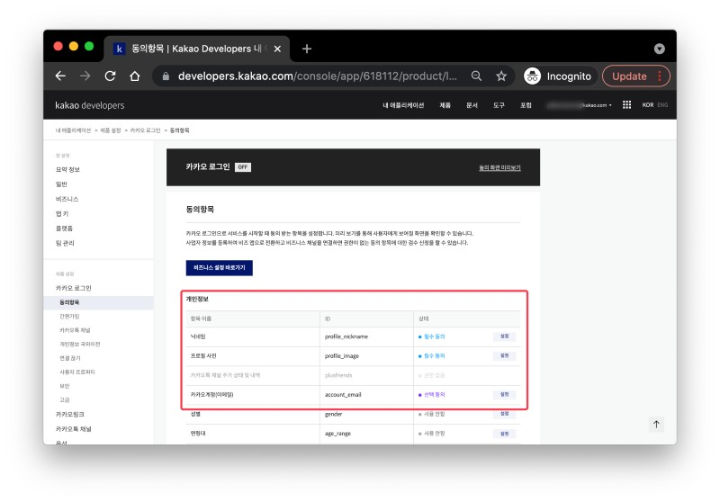

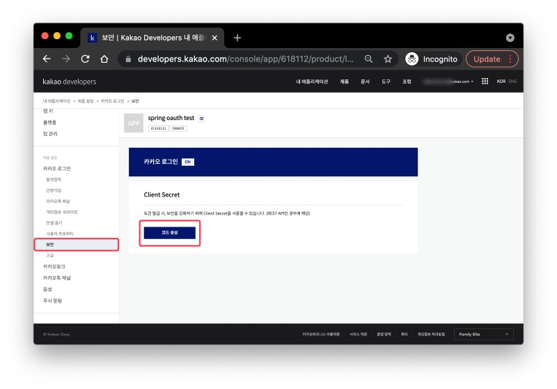


```text
http://localhost:8080/login/oauth2/code/kakao
```


</details>

### 라이브러리 및 yml

<details>
    <summary>gradle</summary>

```gradle
implementation("org.springframework.boot:spring-boot-starter-data-jpa")
implementation("org.springframework.boot:spring-boot-starter-data-redis")
implementation("org.springframework.boot:spring-boot-starter-oauth2-client")
implementation("org.springframework.boot:spring-boot-starter-security")
implementation("org.springframework.boot:spring-boot-starter-web")
implementation("com.fasterxml.jackson.module:jackson-module-kotlin")
implementation("org.jetbrains.kotlin:kotlin-reflect")
compileOnly("org.projectlombok:lombok:1.18.24")
developmentOnly("org.springframework.boot:spring-boot-devtools")
runtimeOnly("com.h2database:h2")
testImplementation("org.springframework.boot:spring-boot-starter-test")
testImplementation("org.springframework.security:spring-security-test")
testImplementation("com.h2database:h2:2.1.214")
```
</details>

<details>
    <summary>application.yaml</summary>

```yaml
spring:
  profiles:
    active:
      - local
  # h2 설정
  h2:
    console:
      enabled: true
      path: /h2-console
  datasource:
    driver-class-name: org.h2.Driver
    url: jdbc:h2:mem:test
    username: admin
    password: admin
  # JPA 설정
  jpa:
    properties:
      hibernate:
        format_sql: true
        show_sql: true
  # H2에서 JPA 사용하기 위한 설정
  sql:
    init:
      mode: always
  # security 설정
  # 구글, 페북, 깃헙 등은 spring security에서 지원함.
  # 네이버, 카카오는 지원하지 않음. 따라서 추가 설정 필요함.
  security:
    oauth2.client:
      registration:
        google:
          clientId: ${oauth2.client.google.id}
          clientSecret: ${oauth2.client.google.secret}
          scope:
            - email
            - profile
        naver:
          clientId: ${oauth2.client.naver.id}
          clientSecret: ${oauth2.client.naver.secret}
          clientAuthenticationMethod: post
          authorizationGrantType: authorization_code
          # application이 가지고 있는 기본 변수를 불러옴.
          redirectUri: "{baseUrl}/{action}/oauth2/code/{registrationId}"
          scope:
            - nickname
            - email
            - profile_image
          clientName: Naver
        kakao:
          clientId: ${oauth2.client.kakao.id}
          clientSecret: ${oauth2.client.kakao.secret}
          clientAuthenticationMethod: post
          authorizationGrantType: authorization_code
          redirectUri: "{baseUrl}/{action}/oauth2/code/{registrationId}"
          scope:
            - profile_nickname
            - profile_image
            - account_email
          clientName: Kakao
      provider:
        kakao:
          authorization_uri: https://kauth.kakao.com/oauth/authorize
          token_uri: https://kauth.kakao.com/oauth/token
          user-info-uri: https://kapi.kakao.com/v2/user/me
          # 해당 서비스에 요청하여 받은 데이터 안에는 user 정보가 있는데 이 정보를 담음 필드 명이 무엇인지 설정하는 것.
          user_name_attribute: id
        naver:
          authorization_uri: https://nid.naver.com/oauth2.0/authorize
          token_uri: https://nid.naver.com/oauth2.0/token
          user-info-uri: https://openapi.naver.com/v1/nid/me
          user_name_attribute: response

logging.level:
  org.hibernate.SQL: debug

--- #local
jpa:
  hibernate:
    ddl-auto: create-drop


--- #env
spring:
  profiles.include:
    - env
```
</details>

<details>
    <summary>application-env.yaml</summary>

```yaml
oauth2.client:
  google:
    id: google에서 받은 ID
    secret: google에서 받은 KEY
  naver:
    id: naver에서 받은 ID
    secret: naver에서 받은 KEY
  kakao:
    id: kakao에서 받은 ID
    secret: kakao에서 받은 KEY
```
</details>

### 멤버

- security 실습을 위한 도메인

<details>
    <summary>Role</summary>

- 사용자 권한

```kotlin
package com.example.kotlin.member

enum class Role(
    val key: String,
    val title: String
) {
    ADMIN("ROLE_ADMIN", "관리자"),
    USER("ROLE_USER", "사용자")
}
```
</details>

<details>
    <summary>Member</summary>

```kotlin
package com.example.kotlin.member

import jakarta.persistence.*
import java.util.*

@Entity
@Table(name = "MEMBER_TABLE")
class Member(
    @Id
    @GeneratedValue(strategy = GenerationType.UUID)
    @Column(name = "member_id", nullable = false)
    var id: UUID?,

    @Column(name = "name", nullable = false)
    var name: String?,

    @Column(name = "email")
    var email: String?,

    @Column(name = "picture")
    var picture: String?,

    @Enumerated(EnumType.STRING)
    var role: Role?

)
```
</details>

<details>
    <summary>MemberRepository</summary>

```kotlin
package com.example.kotlin.member.repository

import com.example.kotlin.member.Member
import org.springframework.data.jpa.repository.JpaRepository

interface MemberRepository : JpaRepository<Member, Long> {
    fun findByEmail(email: String): Member?
}
```
</details>

### Security

- security의 OAuth2를 사용하기 위한 설정 및 로직 구현

<details>
    <summary>Oauth2UserInfo</summary>

- OAuth2에서 가져온 사용자 정보를 담을 클래스.
- 첫 로그인의 경우 관리자는 아닐 것이라 판단하여 user로 줌

```kotlin
package com.example.kotlin.security.oauth2

import com.example.kotlin.member.Member
import com.example.kotlin.member.Role

class Oauth2UserInfo(
    val id: String?,
    val name: String?,
    val email: String?,
    val picture: String?
){
    fun toEntity(): Member {
        return Member(id=null, name=name, email=email, picture=picture, role = Role.USER)
    }
}
```
</details>

<details>
    <summary>OAuth2Attribute</summary>

- 사용자가 이용한 OAuth2 서비스가 무엇인지 판단하고, 해당 서비스의 정보를 알맞게 가져오기 위한 클래스
- naver와 kakao는 Spring Security가 제공하지 않으므로 추가 설정이 필요함.

```kotlin
package com.example.kotlin.security.oauth2

enum class OAuth2Attributes(
    val nameAttributeKey: String?,
    val oauth2UserInfo: (Map<String, Any>?) -> Oauth2UserInfo
) {
    GOOGLE("google", { map ->
        Oauth2UserInfo(
            map?.get("sub").toString(),
            map?.get("name").toString(),
            map?.get("email").toString(),
            map?.get("picture").toString()
        )
    }),

    NAVER("naver", { attributes ->
        val content = attributes?.get("response");
        val map: Map<String, Any>? = if (content is Map<*, *>) {
            content as? Map<String, Any>
        } else {
            emptyMap()
        }
        Oauth2UserInfo(
            map?.get("id").toString(),
            map?.get("nickname").toString(),
            map?.get("email").toString(),
            map?.get("profile_image").toString()
        )
    }),

    KAKAO("kakao", { attributes ->
        val content = attributes?.get("properties");
        val map: Map<String, Any>? = if (content is Map<*, *>) {
            content as? Map<String, Any>
        } else {
            emptyMap()
        }
        Oauth2UserInfo(
            map?.get("sub").toString(),
            map?.get("name").toString(),
            map?.get("account_email").toString(),
            map?.get("thumbnail_image").toString()
        )
    });

    companion object {
        fun extract(registrationId: String, attributes: Map<String, Any>?): Oauth2UserInfo? {
            return values().find { it.nameAttributeKey == registrationId }?.oauth2UserInfo?.invoke(attributes)
        }
    }
}
```
</details>

<details>
    <summary>CustomOAuth2MemberService</summary>


- 사용자가 로그인 할 때 수행할 비즈니스 로직
```kotlin
package com.example.kotlin.security.oauth2

import com.example.kotlin.member.Member
import com.example.kotlin.member.repository.MemberRepository
import jakarta.servlet.http.HttpSession
import org.springframework.security.core.authority.SimpleGrantedAuthority
import org.springframework.security.oauth2.client.userinfo.DefaultOAuth2UserService
import org.springframework.security.oauth2.client.userinfo.OAuth2UserRequest
import org.springframework.security.oauth2.client.userinfo.OAuth2UserService
import org.springframework.security.oauth2.core.OAuth2AuthenticationException
import org.springframework.security.oauth2.core.user.DefaultOAuth2User
import org.springframework.security.oauth2.core.user.OAuth2User
import org.springframework.stereotype.Service

@Service
class CustomOAuth2MemberService(
    private val memberRepository: MemberRepository,
    private val httpSession: HttpSession
): OAuth2UserService<OAuth2UserRequest, OAuth2User> {
    override fun loadUser(userRequest: OAuth2UserRequest?): OAuth2User {
        if (userRequest == null) throw OAuth2AuthenticationException("Oauth2 UserRequest Error")

        // userRequest에서 user 정보 가져오기
        val delegate = DefaultOAuth2UserService()
        val oAuth2User = delegate.loadUser(userRequest)

        // registrationId는 Oauth2 서비스 이름 (구글, 네이버, 카카오 등)
        val registrationId = userRequest.clientRegistration.registrationId
        // OAuth2 로그인 진행시 키가 되는 필드값
        val userNameAttributeName = userRequest.clientRegistration.providerDetails.userInfoEndpoint.userNameAttributeName
        // OAuth2 서비스의 유저 정보들
        val attributes = oAuth2User.attributes;
        // userInfo 추출
        val oauth2UserInfo = OAuth2Attributes.extract(registrationId,attributes)

        // 전달받은 OAuth2User의 attribute를 이용하여 회원가입 및 수정의 역할을 한다.
        val member = oauth2UserInfo?.let { saveOrUpdate(it) }

        // session에 SessionUser(user의 정보를 담는 객체)를 담아 저장한다.
//        httpSession.setAttribute("user", SessionUser(user))

        return DefaultOAuth2User(
            setOf(SimpleGrantedAuthority(member?.role?.key)),
            attributes,
            userNameAttributeName
        )
    }

    fun saveOrUpdate(oauth2UserInfo: Oauth2UserInfo): Member {
        val member = memberRepository.findByEmail(oauth2UserInfo.email?:"")
            ?: oauth2UserInfo.toEntity()

        return memberRepository.save(member)
    }
}
```
</details>

<details>
    <summary>SecurityConfig</summary>

```kotlin
package com.example.kotlin.security.config

import com.example.kotlin.security.oauth2.CustomOAuth2MemberService
import lombok.RequiredArgsConstructor
import org.springframework.context.annotation.Bean
import org.springframework.context.annotation.Configuration
import org.springframework.security.config.annotation.web.builders.HttpSecurity
import org.springframework.security.config.http.SessionCreationPolicy
import org.springframework.security.web.authentication.LoginUrlAuthenticationEntryPoint
import org.springframework.security.web.util.matcher.AntPathRequestMatcher

@Configuration
@RequiredArgsConstructor
class SecurityConfig(
    private val customOAuth2MemberService: CustomOAuth2MemberService
) {
    private val urls = arrayOf(AntPathRequestMatcher("/h2-console/**"), AntPathRequestMatcher("/api/member/signup"), AntPathRequestMatcher("/api/member/login"), AntPathRequestMatcher("/api/member/oauth2/**"))

    @Bean
    fun filterChain(http: HttpSecurity) = http
        .headers {it.frameOptions{it.disable()}}
        .csrf { it.disable() } // csrf off
        .cors { it.disable() } // cors off
        .formLogin { it.disable() } // security login page off
        .sessionManagement { it.sessionCreationPolicy(SessionCreationPolicy.NEVER) } //필요하다면 세션 생성. (API는 session이 필요 없지만 google 계정 정보를 가져오기 위해 session이 필요함)
        .authorizeHttpRequests {
            it.requestMatchers(*urls).anonymous() // [signup, login] 누구나 접근 가능
                .anyRequest().authenticated()
        } // 나머지 api 호출은 인증 받아야함
        .oauth2Login {
            it.userInfoEndpoint { point -> point.userService(customOAuth2MemberService) } // oauth2Login는 loadUser라는 함수를 호출하는게 기본임. 이를 custom하여 사용하는 것.
            it.defaultSuccessUrl("/myspace") // 성공시
            it.failureUrl("/fail") // 실패시
        }
        .exceptionHandling { it.authenticationEntryPoint(LoginUrlAuthenticationEntryPoint("/login")) } // 인증 되지 않은 사용자가 접근시 login으로 이동
        .build()!!
}
```
</details>