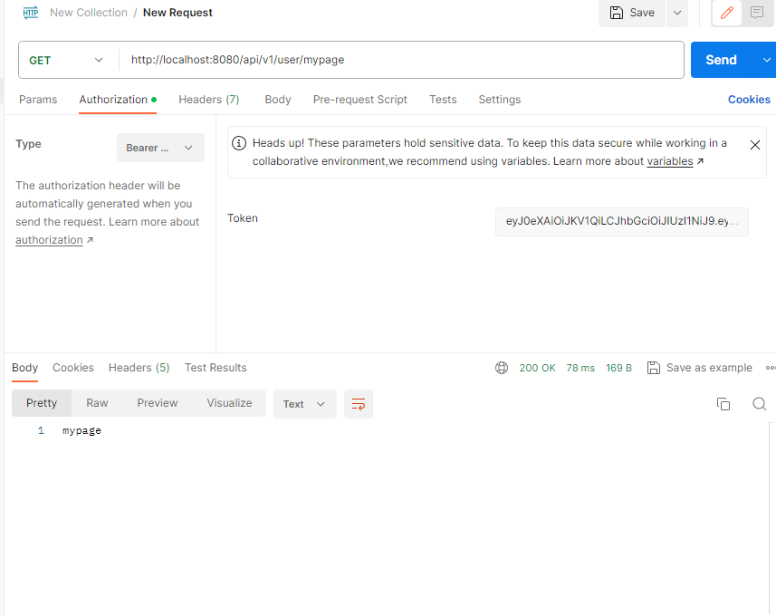

# Spring-Security

## 0. 들어가기 앞서
- Spring Security는 버전에 따라 Deprecated 된 클래스, 함수들이 존재함. 따라서 버전을 확인한 뒤, 사용해야 하는 메서드가 무엇인지 판단하기 바랍니다.
- SpringBoot : 3.1.0, SpringSecurity : 6.1.5
- [docs](https://docs.spring.io/spring-security/reference/index.html)가 가장 정확합니다.
- 구현 전 Spring Security 개념과 프로세스를 파악 해야 합니다.
- 흐름도를 참고하여 무엇을 먼저 작성해야 하는지 확인하기 바랍니다.
  


<br/>

## 1. 라이브러리 추가 및 설정

<details> 
  <summary>gradle</summary>

  ```gradle
  dependencies {
      implementation 'org.springframework.boot:spring-boot-starter-data-jpa'
	implementation 'org.springframework.boot:spring-boot-starter-security'
	implementation 'org.springframework.boot:spring-boot-starter-web'
	compileOnly 'org.projectlombok:lombok'
	developmentOnly 'org.springframework.boot:spring-boot-devtools'
	runtimeOnly 'com.h2database:h2'
	annotationProcessor 'org.projectlombok:lombok'
	testImplementation 'org.springframework.boot:spring-boot-starter-test'
	testImplementation 'org.springframework.security:spring-security-test'

	implementation 'com.fasterxml.jackson.datatype:jackson-datatype-jsr310'			// LocalDateTime 역직렬화 해결 패키지
	implementation "com.googlecode.json-simple:json-simple:1.1.1"                   // Google Simple JSON
	implementation 'com.fasterxml.jackson.core:jackson-databind'           // Jackson Databind
	implementation "io.jsonwebtoken:jjwt:0.9.1"                                     // Spring Json-Web-Token                                  // Spring Json-Web-Token
  }
  ```
</details>

<details>
  <summary>properties</summary>

  ```properties
  spring.h2.console.enabled=true
  spring.h2.console.path=/h2-console

  spring.datasource.driverClassName=org.h2.Driver
  spring.datasource.url=jdbc:h2:mem:test
  spring.datasource.username=sa
  spring.datasource.password=

  spring.sql.init.mode=always

  spring.jpa.hibernate.ddl-auto=create 
  spring.jpa.properties.hibernate.format_sql=true 
  spring.jpa.show-sql=true

  logging.level.com.security.springboot=debug
  ```

</details>


<br/>

## 2. User Domain 및 WebConfig 설정

- 로그인을 위한 유저 도메인.
- 회원 Entity, Service, Controller, Role 작성. 
- webConfig에는 정적 자원이 있는 경로를 추가. (따로 자원 서버가 있을 경우 필요 없음.) 

- <details>
    <summary>WebConfig</summary>

    ```java
    package com.security.springboot.Security.configuration;
    
    import org.springframework.context.annotation.Configuration;
    import org.springframework.core.Ordered;
    import org.springframework.web.servlet.config.annotation.ResourceHandlerRegistry;
    import org.springframework.web.servlet.config.annotation.ViewControllerRegistry;
    import org.springframework.web.servlet.config.annotation.WebMvcConfigurer;
    
    @Configuration
    public class WebMvcConfig implements WebMvcConfigurer {
    
        // 정적 자원 경로
        private static final String[] CLASSPATH_RESOURCE_LOCATIONS = {"classpath:/static/", "classpath/public", "classpath:/",
                "classpath:/resources/", "classpath:/META-INF/resources/", "classpath:/META-INF/resources/webjars/" };
    
        // 정적 자원 경로 추가
        @Override
        public void addResourceHandlers(ResourceHandlerRegistry registry){
            registry.addResourceHandler("/**").addResourceLocations(CLASSPATH_RESOURCE_LOCATIONS);
        }
    }
    ```
  </details>

- <details>
    <summary>UserRole</summary>
    
    ```java
    package com.security.springboot.domain.User.Role;

    import lombok.AllArgsConstructor;
    import lombok.Getter;

    @AllArgsConstructor
    @Getter
    public enum UserRole {
        ROLE_USER("ROLE_USER"),
        ROLE_ADMIN("ROLE_ADMIN");

        private final String position;
    }    
    ```
  </details>
- <details>
    <summary>CommonEntity</summary>

    ```java
    package com.security.springboot.domain.Common;
  
    import jakarta.persistence.*;
    import lombok.Getter;
    import lombok.NoArgsConstructor;
    import lombok.Setter;
    import org.hibernate.annotations.CreationTimestamp;
    import org.hibernate.annotations.UpdateTimestamp;
  
    import java.io.Serializable;
    import java.time.LocalDateTime;
  
    @MappedSuperclass // JPA에서 공통 매핑 정보 클래스를 사용할 때, 공통 속성만 받아서 사용하게 해주는 어노테이션
    @Getter
    @NoArgsConstructor
    public abstract class CommonEntity implements Serializable {
  
        @Id
        @GeneratedValue(strategy = GenerationType.IDENTITY)
        @Column
        private Long id;
  
        @JsonSerialize(using = LocalDateTimeSerializer.class)
        @JsonDeserialize(using = LocalDateTimeDeserializer.class)
        @CreationTimestamp
        @Column(nullable = false, length = 20, updatable = false)
        private LocalDateTime createdAt;
  
        @JsonSerialize(using = LocalDateTimeSerializer.class)
        @JsonDeserialize(using = LocalDateTimeDeserializer.class)
        @UpdateTimestamp
        @Column(length = 20)
        private LocalDateTime updateAt;
  
        @Setter
        @Column(nullable = false, columnDefinition = "BOOLEAN DEFAULT true")
        private Boolean IsEnable = true;
    }
    ```
  
  </details>
- <details>
    <summary>UserEntity</summary>
  
    ```java
    package com.security.springboot.domain.User.Model;

    import com.security.springboot.Security.Role.UserRole;
    import com.security.springboot.domain.Common.CommonEntity;
    import jakarta.persistence.*;
    import lombok.Builder;
    import lombok.Getter;
    import lombok.NoArgsConstructor;

    import java.io.Serializable;

    @NoArgsConstructor
    @Entity
    @Table(name = "users")
    @Getter
    public class UserEntity extends CommonEntity implements Serializable{

        @Column(nullable = false, unique = true, length = 50)
        private String userEmail;

        @Column(nullable = false)
        private String userPw;

        @Column(nullable = false, length =50)
        @Enumerated(EnumType.STRING)
        private UserRole role;

        @Builder
        public UserEntity(String userEmail, String userPw, UserRole role){
            this.userEmail = userEmail;
            this.userPw = userPw;
            this.role = role;
        }

    }
    ```
  
  </details>
- <details>
    <summary>UserRepository</summary>

    ```java
    package com.security.springboot.domain.User.repository;
    
    import com.security.springboot.domain.User.Model.UserEntity;
    import org.springframework.data.jpa.repository.JpaRepository;
    import org.springframework.stereotype.Repository;
    
    import java.util.Optional;
    
    @Repository
    public interface UserRepository extends JpaRepository<UserEntity, Long> {
    
        UserEntity findByUserEmailAndUserPw(String userId, String userPw);
    
        Optional<UserEntity> findByUserEmail(String userEmail);
    }
    ```

  </details>
- <details>
    <summary>UserVO</summary>

    ```java
    package com.security.springboot.domain.User.Model;
    
    import com.security.springboot.domain.User.Role.UserRole;
    import lombok.Data;
    
    @NoArgsConstructor
    @Data
    public class UserVO {
        private Long id;
        private String userEmail;
        private String userPw;
        private UserRole role;
    
        public UserVO(UserEntity userEntity) {
            this.id = userEntity.getId();
            this.userEmail = userEntity.getUserEmail();
            this.userPw = userEntity.getUserPw();
            this.role = userEntity.getRole();
        }
    
        public UserEntity makeUserEntity() {
            return UserEntity.builder().userEmail(this.userEmail).userPw(this.userPw).role(this.role).build();
        }
    }
    
    ```
  
  </details>
- <details>
    <summary>UserService</summary>

    ```java
    package com.security.springboot.domain.User.Service;
    
    import com.security.springboot.domain.User.Model.UserVO;
    
    // 유저 서비스
    public interface UserService  {
        // 로그인
        UserVO login(UserVO userVO);
    
        // 회원가입
        UserVO createUser(UserVO userVO);
    
        // 아이디로 유저 찾기
        UserVO findUserByUserEmail(String userId);
    }    
    ```

  </details>
- <details>
    <summary>UserServiceImpl</summary>

    ```java
    package com.security.springboot.domain.User.Service;
    import com.security.springboot.domain.User.Model.UserEntity;
    import com.security.springboot.domain.User.Model.UserVO;
    import com.security.springboot.domain.User.repository.UserRepository;
    import lombok.RequiredArgsConstructor;
    import org.springframework.security.core.userdetails.UsernameNotFoundException;
    import org.springframework.stereotype.Service;
    
    import java.util.Optional;
    
    @RequiredArgsConstructor
    @Service
    public class UserServiceImpl implements UserService {
    
        private final UserRepository userRepository;
    
        @Override
        public UserVO login(UserVO userVO) {
            UserEntity userEntity = userRepository.findByUserEmailAndUserPw(userVO.getUserEmail(), userVO.getUserPw());
            return new UserVO(userEntity);
        }
    
        @Override
        public UserVO createUser(UserVO userVO) {
            return new UserVO(userVO.makeUserEntity());
        }
    
        @Override
        public UserVO findUserByUserEmail(String userId) {
            Optional<UserEntity> userEntityOptional = userRepository.findByUserEmail(userId);
            UserEntity userEntity = userEntityOptional.orElseThrow(() -> new UsernameNotFoundException(userId)); // user을 찾지 못했을 경우 예외 처리
            return new UserVO(userEntity);
        }
    }
    ```
  </details>


<br/>

## 3. Security 프로세스 구현

- Security를 이용한 로그인 프로세스를 흐름도에 맞춰 구현하겠음.
- securityConfig는 제일 마지막에 구현해야 오류 표시 안나고 편함.

<details>
    <summary>UserDetailsVO</summary>

- 인증된 객체에 넣을 UserDetailsVO.
- Principal로 사용.
- 딱히 수정 될 일이 없기 때문에 VO로 만듬.
- 현재 UserDetailsVO 필드에 UserEntity를 넣음으로서 모든 정보를 넣고 있는데, 상황에 따라 필요한 정보만 넣는 걸 추천.

  ```java
  package com.security.springboot.domain.User.Model;
  
  import lombok.Getter;
  import lombok.RequiredArgsConstructor;
  import lombok.experimental.Delegate;
  import org.springframework.security.core.GrantedAuthority;
  import org.springframework.security.core.userdetails.UserDetails;
  
  import java.util.Collection;
  
  @RequiredArgsConstructor
  @Getter
  public class UserDetailsVO implements UserDetails {
  
      // UserEntity 메소드를 UserDetailVO 객체로 위임 시키는 어노테이션
      // 즉, UserEntity의 메소드를 자신이 바로 사용할 수 있음.
      @Delegate
      private final UserEntity userEntity;
      private final Collection<? extends GrantedAuthority> authorities;
  
      @Override
      public Collection<? extends GrantedAuthority> getAuthorities() {
          return authorities;
      }
  
      @Override
      public String getPassword() {
          return userEntity.getUserPw();
      }
  
      @Override
      public String getUsername() {
          return userEntity.getUserEmail();
      }
  
      @Override
      public boolean isAccountNonExpired() {
          return userEntity.getIsEnable(); // 또는 true 
      }
  
      @Override
      public boolean isAccountNonLocked() {
          return userEntity.getIsEnable(); // 또는 true
      }
  
      @Override
      public boolean isCredentialsNonExpired() {
          return userEntity.getIsEnable(); // 또는 true
      }
  
      @Override
      public boolean isEnabled() {
          return userEntity.getIsEnable(); // 또는 true
      }
  } 
  ```

</details>

<details>
    <summary>UserDetailsServiceImpl</summary>

- DB에 저장된 사용자 정보를 조회하고 이를 UserDetails로 변환.

    ```java
    package com.security.springboot.domain.User.Service;
    
    import com.security.springboot.domain.User.Model.UserDetailsVO;
    import com.security.springboot.domain.User.repository.UserRepository;
    import lombok.RequiredArgsConstructor;
    import org.springframework.security.core.authority.SimpleGrantedAuthority;
    import org.springframework.security.core.userdetails.UserDetails;
    import org.springframework.security.core.userdetails.UserDetailsService;
    import org.springframework.security.core.userdetails.UsernameNotFoundException;
    import org.springframework.stereotype.Service;
    
    import java.util.Collections;
    
    @Service
    @RequiredArgsConstructor
    public class UserDetailsServiceImpl implements UserDetailsService {
    
        private final UserRepository userRepository;
    
        @Override
        public UserDetails loadUserByUsername(String userEmail) throws UsernameNotFoundException {
            return userRepository.findByUserEmail(userEmail)
                    .map(user -> new UserDetailsVO(user, Collections.singleton(new SimpleGrantedAuthority(user.getRole().getPosition()))))
                    .orElseThrow(()-> new UsernameNotFoundException(userEmail));
        }
    }
    ```

</details>

<details>
  <summary>ConvertUtil</summary>

- JSON <-> 객체 메소드

  ```java
  package com.security.springboot.utils;
  
  import com.fasterxml.jackson.core.JsonProcessingException;
  import com.fasterxml.jackson.databind.ObjectMapper;
  import org.json.simple.JSONObject;
  import org.json.simple.parser.JSONParser;
  import org.json.simple.parser.ParseException;
  
  import java.lang.reflect.Field;
  import java.lang.reflect.Method;
  import java.util.HashMap;
  import java.util.Map;
  
  public class ConvertUtil {
  
      /**
       * [공통함수] Object 형을 Map 형태로 변환 함수
       *
       * @param obj {Object}
       * @return Map 형태로 반환함
       */
      public static HashMap<String, Object> convertObjectToMap(Object obj) {
          try {
              Field[] fields = obj.getClass().getDeclaredFields();
              HashMap<String, Object> resultMap = new HashMap<String, Object>();
              for (int i = 0; i <= fields.length - 1; i++) {
                  fields[i].setAccessible(true);
                  resultMap.put(fields[i].getName(), fields[i].get(obj));
              }
              return resultMap;
          } catch (IllegalArgumentException | IllegalAccessException e) {
              e.printStackTrace();
          }
          return null;
      }
  
      /**
       * [공통함수] Map 형을 JSON Object 형태로 변환 함수
       *
       * @param param {Map}
       * @return {JSONObject}
       */
      public static JSONObject convertMapToJsonObject(Map<String, Object> param) {
          return new JSONObject(param);
      }
  
      /**
       * [공통함수] Map 형을 Object 형태로 변환 함수
       *
       * @param map {Map<String, Object}
       * @param obj {Object}
       * @return {Object}
       */
      public static Object convertMapToObject(Map<String, Object> map, Object obj) {
          String keyAttribute = null;
          String setMethodString = "set";
          String methodString = null;
  
          for (String s : map.keySet()) {
              keyAttribute = s;
              methodString = setMethodString + keyAttribute.substring(0, 1).toUpperCase() + keyAttribute.substring(1);
              Method[] methods = obj.getClass().getDeclaredMethods();
              for (Method method : methods) {
                  if (methodString.equals(method.getName())) {
                      try {
                          method.invoke(obj, map.get(keyAttribute));
                      } catch (Exception ignored) {
                      }
                  }
              }
          }
          return obj;
      }
  
  
      /**
       * [공통함수] Object(VO)형을 JSON Object 형태로 변환 함수
       *
       * @param obj {Object}
       * @return {Object}
       */
      public static Object convertObjectToJsonObject(Object obj) {
  
          ObjectMapper om = new ObjectMapper();
          JSONParser parser = new JSONParser();
          String convertJsonString = "";
          Object convertObj = new Object();
  
          // VO ==> JSON(String) 파싱
          try {
              convertJsonString = om.writeValueAsString(obj);
          } catch (JsonProcessingException e) {
              e.printStackTrace();
          }
          // JSON(String) => JSON 파싱
          try {
              convertObj = parser.parse(convertJsonString);
          } catch (ParseException e) {
              e.printStackTrace();
          }
          return convertObj;
      }
  
  }
  ```

</details>

<details> 
    <summary> CustomAuthenticationFilter </summary>

- 커스텀 필터는 UsernamePasswordAuthenticationFilter 이전에 적용해야 에러가 나지 않는다.
- 반환한 UsernamePasswordAuthenticationToken는 SecurityContext에 자동 등록된다.

    ```java
    package com.security.springboot.Security.filter;

    import com.fasterxml.jackson.core.JsonParser;
    import com.fasterxml.jackson.databind.ObjectMapper;
    import com.security.springboot.domain.User.Model.UserVO;
    import jakarta.servlet.http.HttpServletRequest;
    import jakarta.servlet.http.HttpServletResponse;
    import lombok.NoArgsConstructor;
    import lombok.extern.slf4j.Slf4j;
    import org.springframework.security.authentication.AuthenticationManager;
    import org.springframework.security.authentication.UsernamePasswordAuthenticationToken;
    import org.springframework.security.core.Authentication;
    import org.springframework.security.core.AuthenticationException;
    import org.springframework.security.core.userdetails.UsernameNotFoundException;
    import org.springframework.security.web.authentication.UsernamePasswordAuthenticationFilter;
    
    @NoArgsConstructor
    @Slf4j
    public class CustomAuthenticationFilter extends UsernamePasswordAuthenticationFilter {
    
        public CustomAuthenticationFilter(AuthenticationManager authenticationManager) {
            super.setAuthenticationManager(authenticationManager);
        }
    
        @Override
        public Authentication attemptAuthentication(HttpServletRequest request, HttpServletResponse response) throws AuthenticationException {
            UsernamePasswordAuthenticationToken authRequest; // [STEP.01] 사용자가 보낸 값을 넣을 인증 판별 객체 생성
    
            try {
                authRequest= getAuthRequest(request); // [STEP.02] 사용자가 보낸 값 UsernamePasswordAuthenticationToken으로 변환
                setDetails(request, authRequest); // [STEP.03] UsernamePasswordAuthenticationToken에 추가 정보 설정 ex) ip, session ID...
            } catch (Exception e) {
                throw new RuntimeException(e);
            }
            return this.getAuthenticationManager().authenticate(authRequest); // [STEP.05] manager에 인증 전 객체 전달하여 판단 위임 후 결과만 받아옴.
        }
    
        //사용자가 보낸 요청에서 유저 아이디와 비밀번호 추출 하는 메서드
        private UsernamePasswordAuthenticationToken getAuthRequest(HttpServletRequest request) throws Exception {
            try {
                ObjectMapper objectMapper = new ObjectMapper();
                objectMapper.configure(JsonParser.Feature.AUTO_CLOSE_SOURCE, true);
                UserVO userVO = objectMapper.readValue(request.getInputStream(), UserVO.class);
                log.debug("1.CustomAuthenticationFilter :: user Email : " + userVO.getUserEmail() + " userPw:" + userVO.getUserPw());
    
                return new UsernamePasswordAuthenticationToken(userVO.getUserEmail(), userVO.getUserPw());
            } catch (UsernameNotFoundException ae) {
                throw new UsernameNotFoundException(ae.getMessage());
            } catch (Exception e) {
                throw new Exception(e.getMessage(), e.getCause());
            }
        }
    }
    ```

</details>

<details>
    <summary>CustomAuthenticationProvider</summary>

- Filter 후 생성된 토큰을 받아 비즈니스 로직 처리
- 전달 받은 usernamePasswordToken을 순차적으로 Provider들에게 전달.
- 실제 인증 과정을 수행. (Authenticate 함수에 작성)
- 해당 Provider를 SecurityConfig에서 Bena 등록해주어야 함.

    ```java
    package com.security.springboot.Security.Provider;
    
    import com.security.springboot.domain.User.Model.UserDetailsVO;
    import lombok.extern.slf4j.Slf4j;
    import org.springframework.beans.factory.annotation.Autowired;
    import org.springframework.security.authentication.AuthenticationProvider;
    import org.springframework.security.authentication.BadCredentialsException;
    import org.springframework.security.authentication.UsernamePasswordAuthenticationToken;
    import org.springframework.security.core.Authentication;
    import org.springframework.security.core.AuthenticationException;
    import org.springframework.security.core.userdetails.UserDetailsService;
    import org.springframework.security.crypto.bcrypt.BCryptPasswordEncoder;
    
    @Slf4j
    public class CustomAuthenticationProvider implements AuthenticationProvider {
    
        @Autowired
        private UserDetailsService userDetailsService;
        @Autowired
        private BCryptPasswordEncoder passwordEncoder;
    
    
        @Override
        public Authentication authenticate(Authentication authentication) throws AuthenticationException {
            UsernamePasswordAuthenticationToken token = (UsernamePasswordAuthenticationToken) authentication; // [STEP.01] Filter에서 받은 인증 전 객체를 형 변환.
            String userEmail = token.getName(); // [STEP.02] 토큰에서 아이디 추출.
            String userPw = (String) token.getCredentials(); // [STEP.03] 토큰에서 비밀번호를 추출.
    
            log.debug("2.CustomAutenticationProvider userEmail = {}, UserPw = {}",userEmail, userPw);
    
            UserDetailsVO userDetailsVO = (UserDetailsVO) userDetailsService.loadUserByUsername(userEmail); // [STEP.04] 이메일로 사용자 정보 Details로 추출
    
            // [STEP.05] DB에 있던 비밀번호와 사용자가 보낸 비밀번호가 다를 경우 에러.
            // 실제로 가입할 때 passwordEncoder로 변환하여 DB에 저장해야하나 더미 데이터를 변환하지 않았기 때문에 바로 비교함.
            if(!userPw.equals(userDetailsVO.getPassword())) {
                throw new BadCredentialsException(userDetailsVO.getUsername());
            }
    //        if(!passwordEncoder.matches(userPw, userDetailsVO.getPassword())) {
    //            throw new BadCredentialsException(userDetailsVO.getUsername());
    //        }
    
            return new UsernamePasswordAuthenticationToken(userDetailsVO, userPw, userDetailsVO.getAuthorities()); // [STEP.06] 인증 완료한 객체(UsernamePasswordAuthenticationToken)로 만들고 반환
        }
    
        @Override
        public boolean supports(Class<?> authentication) {
            return authentication.equals(UsernamePasswordAuthenticationToken.class);
        }
    }
    
    ```
</details>

<details>
    <summary>CustomLoginSuccessHandler</summary>

- Filter로 사용자 인증이 성공적으로 완료된 이후 처리할 로직 

    ```java
    package com.security.springboot.Security.handler;
    
    import com.security.springboot.domain.User.Model.UserDetailsVO;
    import com.security.springboot.domain.User.Model.UserEntity;
    import com.security.springboot.domain.User.Role.UserRole;
    import com.security.springboot.utils.ConvertUtil;
    import jakarta.servlet.ServletException;
    import jakarta.servlet.http.HttpServletRequest;
    import jakarta.servlet.http.HttpServletResponse;
    import lombok.extern.slf4j.Slf4j;
    import org.json.simple.JSONObject;
    import org.springframework.security.core.Authentication;
    import org.springframework.security.web.authentication.AuthenticationSuccessHandler;
    
    import java.io.IOException;
    import java.io.PrintWriter;
    import java.util.HashMap;
    
    // 인증(로그인) 성공한 이후 추가 처리 로직.
    @Slf4j
    public class CustomLoginSuccessHandler implements AuthenticationSuccessHandler {
        @Override
        public void onAuthenticationSuccess(HttpServletRequest request, HttpServletResponse response, Authentication authentication) throws IOException, ServletException {
            log.debug("3.CustomLoginSuccessHandler");
    
            JSONObject jsonObject; // response로 내보려는 정보를 담은 Json 객체
            HashMap<String, Object> responseMap = new HashMap<>(); // response 할 데이터를 담기 위한 맵
            UserEntity userEntity = ((UserDetailsVO) authentication.getPrincipal()).getUserEntity(); // 사용자와 관련된 정보 조회
            JSONObject userEntityJson = (JSONObject) ConvertUtil.convertObjectToJsonObject(userEntity); // 사용자 정보 Json 객체로 변환
    
            if (userEntity.getRole() == UserRole.ADMIN) {
                responseMap.put("userInfo", userEntityJson); // 유저 정보 Json 형식으로 넣기
                responseMap.put("msg", "관리자 로그인 성공");
            } else {
                responseMap.put("userInfo", userEntityJson); // 유저 정보 Json 형식으로 넣기
                responseMap.put("msg", "일반 사용자 로그인 성공");
            }
    
            jsonObject = new JSONObject(responseMap);
            response.setCharacterEncoding("UTF-8");
            response.setContentType("application/json");
            PrintWriter printWriter = response.getWriter();
            printWriter.print(jsonObject);
            printWriter.flush();
            printWriter.close();
    
        }
    
    }
    ```
</details>

<details>
    <summary>CustomLoginFailureHandler</summary>

- Filter에서 인증 실패 후 처리할 로직

    ```java
    package com.security.springboot.Security.handler;
    
    import jakarta.servlet.ServletException;
    import jakarta.servlet.http.HttpServletRequest;
    import jakarta.servlet.http.HttpServletResponse;
    import lombok.extern.slf4j.Slf4j;
    import org.json.simple.JSONObject;
    import org.springframework.security.core.AuthenticationException;
    import org.springframework.security.web.authentication.AuthenticationFailureHandler;
    
    import java.io.IOException;
    import java.io.PrintWriter;
    import java.util.HashMap;
    
    @Slf4j
    public class CustomLoginFailureHandler implements AuthenticationFailureHandler {
        @Override
        public void onAuthenticationFailure(HttpServletRequest request, HttpServletResponse response, AuthenticationException exception) throws IOException, ServletException {
            log.debug("3.CustomLoginFailsHandler");
    
            response.setCharacterEncoding("UTF-8");
            response.setContentType("application/json");
            PrintWriter printWriter = response.getWriter();
    
            JSONObject jsonObject; // response로 내보려는 정보를 담은 Json 객체
            HashMap<String, Object> responseMap = new HashMap<>(); // response 할 데이터를 담기 위한 맵
            responseMap.put("msg", "로그인 실패");
    
            jsonObject = new JSONObject(responseMap);
            printWriter.print(jsonObject);
            printWriter.flush();
            printWriter.close();
        }
    }
    ```

</details>

<details>
    <summary>SecurityConfig</summary>

- 인증과 인가 설정을 담당하며 security 활성화 시킴.
- 사용자가 만든 필터, 어드바이저, 핸들러를 등록하거나, 추가적인 설정을 등록할 수 있는 클래스.
- 클래스명은 상관 없음.

  ```java
  package com.security.springboot.Security.configuration;
  
  import com.security.springboot.Security.Provider.CustomAuthenticationProvider;
  import com.security.springboot.Security.filter.CustomAuthenticationFilter;
  import com.security.springboot.Security.handler.CustomLoginFailureHandler;
  import com.security.springboot.Security.handler.CustomLoginSuccessHandler;
  import com.security.springboot.jwt.JwtAuthorizationFilter;
  import lombok.RequiredArgsConstructor;
  import org.springframework.boot.autoconfigure.security.servlet.PathRequest;
  import org.springframework.context.annotation.Bean;
  import org.springframework.context.annotation.Configuration;
  import org.springframework.security.authentication.AuthenticationManager;
  import org.springframework.security.authentication.ProviderManager;
  import org.springframework.security.config.annotation.web.builders.HttpSecurity;
  import org.springframework.security.config.annotation.web.configuration.EnableWebSecurity;
  import org.springframework.security.config.annotation.web.configuration.WebSecurityCustomizer;
  import org.springframework.security.config.annotation.web.configurers.AbstractHttpConfigurer;
  import org.springframework.security.config.http.SessionCreationPolicy;
  import org.springframework.security.core.userdetails.UserDetailsService;
  import org.springframework.security.crypto.bcrypt.BCryptPasswordEncoder;
  import org.springframework.security.web.SecurityFilterChain;
  import org.springframework.security.web.authentication.UsernamePasswordAuthenticationFilter;
  import org.springframework.security.web.authentication.www.BasicAuthenticationFilter;
  import org.springframework.security.web.util.matcher.AntPathRequestMatcher;
  
  @Configuration
  @EnableWebSecurity
  @RequiredArgsConstructor
  public class SecurityConfig {
  
      // 패스워드 인코더
      @Bean
      public BCryptPasswordEncoder bCryptPasswordEncoder() {
          return new BCryptPasswordEncoder();
      }
  
      // [STEP.01] customAuthenticationProvider 생성
      @Bean
      public CustomAuthenticationProvider customAuthenticationProvider() {
          return new CustomAuthenticationProvider();
      }
  
      // [STEP.02] authenticationManager 생성
      @Bean
      public AuthenticationManager authenticationManager() {
          return new ProviderManager(customAuthenticationProvider());
      }
  
      // [STEP.03] CustomLoginFailureHandler 생성
      @Bean
      public CustomLoginFailureHandler customLoginFailureHandler() {
          return new CustomLoginFailureHandler();
      }
  
      // [STEP.04] CustomLoginFailureHandler 생성
      @Bean
      public CustomLoginSuccessHandler customLoginSuccessHandler() {
          return new CustomLoginSuccessHandler();
      }
  
      // [STEP.05] customAuthenticationFilter 생성
      @Bean
      public CustomAuthenticationFilter customAuthenticationFilter() {
          CustomAuthenticationFilter customAuthenticationFilter = new CustomAuthenticationFilter(authenticationManager());
          customAuthenticationFilter.setFilterProcessesUrl("/api/v1/user/login");     // 접근 URL
          customAuthenticationFilter.setAuthenticationSuccessHandler(customLoginSuccessHandler());    // '인증'(로그인) 성공 시 해당 핸들러로 처리를 전가한다.
          customAuthenticationFilter.setAuthenticationFailureHandler(customLoginFailureHandler());    // '인증'(로그인) 실패 시 해당 핸들러로 처리를 전가한다.
          customAuthenticationFilter.afterPropertiesSet();
          return customAuthenticationFilter;
      }
  
      // [STEP.06] filterChain 생성
      @Bean
      public SecurityFilterChain filterChain(HttpSecurity http) throws Exception {
          return http
                  .csrf(AbstractHttpConfigurer::disable) // csrf 공격 보호 옵션 끄기. (rest api 에서는 필요 없기 때문)
                  .cors(AbstractHttpConfigurer::disable) // cors 예방 옵션 끄기
                  .headers(AbstractHttpConfigurer::disable) // h2 접근을 위해 사용. 다른 db 사용시 제거
                  .formLogin(AbstractHttpConfigurer::disable) // form bases authentication 비활성화 (기본 로그인 페이지 비활성화, UsernamePasswordAuthenticationFilter 비활성화, rest api만 작성하기 때문에 필요없음.)
                  .httpBasic(AbstractHttpConfigurer::disable) // http basic authentication 비활성화 (기본 로그인 인증창 비활성화, BasicAuthenticationFilter 비활성화, rest api만 작성하기 때문에 필요없음.)
                  .authorizeHttpRequests(request->
                      request.requestMatchers(PathRequest.toStaticResources().atCommonLocations()).permitAll() // 정적 자원 경로 인증, 권한 상관없이 누구나 접근 허용
                              .requestMatchers(new AntPathRequestMatcher("/"),new AntPathRequestMatcher("/swagger-ui/**"),new AntPathRequestMatcher("/h2-console/**")).permitAll() // 해당 페이지 인증, 권한 상관 없이 누구나 접근 허용
                              .requestMatchers(new AntPathRequestMatcher("/api/v1/admin/**")).hasRole("ADMIN") // 해당 페이지는 인증된 사람 중 ADMIN 권한이 있는 자만 접근 허용. 여기서 Enum엔 ROLE_ADMIN으로 되어있는데 ROLE_이 자동으로 앞에 붙기 때문에 Enum에서 ROLE_을 앞에 붙힌것이다.
                              .requestMatchers(new AntPathRequestMatcher("/api/v1/user/**")).hasAnyRole("ADMIN", "USER") // 해당 페이지 인증된 사랑 중 ADMIN 또는 USER 권한이 있는 자만 접근 허용.
                              .anyRequest().authenticated() // 나머지 페이지는 권한 상관없이 인증된 사람만 접근 가능.
                  ) // 특정 페이지 접근 시 사용자 권한 확인 설정
                  .addFilterBefore(customAuthenticationFilter(), UsernamePasswordAuthenticationFilter.class) // UsernamePasswordAuthenticationFilter 실행 전 순서에 커스텀 필터 추가
                  .build();
      }
  
  
  
  }
  ```
</details>
<details>
    <summary>결과</summary>


</details>

<br/>

## 기타
<details>
    <summary>H2 사용시 설정</summary>

- Security 적용 후 Web에서 확인하려면 추가 설정이 필요함.
    
  ```java
  @Bean
  public SecurityFilterChain filterChain(HttpSecurity http) throws Exception {
      return http
              .csrf(AbstractHttpConfigurer::disable) // csrf 공격 보호 옵션 끄기. (rest api 에서는 필요 없기 때문)
              .cors(AbstractHttpConfigurer::disable) // cors 예방 옵션 끄기
              .headers(AbstractHttpConfigurer::disable) // h2 접근을 위해 사용. 다른 db 사용시 제거
              .formLogin(AbstractHttpConfigurer::disable) // form bases authentication 비활성화 (기본 로그인 페이지 비활성화, UsernamePasswordAuthenticationFilter 비활성화, rest api만 작성하기 때문에 필요없음.)
              .httpBasic(AbstractHttpConfigurer::disable) // http basic authentication 비활성화 (기본 로그인 인증창 비활성화, BasicAuthenticationFilter 비활성화, rest api만 작성하기 때문에 필요없음.)
              .authorizeHttpRequests(request->
                  request.requestMatchers(PathRequest.toStaticResources().atCommonLocations()).permitAll() // 정적 자원 경로 인증, 권한 상관없이 누구나 접근 허용
                          .requestMatchers(new AntPathRequestMatcher("/"),new AntPathRequestMatcher("/swagger-ui/**"),new AntPathRequestMatcher("/h2-console/**")).permitAll() // 해당 페이지 인증, 권한 상관 없이 누구나 접근 허용
                          .anyRequest().authenticated() // 나머지 페이지는 권한 상관없이 인증된 사람만 접근 가능.
              ) // 특정 페이지 접근 시 사용자 권한 확인 설정
              .addFilterBefore(customAuthenticationFilter(), UsernamePasswordAuthenticationFilter.class) // UsernamePasswordAuthenticationFilter 실행 전 순서에 커스텀 필터 추가
              .build();
  }
  ```
  
  ```properties
  # JPA 설정
  spring.jpa.hibernate.ddl-auto=create
  spring.jpa.properties.hibernate.format_sql=true
  spring.jpa.show-sql=true
  
  # H2 설정
  spring.h2.console.enabled=true
  spring.h2.console.path=/h2-console
  spring.datasource.driverClassName=org.h2.Driver
  spring.datasource.url=jdbc:h2:mem:test
  spring.datasource.username=sa
  spring.datasource.password=
  spring.sql.init.mode=always
  # 바로 위 구문이 먼저 있어야 JPA로 먼저 테이블 생성
  # spring.sql.init.data-locations=classpath:data.sql (h2 dependencies Implementation 했을 경우 사용. data.sql는 dml, schema.sql은 ddl 여기서 경로 설정한 data.sql 파일을 data(dml용) sql로 설정하겠다는 뜻 )

  # log 출력 설정
  logging.level.com.security.springboot=debug
  ```
</details>

<details>
  <summary>특정 페이지 접근 할 때, 로그인 한 사용자 권한 필요로 할 경우 설정</summary>

- 2가지 방법이 있음.
- Spring Security 구성 설정
  ```java
  @Bean
  public SecurityFilterChain filterChain(HttpSecurity http) throws Exception {
      return http
              .csrf(AbstractHttpConfigurer::disable) // csrf 공격 보호 옵션 끄기. (rest api 에서는 필요 없기 때문)
              .cors(AbstractHttpConfigurer::disable) // cors 예방 옵션 끄기
              .headers(AbstractHttpConfigurer::disable) // h2 접근을 위해 사용. 다른 db 사용시 제거
              .formLogin(AbstractHttpConfigurer::disable) // form bases authentication 비활성화 (기본 로그인 페이지 비활성화, UsernamePasswordAuthenticationFilter 비활성화, rest api만 작성하기 때문에 필요없음.)
              .httpBasic(AbstractHttpConfigurer::disable) // http basic authentication 비활성화 (기본 로그인 인증창 비활성화, BasicAuthenticationFilter 비활성화, rest api만 작성하기 때문에 필요없음.)
              .authorizeHttpRequests(request->
                  request.requestMatchers(PathRequest.toStaticResources().atCommonLocations()).permitAll() // 정적 자원 경로 인증, 권한 상관없이 누구나 접근 허용
                          .requestMatchers(new AntPathRequestMatcher("/"),new AntPathRequestMatcher("/swagger-ui/**"),new AntPathRequestMatcher("/h2-console/**")).permitAll() // 해당 페이지 인증, 권한 상관 없이 누구나 접근 허용
                          .requestMatchers(new AntPathRequestMatcher("/api/v1/admin/**")).hasRole("ADMIN") // 해당 페이지는 인증된 사람 중 ADMIN 권한이 있는 자만 접근 허용. 여기서 Enum엔 ROLE_ADMIN으로 되어있는데 ROLE_이 자동으로 앞에 붙기 때문에 Enum에서 ROLE_을 앞에 붙힌것이다.
                          .requestMatchers(new AntPathRequestMatcher("/api/v1/user/**")).hasAnyRole("ADMIN", "USER") // 해당 페이지 인증된 사랑 중 ADMIN 또는 USER 권한이 있는 자만 접근 허용.
                          .anyRequest().authenticated() // 나머지 페이지는 권한 상관없이 인증된 사람만 접근 가능.
              ) // 특정 페이지 접근 시 사용자 권한 확인 설정
              .addFilterBefore(customAuthenticationFilter(), UsernamePasswordAuthenticationFilter.class) // UsernamePasswordAuthenticationFilter 실행 전 순서에 커스텀 필터 추가
              .build();
  }
  ```
- Controller에 권한 추가
  ```java
  @RestController
  public class AdminController {
      @GetMapping("/admin/dashboard")
      @PreAuthorize("hasRole('ROLE_ADMIN')")
      public String adminDashboard() {
          return "admin";
      }
  }
  ```

</details>

<br/>

# JWT

## 0. 들어가기 앞서

- JWT는 Security와 함께 적용하지 않고 따로 사용 가능합니다.
- 해당 실습은 Security + JWT로 진행했습니다.
- 위에서 진행한 Security 구현에 추가하는 방식으로 진행됩니다.
- AccessToken을 만든 후 RefreshToken을 구현하겠습니다.

<br/>

## 1. 라이브러리 추가 및 설정

<details>
  <summary>gradle</summary>

  ```gradle
  dependencies {
  implementation 'org.springframework.boot:spring-boot-starter-data-jpa'
  implementation 'org.springframework.boot:spring-boot-starter-security'
  implementation 'org.springframework.boot:spring-boot-starter-web'
  annotationProcessor 'org.projectlombok:lombok'
  compileOnly 'org.projectlombok:lombok'
  developmentOnly 'org.springframework.boot:spring-boot-devtools'
  runtimeOnly 'com.h2database:h2'
  implementation 'com.fasterxml.jackson.datatype:jackson-datatype-jsr310'	// LocalDateTime 역직렬화 해결 패키지
  implementation "com.googlecode.json-simple:json-simple:1.1.1"	// Google Simple JSON
  implementation 'com.fasterxml.jackson.core:jackson-databind'	// Jackson Databind
  implementation 'io.jsonwebtoken:jjwt-api:0.11.2'
  implementation 'io.jsonwebtoken:jjwt-impl:0.11.2'
  implementation 'io.jsonwebtoken:jjwt-jackson:0.11.2'
  implementation 'com.sun.xml.bind:jaxb-impl:4.0.1'
  implementation 'com.sun.xml.bind:jaxb-core:4.0.1'
  implementation 'javax.xml.bind:jaxb-api:2.4.0-b180830.0359'
  testImplementation 'org.springframework.boot:spring-boot-starter-test'
  testImplementation 'org.springframework.security:spring-security-test'
  }
  ```
</details> 

<br/>

## 2. AccessToken

<details>
  <summary>AuthConstants</summary>

- 상수 파일로 JWT Header에 키 값인 authorization과 클라이언트에서 JWT로 전송할 때 사용하는 BEARER 값을 상수로 정의함.
  
  ```JAVA
  public final class AuthConstants {
      public static final String AUTH_HEADER = "Authorization";
      public static final String TOKEN_TYPE = "BEARER "; // 띄어 쓰기가 있어야 한다.
  }
  ```
</details>

<details>
  <summary>JWTProvider</summary>

- JWT 생성, 반환, 유효성 검사 등 전반적인 기능을 가지는 클래스.
- 기능을 따로 분리하여 필요한 곳에 사용하기 위해 만듬.
  
  ```java
  package com.security.springboot.jwt;
  
  import com.security.springboot.domain.User.Model.UserVO;
  import io.jsonwebtoken.*;
  import jakarta.xml.bind.DatatypeConverter;
  import lombok.extern.slf4j.Slf4j;
  
  import javax.crypto.spec.SecretKeySpec;
  import java.security.Key;
  import java.util.Calendar;
  import java.util.Date;
  import java.util.HashMap;
  import java.util.Map;
  
  @Slf4j
  public class JWTProvider {
  
      //    @Value(value = "${jwt-secret-key}")
      private static final String jwtSecretKey = "exampleSecretKeyExampleSecretKeyExampleSecretKeyExampleSecretKey"; // HS256 알고리즘을 사용할 경우 256비트 보다 커야하므로 32글자 이상이어야 한다.
  
  
      /**
       * JWT의 Header 생성 후 반환
       *
       * @return
       */
      private static Map<String, Object> createHeader() {
          Map<String, Object> header = new HashMap<>();
  
          header.put("typ", "JWT"); // 토큰 타입
          header.put("alg", "HS256"); // signature(서명) 알고리즘
  
          return header;
      }
  
  
      /**
       * JWT의 Payload UserVO 정보로 Claims 생성 후 반환.
       *
       * @param userVO
       * @return
       */
      private static Map<String, Object> createClaims(UserVO userVO) {
          Map<String, Object> claims = new HashMap<>();
  
          // 비공개 클레임
          claims.put("userEmail", userVO.getUserEmail());
          claims.put("userRole", userVO.getRole());
  
          // 공개 클레임
          claims.put("https://github.com/away0419/spring-security/tree/main/springBoot", true);
  
          return claims;
      }
  
  
      /**
       * JWT Signature 사용하는 시크릿키와 알고리즘을 이용하여 생성 후 반환
       *
       * @return
       */
      private static Key createSignature() {
          byte[] apiKeySecretBytes = DatatypeConverter.parseBase64Binary(jwtSecretKey);
          return new SecretKeySpec(apiKeySecretBytes, SignatureAlgorithm.HS256.getJcaName());
      }
  
  
      /**
       * 토큰 만료 기간을 지정
       *
       * @return
       */
      private static Date createExpiredDate() {
          Calendar c = Calendar.getInstance();
          c.add(Calendar.MINUTE, 30); // 30분
          return c.getTime();
      }
  
  
      /**
       * 사용자 정보를 기반으로 토큰 생성 후 반환
       *
       * @param userVO
       * @return
       */
      public static String generateJwtToken(UserVO userVO) {
  
          // 사용자 시퀀스를 기준으로 JWT 토큰 발급.
          return Jwts.builder()
                  .setHeader(createHeader())  // JWT Header
                  .setClaims(createClaims(userVO))    // JWT Payload 공개, 비공개 클레임 (사용자 정보)
                  .setSubject(String.valueOf(userVO.getId())) // JWT Payload 등록 클레임
                  .setExpiration(createExpiredDate()) // JWT Payload 등록 클레임
                  .setIssuedAt(new Date()) // JWT Payload claims 등록 클레임
                  .signWith(createSignature(),SignatureAlgorithm.HS256)  // JWT Signature 매개변수 순서는 바뀌어도 상관 없는듯
                  .compact();
      }
  
  
      /**
       * 요청의 Header에 있는 토킅 추출 후 반환
       *
       * @param header
       * @return
       */
      public static String getTokenFromHeader(String header) {
          return header.split(" ")[1];
      }
  
  
      /**
       * 토큰 유효성 검사 후 반환
       *
       * @param token
       * @return
       */
      public static boolean isValidToken(String token) {
          try {
              Claims claims = getClaimsFormToken(token);
              log.info("userEmail : {}", claims.get("userId"));
              log.info("userRole : {}", claims.get("userRole"));
              log.info("토큰 발급자 : {}", claims.getSubject());
              log.info("토큰 만료 시간 : {}", claims.getExpiration());
              log.info("토큰 발급 시간 : {}", claims.getIssuedAt());
              return true;
          } catch (ExpiredJwtException e) {
              log.error("Token Expired");
              return false;
          } catch (JwtException e) {
              log.error("Token Tampered");
              return false;
          } catch (NullPointerException e) {
              log.error("Token is null");
              return false;
          }
      }
  
  
      /**
       * 토큰을 기반으로 Claims(정보) 반환
       *
       * @param token
       * @return Claims
       */
      private static Claims getClaimsFormToken(String token) {
          return Jwts.parser().setSigningKey(DatatypeConverter.parseBase64Binary(jwtSecretKey))
                  .parseClaimsJws(token).getBody();
      }
  
  
      /**
       * 토큰의 Claims에서 사용자 이메일을 반환
       *
       * @param token
       * @return 사용자 아이디
       */
      public static String getUserEmailFromToken(String token) {
          return getClaimsFormToken(token).get("userEmail").toString();
      }
  
  
      /**
       * 토큰의 Claims에서 사용자 권한을 반환
       *
       * @param token
       * @return 사용자 권한
       */
      public static String getUserRoleFromToken(String token) {
          return getClaimsFormToken(token).get("userRole").toString();
      }
  
  }
  ```

</details>

<details>
  <summary>CustomLoginSuccessHandler</summary>

- 로그인 성공, 즉 인증 완료시 토큰 발급.

  ```java
  package com.security.springboot.Security.handler;
  
  import com.security.springboot.domain.User.Model.UserDetailsVO;
  import com.security.springboot.domain.User.Model.UserEntity;
  import com.security.springboot.domain.User.Model.UserVO;
  import com.security.springboot.domain.User.Role.UserRole;
  import com.security.springboot.jwt.AuthConstants;
  import com.security.springboot.jwt.JWTProvider;
  import com.security.springboot.utils.ConvertUtil;
  import jakarta.servlet.ServletException;
  import jakarta.servlet.http.HttpServletRequest;
  import jakarta.servlet.http.HttpServletResponse;
  import lombok.extern.slf4j.Slf4j;
  import org.json.simple.JSONObject;
  import org.springframework.security.core.Authentication;
  import org.springframework.security.web.authentication.AuthenticationSuccessHandler;
  
  import java.io.IOException;
  import java.io.PrintWriter;
  import java.util.HashMap;
  
  // 인증(로그인) 성공한 이후 추가 처리 로직.
  @Slf4j
  public class CustomLoginSuccessHandler implements AuthenticationSuccessHandler {
    @Override
    public void onAuthenticationSuccess(HttpServletRequest request, HttpServletResponse response, Authentication authentication) throws IOException, ServletException {
      log.debug("3.CustomLoginSuccessHandler");
  
      JSONObject jsonObject; // response로 내보려는 정보를 담은 Json 객체
      HashMap<String, Object> responseMap = new HashMap<>(); // response 할 데이터를 담기 위한 맵
      UserDetailsVO userDetailsVO = (UserDetailsVO) authentication.getPrincipal(); // userDetailsVO 조회
      UserEntity userEntity = userDetailsVO.getUserEntity(); // 사용자와 관련된 정보 조회
      JSONObject userEntityJson = (JSONObject) ConvertUtil.convertObjectToJsonObject(userEntity); // 사용자 정보 Json 객체로 변환
      String accessToken = JWTProvider.generateJwtToken(userDetailsVO); // accessToken 생성
  
      if (userEntity.getRole() == UserRole.ROLE_ADMIN) {
        responseMap.put("userInfo", userEntityJson); // 유저 정보 Json 형식으로 넣기
        responseMap.put("msg", "관리자 로그인 성공");
      } else {
        responseMap.put("userInfo", userEntityJson); // 유저 정보 Json 형식으로 넣기
        responseMap.put("msg", "일반 사용자 로그인 성공");
      }
  
      jsonObject = new JSONObject(responseMap);
      response.setCharacterEncoding("UTF-8");
      response.setContentType("application/json");
      response.addHeader(AuthConstants.AUTH_HEADER, AuthConstants.TOKEN_TYPE + accessToken); // header 토큰 추가
      PrintWriter printWriter = response.getWriter();
      printWriter.print(jsonObject);
      printWriter.flush();
      printWriter.close();
  
    }
  
  }
  ```

</details>

<details>
  <summary>JwtAuthorizationFilter</summary>

- JWT의 경우 로그인 후 API 호출 시 Token을 검사해야 함.
- 기존 Security Session과 다르게 인가 필터를 추가해서 JWT 유효성 검사 및 권한 판별 과정이 필요함.

  ```java
  package com.security.springboot.jwt;
  
  import jakarta.servlet.FilterChain;
  import jakarta.servlet.ServletException;
  import jakarta.servlet.http.HttpServletRequest;
  import jakarta.servlet.http.HttpServletResponse;
  import lombok.extern.slf4j.Slf4j;
  import org.json.simple.JSONObject;
  import org.springframework.beans.factory.annotation.Autowired;
  import org.springframework.security.authentication.UsernamePasswordAuthenticationToken;
  import org.springframework.security.core.Authentication;
  import org.springframework.security.core.authority.SimpleGrantedAuthority;
  import org.springframework.security.core.context.SecurityContextHolder;
  import org.springframework.security.core.userdetails.UserDetailsService;
  import org.springframework.web.filter.OncePerRequestFilter;
  
  import java.io.IOException;
  import java.io.PrintWriter;
  import java.util.*;
  
  @Slf4j
  public class JwtAuthorizationFilter extends OncePerRequestFilter {
      // BasicAuthenticationFilter를 상속 받아도 됨.(BasicAuthenticationFilter 이 OncePerRequestFilter를 상속하고 있어서 상관없음.)
      // 다만, BasicAuthenticationFilter는 기본적으로 Basic 타입 인증을 사용함.
      // 따라서, BasicAuthenticationFilter 보단 OncePerRequestFilter를 상속 받는 경우가 많음.
      // 대신, BasicAuthenticationFilter는 권한이 필요한 경로만 자동으로 필터링함. OncePerRequestFilter는 이를 구현해야 함.
      
      @Override
      protected void doFilterInternal(HttpServletRequest request, HttpServletResponse response, FilterChain filterChain) throws ServletException, IOException {
  
          // 1. Token이 필요하지 않은 API URL. (필요 없음. securityConfig에서 설정하면 됨.)
  //        List<String> list = Arrays.asList(
  //                "/api/v1/user/login",
  //                "/api/v1/user/generateToken"
  //        );
  
          // 2. 토큰이 필요하지 않은 API URL 다음 필터로 넘기기 (필요 없음. securityConfig에서 설정하면 됨.)
  //        if (list.contains(request.getRequestURI())) {
  //            filterChain.doFilter(request, response);
  //        }
  
          // 3. OPTIONS 요청일 경우 다음 필터로 넘기기 (필요 없음. securityConfig에서 설정하면 됨.)
  //        if (request.getMethod().equalsIgnoreCase("OPTIONS")) {
  //            filterChain.doFilter(request, response);
  //        }
  
          try {
              // [STEP.01] http header에서 AuthConstants.AUTH_HEADER를 가져옴 없으면 ""
              String header = Optional.ofNullable(request.getHeader(AuthConstants.AUTH_HEADER)).orElseThrow(()->new Exception("Token is null"));
              logger.info(header);
  
              // [STEP.02] Header에서 지정한 Token Type 검사 (Token이 가지는 타입과 다른 거임.)
              if(!header.startsWith(AuthConstants.TOKEN_TYPE)){
                  throw new Exception("Token type is invalid");
              }
  
              // [STEP.03] Header에서 Token 추출
              String token = JWTProvider.getTokenFromHeader(header);
  
              // [STEP.04] Token 유효성 검사
              if (!JWTProvider.isValidToken(token)) {
                  throw new Exception("Token is invalid");
              }
  
              // [STEP.05] Token에서 Email 추출
              String userEmail = Optional.ofNullable(JWTProvider.getUserEmailFromToken(token)).orElseThrow(()->new Exception("Token isn't userEmail"));
  
              // [STEP.06] Token에서 Role 추출
              String userRole = Optional.ofNullable(JWTProvider.getUserRoleFromToken(token)).orElseThrow(()->new Exception("Token isn't userRole"));
  
              // [STEP.07] JWT에서 가져온 정보로 인증 완료된 객체 만들기
              Authentication authentication = new UsernamePasswordAuthenticationToken(userEmail,null, Collections.singleton(new SimpleGrantedAuthority(userRole)));
  
              // [STEP.08] context에 저장하여 나머지 필터에서 해당 객체를 통해 검사할 수 있도록 함. stateless 설정을 하면 로직 종료 후 저장된 객체는 삭제가 된다.
              SecurityContextHolder.getContext().setAuthentication(authentication);
  
              // [STEP.09] 다음 필터로 넘기기
              filterChain.doFilter(request, response);
  
          } catch (Exception e) {
              response.setCharacterEncoding("UTF-8");
              response.setContentType("application/json");
              PrintWriter printWriter = response.getWriter();
  
              HashMap<String, Object> jsonMap = new HashMap<>();
              jsonMap.put("status", 401);
              jsonMap.put("code", "9999");
              jsonMap.put("message", e.getMessage());
              JSONObject jsonObject = new JSONObject(jsonMap);
  
              printWriter.println(jsonObject);
              printWriter.flush();
              printWriter.close();
          }
      }
  }
  ```

</details>

<details>
  <summary>결과</summary>



</details>

## 3. RefreshToken


